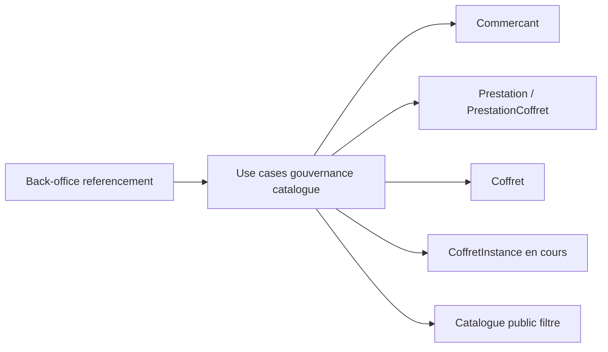

# Architecture applicative EPIC 1 - Gouvernance du referencement commercant et prestation

## Statut

- Version : retro-documentation v1
- Source backlog : [Epic 1 - Gouvernance du referencement commercant et prestation](../../../roadmap/terminees/epic-1-gouvernance-du-referencement-commercant-et-prestation-backlog.md)
- Portee : choix applicatifs de gouvernance du catalogue commercant, prestations et coffrets.
- Hors portee : specification technique detaillee des classes, schemas SQL exhaustifs et contrats API detailles.

## Objectif applicatif

Mettre en place une gouvernance de catalogue permettant de referencer progressivement les commercants, de piloter la disponibilite de leurs prestations et d'eviter l'exposition commerciale d'offres incoherentes.

## Choix d'architecture

- Separer les statuts metier du commercant, de la prestation et du coffret.
- Utiliser le back-office comme surface de gouvernance et de controle des transitions.
- Filtrer le catalogue public a partir des statuts metier, pas uniquement de la presence en base.
- Refuser les transitions qui rendraient incoherents les coffrets actifs, prestations actives ou instances deja achetees.
- Garder les regles de publication dans les use cases applicatifs afin qu'elles soient partagees par API, admin et traitements internes.

## Objets manipules ou crees

- `Commercant`
- `PrestationCoffret`
- `Coffret`
- `CoffretInstance`
- statuts commercant : `BROUILLON`, `REFERENCE`, `ACTIF`, `SUSPENDU`, `ARCHIVE`
- statuts prestation et coffret
- controles de coherence catalogue

## Vue applicative

## Flux principaux

Voir la vue applicative ci-dessus ; aucun flux detaille complementaire n'est documente a ce niveau.

## Frontieres avec les autres domaines

- Le referencement decide de l'eligibilite catalogue.
- La commercialisation expose les coffrets vendables en respectant ces statuts.
- Les achats existants restent proteges par les controles sur `CoffretInstance`.

## Securite / audit / idempotence

- Les actions sensibles doivent etre protegees par les mecanismes d'acces existants.
- Les changements d'etat metier doivent etre auditables lorsque l'EPIC cree ou modifie une ressource.
- L'idempotence est requise pour les traitements relancables, integrations externes, batchs et notifications.

## Points ouverts

- Aucun point ouvert documente dans la retro-documentation initiale.
