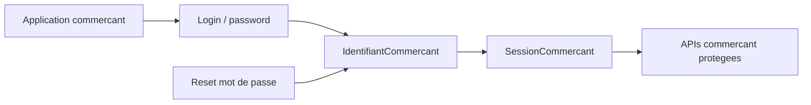

# Architecture applicative EPIC 10 - Authentification commercant login / mot de passe

## Statut

- Version : retro-documentation v1
- Source backlog : [Epic 10 - Authentification commercant login/password](../../../roadmap/terminees/epic-10-authentification-commercant-login-password-backlog.md)
- Portee : architecture applicative d'authentification commercant.
- Hors portee : specification technique detaillee des classes, schemas SQL exhaustifs et contrats API detailles.

## Objectif applicatif

Remplacer l'authentification par QR commercant par un parcours login / mot de passe, avec session serveur et protection des APIs commercant.

## Choix d'architecture

- Porter l'identifiant d'acces commercant dans un domaine d'identite distinct du referentiel commercant.
- Stocker uniquement des secrets haches.
- Utiliser une session commercant limitee dans le temps et revocable.
- Proteger les actions par scopes ou roles.
- Prevoir reset et mise a jour de mot de passe sans exposer les secrets.

## Objets manipules ou crees

- `IdentifiantCommercant`
- `SessionCommercant`
- hash de mot de passe
- token de reinitialisation
- scopes commercant
- `Commercant` reference

## Vue applicative

## Flux principaux

Voir la vue applicative ci-dessus ; aucun flux detaille complementaire n'est documente a ce niveau.

## Frontieres avec les autres domaines

- `identite_acces` porte login, session, reset et scopes.
- `referencement` porte la fiche commercant.
- Les actions metier restent dans leurs domaines respectifs.

## Securite / audit / idempotence

- Les actions sensibles doivent etre protegees par les mecanismes d'acces existants.
- Les changements d'etat metier doivent etre auditables lorsque l'EPIC cree ou modifie une ressource.
- L'idempotence est requise pour les traitements relancables, integrations externes, batchs et notifications.

## Points ouverts

- Aucun point ouvert documente dans la retro-documentation initiale.
