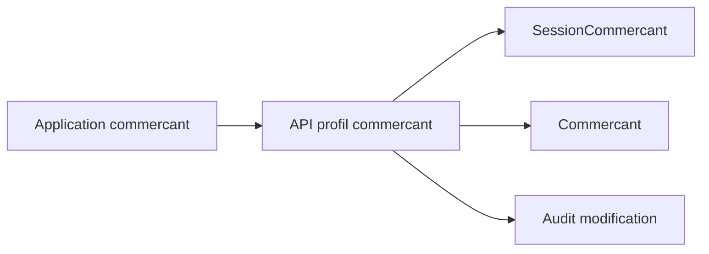

# Architecture applicative EPIC 11 - Espace commercant informations de contact

## Statut

- Version : retro-documentation v1
- Source backlog : [Epic 11 - Espace commercant informations contact](../../../roadmap/terminees/epic-11-espace-commercant-informations-contact-backlog.md)
- Portee : architecture applicative de consultation et mise a jour controlee des informations commercant.
- Hors portee : specification technique detaillee des classes, schemas SQL exhaustifs et contrats API detailles.

## Objectif applicatif

Permettre a un commercant authentifie de consulter et mettre a jour certaines informations de contact, sans lui donner acces a la gouvernance complete du referentiel.

## Choix d'architecture

- Separer les donnees referentielles administrees par Localeo des donnees editables par le commercant.
- Proteger les modifications par session commercant.
- Limiter les champs modifiables.
- Auditer les modifications realisees par le commercant.
- Reutiliser la fiche commercant existante comme source principale.

## Objets manipules ou crees

- `Commercant`
- informations de contact
- `SessionCommercant`
- demande de mise a jour
- evenement d'audit

## Vue applicative

## Flux principaux

Voir la vue applicative ci-dessus ; aucun flux detaille complementaire n'est documente a ce niveau.

## Frontieres avec les autres domaines

- `profils` porte les contenus publics quand ils existent.
- `referencement` conserve la fiche commercant.
- `identite_acces` controle l'acces commercant.

## Securite / audit / idempotence

- Les actions sensibles doivent etre protegees par les mecanismes d'acces existants.
- Les changements d'etat metier doivent etre auditables lorsque l'EPIC cree ou modifie une ressource.
- L'idempotence est requise pour les traitements relancables, integrations externes, batchs et notifications.

## Points ouverts

- Aucun point ouvert documente dans la retro-documentation initiale.
