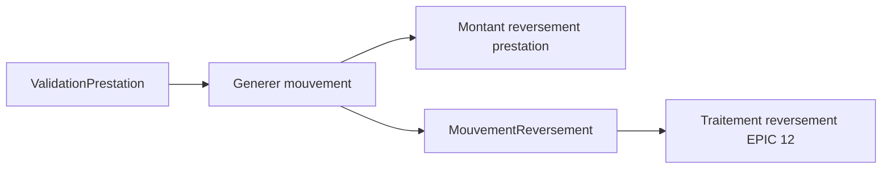

# Architecture applicative EPIC 13 - Generation des reversements commercants

## Statut

- Version : retro-documentation v1
- Source backlog : [Epic 13 - Generation reversements commercants](../../../roadmap/terminees/epic-13-generation-reversements-commercants-backlog.md)
- Portee : architecture applicative de creation des obligations de reversement.
- Hors portee : specification technique detaillee des classes, schemas SQL exhaustifs et contrats API detailles.

## Objectif applicatif

Transformer les validations de prestations en obligations de reversement exploitables par le back-office finance.

## Choix d'architecture

- Creer un mouvement de reversement a partir d'une validation effective.
- Ne pas confondre obligation de reversement et paiement execute.
- Rattacher chaque mouvement au commercant, a la prestation validee et a l'achat/coffret concerne.
- Garantir l'idempotence pour eviter les doubles mouvements.
- Laisser le paiement effectif au traitement de reversement.

## Objets manipules ou crees

- `ValidationPrestation`
- `MouvementReversement`
- `PrestationCoffret`
- `Commercant`
- `CoffretInstance`
- statut `A_REVERSER`

## Vue applicative

## Flux principaux

Voir la vue applicative ci-dessus ; aucun flux detaille complementaire n'est documente a ce niveau.

## Frontieres avec les autres domaines

- `exploitation` produit l'evenement de validation.
- `gestion_reversement` cree l'obligation financiere.
- `commercialisation` fournit le montant configure sur la prestation.

## Securite / audit / idempotence

- Les actions sensibles doivent etre protegees par les mecanismes d'acces existants.
- Les changements d'etat metier doivent etre auditables lorsque l'EPIC cree ou modifie une ressource.
- L'idempotence est requise pour les traitements relancables, integrations externes, batchs et notifications.

## Points ouverts

- Aucun point ouvert documente dans la retro-documentation initiale.
