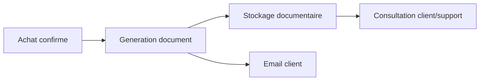

# Architecture applicative EPIC 14 - Documents d'achat et facturation coffret

## Statut

- Version : retro-documentation v1
- Source backlog : [Epic 14 - Documents achat et facturation coffret](../../../roadmap/terminees/epic-14-documents-achat-et-facturation-coffret-backlog.md)
- Portee : architecture applicative de generation et rattachement des documents d'achat.
- Hors portee : specification technique detaillee des classes, schemas SQL exhaustifs et contrats API detailles.

## Objectif applicatif

Produire les documents utiles apres achat d'un coffret, les rattacher a l'achat et permettre leur consultation par les parcours client et support.

## Choix d'architecture

- Declencher la production documentaire depuis le cycle d'achat.
- Rattacher les documents a `AchatCoffret` et/ou `CoffretInstance`.
- Separer generation documentaire, stockage et exposition.
- Conserver les documents comme preuves operationnelles pour support et facturation.
- Preparer l'alignement avec le domaine documentaire transverse de l'EPIC 38.

## Objets manipules ou crees

- `AchatCoffret`
- `CoffretInstance`
- document d'achat
- document de facturation
- reference de fichier
- email d'envoi document

## Vue applicative

## Flux principaux

Voir la vue applicative ci-dessus ; aucun flux detaille complementaire n'est documente a ce niveau.

## Frontieres avec les autres domaines

- `gestion_achats` decide quand produire le document.
- `documentaire` porte le stockage et les metadonnees si le socle EPIC 38 est actif.
- L'infrastructure porte le rendu PDF et le stockage externe.

## Securite / audit / idempotence

- Les actions sensibles doivent etre protegees par les mecanismes d'acces existants.
- Les changements d'etat metier doivent etre auditables lorsque l'EPIC cree ou modifie une ressource.
- L'idempotence est requise pour les traitements relancables, integrations externes, batchs et notifications.

## Points ouverts

- Aucun point ouvert documente dans la retro-documentation initiale.
