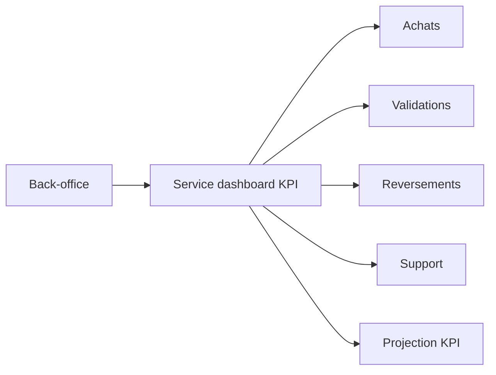

# Architecture applicative EPIC 15 - Dashboard KPIs back-office

## Statut

- Version : retro-documentation v1
- Source backlog : [Epic 15 - Dashboard KPIs backoffice](../../../roadmap/terminees/epic-15-dashboard-kpis-backoffice-backlog.md)
- Portee : architecture applicative de pilotage agrege back-office.
- Hors portee : specification technique detaillee des classes, schemas SQL exhaustifs et contrats API detailles.

## Objectif applicatif

Donner au back-office une vue synthetique des indicateurs clefs Localeo sans creer une nouvelle source de verite metier.

## Choix d'architecture

- Calculer les KPIs depuis les donnees operationnelles existantes.
- Regrouper les lectures dans un service de dashboard dedie.
- Ne pas dupliquer les statuts source dans une table analytique MVP.
- Limiter le dashboard a des indicateurs de pilotage, pas a de la comptabilite.
- Proteger l'acces par role back-office.

## Objets manipules ou crees

- indicateurs d'achats
- indicateurs de coffrets instances
- indicateurs de validations
- indicateurs de reversements
- indicateurs de support
- projection dashboard

## Vue applicative

## Flux principaux

Voir la vue applicative ci-dessus ; aucun flux detaille complementaire n'est documente a ce niveau.

## Frontieres avec les autres domaines

- Le dashboard agrege mais ne devient pas source de verite.
- Les domaines metier restent responsables de leurs statuts.
- Les indicateurs financiers detailles restent dans les vues finance dediees.

## Securite / audit / idempotence

- Les actions sensibles doivent etre protegees par les mecanismes d'acces existants.
- Les changements d'etat metier doivent etre auditables lorsque l'EPIC cree ou modifie une ressource.
- L'idempotence est requise pour les traitements relancables, integrations externes, batchs et notifications.

## Points ouverts

- Aucun point ouvert documente dans la retro-documentation initiale.
