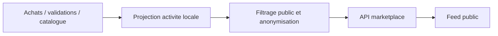

# Architecture applicative EPIC 16 - Feed d'activite locale marketplace

## Statut

- Version : retro-documentation v1
- Source backlog : [Epic 16 - Feed activite locale marketplace](../../../roadmap/terminees/epic-16-feed-activite-locale-marketplace-backlog.md)
- Portee : architecture applicative d'exposition d'un flux d'activite locale.
- Hors portee : specification technique detaillee des classes, schemas SQL exhaustifs et contrats API detailles.

## Objectif applicatif

Afficher sur la marketplace une activite locale exploitable pour animer le territoire, sans exposer de donnees personnelles ni transformer le feed en source metier primaire.

## Choix d'architecture

- Construire le feed comme une projection de donnees existantes.
- Filtrer par ville, commercant, coffret ou evenement utile.
- Masquer les donnees personnelles client.
- Conserver une separation entre feed public et audit interne.
- Permettre une evolution vers des evenements d'animation locale sans coupler le feed au moteur EPIC 41.

## Objets manipules ou crees

- activite locale
- ville
- commercant
- coffret
- validation ou achat agreges
- projection publique de feed

## Vue applicative

## Flux principaux

Voir la vue applicative ci-dessus ; aucun flux detaille complementaire n'est documente a ce niveau.

## Frontieres avec les autres domaines

- `exploitation` peut porter la projection operationnelle.
- Le feed ne remplace ni audit, ni dashboard, ni moteur d'animation locale.

## Securite / audit / idempotence

- Les actions sensibles doivent etre protegees par les mecanismes d'acces existants.
- Les changements d'etat metier doivent etre auditables lorsque l'EPIC cree ou modifie une ressource.
- L'idempotence est requise pour les traitements relancables, integrations externes, batchs et notifications.

## Points ouverts

- Aucun point ouvert documente dans la retro-documentation initiale.
