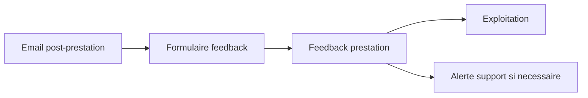

# Architecture applicative EPIC 17 - Feedback client post-prestation

## Statut

- Version : retro-documentation v1
- Source backlog : [Epic 17 - Feedback client post-prestation](../../../roadmap/terminees/epic-17-feedback-client-post-prestation-backlog.md)
- Portee : architecture applicative de collecte et traitement d'un feedback apres prestation.
- Hors portee : specification technique detaillee des classes, schemas SQL exhaustifs et contrats API detailles.

## Objectif applicatif

Permettre au client de donner un retour apres une prestation validee, afin d'alimenter l'exploitation et, si necessaire, le support.

## Choix d'architecture

- Rattacher le feedback a une prestation validee.
- Autoriser un parcours public tokenise pour repondre sans compte.
- Stocker le feedback comme signal operationnel.
- Creer une passerelle vers le support si le feedback exige un traitement humain.
- Ne pas confondre feedback post-prestation et avis public marchand.

## Objets manipules ou crees

- feedback prestation
- `ValidationPrestation`
- `CoffretInstance`
- token de feedback
- note ou commentaire
- alerte support optionnelle

## Vue applicative

## Flux principaux

Voir la vue applicative ci-dessus ; aucun flux detaille complementaire n'est documente a ce niveau.

## Frontieres avec les autres domaines

- `exploitation` porte le signal feedback.
- `support` intervient seulement si le feedback devient une demande a traiter.
- Les avis publics restent hors perimetre.

## Securite / audit / idempotence

- Les actions sensibles doivent etre protegees par les mecanismes d'acces existants.
- Les changements d'etat metier doivent etre auditables lorsque l'EPIC cree ou modifie une ressource.
- L'idempotence est requise pour les traitements relancables, integrations externes, batchs et notifications.

## Points ouverts

- Aucun point ouvert documente dans la retro-documentation initiale.
