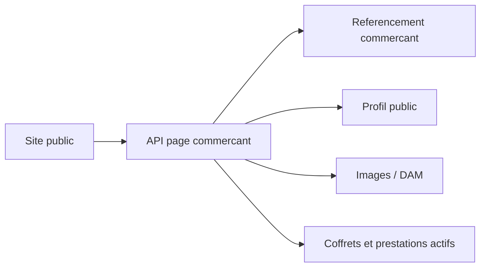

# Architecture applicative EPIC 18 - Page commercant immersive

## Statut

- Version : retro-documentation v1
- Source backlog : [Epic 18 - Page commercant immersive](../../../roadmap/terminees/epic-18-page-commercant-immersive-backlog.md)
- Portee : architecture applicative de publication d'une page commercant publique.
- Hors portee : specification technique detaillee des classes, schemas SQL exhaustifs et contrats API detailles.

## Objectif applicatif

Expose une page publique riche pour un commercant, en s'appuyant sur le referentiel, le profil public, les medias et les coffrets/prestations disponibles.

## Choix d'architecture

- Composer la page a partir de donnees existantes plutot que dupliquer une fiche publique complete.
- Filtrer les contenus selon les statuts de publication.
- Separer les informations referentielles du contenu public editable.
- Servir les medias via le DAM ou le stockage existant.
- Ne pas exposer de donnees internes ou support sur la page publique.

## Objets manipules ou crees

- `Commercant`
- `ProfilCommercant`
- images et medias
- coffrets actifs
- prestations exposees
- contenu public de page

## Vue applicative

## Flux principaux

Voir la vue applicative ci-dessus ; aucun flux detaille complementaire n'est documente a ce niveau.

## Frontieres avec les autres domaines

- `referencement` porte l'identite commercant.
- `profils` porte le contenu public.
- `commercialisation` porte l'offre vendable.
- `dam` porte les medias.

## Securite / audit / idempotence

- Les actions sensibles doivent etre protegees par les mecanismes d'acces existants.
- Les changements d'etat metier doivent etre auditables lorsque l'EPIC cree ou modifie une ressource.
- L'idempotence est requise pour les traitements relancables, integrations externes, batchs et notifications.

## Points ouverts

- Aucun point ouvert documente dans la retro-documentation initiale.
