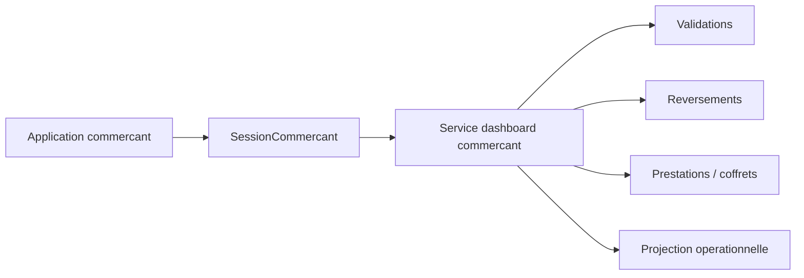

# Architecture applicative EPIC 19 - Dashboard operationnel commercant

## Statut

- Version : retro-documentation v1
- Source backlog : [Epic 19 - Dashboard operationnel commercant](../../../roadmap/terminees/epic-19-dashboard-operationnel-commercant-backlog.md)
- Portee : architecture applicative d'un tableau de bord commercant authentifie.
- Hors portee : specification technique detaillee des classes, schemas SQL exhaustifs et contrats API detailles.

## Objectif applicatif

Donner au commercant une vision operationnelle de son activite Localeo : prestations a venir, validations, revenus, alertes et informations utiles.

## Choix d'architecture

- Exposer un dashboard dedie au commercant authentifie, distinct des vues back-office.
- Agreger les donnees existantes sans creer de nouvelle source analytique.
- Filtrer strictement par commercant courant.
- Reutiliser les reversements, validations et coffrets comme sources.
- Limiter les indicateurs aux informations actionnables pour le commercant.

## Objets manipules ou crees

- `SessionCommercant`
- `Commercant`
- `ValidationPrestation`
- `MouvementReversement`
- `Reversement`
- prestations actives
- alertes operationnelles
- projection dashboard commercant

## Vue applicative

## Flux principaux

Voir la vue applicative ci-dessus ; aucun flux detaille complementaire n'est documente a ce niveau.

## Frontieres avec les autres domaines

- Le dashboard commercant n'est pas une vue back-office.
- Les donnees sont filtrees par identite commercant.
- Les indicateurs finance restent issus de la gestion reversement.

## Securite / audit / idempotence

- Les actions sensibles doivent etre protegees par les mecanismes d'acces existants.
- Les changements d'etat metier doivent etre auditables lorsque l'EPIC cree ou modifie une ressource.
- L'idempotence est requise pour les traitements relancables, integrations externes, batchs et notifications.

## Points ouverts

- Aucun point ouvert documente dans la retro-documentation initiale.
