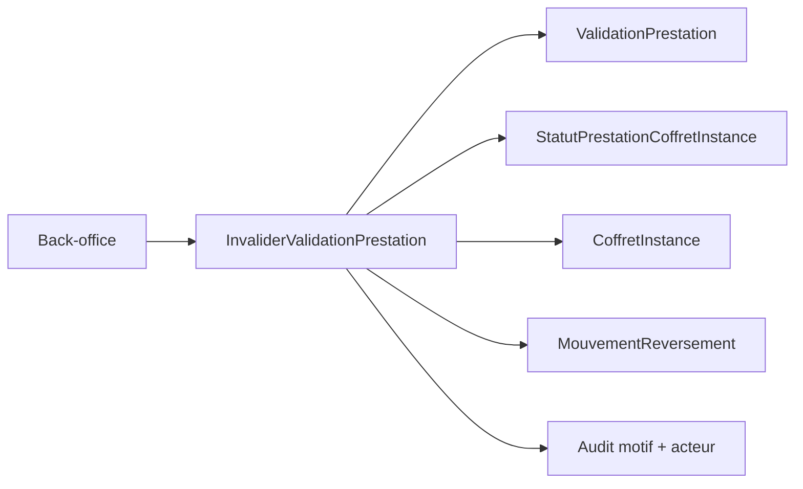

# Architecture applicative EPIC 2 - Invalidation d'une validation de prestation

## Statut

- Version : retro-documentation v1
- Source backlog : [Epic 2 - Invalidation d'une validation de prestation V1](../../../roadmap/terminees/epic-2-invalidation-validation-prestation-v1-backlog.md)
- Portee : choix applicatifs d'annulation logique d'une validation et de protection du reversement.
- Hors portee : specification technique detaillee des classes, schemas SQL exhaustifs et contrats API detailles.

## Objectif applicatif

Permettre au back-office d'invalider une validation de prestation faite par erreur, uniquement lorsque le reversement associe n'est pas deja engage ou paye.

## Choix d'architecture

- Ne jamais supprimer physiquement une validation : l'invalidation est logique et auditable.
- Faire porter la decision par un use case applicatif unique, afin de recalculer ensemble validation, prestation, coffret instance et mouvement de reversement.
- Bloquer l'invalidation des que le reversement n'est plus en statut annulable.
- Recalculer le statut de la `CoffretInstance` apres remise d'une prestation a valider.
- Exiger un motif et un acteur pour toute invalidation.

## Objets manipules ou crees

- `ValidationPrestation`
- `StatutPrestationCoffretInstance`
- `CoffretInstance`
- `MouvementReversement`
- `PrestationCoffret`
- motif d'invalidation
- acteur d'invalidation

## Vue applicative

## Flux principaux

Voir la vue applicative ci-dessus ; aucun flux detaille complementaire n'est documente a ce niveau.

## Frontieres avec les autres domaines

- L'exploitation porte l'acte d'invalidation operationnelle.
- La gestion des achats porte le statut de l'instance et des prestations consommees.
- La gestion reversement porte l'annulation du mouvement financier annulable.

## Securite / audit / idempotence

- Les actions sensibles doivent etre protegees par les mecanismes d'acces existants.
- Les changements d'etat metier doivent etre auditables lorsque l'EPIC cree ou modifie une ressource.
- L'idempotence est requise pour les traitements relancables, integrations externes, batchs et notifications.

## Points ouverts

- Aucun point ouvert documente dans la retro-documentation initiale.
