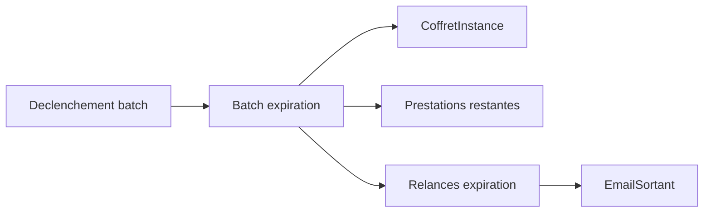

# Architecture applicative EPIC 21 - Expiration automatique des coffrets

## Statut

- Version : retro-documentation v1
- Source backlog : [Epic 21 - Expiration automatique coffrets](../../../roadmap/terminees/epic-21-expiration-automatique-coffrets-backlog.md)
- Portee : architecture applicative des batchs d'expiration et relance.
- Hors portee : specification technique detaillee des classes, schemas SQL exhaustifs et contrats API detailles.

## Objectif applicatif

Expirer automatiquement les `CoffretInstance` arrivees a echeance, bloquer les validations restantes et informer le client.

## Choix d'architecture

- Porter l'expiration dans un batch idempotent et relancable.
- Garder le statut `EXPIRE` pour `CoffretInstance`.
- Passer les prestations restantes non consommees en statut expire.
- Utiliser une table de relance pour eviter les emails en double.
- Exposer le batch via une API protegee par scope batch.

## Objets manipules ou crees

- `CoffretInstance`
- `StatutPrestationCoffretInstance`
- `EmailSortant`
- `relances_expiration_coffrets`
- batch expiration coffrets
- batch relance avant expiration

## Vue applicative

## Flux principaux

Voir la vue applicative ci-dessus ; aucun flux detaille complementaire n'est documente a ce niveau.

## Frontieres avec les autres domaines

- `gestion_achats` porte les statuts d'instance et de prestations.
- `exploitation` porte le batch, l'audit et l'envoi email.
- Le support peut prolonger manuellement selon les droits prevus.

## Securite / audit / idempotence

- Les actions sensibles doivent etre protegees par les mecanismes d'acces existants.
- Les changements d'etat metier doivent etre auditables lorsque l'EPIC cree ou modifie une ressource.
- L'idempotence est requise pour les traitements relancables, integrations externes, batchs et notifications.

## Points ouverts

- Aucun point ouvert documente dans la retro-documentation initiale.
