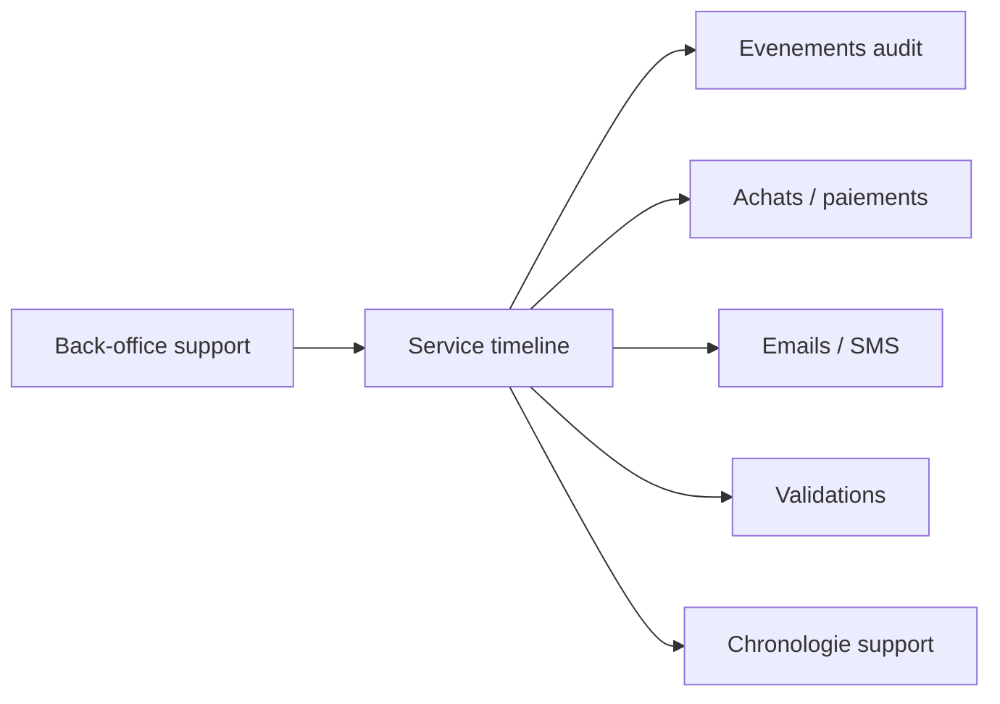

# Architecture applicative EPIC 22 - Timeline support

## Statut

- Version : retro-documentation v1
- Source backlog : [Epic 22 - Timeline support](../../../roadmap/terminees/epic-22-timeline-support-backlog.md)
- Portee : architecture applicative d'une vue chronologique support.
- Hors portee : specification technique detaillee des classes, schemas SQL exhaustifs et contrats API detailles.

## Objectif applicatif

Permettre a un operateur support de reconstituer l'histoire d'un achat, d'une instance de coffret, d'un paiement, d'une notification ou d'une validation.

## Choix d'architecture

- Construire la timeline a partir des traces et objets existants.
- Eviter une nouvelle source de verite tant que les donnees existantes suffisent.
- Normaliser les evenements affiches pour le support.
- Afficher des liens vers les ressources utiles.
- Rendre la lecture exploitable par un operateur non technique.

## Objets manipules ou crees

- `EvenementAudit`
- `AchatCoffret`
- `CoffretInstance`
- `Paiement`
- `EmailSortant`
- `SmsSortant`
- `ValidationPrestation`
- evenement de timeline support

## Vue applicative

## Flux principaux

Voir la vue applicative ci-dessus ; aucun flux detaille complementaire n'est documente a ce niveau.

## Frontieres avec les autres domaines

- `support` porte la vue chronologique.
- Les domaines sources restent proprietaires de leurs objets.
- La timeline ne modifie pas les donnees metier.

## Securite / audit / idempotence

- Les actions sensibles doivent etre protegees par les mecanismes d'acces existants.
- Les changements d'etat metier doivent etre auditables lorsque l'EPIC cree ou modifie une ressource.
- L'idempotence est requise pour les traitements relancables, integrations externes, batchs et notifications.

## Points ouverts

- Aucun point ouvert documente dans la retro-documentation initiale.
