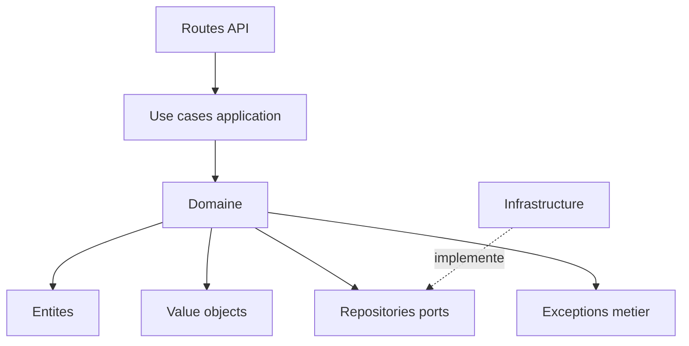

# Architecture applicative EPIC 24 - Optimisation de la couche domaine DDD

## Statut

- Version : retro-documentation v1
- Source backlog : [Epic 24 - Optimisation couche domaine DDD](../../../roadmap/terminees/epic-24-optimisation-couche-domaine-ddd-backlog.md)
- Portee : architecture applicative de clarification de la couche domaine.
- Hors portee : specification technique detaillee des classes, schemas SQL exhaustifs et contrats API detailles.

## Objectif applicatif

Rendre la couche domaine lisible en separant les entites, value objects, repositories et exceptions metier, sans modifier le comportement fonctionnel.

## Choix d'architecture

- Migration one-shot des imports.
- Pas de facade durable pour les anciens chemins.
- Un nom explicite et une responsabilite claire par concept domaine.
- Package `value_objects` conforme aux conventions Python.
- Aucune dependance FastAPI, SQLAlchemy ou provider externe dans le domaine.

## Objets manipules ou crees

- entites domaine
- value objects
- ports repositories
- exceptions metier
- imports applicatifs
- conventions de packages

## Vue applicative

## Flux principaux

Voir la vue applicative ci-dessus ; aucun flux detaille complementaire n'est documente a ce niveau.

## Frontieres avec les autres domaines

- EPIC 24 organise par nature technique.
- EPIC 40 reorganise ensuite par domaine fonctionnel.
- L'infrastructure reste hors couche domaine.

## Securite / audit / idempotence

- Les actions sensibles doivent etre protegees par les mecanismes d'acces existants.
- Les changements d'etat metier doivent etre auditables lorsque l'EPIC cree ou modifie une ressource.
- L'idempotence est requise pour les traitements relancables, integrations externes, batchs et notifications.

## Points ouverts

- Aucun point ouvert documente dans la retro-documentation initiale.
