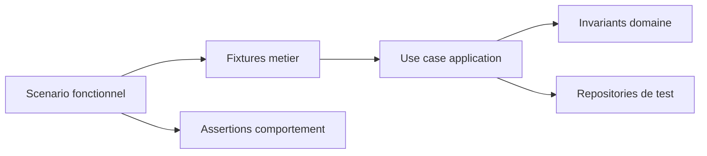

# Architecture applicative EPIC 25 - Tests fonctionnels domaine et application

## Statut

- Version : retro-documentation v1
- Source backlog :
  - [Epic 25 - Tests fonctionnels domaine application](../../../roadmap/terminees/epic-25-tests-fonctionnels-domaine-application-backlog.md)
  - [Epic 25 - Plan detaille](../../../roadmap/terminees/epic-25-tests-fonctionnels-domaine-application-backlog.md)
- Portee : architecture applicative de couverture fonctionnelle.
- Hors portee : specification technique detaillee des classes, schemas SQL exhaustifs et contrats API detailles.

## Objectif applicatif

Structurer des tests fonctionnels centres sur les invariants domaine et les use cases applicatifs, afin de securiser les workflows critiques.

## Choix d'architecture

- Tester les use cases en priorite plutot que les details d'infrastructure.
- Construire des fixtures metier lisibles.
- Couvrir les invariants domaine, erreurs metier et transitions de statut.
- Distinguer tests domaine, tests application et tests API.
- Eviter que les tests reproduisent la logique interne au lieu de verifier le comportement.

## Objets manipules ou crees

- scenarios de test fonctionnel
- fixtures metier
- use cases applicatifs
- entites domaine
- repositories de test ou UoW de test
- assertions d'erreurs metier

## Vue applicative

## Flux principaux

Voir la vue applicative ci-dessus ; aucun flux detaille complementaire n'est documente a ce niveau.

## Frontieres avec les autres domaines

- Les tests fonctionnels verifient le comportement observable.
- Les tests unitaires de bas niveau restent complementaires.
- Les tests API valident le contrat expose.

## Securite / audit / idempotence

- Les actions sensibles doivent etre protegees par les mecanismes d'acces existants.
- Les changements d'etat metier doivent etre auditables lorsque l'EPIC cree ou modifie une ressource.
- L'idempotence est requise pour les traitements relancables, integrations externes, batchs et notifications.

## Points ouverts

- Aucun point ouvert documente dans la retro-documentation initiale.
