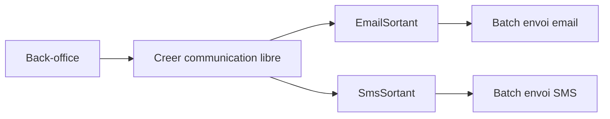

# Architecture applicative EPIC 26 - Communication libre back-office

## Statut

- Version : retro-documentation v1
- Source backlog : [Epic 26 - Communication libre backoffice](../../../roadmap/terminees/epic-26-communication-libre-backoffice-backlog.md)
- Portee : architecture applicative d'envoi libre email/SMS par un operateur.
- Hors portee : specification technique detaillee des classes, schemas SQL exhaustifs et contrats API detailles.

## Objectif applicatif

Permettre a un operateur back-office d'envoyer un message libre a un commercant, client ou destinataire saisi, en reutilisant les outbox existantes.

## Choix d'architecture

- Ne pas appeler directement les providers email/SMS depuis le back-office.
- Passer par les outbox `EmailSortant` et `SmsSortant`.
- Tracer acteur, destinataire, canal, contenu et statut.
- Positionner la communication libre comme outil support/exploitation, pas campagne marketing.
- Garder une signature Localeo unique en MVP.

## Objets manipules ou crees

- communication libre
- `EmailSortant`
- `SmsSortant`
- destinataire libre ou rattache
- acteur back-office
- statut d'envoi

## Vue applicative

## Flux principaux

Voir la vue applicative ci-dessus ; aucun flux detaille complementaire n'est documente a ce niveau.

## Frontieres avec les autres domaines

- `support` porte l'usage operateur.
- `exploitation` porte les outbox et l'envoi technique.
- Le marketing de masse reste hors perimetre.

## Securite / audit / idempotence

- Les actions sensibles doivent etre protegees par les mecanismes d'acces existants.
- Les changements d'etat metier doivent etre auditables lorsque l'EPIC cree ou modifie une ressource.
- L'idempotence est requise pour les traitements relancables, integrations externes, batchs et notifications.

## Points ouverts

- Aucun point ouvert documente dans la retro-documentation initiale.
