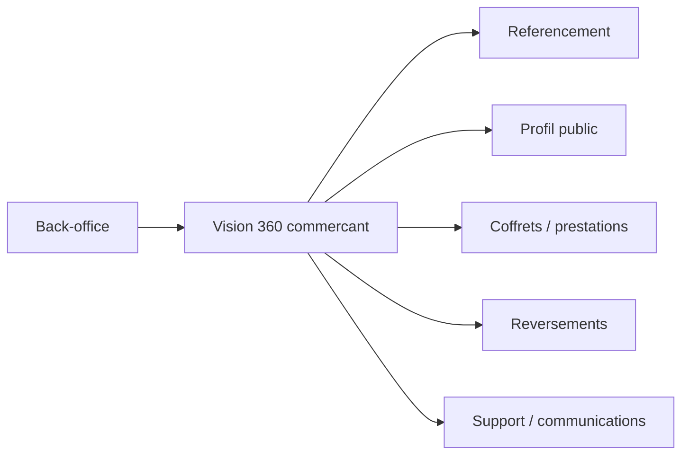

# Architecture applicative EPIC 27 - Vision 360 commercant back-office

## Statut

- Version : retro-documentation v1
- Source backlog : [Epic 27 - Vision 360 commercant](../../../roadmap/terminees/epic-27-vision-360-commercant-backoffice-backlog.md)
- Portee : architecture applicative d'une vue agregative support/exploitation.
- Hors portee : specification technique detaillee des classes, schemas SQL exhaustifs et contrats API detailles.

## Objectif applicatif

Fournir au back-office une page unique pour comprendre l'activite d'un commercant : referentiel, profil, coffrets, validations, revenus, support et alertes.

## Choix d'architecture

- Construire une vue agregative, sans nouvelle source de verite analytique.
- Filtrer par commercant selectionne.
- Limiter les listes recentes pour garder une vue operationnelle.
- Reutiliser les domaines existants comme sources.
- Ajouter des raccourcis d'action vers communication libre et support.

## Objets manipules ou crees

- `Commercant`
- `ProfilCommercant`
- `Coffret`
- `PrestationCoffret`
- `ValidationPrestation`
- `MouvementReversement`
- `Reversement`
- `MessageContact`
- communications email/SMS
- projection vision 360 commercant

## Vue applicative

## Flux principaux

Voir la vue applicative ci-dessus ; aucun flux detaille complementaire n'est documente a ce niveau.

## Frontieres avec les autres domaines

- La vue agrege mais ne modifie pas les sources.
- Le dashboard commercant EPIC 19 reste la surface destinee au commercant.
- Les actions sensibles restent portees par leurs use cases d'origine.

## Securite / audit / idempotence

- Les actions sensibles doivent etre protegees par les mecanismes d'acces existants.
- Les changements d'etat metier doivent etre auditables lorsque l'EPIC cree ou modifie une ressource.
- L'idempotence est requise pour les traitements relancables, integrations externes, batchs et notifications.

## Points ouverts

- Aucun point ouvert documente dans la retro-documentation initiale.
