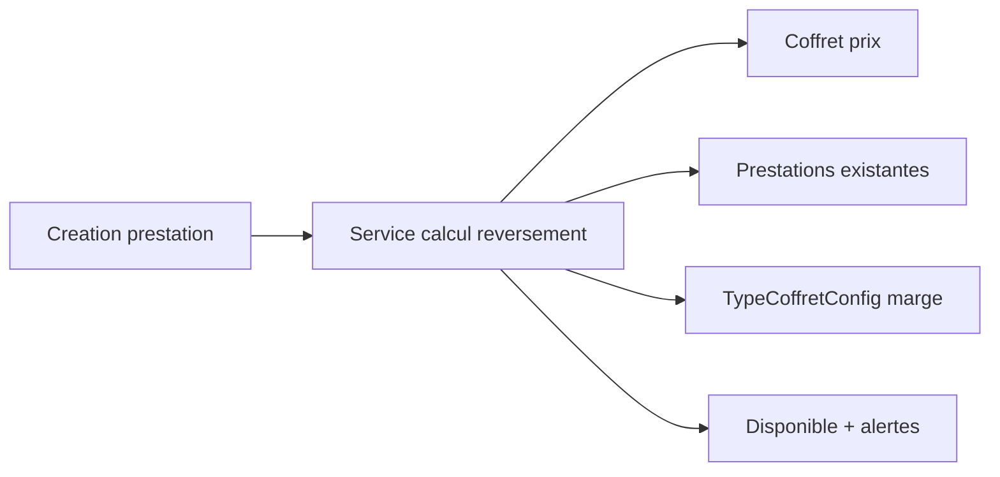

# Architecture applicative EPIC 28 - Calcul reversement coffret back-office

## Statut

- Version : retro-documentation v1
- Source backlog : [Epic 28 - Calcul reversement coffret](../../../roadmap/terminees/epic-28-calcul-reversement-coffret-backoffice-backlog.md)
- Portee : architecture applicative d'aide au calcul de reversement.
- Hors portee : specification technique detaillee des classes, schemas SQL exhaustifs et contrats API detailles.

## Objectif applicatif

Aider l'operateur a saisir un montant de reversement coherent lors de la construction d'un coffret, en tenant compte du prix, de la marge cible et des prestations deja affectees.

## Choix d'architecture

- Calculer le disponible a partir du coffret et des prestations rattachees.
- Utiliser le taux de marge configure sur le type de coffret.
- Exclure les prestations suspendues ou archivees du montant reserve.
- Exiger confirmation explicite en cas de degradation de marge.
- Auditer toute degradation de marge.

## Objets manipules ou crees

- `Coffret`
- `PrestationCoffret`
- `TypeCoffretConfig`
- `montant_reversement`
- marge minimum
- montant disponible
- suggestion de repartition
- evenement d'audit marge

## Vue applicative

## Flux principaux

Voir la vue applicative ci-dessus ; aucun flux detaille complementaire n'est documente a ce niveau.

## Frontieres avec les autres domaines

- `commercialisation` porte la construction d'offre.
- `gestion_reversement` consomme ensuite les montants configures.
- Le calcul ne remplace pas la validation finance en cas de degradation.

## Securite / audit / idempotence

- Les actions sensibles doivent etre protegees par les mecanismes d'acces existants.
- Les changements d'etat metier doivent etre auditables lorsque l'EPIC cree ou modifie une ressource.
- L'idempotence est requise pour les traitements relancables, integrations externes, batchs et notifications.

## Points ouverts

- Aucun point ouvert documente dans la retro-documentation initiale.
