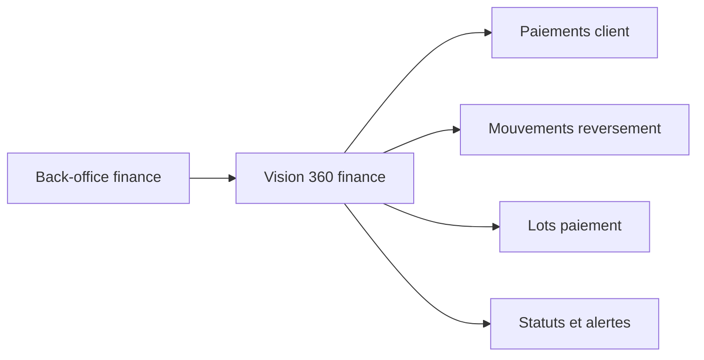

# Architecture applicative EPIC 30 - Vue 360 reversements et paiements

## Statut

- Version : retro-documentation v1
- Source backlog : [Epic 30 - Vue 360 reversements paiements](../../../roadmap/terminees/epic-30-vue-360-reversements-paiements-backlog.md)
- Portee : architecture applicative de pilotage finance.
- Hors portee : specification technique detaillee des classes, schemas SQL exhaustifs et contrats API detailles.

## Objectif applicatif

Fournir au back-office une vision 360 des paiements et reversements afin de preparer, controler et suivre les campagnes finance.

## Choix d'architecture

- Agreger paiements client, mouvements, reversements, lots et paiements reversement.
- Conserver les sources financieres existantes.
- Distinguer les statuts a reverser, en cours, paye, annule ou en echec.
- Permettre une lecture par commercant, lot ou periode.
- Preparer la coexistence avec les flux PSP de l'EPIC 39.

## Objets manipules ou crees

- `Paiement`
- `MouvementReversement`
- `Reversement`
- `LigneReversement`
- `LotPaiementReversement`
- `PaiementReversement`
- projection vision 360 finance

## Vue applicative

## Flux principaux

Voir la vue applicative ci-dessus ; aucun flux detaille complementaire n'est documente a ce niveau.

## Frontieres avec les autres domaines

- `gestion_reversement` porte la dette et son execution.
- `gestion_achats` porte le paiement client.
- La vue 360 ne remplace pas les journaux financiers.

## Securite / audit / idempotence

- Les actions sensibles doivent etre protegees par les mecanismes d'acces existants.
- Les changements d'etat metier doivent etre auditables lorsque l'EPIC cree ou modifie une ressource.
- L'idempotence est requise pour les traitements relancables, integrations externes, batchs et notifications.

## Points ouverts

- Aucun point ouvert documente dans la retro-documentation initiale.
