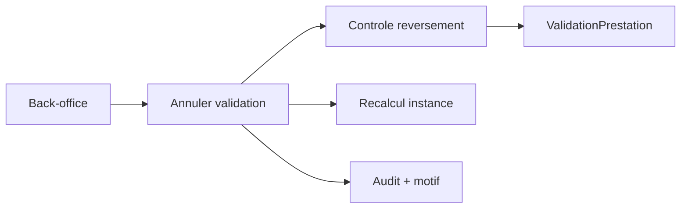

# Architecture applicative EPIC 31 - Annulation validation prestation back-office

## Statut

- Version : retro-documentation v1
- Source backlog : [Epic 31 - Annulation validation prestation backoffice](../../../roadmap/terminees/epic-31-annulation-validation-prestation-backoffice.md)
- Portee : architecture applicative d'annulation back-office encadree.
- Hors portee : specification technique detaillee des classes, schemas SQL exhaustifs et contrats API detailles.

## Objectif applicatif

Permettre au back-office d'annuler une validation de prestation faite par erreur, sans casser la chaine achat, coffret, reversement, audit et notification.

## Choix d'architecture

- Encadrer l'annulation par un use case back-office explicite.
- Reprendre les garde-fous de l'invalidation EPIC 2.
- Controler l'impact reversement avant d'annuler.
- Recalculer les statuts de prestation et d'instance.
- Notifier ou tracer selon la politique operationnelle retenue.

## Objets manipules ou crees

- `ValidationPrestation`
- `StatutPrestationCoffretInstance`
- `CoffretInstance`
- `MouvementReversement`
- motif d'annulation
- evenement d'audit
- notification operationnelle

## Vue applicative

## Flux principaux

Voir la vue applicative ci-dessus ; aucun flux detaille complementaire n'est documente a ce niveau.

## Frontieres avec les autres domaines

- L'annulation reste une action interne.
- Les reversements deja executes exigent un traitement finance separe.
- Les objets historiques restent conserves.

## Securite / audit / idempotence

- Les actions sensibles doivent etre protegees par les mecanismes d'acces existants.
- Les changements d'etat metier doivent etre auditables lorsque l'EPIC cree ou modifie une ressource.
- L'idempotence est requise pour les traitements relancables, integrations externes, batchs et notifications.

## Points ouverts

- Aucun point ouvert documente dans la retro-documentation initiale.
