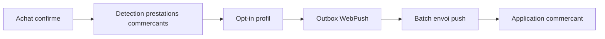

# Architecture applicative EPIC 32 - Live tracking WebPush commercants

## Statut

- Version : retro-documentation v1
- Source backlog : [Epic 32 - Live tracking WebPush commercants](../../../roadmap/terminees/epic-32-live-tracking-webpush-commercants-backlog.md)
- Portee : architecture applicative de notification temps quasi reel des commercants.
- Hors portee : specification technique detaillee des classes, schemas SQL exhaustifs et contrats API detailles.

## Objectif applicatif

Notifier les commercants qui l'ont active lorsqu'un achat confirme contient au moins une de leurs prestations actives.

## Choix d'architecture

- Fonctionnalite opt-in portee par le profil commercant.
- Declenchement a la confirmation d'achat, pas a l'ouverture checkout.
- Passer par une outbox WebPush dediee.
- Envoyer un payload opaque avec deep link applicatif.
- Piloter la fonctionnalite par feature flag backend.

## Objets manipules ou crees

- preference live tracking
- abonnement WebPush commercant
- notification WebPush sortante
- `AchatCoffret`
- `PrestationCoffret`
- `ProfilCommercant`
- feature flag live tracking

## Vue applicative

## Flux principaux

Voir la vue applicative ci-dessus ; aucun flux detaille complementaire n'est documente a ce niveau.

## Frontieres avec les autres domaines

- `profils` porte la preference.
- `exploitation` porte l'outbox, l'envoi et l'audit.
- `gestion_achats` fournit l'evenement achat confirme.

## Securite / audit / idempotence

- Les actions sensibles doivent etre protegees par les mecanismes d'acces existants.
- Les changements d'etat metier doivent etre auditables lorsque l'EPIC cree ou modifie une ressource.
- L'idempotence est requise pour les traitements relancables, integrations externes, batchs et notifications.

## Points ouverts

- Aucun point ouvert documente dans la retro-documentation initiale.
