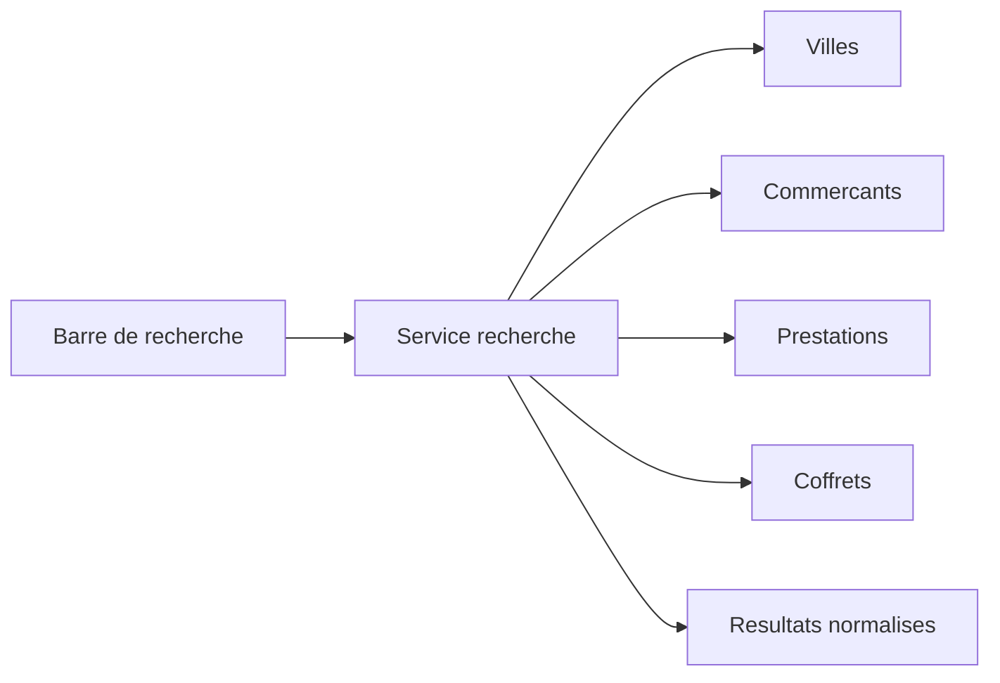

# Architecture applicative EPIC 33 - Recherche multiscope marketplace

## Statut

- Version : retro-documentation v1
- Source backlog : [Epic 33 - Recherche multiscope marketplace](../../../roadmap/terminees/epic-33-recherche-multiscope-marketplace-backlog.md)
- Portee : architecture applicative de recherche publique.
- Hors portee : specification technique detaillee des classes, schemas SQL exhaustifs et contrats API detailles.

## Objectif applicatif

Fournir un service de recherche unique pour la marketplace, capable de retrouver villes, commercants, prestations et coffrets.

## Choix d'architecture

- Centraliser la recherche marketplace dans un service applicatif dedie.
- Interroger plusieurs sources sans changer leur propriete metier.
- Normaliser les resultats pour l'interface publique.
- Filtrer les objets non publiables ou non actifs.
- Garder la recherche MVP compatible avec une future indexation specialisee.

## Objets manipules ou crees

- requete de recherche
- resultat recherche multiscope
- `Ville`
- `Commercant`
- `PrestationCoffret`
- `Coffret`
- filtres de publication

## Vue applicative

## Flux principaux

Voir la vue applicative ci-dessus ; aucun flux detaille complementaire n'est documente a ce niveau.

## Frontieres avec les autres domaines

- `commercialisation` porte l'offre recherchable.
- `referencement` porte villes et commercants.
- Le moteur de recherche ne devient pas source de verite.

## Securite / audit / idempotence

- Les actions sensibles doivent etre protegees par les mecanismes d'acces existants.
- Les changements d'etat metier doivent etre auditables lorsque l'EPIC cree ou modifie une ressource.
- L'idempotence est requise pour les traitements relancables, integrations externes, batchs et notifications.

## Points ouverts

- Aucun point ouvert documente dans la retro-documentation initiale.
