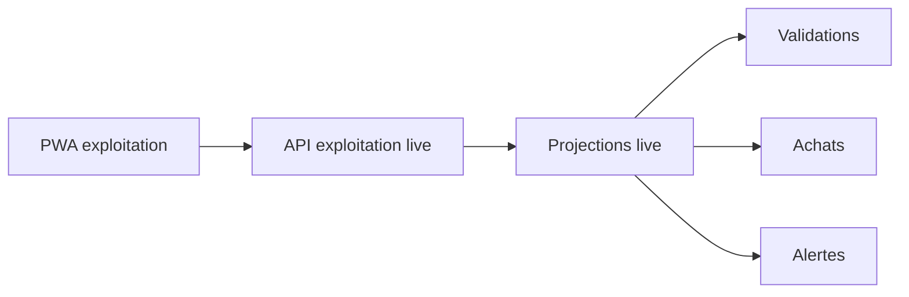

# Architecture applicative EPIC 34 - PWA exploitation live dashboard

## Statut

- Version : retro-documentation v1
- Source backlog : [Epic 34 - PWA exploitation live dashboard](../../../roadmap/terminees/epic-34-pwa-exploitation-live-dashboard-backlog.md)
- Portee : architecture applicative d'une PWA de supervision operationnelle.
- Hors portee : specification technique detaillee des classes, schemas SQL exhaustifs et contrats API detailles.

## Objectif applicatif

Fournir a l'exploitation une interface live pour suivre l'activite, les validations, alertes et indicateurs operationnels.

## Choix d'architecture

- Exposer une surface PWA interne separee du back-office SQLAdmin.
- Construire des projections live depuis les donnees operationnelles.
- Garder les APIs sous surface interne/protegee.
- Eviter de dupliquer les sources metier.
- Prevoir cache, manifest et assets PWA comme infrastructure de presentation.

## Objets manipules ou crees

- PWA exploitation
- manifest web app
- projection live exploitation
- evenement operationnel
- validation recente
- alerte exploitation
- indicateur live

## Vue applicative

## Flux principaux

Voir la vue applicative ci-dessus ; aucun flux detaille complementaire n'est documente a ce niveau.

## Frontieres avec les autres domaines

- `exploitation` porte la supervision live.
- Les domaines sources restent proprietaires des donnees.
- La PWA ne remplace pas les workflows back-office metier.

## Securite / audit / idempotence

- Les actions sensibles doivent etre protegees par les mecanismes d'acces existants.
- Les changements d'etat metier doivent etre auditables lorsque l'EPIC cree ou modifie une ressource.
- L'idempotence est requise pour les traitements relancables, integrations externes, batchs et notifications.

## Points ouverts

- Aucun point ouvert documente dans la retro-documentation initiale.
