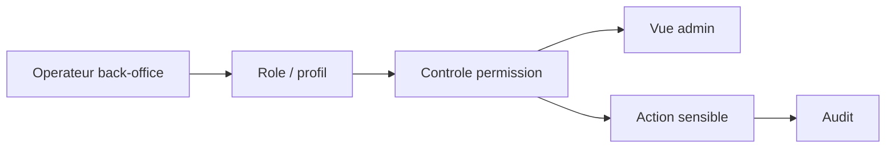

# Architecture applicative EPIC 35 - Profils back-office differencies

## Statut

- Version : retro-documentation v1
- Source backlog : [Epic 35 - Profils backoffice differencies](../../../roadmap/terminees/epic-35-profils-backoffice-differencies-backlog.md)
- Portee : architecture applicative de permissions back-office.
- Hors portee : specification technique detaillee des classes, schemas SQL exhaustifs et contrats API detailles.

## Objectif applicatif

Differencier les droits back-office selon les profils d'operateurs afin de limiter les actions sensibles aux roles autorises.

## Choix d'architecture

- Centraliser les profils et permissions back-office.
- Proteger les vues et actions sensibles par role.
- Distinguer lecture, action operationnelle et administration.
- Auditer les actions sensibles.
- Eviter de coder les droits uniquement dans l'interface.

## Objets manipules ou crees

- profil back-office
- role back-office
- permission
- action sensible
- utilisateur administrateur
- evenement d'audit

## Vue applicative

## Flux principaux

Voir la vue applicative ci-dessus ; aucun flux detaille complementaire n'est documente a ce niveau.

## Frontieres avec les autres domaines

- `identite_acces` porte roles et permissions.
- Les domaines metier gardent leurs use cases.
- L'interface ne doit pas etre le seul garde-fou.

## Securite / audit / idempotence

- Les actions sensibles doivent etre protegees par les mecanismes d'acces existants.
- Les changements d'etat metier doivent etre auditables lorsque l'EPIC cree ou modifie une ressource.
- L'idempotence est requise pour les traitements relancables, integrations externes, batchs et notifications.

## Points ouverts

- Aucun point ouvert documente dans la retro-documentation initiale.
