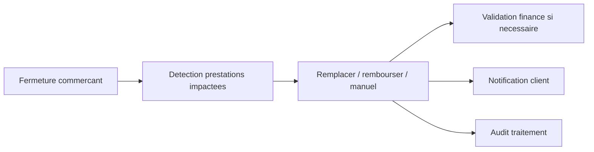

# Architecture applicative EPIC 36 - Fermeture commercant et remplacement prestations

## Statut

- Version : retro-documentation v1
- Source backlog : [Epic 36 - Fermeture commercant remplacement prestations](../../../roadmap/terminees/epic-36-fermeture-commercant-remplacement-prestations-backlog.md)
- Portee : architecture applicative de traitement des impacts d'une fermeture commercant.
- Hors portee : specification technique detaillee des classes, schemas SQL exhaustifs et contrats API detailles.

## Objectif applicatif

Gerer les coffrets contenant des prestations d'un commercant ferme, en proposant remplacement, remboursement ou traitement manuel selon l'etat de consommation.

## Choix d'architecture

- Identifier les prestations impactees par la fermeture.
- Traiter chaque prestation non consommee avec une decision explicite.
- Exiger validation finance si le remplacement augmente la valeur reversee.
- Creer une demande de remboursement au lieu d'executer automatiquement un PSP en MVP.
- Notifier le client par email en MVP.

## Objets manipules ou crees

- `Commercant`
- prestation impactee
- `CoffretInstance`
- `StatutPrestationCoffretInstance`
- prestation de remplacement
- demande de remboursement
- validation finance
- email client

## Vue applicative

## Flux principaux

Voir la vue applicative ci-dessus ; aucun flux detaille complementaire n'est documente a ce niveau.

## Frontieres avec les autres domaines

- `referencement` porte la fermeture du commercant.
- `gestion_achats` porte les instances impactees.
- `support` porte le traitement client.
- `gestion_reversement` intervient sur les impacts financiers.

## Securite / audit / idempotence

- Les actions sensibles doivent etre protegees par les mecanismes d'acces existants.
- Les changements d'etat metier doivent etre auditables lorsque l'EPIC cree ou modifie une ressource.
- L'idempotence est requise pour les traitements relancables, integrations externes, batchs et notifications.

## Points ouverts

- Aucun point ouvert documente dans la retro-documentation initiale.
