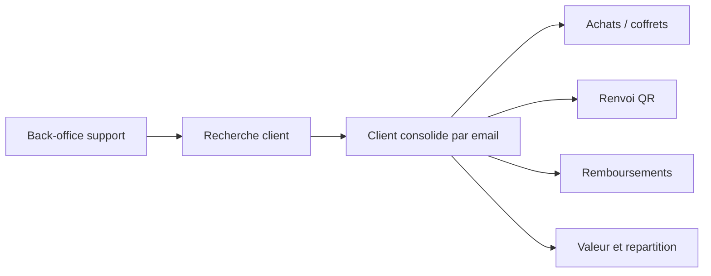

# Architecture applicative EPIC 37 - Vision 360 client back-office

## Statut

- Version : retro-documentation v1
- Source backlog : [Epic 37 - Vision 360 client](../../../roadmap/terminees/epic-37-vision-360-client-backoffice-backlog.md)
- Portee : architecture applicative de consolidation client support.
- Hors portee : specification technique detaillee des classes, schemas SQL exhaustifs et contrats API detailles.

## Objectif applicatif

Permettre au back-office de retrouver un client et de comprendre son historique d'achats, QR, remboursements, valeur et activite support depuis une vue unique.

## Choix d'architecture

- Creer une table `clients` pour consolider les achats par email.
- Utiliser l'email comme cle MVP de consolidation.
- Garder les achats sans email valide en client non consolide.
- Limiter les coordonnees completes et les remboursements aux roles autorises.
- Ne pas fusionner automatiquement les doublons d'emails differents en MVP.

## Objets manipules ou crees

- `Client`
- `AchatCoffret`
- `CoffretInstance`
- QR client
- email de renvoi QR
- remboursement
- repartition CA par commercant
- suspicion de doublon
- projection vision 360 client

## Vue applicative

## Flux principaux

Voir la vue applicative ci-dessus ; aucun flux detaille complementaire n'est documente a ce niveau.

## Frontieres avec les autres domaines

- `support` porte la vue de traitement client.
- `gestion_achats` reste source des achats et instances.
- `identite_acces` ou back-office permissions protege les donnees sensibles.

## Securite / audit / idempotence

- Les actions sensibles doivent etre protegees par les mecanismes d'acces existants.
- Les changements d'etat metier doivent etre auditables lorsque l'EPIC cree ou modifie une ressource.
- L'idempotence est requise pour les traitements relancables, integrations externes, batchs et notifications.

## Points ouverts

- Aucun point ouvert documente dans la retro-documentation initiale.
