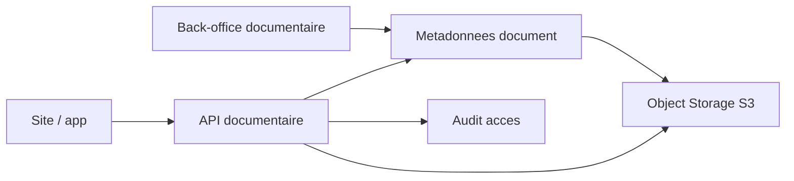

# Architecture applicative EPIC 38 - Gestion documentaire transverse

## Statut

- Version : retro-documentation v1
- Source backlog : [Epic 38 - Gestion documentaire transverse](../../../roadmap/terminees/epic-38-gestion-documentaire-backlog.md)
- Portee : architecture applicative du socle documentaire.
- Hors portee : specification technique detaillee des classes, schemas SQL exhaustifs et contrats API detailles.

## Objectif applicatif

Fournir un socle documentaire transverse pour publier des documents publics, rattacher des documents contractuels et tracer les documents generes, sans stocker les binaires en base.

## Choix d'architecture

- Stocker en base uniquement les metadonnees et references de stockage.
- Utiliser un stockage objet compatible S3 pour les binaires.
- Servir les documents via le backend afin de garder controle et audit.
- Gerer publication, remplacement de contenu, statut et dates depuis le back-office.
- Distinguer documents publics, documents commercants, documents clients et documents generes.

## Objets manipules ou crees

- document
- metadonnees documentaires
- scope de publication
- reference stockage externe
- document public
- document commercant
- document client
- rattachement documentaire
- audit de consultation ou telechargement

## Vue applicative

## Flux principaux

Voir la vue applicative ci-dessus ; aucun flux detaille complementaire n'est documente a ce niveau.

## Frontieres avec les autres domaines

- `documentaire` porte les metadonnees et droits d'acces.
- `dam` reste limite aux images et assets media.
- Les domaines metier produisent ou consomment des documents via rattachement.

## Securite / audit / idempotence

- Les actions sensibles doivent etre protegees par les mecanismes d'acces existants.
- Les changements d'etat metier doivent etre auditables lorsque l'EPIC cree ou modifie une ressource.
- L'idempotence est requise pour les traitements relancables, integrations externes, batchs et notifications.

## Points ouverts

- Aucun point ouvert documente dans la retro-documentation initiale.
