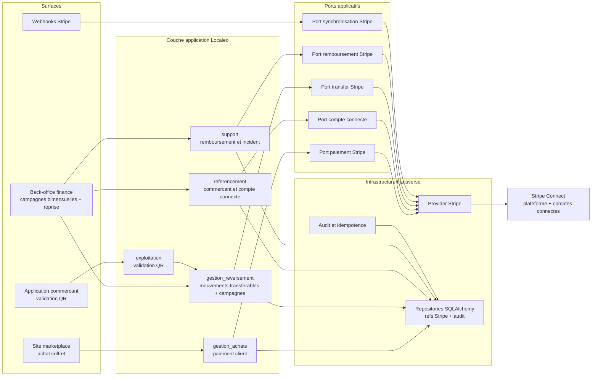
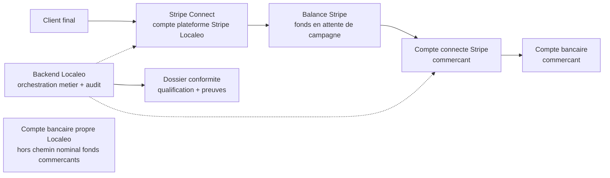
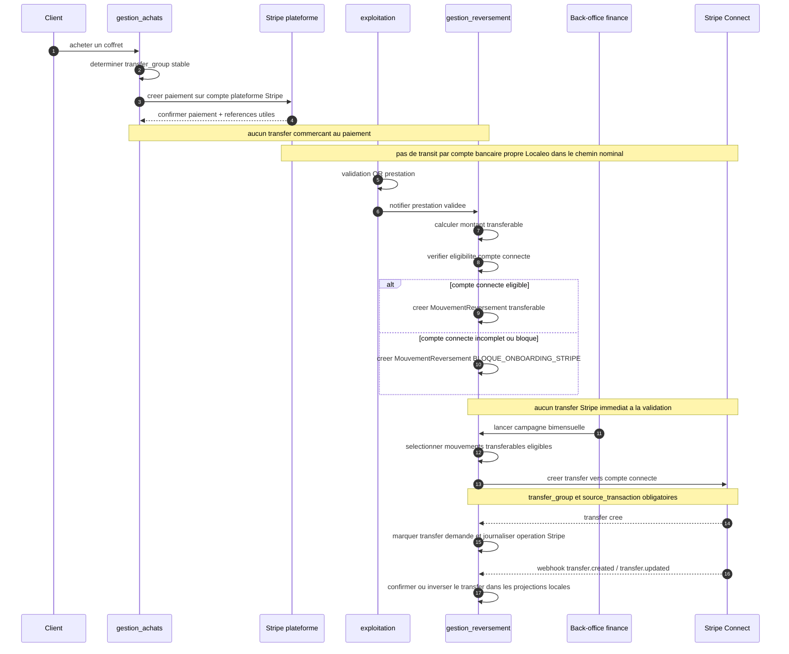
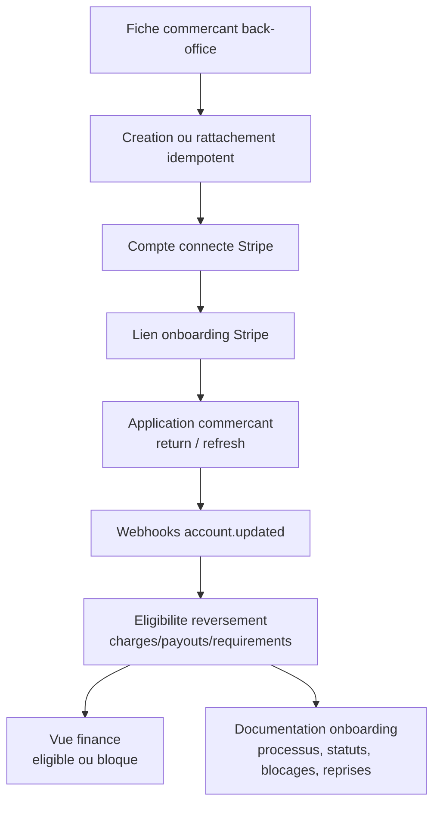
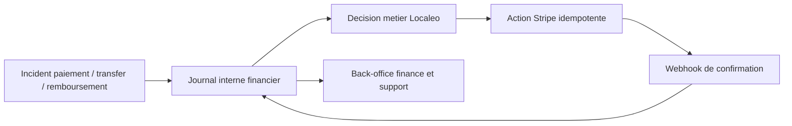

# Architecture applicative EPIC 39 - Delegation des flux financiers a Stripe Connect

## Statut

- Version : initialisation v1
- Source backlog : [Epic 39 - Delegation des flux financiers a Stripe Connect](../../../roadmap/terminees/epic-39-stripe-connect-psp-backlog.md)
- ADR associe : [ADR-2026-07-09 - Decisions d'implementation EPIC 39 Stripe Connect](../../decisions/ADR-2026-07-09-epic-39-stripe-connect-implementation.md)
- Livrable contractuel associe : Annexe contractuelle - Flux financiers Stripe Connect — source historique non retrouvée (`annexe-flux-financiers-stripe-connect.md` ; voir [le registre des sources absentes](../../../organisation/sources-historiques-absentes.md))
- Dossier Lot 0 : Validation conformite Stripe Connect — source historique non retrouvée (`lot-0-dossier-validation-conformite-stripe-connect.md` ; voir [le registre des sources absentes](../../../organisation/sources-historiques-absentes.md))
- Onboarding commercant : Documentation onboarding commercant Stripe Connect — source historique non retrouvée (`onboarding-commercant-stripe-connect.md` ; voir [le registre des sources absentes](../../../organisation/sources-historiques-absentes.md))
- Portee : architecture applicative cible pour la delegation paiement et reversement a Stripe Connect, incluant les invariants de conformite PSP et de protection des fonds
- Hors portee : schema SQL detaille, mapping exhaustif des champs Stripe et specification technique des classes.

## Objectif applicatif

L'EPIC 39 met en place une architecture applicative permettant a Localeo de deleguer les flux financiers a Stripe Connect, sans perdre la maitrise metier du cycle paiement, validation, transfer, remboursement et support.

Ce document ne constitue pas un avis juridique. Il formalise les choix d'architecture, les invariants de flux et les preuves a produire pour permettre la validation juridique du modele PSP cible.

Le choix cible est Stripe Connect avec le modele `separate charges and transfers` :

- le type de compte Connect cible est `Express` ;
- le client paie via Stripe Connect sur le compte plateforme Stripe Localeo ;
- le coffret n'est vendable que si tous les commercants des prestations rattachees disposent d'un compte connecte Stripe eligible aux transfers ;
- aucun transfer commercant n'est cree au moment du paiement ;
- la validation QR d'une prestation declenche l'obligation de reversement ;
- la validation QR rend le mouvement transferable uniquement si le compte connecte Stripe reste eligible, sans creer immediatement le transfer Stripe ;
- si l'eligibilite Stripe se degrade apres achat, le mouvement est bloque jusqu'a regularisation Stripe ;
- Localeo pilote ensuite les transfers vers les comptes connectes commercants dans des campagnes bimensuelles de reversement ;
- les fonds destines aux commercants ne transitent pas par un compte bancaire propre Localeo dans le modele cible valide ;
- les objets internes `Paiement`, `MouvementReversement`, `Reversement` et `PaiementReversement` restent le modele metier et back-office Localeo ;
- ces objets sont alimentes par les commandes Stripe, les webhooks Stripe, les references Stripe, les cles d'idempotence, les statuts synchronises et les traces d'audit necessaires.

## Choix d'architecture

- Isoler Stripe derriere des ports applicatifs afin d'eviter de diffuser les details Stripe dans les use cases metier.
- Creer les comptes connectes en cible `Express`, afin de deleguer a Stripe l'onboarding, les exigences KYC et l'experience minimale de compte connecte.
- Garder `gestion_achats` responsable du paiement client et du lien avec l'achat/coffret.
- Garder `commercialisation` responsable de la vendabilite du coffret : un coffret contenant une prestation d'un commercant non eligible Stripe Connect ne doit pas etre publie ni vendu.
- Garder `exploitation` responsable du signal de validation QR.
- Garder `gestion_reversement` responsable de la decision metier de transfer, des objets `MouvementReversement`, `Reversement`, `PaiementReversement`, de l'eligibilite apres validation, du statut `BLOQUE_ONBOARDING_STRIPE` et du declenchement Stripe par campagne bimensuelle.
- Rattacher l'onboarding Stripe Connect au referentiel commercant, sans stocker de donnees bancaires sensibles si Stripe porte cette responsabilite.
- Creer un `transfer_group` stable des l'initialisation du paiement, au format canonique `achat:{achat_id}`, pour relier paiement, achat, validation et transfers.
- Exiger `source_transaction` pour chaque transfer ; reparer la reference depuis le paiement ou `PaymentIntent.latest_charge` et bloquer l'appel Stripe si la charge d'origine reste introuvable.
- Traiter les webhooks Stripe comme des synchronisations d'etat, pas comme la source de decision metier.
- Rendre toutes les operations externes idempotentes : compte connecte, paiement, transfer, remboursement, webhook et reprise.
- Proteger l'activation de Stripe Connect par `LOCALEO_FEATURE_STRIPE_CONNECT_ENABLED`, avec activation production interdite sans go/no-go juridique, finance et conformite PSP.
- Requalifier les objets internes `Paiement`, `MouvementReversement`, `Reversement` et `PaiementReversement` autour de Stripe.
- Decommissionner completement les virements, reversements, exports bancaires et confirmations manuelles, et les remplacer par un pilotage de campagnes bimensuelles Stripe Connect.
- Supprimer les donnees, vues et parcours historiques manuels, l'application n'etant pas en production, sans surface operationnelle ni retrocompatibilite applicative.
- Formaliser l'invariant de flux : Stripe execute les operations financieres ; Localeo orchestre les decisions metier et conserve le journal, sans recevoir les fonds commercants sur ses comptes bancaires propres.
- Conditionner la mise en production a une validation juridique du role Localeo, du besoin eventuel d'enregistrement ACPR et du mecanisme de protection des fonds chez Stripe.
- Interdire tout fallback manuel banque : un incident Stripe ou onboarding bloque le reversement jusqu'a resolution via Stripe.

## Configuration et garde-fous d'activation

L'integration Stripe Connect doit etre configuree de maniere explicite par
environnement.

Variables cibles :

- `LOCALEO_FEATURE_STRIPE_CONNECT_ENABLED` ;
- `LOCALEO_STRIPE_SECRET_KEY` ;
- `LOCALEO_STRIPE_WEBHOOK_SECRET` ;
- `LOCALEO_STRIPE_CONNECT_WEBHOOK_SECRET` ;
- `LOCALEO_STRIPE_ONBOARDING_RETURN_URL` ;
- `LOCALEO_STRIPE_ONBOARDING_REFRESH_URL`.

Les evenements du compte plateforme sont recus sur
`POST /public/stripe/webhook` et verifies avec
`LOCALEO_STRIPE_WEBHOOK_SECRET`. Les evenements emis pour les comptes connectes
sont recus sur `POST /public/stripe-connect/webhook`, verifies avec
`LOCALEO_STRIPE_CONNECT_WEBHOOK_SECRET` et limites a `account.updated`.

Decision d'interface onboarding :

- les URLs `return_url` et `refresh_url` utilisees dans les `AccountLink`
  Stripe pointent vers l'application commercant ;
- elles ne doivent pas pointer vers `/admin`, `/internal` ou une route protegee
  par API key ;
- l'application commercant affiche l'etat de reprise du parcours et appelle le
  backend pour resynchroniser ou regenerer un lien ;
- le backend reste seul a appeler Stripe avec la cle secrete ;
- chaque parcours doit porter un `state` opaque signe ou une protection
  equivalente liee a la session commercant.

Valeurs cibles :

```env
LOCALEO_STRIPE_ONBOARDING_RETURN_URL=https://commercants.localeo.fr/stripe-connect/onboarding/return
LOCALEO_STRIPE_ONBOARDING_REFRESH_URL=https://commercants.localeo.fr/stripe-connect/onboarding/refresh
```

Les noms historiques `STRIPE_API_KEY` et `STRIPE_WEBHOOK_SECRET` peuvent
exister pendant la refonte, mais doivent etre migres vers les noms cibles ou
documentes comme alias techniques transitoires.

Regles d'activation :

- environnement de developpement et test : activation possible avec un compte
  Stripe test dedie ;
- environnement de production : activation interdite tant que le dossier de
  conformite PSP et le go/no-go juridique/finance ne sont pas valides ;
- tous les use cases sensibles doivent verifier le feature flag avant de creer
  ou reprendre une operation Stripe Connect ;
- les webhooks peuvent etre recus en preproduction, mais ne doivent pas
  declencher de changement financier operationnel si le flux cible est desactive.

## Statuts cible des mouvements

Les statuts metier cibles pour `MouvementReversement` dans le flux Stripe
Connect sont :

| Statut | Role applicatif |
| --- | --- |
| `A_CALCULER` | Mouvement en construction, montant ou references a finaliser. |
| `TRANSFERABLE` | Mouvement eligible a une campagne Stripe Connect. |
| `BLOQUE_ONBOARDING_STRIPE` | Compte connecte absent, incomplet, bloque ou non eligible. |
| `EN_CAMPAGNE` | Mouvement selectionne dans une campagne en cours. |
| `TRANSFER_DEMANDE` | Transfer demande a Stripe avec cle d'idempotence. |
| `TRANSFER_CONFIRME` | Transfer confirme par Stripe. |
| `ECHEC_TRANSFER` | Echec de transfer repris via Stripe apres correction. |
| `ANNULE` | Mouvement neutralise par une decision metier auditee. |

Les anciens statuts manuels ne doivent pas redevenir des statuts cibles. Si le
code historique reference encore `A_REVERSER` ou `ECHEC`, une migration one-shot
doit les mapper vers `TRANSFERABLE` ou `ECHEC_TRANSFER` selon le cas.

## Principes de conformite financiere

- L'architecture distingue quatre notions : compte plateforme Stripe, balance Stripe, compte connecte commercant et compte bancaire propre Localeo.
- Le chemin nominal des fonds clients destines aux commercants reste dans l'ecosysteme Stripe jusqu'au transfer ou payout vers le compte connecte ou le compte bancaire du commercant.
- Les comptes bancaires propres Localeo ne doivent pas recevoir les fonds destines aux commercants dans le flux cible.
- Les objets internes Localeo representent le suivi metier du flux Stripe ; ils ne representent ni une detention des fonds ni une execution bancaire manuelle.
- Les references Stripe et le journal evenementiel Stripe servent a l'idempotence, l'audit, le support, le rapprochement et la projection back-office.
- Les termes utilises dans les contrats, mandats, factures, back-office et API doivent etre alignes avec la qualification juridique validee.
- Le mecanisme de cantonnement, segregation ou protection des fonds n'est pas suppose par l'architecture : il doit etre documente a partir des elements contractuels Stripe et valide par le conseil juridique.
- Les choix de flux doivent etre traduits dans une annexe contractuelle dediee aux flux Stripe Connect avant integration aux CGV ou au contrat commercant.

## Objets manipules ou crees

- `Commercant`
- compte connecte Stripe commercant
- `AchatCoffret`
- `Paiement`
- references Stripe : Checkout Session, PaymentIntent, Charge, Customer
- `transfer_group`
- validation QR / `ValidationPrestation`
- `MouvementReversement`
- `Reversement`
- `PaiementReversement`
- campagne bimensuelle de reversement
- journal evenementiel Stripe
- operation Stripe : paiement, transfer, remboursement, synchronisation payout
- webhook Stripe
- cle d'idempotence metier
- evenement d'audit finance
- dossier conformite PSP
- decision juridique de qualification du modele
- preuve de non-transit par compte bancaire propre Localeo
- references contractuelles Stripe sur la protection des fonds
- annexe contractuelle flux financiers Stripe Connect

## Vue applicative



## Vue conformite des flux financiers



L'architecture cible doit permettre de prouver que le compte bancaire propre Localeo n'est jamais dans le chemin operationnel des fonds destines aux commercants. Aucun flux manuel, export bancaire ou reprise bancaire ne doit pouvoir utiliser ce chemin dans la cible.

## Flux principaux

### Paiement et reversement



### Onboarding commercant



La documentation d'onboarding commercant est un livrable d'exploitation et de support. Elle doit decrire le parcours nominal, les pre-requis commercant, les etapes realisees chez Stripe, les responsabilites Localeo/commercant/Stripe, les donnees et pieces attendues, les statuts synchronises, les cas de blocage, les reprises, les impacts sur l'eligibilite aux transfers, les routes de l'application commercant utilisees en `return_url` et `refresh_url`, et les points d'escalade support.

### Gestion des incidents et remboursements



Les remboursements sont separes en deux parcours applicatifs :

- avant transfer : remboursement client execute via Stripe Refund, rattache au paiement d'origine et idempotent par demande de remboursement ;
- apres transfer : remboursement client avec regle explicite de reprise ou compensation via Stripe, sans traitement bancaire manuel.

## Frontieres avec les autres domaines

| Domaine | Responsabilite dans l'EPIC 39 |
| --- | --- |
| `referencement` | Rattachement du compte connecte au commercant et lecture de son eligibilite. |
| `commercialisation` | Controle de vendabilite du coffret selon l'eligibilite Stripe Connect des commercants rattaches aux prestations. |
| `gestion_achats` | Initialisation paiement client, objet `Paiement`, references Stripe de paiement, `transfer_group`. |
| `exploitation` | Validation QR qui declenche l'obligation de reversement. |
| `gestion_reversement` | Calcul metier du montant, `MouvementReversement` transferable ou `BLOQUE_ONBOARDING_STRIPE`, `Reversement`, `PaiementReversement`, campagne bimensuelle, creation du transfer Stripe, statut synchronise et reprise. |
| `support` | Parcours remboursement, incident client et support operationnel. |
| `identite_acces` | Protection des actions finance sensibles et scopes back-office. |
| `exploitation` | Webhooks, audit, alertes et traitements de reprise si portes comme operations internes. |
| `finance_juridique` | Qualification PSP, dossier de preuve, validation ACPR eventuelle, alignement contractuel. |

## Regles de frontiere

- Stripe execute le flux financier, mais ne decide pas quand un commercant doit etre reverse.
- La validation QR reste la condition metier d'obligation de reversement, mais le mouvement n'est transferable que si le compte connecte Stripe est eligible.
- Un mouvement `BLOQUE_ONBOARDING_STRIPE` est visible en finance mais exclu des campagnes de reversement.
- La regularisation Stripe Connect peut requalifier les mouvements bloques comme transferables via webhook ou resynchronisation back-office.
- La creation effective d'un transfer Stripe est pilotee par Localeo dans une campagne bimensuelle de reversement.
- La campagne ne cloture pas seule le reversement : elle demande le transfer Stripe ; la confirmation ou l'inversion est synchronisee par webhook Stripe et met a jour `PaiementReversement`, `MouvementReversement` et `Reversement`.
- Avant chaque demande de transfer, la campagne exige une `source_transaction` de type `ch_*`. Elle la repare depuis le paiement ou `PaymentIntent.latest_charge` si necessaire et n'appelle pas Stripe tant que la charge d'origine reste introuvable.
- Le montant du transfer vient des regles Localeo existantes ; il n'est pas saisi librement au moment du transfer.
- Les webhooks Stripe ne creent pas de droits metier ; ils synchronisent l'etat d'operations deja decidees ou reconnues.
- Les secrets Stripe et donnees bancaires sensibles ne doivent pas etre stockes ni exposes dans les logs.
- Les anciens objets et flux manuels sont supprimes ; ils ne permettent aucune reprise, export, confirmation ou paiement manuel.
- Les nouveaux flux peuvent creer ou mettre a jour `Paiement`, `MouvementReversement`, `Reversement` et `PaiementReversement`, mais ces objets declenchent ou refletent des operations Stripe.
- Les objets internes ne doivent pas reconstituer un systeme manuel concurrent de Stripe.
- Les exports de virement bancaire manuel sont supprimes des parcours operationnels cibles.
- Les campagnes bimensuelles Stripe Connect remplacent le pilotage bancaire manuel tout en conservant la maitrise operationnelle par Localeo.
- Les flux cibles ne doivent pas faire transiter les fonds commercants par un compte bancaire propre Localeo.
- Tout fallback manuel banque est interdit dans la cible.
- La mise en production du flux cible depend de la validation du dossier conformite PSP.
- L'architecture doit conserver les elements permettant d'expliquer a posteriori le chemin d'un paiement, du paiement client au transfer ou payout commercant.

## Securite / audit / idempotence

- Les actions sensibles doivent etre protegees par les mecanismes d'acces existants.
- Les changements d'etat metier doivent etre auditables lorsque l'EPIC cree ou modifie une ressource.
- L'idempotence est requise pour les traitements relancables, integrations externes, batchs et notifications.
- Les preuves de conformite doivent etre versionnees ou conservees avec une date de validation : qualification du role Localeo, decision ACPR, documentation Stripe, cartographie des flux et go/no-go production.
- Les journaux finance doivent distinguer operation Stripe nominale et reprise technique Stripe ; aucune exception manuelle banque ne doit etre creee.
- Les vues back-office ne doivent pas masquer les etats de blocage lies a l'onboarding, aux capacites Stripe ou a une decision de conformite manquante.

## Points ouverts

- Les points Lot 0 sont cadres dans `docs/juridique/lot-0-dossier-validation-conformite-stripe-connect.md`.
- Finaliser la validation juridique du mecanisme de cantonnement, segregation ou protection des fonds a partir des preuves Stripe collectees.
- Valider juridiquement la qualification Localeo comme plateforme numerique d'intermediation, operateur de plateforme en ligne et mandataire d'encaissement.
- Valider juridiquement l'annexe Stripe avant integration aux CGV, contrat commercant, mandat existant, factures, mentions back-office et annexes.
- Obtenir et archiver la documentation contractuelle Stripe definitive sur les tarifs, comptes actifs, balances, reserves, responsabilites et protection des fonds.
- Decrire les contrats des ports applicatifs Stripe et les evenements d'audit associes.
- Definir les projections back-office finance cible apres suppression des exports bancaires manuels et introduction des campagnes bimensuelles Stripe Connect.
