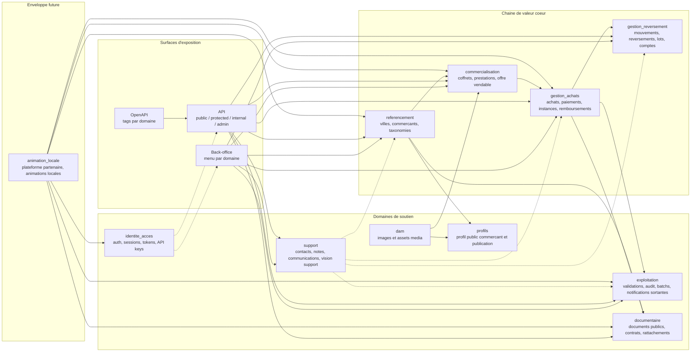
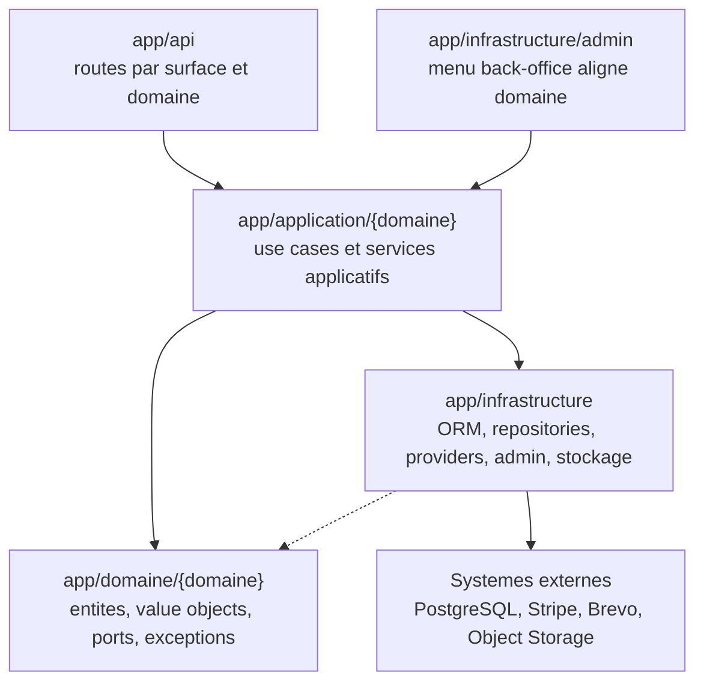
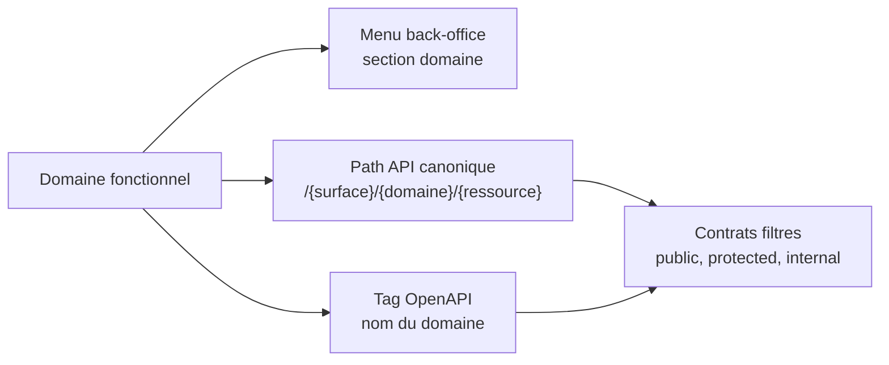

# Architecture applicative EPIC 40 - Domaines fonctionnels backend

## Statut

- Version : initialisation v1
- Source backlog : [Epic 40 - Organisation du backend par domaines fonctionnels](../../../roadmap/terminees/epic-40-domaines-fonctionnels-backend-backlog.md)
- Portee : architecture applicative cible pour l'organisation backend par domaines fonctionnels
- Hors portee : plan de migration detaille, specification technique des classes, contrat technique final de chaque endpoint.

## Objectif applicatif

L'EPIC 40 vise a rendre le backend Localeo plus lisible et maintenable en faisant apparaitre les domaines fonctionnels dans :

- les packages `app/domaine/{domaine}` ;
- les packages `app/application/{domaine}` ;
- l'organisation du menu back-office ;
- les chemins d'API canoniques ;
- les tags OpenAPI.

La couche `app/infrastructure` reste transverse. Elle porte les mecanismes techniques partages : ORM, repositories SQLAlchemy, providers externes, stockage, email, SMS, paiement, admin.

## Choix d'architecture

- Organiser `app/domaine` et `app/application` par domaine fonctionnel, pas seulement par nature technique.
- Garder `app/infrastructure` transverse pour eviter de dupliquer ORM, providers, stockage, email, SMS, paiement et admin.
- Aligner le menu back-office sur les memes domaines que le backend.
- Faire porter le domaine dans le path API canonique : `/{surface}/{domaine}/{ressource}`.
- Faire porter le domaine dans les tags OpenAPI.
- Exposer des contrats OpenAPI filtres par surface : public, protected et internal.
- Migrer les paths API en one-shot, sans conserver durablement les anciens paths.
- Integrer `animation_locale` comme enveloppe cible pour preparer l'EPIC 41 sans implementer son moteur dans l'EPIC 40.

## Vue applicative

## Lecture du modele

La chaine de valeur coeur est volontairement separee en quatre domaines :

- `referencement` decrit les acteurs et taxonomies qui rendent l'offre possible ;
- `commercialisation` structure l'offre vendable ;
- `gestion_achats` gere le cycle de vie post-intention d'achat ;
- `gestion_reversement` gere les obligations et executions de reversement commercant.

Les domaines de soutien restent separes pour eviter que `exploitation` devienne un domaine fourre-tout. `identite_acces`, `documentaire`, `dam`, `support` et `profils` portent chacun un cycle de vie distinct.

`animation_locale` est integre comme enveloppe cible afin que l'organisation du backend anticipe l'EPIC 41 sans melanger ses objets avec les achats ou la commercialisation existante.

## Objets manipules ou crees

| Domaine | Responsabilite | Objets et concepts principaux |
| --- | --- | --- |
| `referencement` | Gerer le socle referentiel avant exposition commerciale. | `Ville`, `TypeCommercant`, `Commercant`, listes et details referentiels. |
| `commercialisation` | Gerer l'offre vendable. | `Coffret`, `PrestationCoffret`, `TypeCoffretConfig`, recherche marketplace, detail offre. |
| `gestion_achats` | Gerer le cycle achat apres intention d'achat. | `AchatCoffret`, `Paiement`, `PaiementEvent`, `CoffretInstance`, `StatutPrestationCoffretInstance`, remboursement, activation, consultation post-achat. |
| `gestion_reversement` | Gerer la dette commercant et son execution. | `CompteBancaireCommercant`, `CompteReversementCommercant`, `MouvementReversement`, `Reversement`, `LigneReversement`, `PaiementReversement`, `LotPaiementReversement`. |
| `exploitation` | Piloter les operations terrain et les evenements operationnels. | `LienCourt`, `EvenementAudit`, `EmailSortant`, `SmsSortant`, `ValidationPrestation`, `ValidationSecours`, `TransactionValidation`, activites locales, batchs, PWA exploitation, feedback prestation. |
| `support` | Gerer les interactions support client, commercant et partenaire. | `MessageContact`, `MotifContact`, notes internes, communications libres, timeline support, demandes de facturation. |
| `identite_acces` | Gerer securite, authentification, sessions et tokens. | `TokenAccesCommercant`, `SessionCommercant`, `RateLimitAuthentification`, `ApiKey`, `IdentifiantCommercant`, reset password, verification session. |
| `documentaire` | Gerer les documents et leurs rattachements. | Gestion documentaire, documents publics, documents commercants, documents clients, contrats, mandats, rattachements documentaires. |
| `dam` | Gerer les images et assets media. | Images coffrets, images commercants, media assets, stockage et publication media. |
| `profils` | Gerer la publication du profil commercant. | `ProfilCommercant`, contenu public du profil, versioning de publication. |
| `animation_locale` | Preparer la plateforme partenaire d'animations locales. | Enveloppe cible pour animations, inscriptions, participants, lots, tirages et pilotage live. |

## Organisation cible des couches

Regles attendues :

- les routes HTTP orchestrent les entrees et sorties, mais ne portent pas la logique metier ;
- les use cases applicatifs sont regroupes par domaine fonctionnel ;
- les objets metier vivent dans `app/domaine/{domaine}` ;
- l'infrastructure reste transverse et implemente les ports/repositories attendus par le domaine ;
- une reorganisation de package ne doit pas modifier les schemas SQL, les payloads ou les comportements metier.

## Alignement API, OpenAPI et back-office

Exemples de conventions :

- `/public/referencement/villes` porte le domaine `referencement` ;
- `/public/commercialisation/coffrets` porte le domaine `commercialisation` ;
- `/public/documentaire/documents` porte le domaine `documentaire` ;
- `/protected/exploitation/validation` porte le domaine `exploitation` ;
- `/protected/gestion-reversement/reversements` porte le domaine `gestion_reversement` ;
- `/internal/support/messages-contact` porte le domaine `support`.

Les tags OpenAPI doivent reprendre le meme modele mental, par exemple `Referencement`, `Commercialisation`, `Gestion achats`, `Gestion reversement`, `Exploitation`, `Support`, `Documentaire`.

## Regles de frontiere

- Il n'y a pas de domaine `qr` dedie. Le `QrToken` reste un value object partage : le cycle de vie post-achat appartient a `gestion_achats`, le scan et la validation terrain appartiennent a `exploitation`.
- Le feedback prestation appartient a `exploitation` comme signal operationnel post-prestation. Il peut alimenter `support` si une demande ou alerte support est creee.
- Les documents d'achat sont produits par `gestion_achats`, mais leur gestion documentaire transverse appartient a `documentaire`.
- `TypeCoffretConfig` appartient a `commercialisation`, car il structure l'offre vendable.
- `IdentifiantCommercant` appartient a `identite_acces` lorsqu'il porte login, mot de passe, verrouillage et tentatives de connexion.
- Les tokens de consultation appartiennent a `identite_acces` pour la mecanique de securite ; les use cases de consultation post-achat restent dans `gestion_achats`.
- `dam` ne doit pas porter les contrats, documents clients ou documents publics : il reste limite aux images et assets media.

## Flux principaux

Voir la vue applicative ci-dessus ; aucun flux detaille complementaire n'est documente a ce niveau.

## Frontieres avec les autres domaines

- Les frontieres avec les autres domaines restent celles du backlog de l'EPIC et des conventions EPIC 40.

## Securite / audit / idempotence

- Les actions sensibles doivent etre protegees par les mecanismes d'acces existants.
- Les changements d'etat metier doivent etre auditables lorsque l'EPIC cree ou modifie une ressource.
- L'idempotence est requise pour les traitements relancables, integrations externes, batchs et notifications.

## Points ouverts

- Diagrammes de sequence pour les flux achat, validation QR, reversement et support.
- Strategie de migration package par package.
- Regles de nommage exactes pour les modules Python cibles.
- Verification runtime des routes migrees et des contrats OpenAPI filtres.
