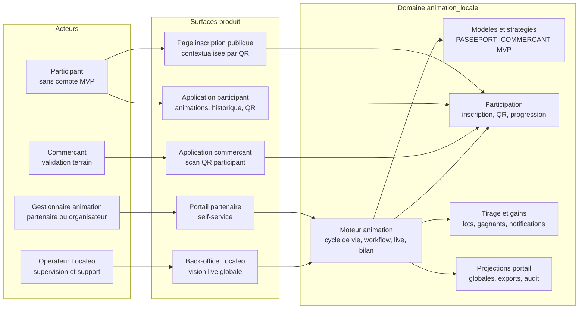
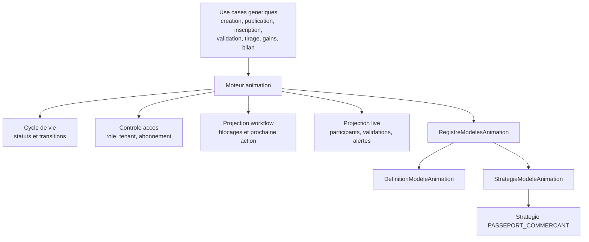
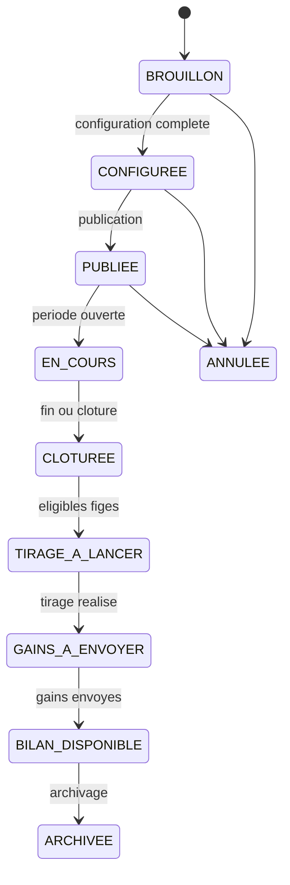
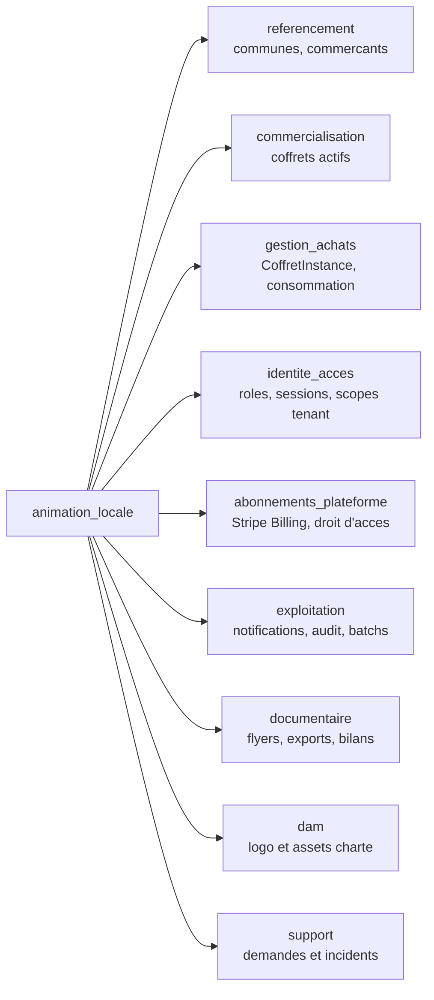

# Architecture applicative EPIC 41 - Domaine animation locale

> Réorganisation du 18 septembre 2026 : une variante applicative distincte existe ; consulter [les versions et écarts conservés](../../../organisation/variantes-a-harmoniser.md). Ce classement ne tranche pas leurs divergences.

## Statut

- Version : cadrage UX v2
- Source backlog : [Epic 41 - Plateforme d'animation locale MVP](../../../roadmap/terminees/epic-41-plateforme-animation-locale-mvp-backlog.md)
- Source UX : [Expression de besoin UX - Plateforme partenaire](../../../produit/animation/epic-41-expression-besoin-plateforme-partenaire-figma.md)
- Source analyse API : [Analyse API de la maquette Animation locale](../../../specifications/epic-41-api/analyse-api-maquette.md)
- Source maquette courante : `livrables/design/animation/localeo-animation-maquette-v2.zip`
- Portee : architecture applicative cible du domaine fonctionnel `animation_locale`
- Hors portee : schemas SQL finaux, implementation concrete des classes, choix fin du domaine porteur des abonnements plateforme.

## Objectif applicatif

L'EPIC 41 introduit un domaine metier distinct, `animation_locale`, pour permettre a des partenaires habilites de creer, publier, piloter et analyser des animations locales sans intervention nominale de Localeo.

Le MVP livre le `Passeport commercant`, mais le domaine doit rester generique : le moteur ne doit pas devenir une implementation codee en dur d'un seul format d'animation.

## Choix d'architecture

- une animation est toujours creee depuis un modele ;
- le tenant MVP est la commune ;
- une animation MVP appartient a un seul tenant commune ;
- le partenaire gere ses animations en self-service via un portail dedie ;
- Localeo supervise, corrige exceptionnellement et administre les abonnements, sans etre le createur nominal des animations ;
- les lots sont des coffrets actifs de la commune, finances au prix catalogue par le partenaire via un achat professionnel Stripe ;
- la validation terrain utilise le QR participant scanne depuis l'application commercant ;
- la confirmation du paiement reserve les `CoffretInstance` ; l'envoi des gains active ces instances prepayees sans achat a zero euro ni duplication de `gestion_achats` ;
- les vues globales du portail partenaire sont des projections applicatives du domaine, pas de simples assemblages frontend ;
- les listes d'eligibilite commercants et coffrets sont exposees par `animation_locale` afin de masquer au frontend la logique croisee `referencement` + `commercialisation` ;
- l'abonnement detaille visible dans le portail est une projection consommee par `animation_locale`, distincte du droit technique `DroitAccesPlateformeAnimation` ;
- l'audit visible par le partenaire est une projection limitee aux evenements publiables de l'animation ;
- les exports CSV sont des ressources tracees, soumises a suppression automatique ;
- les APIs respectent les conventions EPIC 40 : `/public/animation-locale`, `/protected/animation-locale`, `/internal/animation-locale` et tag OpenAPI `Animation locale`.

## Vue applicative

## Objets manipules ou crees

- `ModeleAnimation`
- `DefinitionModeleAnimation`
- `StrategieModeleAnimation`
- `RegistreModelesAnimation`
- `TenantCommuneAnimation`
- `DroitAccesPlateformeAnimation`
- `Animation`
- `GestionnaireAnimation`
- `OrganisateurAnimation`
- `CommercantParticipantAnimation`
- `ParticipantAnimation`
- `InscriptionAnimation`
- `QrInscriptionAnimation`
- `QrParticipantAnimation`
- `FlyerCommunicationAnimation`
- `EtapeAnimation`
- `ValidationEtapeAnimation`
- `DotationAnimation`
- `LotAnimation`
- `TirageAnimation`
- `GainAnimation`
- `NotificationAnimation`
- `VueLiveAnimation`
- `VueWorkflowAnimation`
- `ContextePortailAnimation`
- `ModeleAnimationContextualise`
- `CommercantEligibleAnimation`
- `CoffretEligibleAnimation`
- `ConfigurationAnimation`
- `ValidationPublicationAnimation`
- `ListeParticipantsAnimation`
- `ListeValidationsAnimation`
- `ListeTiragesAnimation`
- `ListeGainsAnimation`
- `ListeFlyersAnimation`
- `ListeBilansAnimation`
- `AbonnementAnimation`
- `AuditAnimation`
- `ExportAnimation`
- `NotificationPortailAnimation`
- `BilanAnimation`
- `DashboardPerformanceAnimation`
- `PolitiqueConservationAnimation`

## Decoupage applicatif cible

```mermaid
flowchart TB
    subgraph Surfaces["Surfaces"]
        Portail["Portail partenaire"]
        Public["Page publique inscription"]
        MobileParticipant["Application participant"]
        MobileCommercant["Application commercant"]
        Supervision["Back-office Localeo"]
    end

    subgraph App["Use cases animation_locale"]
        Contexte["Contexte portail<br/>tenant, abonnement, notifications"]
        Creation["Creation et configuration"]
        Moteur["Moteur generique animation"]
        Eligibilite["Eligibilite<br/>commercants et coffrets"]
        Participation["Inscription et QR participant"]
        Terrain["Validation terrain"]
        Gains["Tirage et gains"]
        Reporting["Projections<br/>live, workflow, dashboard"]
        Global["Vues globales portail<br/>participants, validations,<br/>tirages, flyers, bilans, coffrets"]
        Exports["Exports CSV<br/>traces et purge"]
        Audit["Audit partenaire<br/>evenements publiables"]
    end

    subgraph Variation["Points de variation modele"]
        Registre["Registre modeles"]
        Definition["Definition modele"]
        Strategie["Strategie modele"]
        Passeport["PASSEPORT_COMMERCANT"]
    end

    subgraph Core["Domaines Localeo consommes"]
        Ref["referencement"]
        Com["commercialisation"]
        Achats["gestion_achats"]
        Identite["identite_acces"]
        Abonnement["abonnements_plateforme"]
        Exploit["exploitation"]
        Doc["documentaire"]
    end

    Portail --> Contexte
    Portail --> Creation
    Portail --> Global
    Portail --> Exports
    Portail --> Audit
    Public --> Participation
    MobileParticipant --> Participation
    MobileCommercant --> Terrain
    Supervision --> Reporting

    Creation --> Moteur
    Contexte --> Moteur
    Eligibilite --> Ref
    Eligibilite --> Com
    Participation --> Moteur
    Terrain --> Moteur
    Gains --> Moteur
    Reporting --> Moteur
    Global --> Moteur
    Exports --> Moteur
    Audit --> Moteur

    Moteur --> Registre
    Registre --> Definition
    Registre --> Strategie
    Strategie --> Passeport

    Creation --> Ref
    Creation --> Abonnement
    Contexte --> Identite
    Contexte --> Abonnement
    Terrain --> Ref
    Gains --> Com
    Gains --> Achats
    Participation --> Identite
    Participation --> Exploit
    Reporting --> Achats
    Global --> Achats
    Global --> Ref
    Exports --> Doc
    Audit --> Exploit
    Creation --> Doc
```

## Moteur generique d'animation

Le socle generique porte les invariants communs : cycle de vie, droits, tenant commune, abonnement, inscription, QR, validation d'etape, progression, qualification, tirage, gain, flyer, bilan, live, dashboard, audit et conservation.

Les particularites d'un modele sont isolees dans une `DefinitionModeleAnimation` et une `StrategieModeleAnimation`. Au MVP, seule la strategie `PASSEPORT_COMMERCANT` est active. Un second modele doit pouvoir etre ajoute sans reecrire les use cases generiques.

## Projections du portail partenaire

Le portail partenaire impose des vues transverses a l'interieur du domaine `animation_locale`. Ces vues ne doivent pas etre reconstruites cote frontend a partir de multiples endpoints generiques ; elles sont des projections applicatives dediees, filtrees par tenant commune et par droits.

| Surface portail | Projection applicative | Responsabilite |
| --- | --- | --- |
| Barre haute | `ContextePortailAnimation` | Commune active, communes habilitees, partenaire, abonnement, notifications. |
| Tableau de bord | `DashboardPerformanceAnimation` | KPIs, series temporelles, top commercants, alertes et animations necessitant une action. |
| Liste animations | `AnimationListItem` | Statut, workflow, alertes, compteurs et action suivante. |
| Catalogue modeles | `ModeleAnimationContextualise` | Disponibilite par tenant, abonnement, formule et prerequis. |
| Assistant creation | `CommercantEligibleAnimation`, `CoffretEligibleAnimation`, `ValidationPublicationAnimation` | Selection guidee et validation des prerequis. |
| Fiche animation | `VueWorkflowAnimation`, `VueLiveAnimation`, `ConfigurationAnimation` | Pilotage et lecture detaillee. |
| Participants | `ListeParticipantsAnimation` | Vue masquee et paginee par animation ou globale. |
| Validations | `ListeValidationsAnimation` | Validations, anomalies, filtres et export. |
| Tirages et gains | `ListeTiragesAnimation`, `ListeGainsAnimation` | Eligibles, tirages, gagnants, envoi des gains. |
| Coffrets gagnes | `ConsommationCoffretGain` | Lecture de la consommation issue de `gestion_achats`. |
| Flyers | `ListeFlyersAnimation`, `FlyerCommunicationAnimation` | Statut, telechargement, regeneration. |
| Bilans | `ListeBilansAnimation`, `BilanAnimation` | Comparaison, synthese et exports CSV. |
| Abonnement | `AbonnementAnimation` | Formule, statut, dates, droits inclus et limitations. |
| Audit | `AuditAnimation` | Evenements publiables pour le partenaire, sans donnees internes sensibles. |

## Familles API cibles

```mermaid
flowchart TB
    Portal["Portail partenaire"] --> Context["Contexte et droits"]
    Portal --> Config["Creation et configuration"]
    Portal --> Detail["Fiche animation"]
    Portal --> Global["Vues globales"]
    Portal --> Export["Exports"]
    Portal --> Support["Support partenaire"]

    Context --> C1["/protected/animation-locale/contexte-portail"]
    Context --> C2["/protected/animation-locale/abonnement"]
    Config --> E1["/protected/animation-locale/modeles"]
    Config --> E2["/protected/animation-locale/communes/{id}/commercants-eligibles"]
    Config --> E3["/protected/animation-locale/communes/{id}/coffrets-eligibles"]
    Detail --> D1["/protected/animation-locale/animations/{id}/workflow"]
    Detail --> D2["/protected/animation-locale/animations/{id}/participants"]
    D2 --> D2S["DELETE /animations/{id}/participants/{participant_id}<br/>permission dediee"]
    Detail --> D3["/protected/animation-locale/animations/{id}/validations"]
    Detail --> D4["/protected/animation-locale/animations/{id}/tirages"]
    Detail --> D5["/protected/animation-locale/animations/{id}/gains"]
    Detail --> D6["/protected/animation-locale/animations/{id}/audit"]
    Global --> G1["/protected/animation-locale/participants"]
    Global --> G2["/protected/animation-locale/validations"]
    Global --> G3["/protected/animation-locale/tirages"]
    Global --> G4["/protected/animation-locale/flyers"]
    Global --> G5["/protected/animation-locale/bilans"]
    Export --> X1["exports CSV traces et purges"]
    Support --> S1["/protected/support/animation-locale/*"]
```

Les routes support sont volontairement rattachees au domaine `support`. Le portail les consomme, mais `animation_locale` ne devient pas proprietaire des messages support.

## Flux principaux

### Workflow fonctionnel

La `VueWorkflowAnimation` est une projection derivee du statut, des transitions autorisees, des droits, de l'abonnement et des invariants metier. Elle ne doit pas devenir un second etat persiste concurrent de `Animation.statut`.

## Frontieres avec les autres domaines

Frontieres importantes :

- `animation_locale` reference les communes et commercants, mais ne les duplique pas.
- `animation_locale` selectionne des coffrets comme lots, mais ne porte pas le catalogue commercial.
- `animation_locale` initialise le financement d'une ligne de lots et reserve les instances confirmees a l'animation ; checkout, webhook, preuve de paiement, activation et consommation restent portes par `gestion_achats`.
- `animation_locale` consomme un `DroitAccesPlateformeAnimation`; la souscription, la facturation et Stripe Billing appartiennent au domaine transverse dedie `abonnements_plateforme`.
- `identite_acces` adapte le mecanisme Localeo de token/session a un profil Animation distinct et porte les scopes par tenant commune ; aucun fournisseur OIDC externe n'est introduit au MVP.
- `documentaire` porte les metadonnees et l'acces aux flyers PDF, exports et bilans documentaires.
- `exploitation` porte les notifications sortantes, les evenements d'audit et les traitements batchs.

## Parcours metier couverts par le domaine

| Parcours | Objets principaux | Dependances |
| --- | --- | --- |
| Contexte portail | `ContextePortailAnimation`, `TenantCommuneAnimation`, `AbonnementAnimation`, `NotificationPortailAnimation` | `identite_acces`, `abonnements_plateforme`, `exploitation` |
| Creation self-service | `ModeleAnimation`, `Animation`, `TenantCommuneAnimation`, `GestionnaireAnimation` | `identite_acces`, `referencement`, `abonnements_plateforme` |
| Eligibilite de configuration | `CommercantEligibleAnimation`, `CoffretEligibleAnimation`, `ValidationPublicationAnimation` | `referencement`, `commercialisation`, `abonnements_plateforme` |
| Configuration Passeport commercant | `DefinitionModeleAnimation`, `StrategieModeleAnimation`, `EtapeAnimation`, `CommercantParticipantAnimation` | `referencement` |
| Flyer de communication | `QrInscriptionAnimation`, `FlyerCommunicationAnimation` | `documentaire`, `dam` |
| Inscription participant | `ParticipantAnimation`, `InscriptionAnimation`, `QrParticipantAnimation` | `exploitation`, `identite_acces` pour tokens si retenu |
| Validation terrain | `ValidationEtapeAnimation`, `EtapeAnimation`, `QrParticipantAnimation` | application commercant, `referencement`, `exploitation` |
| Qualification et live | `VueLiveAnimation`, `VueWorkflowAnimation`, `DashboardPerformanceAnimation` | `exploitation`, `gestion_achats` pour consommation des gains |
| Financement des lots | `LotAnimation`, projection de couverture financiere | `commercialisation`, `gestion_achats`, Stripe |
| Tirage et gains | `TirageAnimation`, `LotAnimation`, `GainAnimation` | `commercialisation`, `gestion_achats`, `exploitation` |
| Vues globales portail | `ListeParticipantsAnimation`, `ListeValidationsAnimation`, `ListeTiragesAnimation`, `ListeGainsAnimation`, `ListeFlyersAnimation`, `ListeBilansAnimation` | `referencement`, `gestion_achats`, `documentaire` |
| Bilan et export | `BilanAnimation`, `DashboardPerformanceAnimation` | `documentaire`, `gestion_achats`, `exploitation` |
| Audit partenaire | `AuditAnimation` | `exploitation`, `support` |
| Support partenaire | message support rattache a l'animation | `support`, `identite_acces` |

## Regles de frontiere MVP

- Les partenaires creent et gerent les animations ; Localeo conserve une vision live globale et des droits d'administration exceptionnels.
- Les animations multi-communes sont hors MVP.
- Un gestionnaire peut etre habilite sur plusieurs communes, mais doit selectionner explicitement le tenant commune actif.
- Les partenaires contributeurs et groupes de participants restent post-MVP sauf besoin client signe.
- Le QR d'inscription public et le QR participant sont distincts du QR coffret.
- Les lots libres, lots externes et lots hors commune sont exclus du MVP.
- Chaque ligne de lot doit etre couverte par un achat professionnel Stripe confirme et par le stock d'instances reservees avant publication. Les lots deviennent immuables des l'initialisation d'un paiement.
- Le dashboard de performance ne doit pas exposer de donnees personnelles participant.
- Les donnees nominatives participant, QR/tokens, validations, tirages, gains, exports et notifications doivent suivre la politique de conservation et d'anonymisation definie dans l'EPIC 41.
- La suppression manuelle d'un participant est bornee au tenant commune, exige `animation:supprimer_participant` et cascade uniquement vers tokens et validations. Les populations figees et gains restent immuables ; leur presence bloque la suppression.

## Ecarts maquette integres

| Ecart | Decision d'architecture |
| --- | --- |
| Vues globales portail. | Les vues participants, validations, tirages, flyers, bilans et coffrets gagnes sont des projections applicatives dediees. |
| Lectures detaillees manquantes. | La fiche animation expose des projections separees pour configuration, participants, validations, tirages, gains et audit. |
| Eligibilite creation. | `animation_locale` expose des projections d'eligibilite pour commercants et coffrets afin de centraliser les regles inter-domaines. |
| Abonnement detaille. | `AbonnementAnimation` est une projection UX consommee par le portail, distincte du droit technique d'acces. |
| Exports CSV. | Les exports sont traces, rattaches au tenant et deleguent le fichier au documentaire. |
| Audit partenaire. | L'audit partenaire est une projection limitee aux evenements publiables. |
| Support partenaire. | Le portail consomme des routes support, mais la propriete metier reste dans `support`. |
| Navigation contextuelle V2. | Les projections de notification, d'alerte et de workflow exposent la ressource et l'action cible ; l'onglet reste un indice de presentation non persiste. |
| Cloture V2. | Un seul use case atomique clot l'animation, interdit les nouvelles inscriptions/validations et fige la population eligible avant tirage. |
| Retours de commande V2. | Publication, flyers, exports et gains retournent un etat metier et, pour les traitements asynchrones, une ressource de suivi issue de l'outbox/documentaire. |

## Securite / audit / idempotence

- Les actions sensibles doivent etre protegees par les mecanismes d'acces existants.
- Les changements d'etat metier doivent etre auditables lorsque l'EPIC cree ou modifie une ressource.
- L'idempotence est requise pour les traitements relancables, integrations externes, batchs et notifications.
- Les projections globales du portail doivent appliquer le filtre tenant commune avant tout calcul ou pagination.
- L'audit partenaire expose uniquement les evenements publiables de l'animation ; les corrections internes, donnees sensibles et details de securite restent reserves a Localeo.
- Les exports CSV doivent etre traces, rattaches a l'utilisateur et au tenant, et supprimes selon la politique de conservation.
- Les endpoints d'eligibilite doivent retourner les raisons de non-eligibilite sans exposer de donnees internes inutiles.

## Points ouverts

- Ajouter les diagrammes de sequence pour creation, inscription, validation, tirage, envoi de gain et suivi de consommation.
- Stabiliser les schemas OpenAPI detailles apres validation finale des ecrans du portail partenaire.

Le live MVP est acte en polling HTTP toutes les 15 secondes, avec flux recent par curseur. Les vues globales Participants, Validations, Tirages/Gains, Flyers et Bilans sont toutes incluses dans le MVP. Les decisions structurantes `ARB-01` a `ARB-62` sont centralisees dans le [registre des arbitrages API](../../../specifications/epic-41-api/registre-arbitrages.md), integralement valide.

## Decisions d'implementation validees

- `identite_acces` porte une session Animation serveur de 8 heures et ses routes de connexion, validation et deconnexion.
- Les habilitations partenaire/commune sont persistantes et reverifiees ; elles ne sont pas embarquees comme source de verite dans le token.
- La permission sensible `animation:supprimer_participant` est attribuee explicitement ; elle n'est pas retroactive sur les habilitations existantes.
- Le modele principal est relationnel. Les parametres de modele, snapshots et audits peuvent utiliser JSON.
- La cloture et le gel des eligibles partagent une transaction avec verrouillage de la ligne Animation.
- Les QR participant utilisent des tokens CSPRNG opaques de 256 bits minimum, hashes en base et sans PII.
- Aucun chiffrement applicatif des PII participant n'est retenu au MVP ; cette exception est documentee et doit etre reevaluee avant production.
- ReportLab genere PDF et apercu PNG ; `documentaire` porte les binaires et versions.
- `animation_operations` porte le suivi asynchrone, execute par BatchRunner/outbox avec cinq tentatives maximum.
- DAM porte les images partenaires controlees ; `support` porte les fils textuels sans piece jointe au MVP.
- Le coeur abonnement peut fonctionner par activation administrative auditee avant le raccordement des secrets Stripe de test.
- Emails et flyers reposent sur des gabarits versionnes et configurables ; les contenus et rendus definitifs sont des criteres de recette, pas des prerequis au developpement du socle.
- `LOCALEO_ANIMATION_PUBLIC_URL_TEMPLATE` et `LOCALEO_ANIMATION_PARTICIPANT_URL_TEMPLATE` portent les URLs frontend completes ; le backend ne construit pas leurs chemins. `LOCALEO_ANIMATION_PORTAIL_URL` porte l'acces gestionnaire.
- L'application commercant est livree dans un lot coordonne avec les deux parcours QR des sa premiere version, sans mecanisme de retrocompatibilite.
- La projection commercant expose uniquement ses animations dans la commune active. Un indicateur backend explicite masque la rubrique hors commune equipee et l'inclusion emet une notification inbox idempotente, relayee selon les preferences.
- La conception frontend de ce lot est détaillée dans [la spécification des évolutions de l’application commerçant](../../../specifications/epic-41-api/application-commercant.md).
- Les purges RGPD sont configurables et testees, avec validation juridique bloquante avant production.
- `documentaire` abstrait un stockage local de developpement et un stockage objet prive heberge, expose par route protegee ou URL signee courte.
