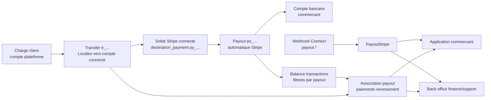
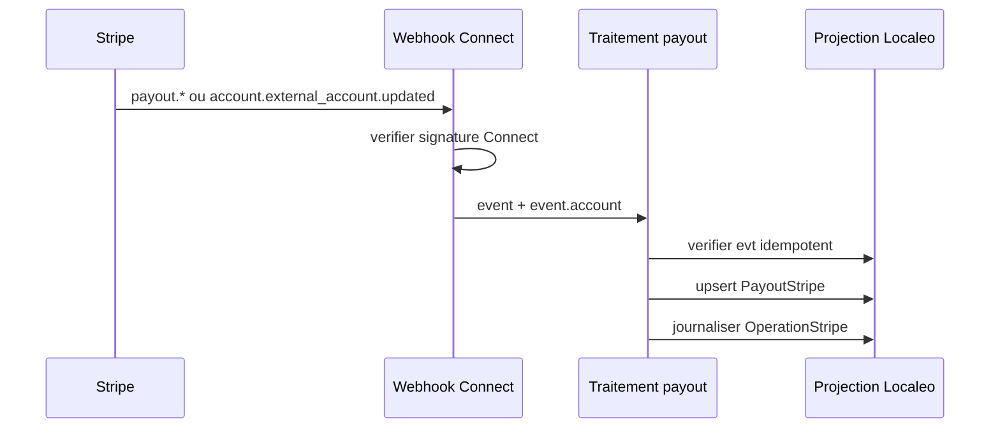
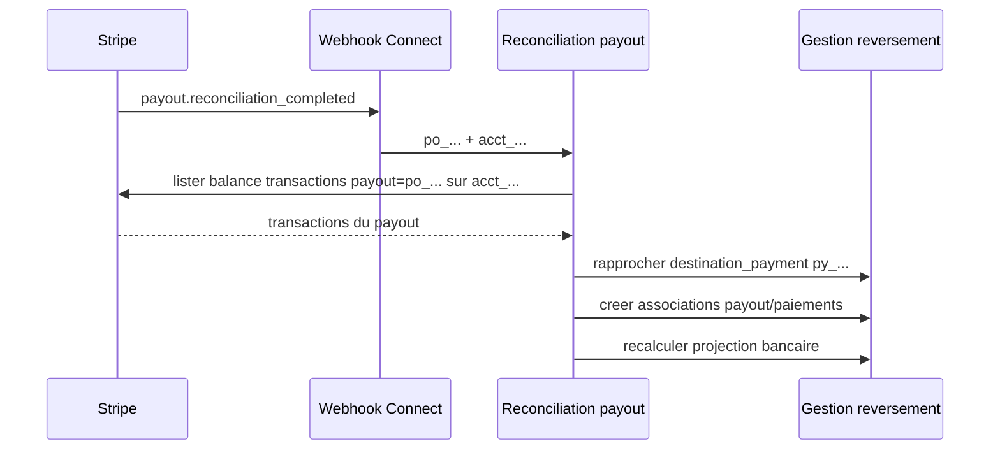

# Architecture applicative EPIC 43 - Suivi des virements bancaires Stripe Connect

## Statut

- Version : implementation backend v1
- Source backlog : [Epic 43 - Suivi des virements bancaires Stripe Connect](../../../roadmap/terminees/epic-43-suivi-payouts-bancaires-stripe-connect-backlog.md)
- Passation frontend : [EPIC 43 - Impacts application commercant](../../../roadmap/terminees/epic-43-suivi-payouts-bancaires-stripe-connect-backlog.md)
- Epic parente : [Epic 39 - Delegation des flux financiers a Stripe Connect](../../../roadmap/terminees/epic-39-stripe-connect-psp-backlog.md)
- Portee : projection, rapprochement et exposition des payouts emis par Stripe pour les comptes connectes commercants.
- Hors portee : creation de payouts manuels, modification des coordonnees bancaires et garantie contractuelle de date de credit bancaire.

## Objectif applicatif

L'EPIC 43 complete le flux Stripe Connect apres le `Transfer`. L'application doit pouvoir distinguer et expliquer trois positions successives des fonds : compte plateforme Stripe, solde Stripe du compte connecte, puis compte bancaire du commercant.

La confirmation d'un Transfer reste la fin de l'obligation de transfer portee par l'EPIC 39. Le payout est une projection bancaire complementaire, alimentee par les evenements des comptes connectes et par la reconciliation Stripe.

## Choix d'architecture

- Conserver les payouts automatiques Stripe dans le MVP.
- Ne pas faire porter le payout bancaire par `Reversement.statut`.
- Introduire une projection `PayoutStripe` dediee dans `gestion_reversement`.
- Modeliser explicitement l'association entre payout et paiements de reversement.
- Conserver `destination_payment` sur chaque Transfer afin de relier les deux cotes du mouvement Connect.
- Recevoir les evenements payout sur le webhook comptes connectes signe par `LOCALEO_STRIPE_CONNECT_WEBHOOK_SECRET`.
- Identifier le compte connecte avec `event.account`.
- Traiter les webhooks par upsert et dedoublonnage `evt_...`, sans supposer leur ordre.
- Reconciler uniquement a partir des donnees Stripe du compte connecte, sans rapprochement par montant seul.
- Accepter qu'un payout regroupe plusieurs reversements et qu'un reversement puisse connaitre plusieurs tentatives apres echec.
- Considerer `payout.paid` comme revisable par un `payout.failed` tardif.
- Ne stocker aucune coordonnee bancaire complete ; conserver seulement les identifiants Stripe et representations masquees utiles au support.
- Utiliser `AssociationPayoutPaiementReversement` comme source de verite et supprimer `PaiementReversement.stripe_payout_id` apres migration des donnees existantes, sans double ecriture durable.
- Supporter completement les payouts automatiques standard ; recevoir et afficher les payouts manuels ou instantanes sans les creer et sans garantir leur rapprochement exact.
- Conserver `payout` comme terme technique interne et utiliser exclusivement `virement bancaire` dans les contrats et libelles destines au commercant.
- Separer le statut Stripe du payout et le statut de rapprochement Localeo ; calculer une projection publique `VIREMENT_*` sans exposer les etats internes.
- Epingler une version Stripe API v1 commune aux appels backend, a la destination d'evenements Connect et aux tests de contrat. Les payouts ne dependent pas des evenements Accounts v2.
- Traiter `account.external_account.updated` pour detecter une destination bancaire desactivee apres un echec de payout, sans remplacer le traitement existant de `account.updated`.

## Objets manipules ou crees

- `PayoutStripe`
- `StatutPayoutStripe`
- `StatutRapprochementPayout`
- `StatutVirementBancairePublic`
- `AssociationPayoutPaiementReversement`
- `TransferStripe.destination_payment_id`
- `PaiementReversement`
- `Reversement`
- `OperationStripe`
- `PayoutStripeRepository`
- `StripePayoutPort`
- `TraiterWebhookPayoutStripeConnect`
- `ReconcilierPayoutStripeConnect`
- `RattraperPayoutsStripeConnect`

## Vue applicative

## Modele de donnees cible

### `PayoutStripe`

Champs structurants :

- identifiant metier UUID ;
- `stripe_payout_id` unique ;
- `stripe_account_id` indexe ;
- montant en centimes et devise ;
- `statut_stripe` normalise et statut Stripe brut ;
- `automatic`, `method`, `arrival_date` ;
- `destination_id` et libelle masque si disponible ;
- `balance_transaction_id`, `failure_balance_transaction_id` ;
- `statut_rapprochement` normalise et `reconciliation_status` Stripe brut ;
- `failure_code`, message public normalise et detail technique interne ;
- `trace_id_status`, `trace_id_value` selon la politique de conservation et d'acces ci-dessous ;
- dates de creation Stripe, premiere reception et derniere mise a jour ;
- payload Stripe minimise.

### `AssociationPayoutPaiementReversement`

Champs structurants :

- `payout_stripe_id` ;
- `paiement_reversement_id` ;
- `connected_balance_transaction_id` ;
- `destination_payment_id` ;
- montant rapproche en centimes ;
- date de rapprochement ;
- source du rapprochement et statut de coherence.

L'unicite doit empecher de rattacher deux fois la meme balance transaction au meme payout tout en autorisant plusieurs tentatives de payout dans le temps.

## Flux principaux

### Reception d'un evenement payout

### Reconciliation d'un payout automatique

## Regles de statut

Le stockage ne fusionne pas le statut Stripe et le resultat du rapprochement :

| Dimension | Valeurs |
| --- | --- |
| `statut_stripe` | `pending`, `in_transit`, `paid`, `failed`, `canceled` |
| `statut_rapprochement` | `EN_ATTENTE`, `EN_COURS`, `RAPPROCHE`, `NON_RAPPROCHE`, `NON_RAPPROCHABLE` |

La projection publique est calculee comme suit :

| Statut Stripe | Statut de rapprochement | Code API commerçant | Libelle commerçant |
| --- | --- | --- | --- |
| `pending` | tout etat | `VIREMENT_A_VENIR` | Virement bancaire a venir |
| `in_transit` | tout etat | `VIREMENT_EN_COURS` | Virement bancaire en cours |
| `paid` | `EN_ATTENTE` ou `EN_COURS` | `VIREMENT_EFFECTUE_CONFIRMATION_EN_COURS` | Virement effectue - details en cours de confirmation |
| `paid` | `RAPPROCHE` | `VIREMENT_EFFECTUE` | Virement effectue |
| `paid` | `NON_RAPPROCHE` ou `NON_RAPPROCHABLE` | `VIREMENT_DETAILS_INDISPONIBLES` | Virement effectue - details indisponibles |
| `failed` | tout etat | `ECHEC_VIREMENT` | Echec du virement bancaire |
| `canceled` | tout etat | `VIREMENT_ANNULE` | Virement bancaire annule |

Les codes internes de rapprochement et le terme `payout` ne sont jamais exposes comme libelles dans l'application commercant. La projection bancaire d'un reversement ne passe a `VIREMENT_EFFECTUE` que lorsque son paiement de reversement est rapproche d'un payout `paid`. Le statut `PAYE` du reversement n'est pas retrograde par un echec bancaire ; l'echec reste porte par la dimension payout. Un `paid` devenu `failed` declenche une alerte critique finance/support et une notification commercant, sans creation automatique d'un nouveau Transfer ou Payout.

## Contrats API

### Application commercant

Le endpoint existant `GET /protected/gestion-reversement/commercants/{commercant_id}/reversements/mois/{nb_mois}` est enrichi de facon additive. Chaque reversement expose `virements_bancaires`, une liste ordonnee par date decroissante contenant au minimum :

- `statut_code` et `statut_libelle` issus de la projection publique `VIREMENT_*` ;
- `montant_reversement_inclus` et devise, sans presenter le montant total d'un payout groupe comme un virement individuel ;
- date d'arrivee estimee, date du dernier evenement et destination masquee quand disponibles ;
- motif public, `action_requise` et lien vers le parcours Stripe lorsque necessaire ;
- reference de tracage bancaire uniquement selon la politique d'acces definie dans cet epic.

Les identifiants `po_...`, statuts Stripe bruts, codes `PAYOUT_*`, details techniques et statuts de rapprochement ne font pas partie du contrat commercant.

### Finance et support

Les routes techniques suivantes sont protegees par `internal:finance` :

- `GET /protected/gestion-reversement/payouts` : recherche paginee par payout, transfer, compte connecte, commercant, statut et periode ;
- `GET /protected/gestion-reversement/payouts/{stripe_payout_id}` : detail, associations, historique et anomalies ;
- `POST /protected/gestion-reversement/payouts/{stripe_payout_id}/reconcilier` : reconciliation idempotente ciblee, sans creation de flux financier ;
- `POST /protected/gestion-reversement/payouts/rattrapage` : reprise ciblee par `po_...`, `acct_...` ou fenetre temporelle.

## Version Stripe et evenements

- introduire une configuration explicite `LOCALEO_STRIPE_API_VERSION` et refuser le demarrage en environnement deploye si elle est absente lorsque Stripe Connect est actif ;
- appliquer cette version v1 a tous les appels Stripe du backend et configurer la destination d'evenements Connect avec la meme version ;
- couvrir par tests de contrat la forme des objets Payout, Transfer et BalanceTransaction attendus ;
- conserver les six evenements `payout.*`, `account.updated` et `account.external_account.updated` sur la destination Connect ;
- ne pas attendre d'evenements Accounts v2 pour les payouts, ceux-ci restant emis sous forme d'evenements v1.

## Conservation et acces

| Donnee | Conservation cible | Acces |
| --- | --- | --- |
| Identifiants financiers, associations, statuts, montants et motifs publics normalises | 10 ans apres la cloture de l'exercice concerne | Finance et support selon habilitation ; projection publique minimisee. |
| Payload webhook payout minimise | 13 mois | Technique et support L2, acces audite. |
| Detail technique d'echec assaini | 13 mois | Finance, technique et support L2, acces audite. |
| `trace_id.value` | 5 ans puis suppression | Finance et support L2 en clair avec audit ; support L1 masque. |
| Destination bancaire | Representation masquee uniquement | Selon les besoins de la surface ; aucune coordonnee complete. |

L'application commercant n'expose `trace_id.value` qu'apres 10 jours ouvrables suivant un payout annonce verse mais non recu, ou lorsqu'une action explicite est requise. La valeur complete ne doit pas apparaitre dans les logs ni dans les exports standards.

Les durees de conservation doivent etre confirmees par le juridique et le DPO avant la mise en production.

Un batch quotidien `maintenance.payouts.purger` applique ces echeances. Il supprime les payloads et details techniques expires, supprime `trace_id.value` apres cinq ans, conserve les champs financiers normalises pendant dix ans, prend en charge `dry_run` et journalise le volume examine, masque et supprime.

## Frontieres avec les autres domaines

- `gestion_reversement` possede les projections Transfer, Reversement, PaiementReversement, PayoutStripe et leur rapprochement.
- `referencement` fournit le lien entre `stripe_account_id` et `Commercant` ainsi que l'eligibilite payouts.
- `identite_acces` protege les APIs commercant et les droits back-office.
- `exploitation` peut porter les alertes et batchs de reprise, sans posseder le modele financier.
- l'application commercant consomme une projection preparee par le backend et ne reconstruit pas le rapprochement.
- Stripe reste la source des statuts payout et des informations bancaires.

## Securite / audit / idempotence

- verifier chaque evenement avec le secret du webhook comptes connectes ;
- refuser toute projection payout sans `event.account` exploitable ;
- dedoublonner par identifiant d'evenement et upserter par `stripe_payout_id` ;
- executer les appels de reconciliation dans le contexte explicite `Stripe-Account` du commercant ;
- interdire un rapprochement par montant seul ;
- masquer destination, causes techniques et trace bancaire selon la surface ;
- journaliser reception, transition, rapprochement, anomalie et reprise ;
- ne jamais loguer la cle secrete, la signature complete, l'IBAN ou le payload bancaire non filtre ;
- rendre le traitement de rattrapage strictement non financier : aucune creation de Transfer ou Payout.

## Strategie de reprise

- lister les payouts recents par compte connecte avec une fenetre bornee ;
- upserter leur projection locale ;
- recuperer les Transfers anciens dont `destination_payment` manque ;
- reconciler les payouts automatiques en statut compatible ;
- conserver les transactions non rapprochees dans une file d'anomalies ;
- permettre un rejeu cible par `stripe_payout_id` depuis le back-office finance.
- exposer le batch par `POST /protected/gestion-reversement/payouts/rattrapage/batch` et l'enregistrer dans le catalogue d'exploitation avec verrou et relance manuelle ;
- executer toutes les 6 heures une reprise des payouts incomplets des 14 derniers jours ;
- executer chaque nuit un controle des 90 derniers jours ;
- effectuer au premier deploiement un backfill depuis le premier Transfer Stripe Connect Localeo connu ;
- permettre aussi un rejeu cible par `stripe_account_id` ;
- alerter apres les echecs permanents ou anomalies non resolues.

## Alertes et information commercant

- calculer l'absence de payout a partir de la date de disponibilite des fonds et de la prochaine date de payout attendue ;
- emettre un avertissement a J+2 ouvrables puis une alerte critique a J+5 ouvrables apres cette date ;
- utiliser J+7 et J+10 ouvrables comme seuils de repli lorsque le calendrier Stripe est indisponible ;
- ne pas emettre cette alerte pour un compte configure avec un calendrier de payout manuel ;
- traduire les echecs en categories publiques controlees : coordonnees bancaires invalides, compte ferme, refus bancaire, devise non supportee, action requise ou incident technique ;
- conserver le code et le detail Stripe assainis dans les seules surfaces internes autorisees.
- persister chaque anomalie afin qu'elle reste visible dans le back-office jusqu'a resolution ;
- envoyer les alertes critiques par email au groupe finance/support configure ;
- notifier un echec de virement au commercant par email et, si ce canal est active, par WebPush ;
- dedoublonner les notifications par `stripe_payout_id`, type d'alerte et transition de statut.

## Observabilite

- nombre de payouts par statut ;
- montant en attente, en transit, verse et en echec ;
- delai Transfer confirme vers payout cree ;
- delai payout cree vers `paid` ;
- nombre et montant de transactions non rapprochees ;
- nombre de payouts `paid` devenus `failed` ;
- anciennete du dernier webhook par compte connecte ;
- nombre de reprises et resultat du rapprochement.

## Validations externes restantes

- validation juridique et DPO des durees de conservation ;
- validation finance des seuils d'alerte proposes ;
- validation produit et support de la taxonomie et des messages publics d'echec.
