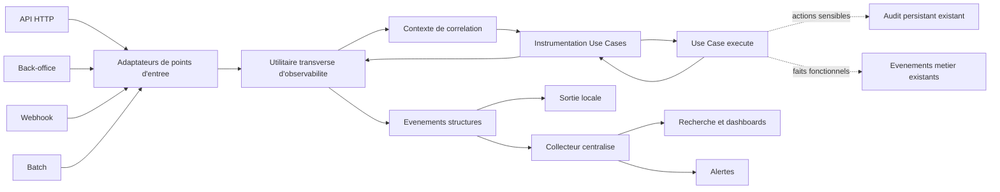
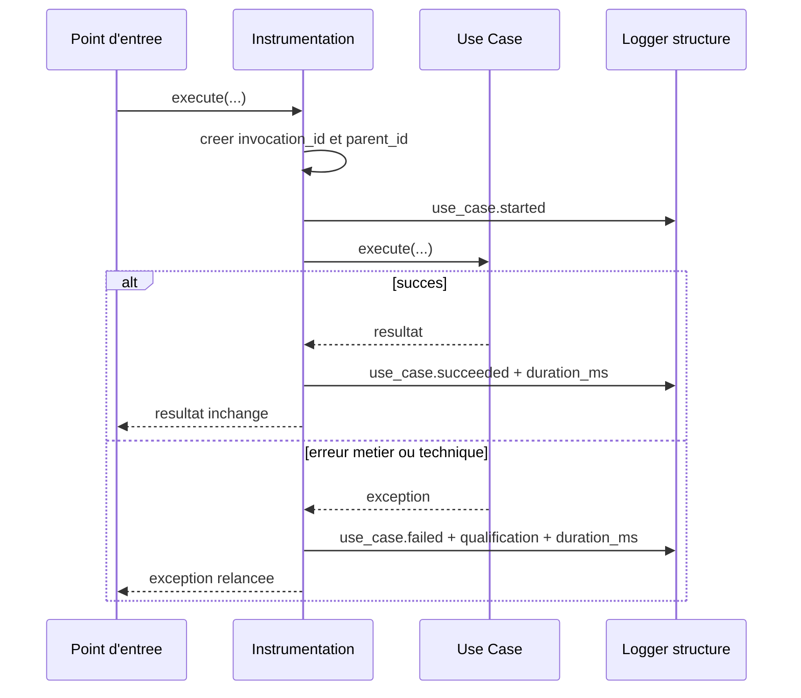

# Architecture applicative EPIC 44 - Observabilite et logs des Use Cases

## Statut

- Version : implementation backend v1.
- Etat : `Implementation backend realisee - validation runtime a finaliser`.
- Source backlog :
  [EPIC 44 - Observabilite et logs des Use Cases](../../../roadmap/terminees/epic-44-observabilite-logs-use-cases-backlog.md).
- Portee : instrumentation transverse des Use Cases backend, correlation,
  securisation, format, collecte et supervision.
- Hors portee : audit persistant, stockage des payloads complets et
  observabilite des applications frontend.

## Objectif applicatif

Garantir qu'une invocation de Use Case soit observable de son demarrage a son
issue, quel que soit son point d'entree : HTTP, back-office, webhook, batch ou
traitement interne.

Le dispositif doit repondre rapidement aux questions suivantes :

- quel Use Case a ete appele ?
- depuis quel contexte et pour quelle correlation ?
- a-t-il reussi, rencontre une erreur metier ou une erreur technique ?
- combien de temps a-t-il dure ?
- quels autres Use Cases ont ete appeles dans la meme execution ?

## Choix d'architecture

### Instrumentation centrale

L'instrumentation reste centrale et automatique autour des methodes `execute`.
Elle ne doit pas imposer un decorateur manuel sur chaque Use Case.

Le mecanisme existant de `app/observability_instrumentation.py` est consolide :

- decouverte des Use Cases eligibles ;
- wrapper synchrone ou asynchrone ;
- idempotence de l'instrumentation ;
- emission dans `localeo.use_cases.<domaine>.<UseCase>` ;
- preservation de la signature, du resultat et des exceptions.

Les methodes du domaine ne sont pas instrumentees automatiquement. Les
decisions, regles metier et invariants utiles emettent des evenements explicites
via la meme facade dans `localeo.domaine.decisions`,
`localeo.domaine.business_rules` et `localeo.domaine.invariants`. Cette
frontiere evite le bruit et la serialisation accidentelle d'objets metier tout
en laissant `LOCALEO_DOMAINE_LOG_LEVEL` piloter leur verbosite.

### Utilitaire transverse de journalisation

Le module `app/observability.py` constitue la facade publique unique de
journalisation applicative. Il pilote :

- la creation, la validation, la propagation et la restauration du contexte ;
- la lecture du `correlation_id` courant ;
- la construction du schema structure et son versionnement ;
- l'horodatage, les durees, les niveaux et les namespaces ;
- la normalisation, la redaction et la troncature des attributs ;
- l'emission non bloquante des evenements vers le logger configure.

Les responsabilites restent separees :

- `app/observability_http.py` adapte FastAPI, extrait la methode, le modele de
  route, le statut et le `User-Agent`, puis alimente la facade ;
- `app/observability_instrumentation.py` detecte et encadre les appels de Use
  Cases, mais delegue a la facade la construction et l'emission des evenements ;
- `app/logging_config.py` configure uniquement les handlers, formatters, niveaux
  et transports ;
- les adaptateurs batch, webhook et back-office ouvrent un contexte avec la
  meme facade sans connaitre le format final du log.

La facade ne contient aucune regle metier et ne depend ni de FastAPI, ni de
Stripe, ni du collecteur retenu. Les integrations de framework sont placees en
peripherie. Le remplacement futur du formatter ou du transport ne doit donc pas
modifier les Use Cases.

Le `User-Agent` et les identifiants de correlation recus sont des entrees non
fiables. Le `User-Agent` est normalise et tronque a une limite documentee. Un
identifiant entrant n'est propage qu'apres validation de son format et de sa
longueur ; sinon la facade cree un `LOC-<UUID>`. La query string brute, les
cookies et les headers d'authentification sont exclus du contexte.

### Contexte d'invocation

Un contexte porte par `ContextVar` contient :

- `request_id` ;
- `correlation_id` ;
- `use_case_invocation_id` ;
- `parent_use_case_invocation_id` ;
- contexte d'acteur assaini lorsqu'il est disponible.

Une pile d'invocations permet de representer les appels imbriques sans melanger
les executions asynchrones concurrentes.

Pour une requete HTTP, le `request_id` existant devient la valeur source de la
correlation racine. Il est expose sous le nom `correlationId` dans les erreurs
JSON et sous `correlation_id` dans les logs. Ces noms designent la meme valeur,
pas deux identifiants independants.

### Contrat d'erreur correlable

Tous les chemins d'erreur convergent vers un constructeur ou gestionnaire
commun garantissant au minimum :

```json
{
  "detail": "Message utilisable par le consommateur",
  "correlationId": "LOC-2d36be3d-6af3-4ad0-867e-99ffdbfdcf70"
}
```

Ce contrat couvre les gestionnaires d'exceptions metier et techniques, les
erreurs de validation `422`, les refus de securite, les routes inexistantes et
les exceptions inattendues. Le header de correlation de la reponse et les logs
utilisent la meme valeur.

Pour une erreur hors HTTP, le resultat operateur, l'execution batch ou l'ecran
back-office expose aussi une reference de correlation. Une erreur ne doit jamais
etre retournee sans reference, meme si elle survient avant l'appel d'un Use Case.

Les identifiants generes par Localeo suivent le format `LOC-<UUID>`. Les
interfaces les presentent avec le libelle `Reference erreur`, une consigne de
communication au support et une action de copie. La valeur complete est la cle
de recherche ; aucune recherche d'exploitation ne doit reposer sur une version
visuellement tronquee.

### Evenements structures

L'instrumentation emet :

- `use_case.started` ;
- `use_case.succeeded` ;
- `use_case.failed`.

Le domaine emet explicitement, uniquement aux points de decision retenus :

- `decision.evaluated` pour un calcul sans changement d'etat ;
- `business_rule.evaluated` pour une transition ou une autorisation ;
- `invariant.evaluated` avant le rejet d'une valeur ou d'une transition.

La premiere couverture comprend les invariants des value objects partages, les
transitions de reversement, les files d'e-mails et SMS, la consommabilite d'un
coffret, l'eligibilite Stripe Connect, les scopes des cles API et le statut
public des virements bancaires. Les valeurs personnelles, tokens, messages
providers et motifs libres ne sont jamais fournis a la facade.

Les champs exploitables sont portes comme attributs structures. La phrase
humaine du log n'est pas la source de verite du contrat.

### Separation logs, audit et metriques

- les logs expliquent l'execution technique et applicative ;
- l'audit persistant prouve une action sensible ou financiere ;
- les evenements metier decrivent un fait fonctionnel ;
- les metriques agregees mesurent volume, taux d'erreur et durees.

Une meme action peut produire ces signaux complementaires, mais aucun ne doit
etre utilise comme substitut implicite d'un autre.

## Objets manipules ou crees

### `UseCaseInvocationContext`

Objet technique non persiste contenant les correlations de l'invocation.

### `UseCaseLogEvent`

Schema logique versionne comprenant au minimum :

- identite du service et de l'environnement ;
- nom, module et domaine du Use Case ;
- identifiants d'invocation et de correlation ;
- evenement, issue et duree ;
- qualification d'erreur assainie ;
- identifiants metier autorises par liste blanche.

### Registre d'extracteurs

Un registre optionnel peut extraire des identifiants non sensibles pour certains
Use Cases. Sans extracteur explicite, aucun argument ni resultat complet n'est
journalise.

## Vue applicative



## Flux principal d'une invocation



## Frontieres avec les autres domaines

- `observabilite` est transverse et ne porte aucune decision metier ;
- chaque domaine peut fournir une liste blanche d'identifiants utiles ;
- les Use Cases ne dependent pas du fournisseur de collecte ;
- `exploitation` consomme les logs, tableaux de bord et alertes ;
- `identite_acces` fournit seulement un contexte d'acteur assaini ;
- les batchs conservent leur historique persistant et transmettent leur
  `correlation_id` ;
- l'audit existant reste obligatoire pour les actions sensibles.

## Securite, confidentialite et disponibilite

- redaction centrale avant tout formatter ou transport ;
- liste noire de secours pour secrets connus et liste blanche pour donnees
  metier exposees ;
- aucune serialization generique d'un objet d'infrastructure, request, session
  ou Unit of Work ;
- acces aux logs de production limite selon les roles ;
- chiffrement en transit et au repos selon le collecteur choisi ;
- panne du collecteur non bloquante pour les parcours metier ;
- bornes de taille par evenement et troncature explicite ;
- retention et suppression conformes a la minimisation RGPD.

## Strategie de migration

1. Etablir l'inventaire des Use Cases eligibles et la couverture actuelle.
2. Consolider `app/observability.py` comme facade unique et reduire les autres
   modules a leurs responsabilites d'adaptation, instrumentation ou configuration.
3. Aligner le namespace `localeo.trace.*` vers `localeo.use_cases.*`.
4. Introduire le contexte d'invocation et le schema structure versionne.
5. Remplacer la journalisation generique des entrees/sorties par des extracteurs
   autorises.
6. Ajouter les tests de couverture, redaction, correlation, sync et async.
7. Migrer les emissions contractuelles directes vers la facade transverse.
8. Activer le format structure en environnement de test.
9. Configurer collecte, dashboards, alertes, retention et droits.
10. Recetter puis deployer progressivement en production.

La bascule ne necessite aucune migration de donnees metier.

## Tests d'architecture et de contrat

- inventaire automatique de toutes les classes publiques avec `execute` ;
- un seul wrapper par methode ;
- un `started` et un seul terminal par invocation ;
- preservation des retours et exceptions ;
- isolation de deux appels async concurrents ;
- relation parent/enfant pour appels imbriques ;
- propagation HTTP, batch, webhook et back-office ;
- redaction des secrets et donnees personnelles ;
- verification du namespace et des niveaux configures ;
- validation du schema JSON et de sa version ;
- verification que l'echec du transport de logs n'interrompt pas le Use Case.
- presence d'un `correlationId` coherent sur toutes les familles de reponses
  4xx/5xx, y compris `401`, `403`, `404`, `409`, `422`, `500` et `502` ;
- egalite entre `correlationId`, valeur du header et correlation des logs ;
- format `LOC-<UUID>`, libelle visible et copie de la valeur complete dans les
  interfaces consommatrices ;
- contrat unique de la facade utilise par les adaptateurs HTTP, batch, webhook,
  back-office et l'instrumentation des Use Cases ;
- validation des correlations entrantes, troncature du `User-Agent` et absence
  de query string, cookies ou secrets dans les evenements ;
- restauration du contexte apres une execution et isolation de deux contextes
  asynchrones concurrents ;

## Decisions d'exploitation actees

### Transport, collecte et formats

- la facade transverse emet vers la sortie standard et ne connait aucun SDK de
  collecte ;
- Render transmet les logs a Better Stack Telemetry par Log Stream chiffre ;
- la source Better Stack cible utilise la region Allemagne ;
- test, preproduction et production utilisent un schema JSON structure
  versionne `1` ; le rendu local peut etre textuel mais conserve les memes
  attributs ;
- Render reste utilisable comme consultation de secours dans la limite de sa
  retention native.

### Retention, niveaux et alertes

- retention : 14 jours en test, 30 jours en preproduction et 90 jours en
  production ;
- niveaux nominaux : `INFO` pour HTTP et Use Cases, `WARNING` pour anomalie,
  `ERROR` pour echec technique et `DEBUG` desactive par defaut en production ;
- seuil lent nominal : 2 000 ms, surchargeable par Use Case ;
- alerte performance : p95 superieur a 1 500 ms pendant 15 minutes avec au
  moins 20 executions ;
- alerte erreur technique : 3 echecs en 5 minutes ou taux superieur a 5 % ;
- paiement, reversement, webhook Stripe et batch critique : alerte au premier
  echec definitif ;
- erreurs metier : mesure agregee sans alerte individuelle.

### Minimisation et habilitations

- seuls les UUID internes explicitement autorises et les identifiants Stripe
  non secrets utiles au diagnostic sont acceptes ;
- les extensions par domaine passent par un extracteur en liste blanche ;
- le `User-Agent` est assaini, prive de caracteres de controle et borne a
  512 caracteres ;
- les profils exploitation et responsables techniques consultent les logs
  assainis ; le support dispose d'une recherche limitee par `correlationId` ;
  finance et produit utilisent des vues agregees ;
- le responsable securite administre et revoit periodiquement les acces.

### Compatibilite et evolution

- `correlationId` est le nom public canonique ; `request_id` reste un alias
  deprecie, strictement egal, jusqu'a une version majeure de l'API ;
- OpenTelemetry est reporte en phase 2 ; `trace_id` et `span_id` sont reserves
  comme champs optionnels du schema ;
- le choix du forfait Better Stack et la validation DPO de la retention sont
  des prerequis de mise en production, pas des blocages d'implementation.
