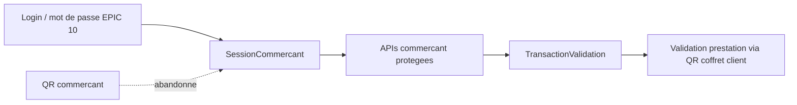

# Architecture applicative EPIC 5 - Session commercant securisee par QR code

## Statut

- Version : retro-documentation v1
- Source backlog : [Epic 5 - Session commercant securisee par QR code](../../../roadmap/abandonnees/epic-5-session-commercant-securisee-par-qr-code-backlog.md)
- Portee : trace d'architecture du cadrage abandonne avant production.
- Hors portee : specification technique detaillee des classes, schemas SQL exhaustifs et contrats API detailles.

## Objectif applicatif

Le cadrage initial prevoyait d'ouvrir une session commercant depuis un QR commercant, puis d'utiliser cette session pour proteger les actions sensibles. Ce choix a ete decommissionne avant production au profit de l'authentification login / mot de passe de l'EPIC 10.

## Choix d'architecture

- Ne pas implementer le `qr_commercant` comme mecanisme d'authentification cible.
- Conserver le concept de session commercant cote serveur.
- Remplacer l'authentification initiale QR par login / mot de passe.
- Garder la validation QR client/coffret separee de l'authentification commercant.
- Utiliser des sessions opaques revocables plutot que des tokens stateless pour les actions commercant sensibles.

## Objets manipules ou crees

- `SessionCommercant`
- `session_token`
- scopes commercant
- `TransactionValidation`
- concept abandonne `qr_commercant`
- QR coffret client, hors perimetre de l'authentification commercant

## Vue applicative retenue

## Flux principaux

Voir la vue applicative ci-dessus ; aucun flux detaille complementaire n'est documente a ce niveau.

## Frontieres avec les autres domaines

- `identite_acces` porte la session commercant.
- `exploitation` porte la transaction de validation.
- Le QR commercant n'est pas une cible d'implementation.

## Securite / audit / idempotence

- Les actions sensibles doivent etre protegees par les mecanismes d'acces existants.
- Les changements d'etat metier doivent etre auditables lorsque l'EPIC cree ou modifie une ressource.
- L'idempotence est requise pour les traitements relancables, integrations externes, batchs et notifications.

## Points ouverts

- Aucun point ouvert documente dans la retro-documentation initiale.
