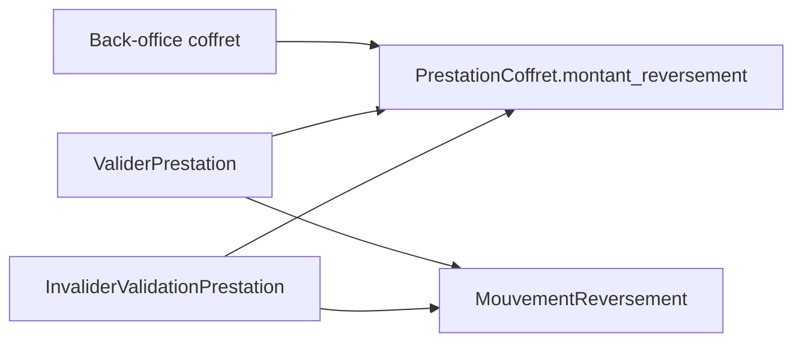

# Architecture applicative EPIC 6 - Montant de reversement sur prestation coffret

## Statut

- Version : retro-documentation v1
- Source backlog : [Epic 6 - Montant de reversement sur prestation coffret](../../../roadmap/terminees/epic-6-montant-reversement-prestation-coffret-backlog.md)
- Portee : choix applicatifs autour de la source de verite du montant a reverser.
- Hors portee : specification technique detaillee des classes, schemas SQL exhaustifs et contrats API detailles.

## Objectif applicatif

Rendre explicite le montant reverse au commercant pour chaque prestation de coffret, afin que les mouvements financiers ne reposent plus sur un montant implicite ou code en dur.

## Choix d'architecture

- Porter le montant de reversement sur la prestation de coffret.
- Utiliser ce montant comme source de verite lors de la validation.
- Faire creer le mouvement de reversement par le use case de validation a partir de ce montant.
- Reutiliser le meme montant pour verifier la coherence lors d'une invalidation.
- Laisser la saisie au back-office, sans delegation commercant en V1.

## Objets manipules ou crees

- `PrestationCoffret`
- `montant_reversement`
- `MouvementReversement`
- `ValidationPrestation`
- erreurs metier de montant requis ou invalide

## Vue applicative

## Flux principaux

Voir la vue applicative ci-dessus ; aucun flux detaille complementaire n'est documente a ce niveau.

## Frontieres avec les autres domaines

- La commercialisation porte la configuration de l'offre.
- La gestion reversement consomme ce montant pour creer l'obligation financiere.
- Le montant client du coffret reste distinct du montant reverse commercant.

## Securite / audit / idempotence

- Les actions sensibles doivent etre protegees par les mecanismes d'acces existants.
- Les changements d'etat metier doivent etre auditables lorsque l'EPIC cree ou modifie une ressource.
- L'idempotence est requise pour les traitements relancables, integrations externes, batchs et notifications.

## Points ouverts

- Aucun point ouvert documente dans la retro-documentation initiale.
