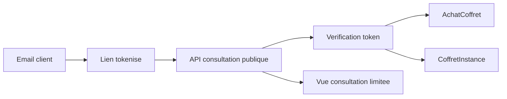

# Architecture applicative EPIC 7 - Tokens de consultation achat et coffret instance

## Statut

- Version : retro-documentation v1
- Source backlog : [Epic 7 - Tokens de consultation achat et coffret instance](../../../roadmap/terminees/epic-7-tokens-de-consultation-achat-et-coffret-instance-backlog.md)
- Portee : choix applicatifs de consultation securisee sans compte client.
- Hors portee : specification technique detaillee des classes, schemas SQL exhaustifs et contrats API detailles.

## Objectif applicatif

Permettre a un client de consulter un achat ou une instance de coffret via un lien tokenise, sans creer de compte, tout en limitant la duree, les droits et la surface d'exposition.

## Choix d'architecture

- Utiliser des tokens opaques, stockes et verifiables cote serveur.
- Rattacher le token a un achat ou une `CoffretInstance`, pas a un utilisateur global.
- Limiter le token a des scopes de consultation.
- Permettre expiration, revocation et regeneration.
- Ne pas exposer les identifiants internes sensibles dans l'URL publique.

## Objets manipules ou crees

- `TokenAccesCommercant` ou token de consultation equivalent
- token d'achat
- token de `CoffretInstance`
- `AchatCoffret`
- `CoffretInstance`
- scopes et dates d'expiration

## Vue applicative

## Flux principaux

Voir la vue applicative ci-dessus ; aucun flux detaille complementaire n'est documente a ce niveau.

## Frontieres avec les autres domaines

- `identite_acces` porte la mecanique token.
- `gestion_achats` porte les use cases de consultation post-achat.
- Le token ne remplace pas une authentification client complete.

## Securite / audit / idempotence

- Les actions sensibles doivent etre protegees par les mecanismes d'acces existants.
- Les changements d'etat metier doivent etre auditables lorsque l'EPIC cree ou modifie une ressource.
- L'idempotence est requise pour les traitements relancables, integrations externes, batchs et notifications.

## Points ouverts

- Aucun point ouvert documente dans la retro-documentation initiale.
