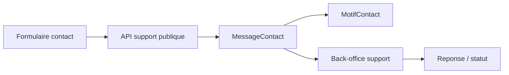

# Architecture applicative EPIC 8 - Gestion des contacts et messages support

## Statut

- Version : retro-documentation v1
- Source backlog : [Epic 8 - Gestion des contacts et messages support](../../../roadmap/terminees/epic-8-gestion-contacts-messages-support-backlog.md)
- Portee : architecture applicative de reception, qualification et traitement des contacts.
- Hors portee : specification technique detaillee des classes, schemas SQL exhaustifs et contrats API detailles.

## Objectif applicatif

Centraliser les messages de contact et demandes support afin de disposer d'un suivi exploitable par les operateurs back-office.

## Choix d'architecture

- Creer un point d'entree public pour les demandes de contact.
- Stocker les messages comme objets support consultables en back-office.
- Utiliser des motifs de contact pour qualifier la demande.
- Garder les reponses et changements de statut dans le domaine support.
- Eviter de melanger le support avec les evenements techniques d'exploitation.

## Objets manipules ou crees

- `MessageContact`
- `MotifContact`
- statut de message support
- coordonnees demandeur
- reponse support
- trace d'audit ou timeline support

## Vue applicative

## Flux principaux

Voir la vue applicative ci-dessus ; aucun flux detaille complementaire n'est documente a ce niveau.

## Frontieres avec les autres domaines

- `support` porte le cycle de vie de la demande.
- `exploitation` peut fournir audit et notifications sortantes.
- Les achats, clients ou commercants sont rattaches par reference si necessaire.

## Securite / audit / idempotence

- Les actions sensibles doivent etre protegees par les mecanismes d'acces existants.
- Les changements d'etat metier doivent etre auditables lorsque l'EPIC cree ou modifie une ressource.
- L'idempotence est requise pour les traitements relancables, integrations externes, batchs et notifications.

## Points ouverts

- Aucun point ouvert documente dans la retro-documentation initiale.
