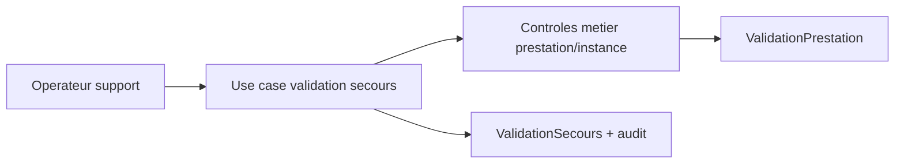

# Architecture applicative EPIC 9 - Mode secours telephonique d'honorisation prestation

## Statut

- Version : retro-documentation v1
- Source backlog : [Epic 9 - Mode secours telephonique](../../../roadmap/terminees/epic-9-mode-secours-telephonique-honorisation-prestation-backlog.md)
- Portee : architecture applicative d'une validation de secours encadree.
- Hors portee : specification technique detaillee des classes, schemas SQL exhaustifs et contrats API detailles.

## Objectif applicatif

Permettre l'honorisation d'une prestation en cas d'impossibilite d'utiliser le parcours QR standard, tout en conservant controle, audit et coherence avec la validation normale.

## Choix d'architecture

- Separer la validation de secours de la validation QR standard.
- Exiger un contexte d'appel, un motif et un operateur.
- Reutiliser les memes invariants metier que la validation normale lorsque c'est possible.
- Creer une trace specifique de secours pour l'audit et le support.
- Eviter qu'un mode secours contourne les controles de prestation, commercant et coffret instance.

## Objets manipules ou crees

- `ValidationSecours`
- `ValidationPrestation`
- `TransactionValidation`
- `CoffretInstance`
- `StatutPrestationCoffretInstance`
- motif de secours
- acteur back-office ou support

## Vue applicative

## Flux principaux

Voir la vue applicative ci-dessus ; aucun flux detaille complementaire n'est documente a ce niveau.

## Frontieres avec les autres domaines

- `exploitation` porte le mode secours et l'audit operationnel.
- `gestion_achats` conserve la source de verite de l'instance et des prestations.
- `gestion_reversement` reste declenchee par une validation effective.

## Securite / audit / idempotence

- Les actions sensibles doivent etre protegees par les mecanismes d'acces existants.
- Les changements d'etat metier doivent etre auditables lorsque l'EPIC cree ou modifie une ressource.
- L'idempotence est requise pour les traitements relancables, integrations externes, batchs et notifications.

## Points ouverts

- Aucun point ouvert documente dans la retro-documentation initiale.
