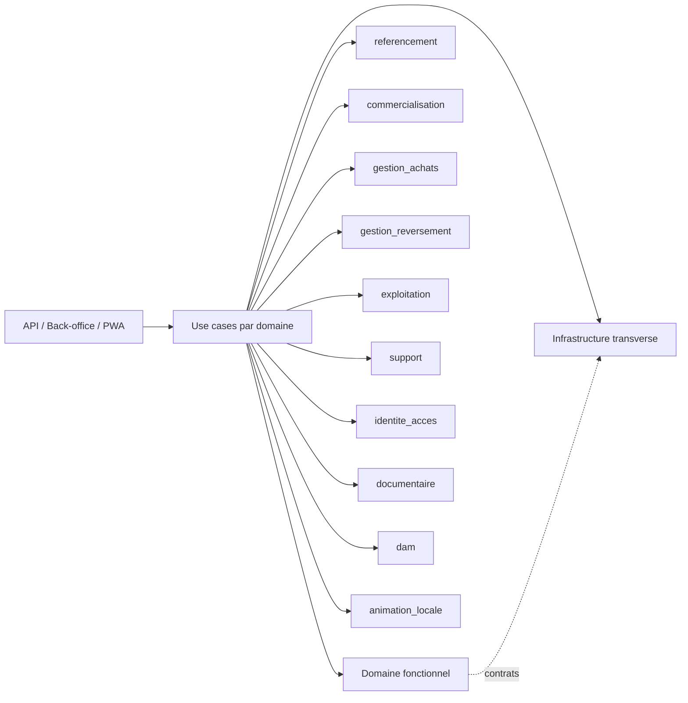

# Domaines fonctionnels

## Intention

Le backend Localeo est organise autour de domaines fonctionnels visibles dans `app/domaine` et `app/application`.

La couche `app/infrastructure` reste transverse : elle porte les adaptateurs SQLAlchemy, SQLAdmin, Stripe, Brevo, stockage objet, email, SMS et autres integrations techniques.

## Domaines cibles

| Domaine | Responsabilite applicative |
| --- | --- |
| `referencement` | Villes, typologies, commercants, acces commercants metier et taxonomies. |
| `commercialisation` | Offre vendable, coffrets, prestations, configuration de type coffret. |
| `gestion_achats` | Achats, paiements, remboursements, documents d'achat, instances de coffret et consultation post-achat. |
| `gestion_reversement` | Comptes bancaires commercants, mouvements, reversements, paiements et lots. |
| `exploitation` | Validation terrain, validations de secours, liens, activite locale, audit operationnel, sessions operationnelles et transactions. |
| `support` | Communications, notes, contacts, demandes de facturation, motifs de contact et traitement support. |
| `profils` | Profils commercants et surfaces publiques de presentation. |
| `dam` | Images et assets media. |
| `documentaire` | Documents, versions internes, publication et exposition documentaire. |
| `identite_acces` | Authentification, sessions, tokens, API keys, rate limit et autorisations. |
| `animation_locale` | Enveloppe du domaine animation locale, plateforme partenaire, inscriptions, tirages et suivi. |

## Regles de classement

- Un objet appartient au domaine qui porte sa regle metier principale.
- Un objet de securite ou d'acces reste dans `identite_acces`, meme s'il protege un parcours d'un autre domaine.
- Un document metier ou contractuel va dans `documentaire`; une image ou un asset visuel va dans `dam`.
- Les objets financiers lies au paiement client restent dans `gestion_achats`.
- Les objets financiers lies au paiement commercant restent dans `gestion_reversement`.
- Les vues globales de pilotage peuvent rester transverses, mais leurs vues specialisees doivent etre rattachees a leur domaine.

## Frontieres

