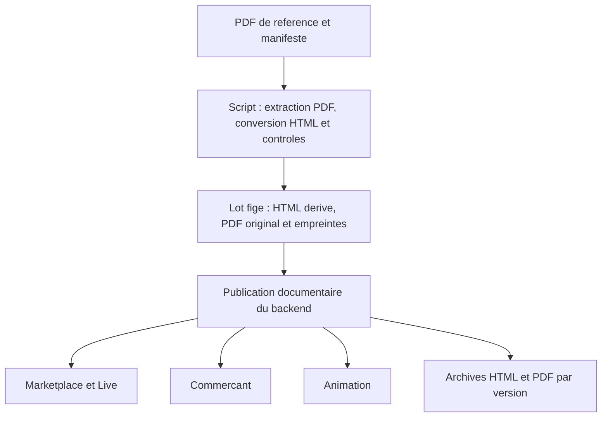

# Plan de publication automatisee des documents juridiques

Date : 14 septembre 2026. Statut : implementation disponible, qualification locale realisee ; publication du lot TEST a confirmer par la recette distante.

Le mode operatoire executable est desormais [Publier les documents juridiques](../exploitation/technique/publier-documents-juridiques.md). Ce plan conserve les choix de conception et le perimetre. La presence du code ou le deploiement d'un lecteur ne vaut pas attestation de publication : seul le rapport du lot exact sur les quatre surfaces permet de conclure.

## 1. Resultat vise et choix recommande

Maintenir un corpus de PDF de reference dans le depot backend, deriver leur representation HTML, puis publier une seule fois dans le service documentaire commun avec le PDF original telechargeable. **Decision utilisateur : les PDF sont l'unique source de verite ; aucun Word n'est requis ni utilise par la chaine de publication.** Marketplace, Live, Commercant et Animation affichent les documents qui les concernent depuis ce catalogue.

Apres la premiere integration et le deploiement du lecteur dans les applications, une modification de texte ne doit plus imposer de modifier, commiter et redeployer plusieurs frontends. Le script publie des documents ; il ne modifie pas les regles des commandes, contrats ou participations deja acceptes.

Marketplace et Live constituent deux surfaces d'un meme depot et d'un meme deploiement. Il y a donc trois applications frontend a adapter, et un backend commun.



L'alternative consiste a recopier des fichiers statiques dans les trois depots puis redeployer chaque application. Elle reutiliserait davantage le fonctionnement Marketplace actuel, mais obligerait a orchestrer plusieurs commits/deploiements et pourrait laisser les sites sur des versions differentes. La publication centralisee est recommandee pour les mises a jour recurrentes ; les fichiers statiques deja publies restent conserves comme archives.

## 2. Point de depart constate avant implementation

| Element | Existant reutilisable | Adaptation necessaire |
|---|---|---|
| Corpus | Seize PDF dans `docs/juridique/{communs,marketplace,live,commercant,animation,interne}` | Le dossier a ete reorganise depuis la revue V1 : ne plus supposer un chemin `docs/juridique/V1`. Inventorier les PDF sources et remplacer les chemins figes par un manifeste. |
| Marketplace/Live | Huit documents publics, lecteur avec sommaire, tableaux, liens et PDF ; deux revisions 1.1 publiees | `legalContent.js` importe un JSON dans le bundle. Passer a un catalogue central, avec chargement, erreurs, archives et filtrage par surface. |
| Import Marketplace | Verification d'empreintes et lecteur HTML deja disponibles | L'ancien script depend de DOCX et reste fixe sur huit fichiers, une date et `/legal/v1`. Remplacer son ingestion par une conversion des PDF ; ne pas le relancer sur les revisions 1.1. |
| Backend documentaire | Documents publics/prives, stockage, HTML derive d'un PDF, publication, audit et immutabilite des documents probants | Ajouter l'identite juridique stable, l'association de version HTML/PDF, le catalogue par surface et la publication d'un lot coherent. |
| Conversion PDF du backend | Fonction `generate_html_preview_from_pdf` | Elle produit actuellement un texte d'attente contenant le nom du fichier, pas une extraction du PDF. Elle ne peut pas servir de convertisseur automatique. |
| Commercant et Animation | Applications React avec leurs parcours de connexion | Aucun lecteur juridique commun repere. Les pages publiques doivent etre selectionnees avant les composants qui imposent/restaurent la session. |

Ces constats de depart viennent des depots locaux et expliquent les travaux realises. La presence des anciennes copies statiques CGV et confidentialite 1.1 sur le site de test avait ete verifiee par leurs empreintes ; elle ne prouve pas la publication du nouveau catalogue central. Le lecteur Marketplace/Live charge maintenant l'API et l'ancien importeur DOCX est desactive. Les lecteurs publics Commercant et Animation sont egalement implementes.

## 3. Documents a distribuer

Le catalogue public utilise une liste explicite. La presence d'un fichier dans un dossier ne suffit pas a le publier.

| Documents | Marketplace | Live | Commercant | Animation |
|---|---|---|---|---|
| Mentions legales | Oui | Oui | Oui | Oui |
| Politique de confidentialite commune | Oui | Oui | Oui | Oui |
| Politique cookies/stockages | Oui | Oui | Oui | Oui |
| Declaration d'accessibilite | Oui | Oui | Oui | Oui |
| CGV Marketplace | Oui | Lien contextuel si achat | Selon parcours d'achat concerne | Selon parcours d'achat concerne |
| Information et formulaire de retractation Marketplace | Oui | Lien contextuel si achat | Selon parcours d'achat concerne | Selon parcours d'achat concerne |
| CGU Live et notice de confidentialite Live | Liens de passage vers Live | Oui | Non | Non |
| Contrat commercant avec fiche prestations | Non | Non | Modele vierge | Non |
| Conditions particulieres Animation | Non | Non | Lien si besoin de contexte | Oui |
| Annexe protection des donnees partenaire Animation | Non | Non | Non | Modele general |
| Reglement type d'une animation | Non | Lien vers le reglement de l'operation concernee | Lien vers l'operation concernee | Modele general identifie comme tel |
| Annexes internes A, B, C et E | Non | Non | Non | Non |

Le manifeste implemente douze documents publics, dont quatre communs, et quatre documents internes exclus. Il distribue huit documents sur Marketplace, six sur Live, cinq sur Commercant et sept sur Animation. Les liens contextuels vers un achat ou une operation ne constituent pas une diffusion supplementaire automatique dans le catalogue de chaque surface.

Les contrats remplis ou signes, fiches individuelles, recapitulatif de souscription, liste de prestataires propre a un contrat et pieces internes restent dans leur dossier protege. Le script ne les copie pas dans le catalogue public.

Le reglement type doit porter la mention de modele a completer. Le reglement et la fiche figes d'une animation sont des documents propres a cette operation ; une fois leur PDF de reference produit et valide par le flux metier distinct, leur publication peut reutiliser la meme conversion PDF vers HTML et conserver la version presentee aux participants.

## 4. Source de reference et manifeste

**Regle retenue : chaque edition juridique a un PDF de reference unique.** Le PDF fourni est conserve et telecharge octet pour octet. L'HTML et les blocs de lecture sont exclusivement des derives de ce fichier. Le manifeste porte les metadonnees de diffusion ; il ne contient aucune redaction juridique alternative.

La reprise initiale part directement des PDF deja valides. Aucune recherche, reconstitution ou consolidation de sources Word n'est necessaire. Une modification du texte juridique se fait dans un nouveau PDF de reference, puis le script regenere l'HTML. Aucune correction editoriale autonome de l'HTML n'est admise. Une erreur de conversion se corrige dans l'extracteur ou ses regles de structure, puis le derive est regenere et compare au meme PDF.

Qualifier d'abord la conversion sur le corpus actuel, notamment les tableaux de tarifs et de prestations, listes, liens, accents, notes et changements de page. Les cas dont la structure reste ambigue sont signales pour relecture ; ils ne doivent pas etre presentes comme une conversion fidele par le seul fait qu'une extraction de texte a reussi.

Organisation implementee, sans reintroduire les anciens dossiers de travail supprimes. Les lots prepares sont conserves separement du corpus ; leur archive operateur ne doit pas etre ecrasee lors d'une preparation suivante :

```text
docs/juridique/
  communs/ ... marketplace/ ... live/ ... commercant/ ... animation/ # PDF sources
  interne/                    # toujours exclu de la diffusion publique
  publication/
    catalogue.json            # identites, PDF sources, versions et destinataires
    environments.json          # profil TEST explicite, URLs non secretes
scripts/juridique/
  publier_documents.py
  preparation.py
  verification_sites.py
  requirements.txt
tmp/<lot-operateur>/           # lot.json, rapport QA, PDF originaux et derives
```

Un document du catalogue porte au minimum :

- un identifiant stable, par exemple `cgv-marketplace` ;
- son titre et sa langue ;
- sa version juridique, par exemple `1.1`, distincte de la version du logiciel ;
- sa date documentaire et, si elle est definie, sa date d'effet ;
- le chemin du PDF source et son empreinte SHA-256 ;
- les derives HTML et blocs structures, leurs empreintes, ainsi que la version du convertisseur et de ses regles ;
- les surfaces de diffusion et son statut public/interne/prive ;
- ses routes actuelles a preserver et les liens documentaires associes ;
- la reference du controle ayant valide les fichiers exacts a diffuser.

Une version publiee conserve ses octets. Un PDF different ne remplace jamais silencieusement une version existante : une nouvelle edition explicite est requise. La date d'effet n'est pas deduite du nom de fichier ni de la date du deploiement. Modifier le chemin d'un fichier ne change pas son identite juridique. Les metadonnees renseignees dans le manifeste doivent etre coherentes avec le PDF ; une contradiction est signalee.

Une correction purement technique du HTML conserve la reference au meme PDF et sa version juridique, mais cree une nouvelle revision de rendu et un nouveau lot audite. Les anciens derives restent immuables et accessibles ; aucune URL versionnee n'est reecrite. La reprise de publication est identifiee par le PDF, les derives et leurs revisions, pas seulement par le numero de version juridique.

Le lot de publication contient la liste complete des versions attendues, avec un identifiant et une empreinte propres. Un lot peut reunir des documents 1.0 et 1.1 : il ne faut pas augmenter artificiellement la version de tout le corpus pour corriger un seul texte.

## 5. Preparation et comportement du script

Interface implementee dans `scripts/juridique/publier_documents.py`. Installer d'abord les dependances et Chromium dans le virtualenv CLI selon le mode operatoire. Les commandes suivantes supposent son interpreteur dans `$juridiquePython` et, pour planifier/publier, une cle technique TEST injectee explicitement :

```powershell
# Derive le HTML des PDF, copie les originaux et prepare le rapport
& $juridiquePython scripts/juridique/publier_documents.py preparer --catalogue ../localeo-projet/docs/juridique/publication/catalogue.json --sortie tmp/juridique-publication

# Compare le lot fige avec l'environnement de test
& $juridiquePython scripts/juridique/publier_documents.py planifier --lot tmp/juridique-publication/lot.json --env test

# Publie exactement ce lot, puis verifie les quatre surfaces
& $juridiquePython scripts/juridique/publier_documents.py publier --lot tmp/juridique-publication/lot.json --env test

# Rejoue seulement la verification des documents effectivement servis
& $juridiquePython scripts/juridique/publier_documents.py verifier --lot tmp/juridique-publication/lot.json --env test
```

Le profil livre ne definit pas encore de destination production. La promotion du meme lot exige un profil et une cle distincts explicites ; aucune regeneration du contenu ne doit intervenir entre environnements.

En TEST, l'API principale de publication est `test-api.localeo.city`. Le lecteur Animation utilise historiquement l'alias `test-backoffice.localeo.city`, declare explicitement par `sites.animation.api_base_url`. Son identite et ses documents sont verifies separement, en lecture publique sans cle technique ; les sessions applicatives existantes ne sont pas modifiees.

La preparation actuelle exige un PDF balise et utilise son arbre logique, ses MCID, les positions des caracteres et les annotations de liens. Elle conserve titres, paragraphes, listes et tableaux simples, y compris sur plusieurs pages. Les emphases typographiques ne sont pas reproduites comme une seconde mise en page. Le PDF telechargeable reste toujours le fichier d'entree original : le script ne le recompose pas, ne le compresse pas et ne lui ajoute pas de couche OCR.

Les controles portent sur chaque page et chaque bloc utile : absence d'omission ou de duplication, ordre de lecture, montants et dates exacts, cellules des tableaux correctement associees, liens extraits des annotations du PDF et notes conservees. La suppression des en-tetes/pieds de page repetitifs et la normalisation des cesures sont limitees et tracees. Une simple egalite du nombre de caracteres ne suffit pas. Le rapport permet de rapprocher un bloc HTML de sa page et de sa zone source dans le PDF.

Les pages scannees, chiffrees, non balisees, vides de facon inattendue ou trop complexes provoquent un diagnostic et un refus. Les figures, cellules fusionnees, en-tetes complexes, liens internes PDF et textes de remplacement demandent une qualification qui n'est pas automatisee dans ce profil. Aucun OCR n'est implemente. Une structure ambigue ou un contenu incomplet empeche la publication du nouveau lot, tout en conservant la publication precedente.

La publication reutilise un lot fige et ses editions deja preparees. La commande `preparer` refait les controles du corpus ; elle n'est pas un cache de conversion. Un nouveau PDF ou une evolution du convertisseur declenche les controles correspondants avant activation ; aucun modele de langage ne reformule ou complete le contenu juridique.

La publication doit :

1. Verifier l'identite de l'environnement et afficher les domaines vises. Aucun environnement de production implicite.
2. Lire le catalogue distant et produire le bilan : documents inchanges, nouvelles versions, ajouts et retraits demandes explicitement.
3. Verifier les empreintes du PDF original et de ses derives, les versions juridiques et revisions de rendu, les destinations et les controles de conversion. Un lot identique est sans effet ; une edition deja connue avec un PDF different ou une revision de rendu existante avec un HTML different est refusee.
4. Televerser les nouvelles pieces comme brouillons via les routes `/internal/documentaire/juridique`, avec une cle dont le scope strict est `documentaire:publier`. Aucune session administrateur ni aucun secret dans le manifeste ou les journaux.
5. Verifier la presence et le lien de chaque paire HTML/PDF, puis activer le lot complet dans une transaction. Une interruption de televersement laisse le catalogue precedent actif et permet de reprendre sans doublons.
6. Tester les URLs des quatre surfaces : lecture HTML, version, lien PDF, type de contenu, empreinte et archives. Un `200` seul ne suffit pas : une application peut renvoyer son HTML d'accueil pour un PDF absent.
7. Ecrire un compte rendu avec environnement, lot, versions, URLs, resultats et eventuels echecs. Une publication active mais une verification distante echouee doit etre signalee comme telle, sans annoncer un succes global.

Le script doit fonctionner depuis un poste operateur puis en CI, sans exiger la presence des trois depots frontend a cote du backend. Il ne cree pas automatiquement de commit ni de deploiement applicatif lors d'une mise a jour de contenu.

## 6. Complements du service documentaire

Le nouveau service reutilise `DocumentOrm`, le stockage et la preparation/publication documentaire. Les invariants sont dans `app/domaine/documentaire/entities/publication_juridique.py` et l'orchestration dans `app/application/documentaire/services/publication_juridique.py` ; le script reste un client de ces regles.

- **Identite stable :** un PDF par identifiant/version juridique, et plusieurs revisions immuables de rendu. Les metadonnees exposent langue, surfaces, dates et empreintes des trois representations.
- **Couple HTML/PDF :** les documents PDF et HTML reutilisent le stockage documentaire avec des types distincts ; le JSON de lecture est lie a la meme revision. L'API compare et sert les empreintes attendues.
- **Publication coherente :** les editions sont preparees avant l'activation transactionnelle du lot. Le pointeur courant est verrouille et compare a celui observe par le client ; les publications concurrentes divergentes sont refusees.
- **Archives :** seules les editions ayant ete publiees sont accessibles par leurs URL immuables. Retirer une entree courante ne ferme pas ses archives publiques et n'ouvre aucun dossier prive.
- **Retour a un lot precedent :** une nouvelle decision auditee change le pointeur courant vers un lot conserve ; elle ne republie pas de contrat individuel archive et ne reecrit aucune acceptation.
- **Rendu HTML :** sous-ensemble controle de blocs et liens, sans script ni gestionnaire d'evenement. Le HTML serveur et les lecteurs utilisent les memes sections derivees du PDF.
- **Disponibilite et cache :** le catalogue est revalide, les editions sont immuables et le lecteur fixe la revision choisie. Une absence ou une panne donne un etat explicite sans ancien texte local presente comme version courante.

La migration nouvelle `sql/v234_publications_juridiques.sql` cree ces tables, contraintes et protections. Elle doit etre appliquee sur l'environnement cible par l'outillage de migration habituel ; sa presence dans le depot ne prouve pas son application distante.

## 7. Integration des pages dans chaque application

Les lecteurs implementes proposent une page HTML mobile avec titre, version, date, sommaire, liens par article, tableaux lisibles, bouton **Telecharger le PDF**, anciennes versions et retour au site. La hierarchie des titres doit refleter la structure du document, conformement aux [recommandations W3C sur les titres](https://www.w3.org/WAI/tutorials/page-structure/headings/).

Le telechargement doit fonctionner aussi lorsque le PDF est servi par une autre origine : verifier les en-tetes de reponse ou utiliser le proxy public existant. L'attribut HTML `download` seul ne constitue pas une garantie de telechargement dans cette configuration.

Les routes Marketplace historiques (`/cgv`, `/confidentialite`, etc.) et les anciennes URLs PDF `/legal/v1/...` et `/legal/v1.1/...` sont conservees. L'index est `/juridique`, ou `/live/juridique` pour Live ; les editions courantes sont sous `/:id`, les archives sous `/:id/versions` et `/:id/versions/:version/:renderRevision`. La page du formulaire de retractation reste distincte du parcours de declaration de l'epic 64.

| Surface | Integration realisee |
|---|---|
| Marketplace | `LegalPage.jsx` et `legalContent.js` utilisent le catalogue central ; documents associes filtres, pied de page et anciennes routes conserves. |
| Live | Meme lecteur et acces reseau ; entree dans les reglages et liens contextuels ; consultation hors du composant qui cree l'installation, avec retour vers Live. |
| Commercant | Lecteur public avant les gardes de session ; liens sur connexion et dans l'application ; modele general identifie, dossier signe prive conserve. |
| Animation | Lecteur public avant la restauration de session ; liens sur connexion, activation, navigation et Abonnement ; modeles generiques distingues des documents d'une operation. |

La consultation publique ne doit pas necessiter que l'API de session fonctionne. La lecture centralisee conserve cependant une dependance au service documentaire : sa panne doit avoir un comportement explicite, pas une redirection vers la connexion ni un document vide.

Le lecteur fixe la version au debut de la consultation afin qu'une publication concurrente ne change pas le PDF associe au texte affiche. Les actes metier existants, notamment le mandat Chorus Pro et les reglements d'invitation commercant, restent lies a leurs propres versions. Ne pas ajouter une acceptation globale a la connexion pour rendre les pages legales accessibles.

Les service workers ne doivent pas bloquer une mise a jour du catalogue ni cacher un changement de version. Aucun contrat prive ou lien d'invitation ne doit entrer dans un cache public. Les telechargements locaux statiques eventuellement conserves doivent repondre `404` lorsqu'un fichier manque, et non renvoyer le document HTML de l'application.

## 8. Ordre de realisation

| Lot | Livrable | Condition de sortie |
|---|---|---|
| 1. Corpus et preparation | Manifeste des seize PDF ; liste des douze documents generiques ; convertisseur PDF vers HTML et rapport de fidelite | Aucun Word requis ; les PDF originaux sont preserves ; contenu, structure, versions, dates et empreintes controles ; aucun document interne n'entre dans un lot public. |
| 2. Publication backend | Catalogue logique, HTML/PDF lies, archives, authentification du script et activation coherente | Une publication interrompue ne change pas le catalogue actif ; rejouer le lot ne cree pas de doublon ; ancienne version retrouvable. |
| 3. Lecteurs des sites | Marketplace/Live raccordes, lecteurs publics Commercant/Animation et liens contextuels | Les quatre surfaces permettent lecture et telechargement sans connexion ; regression des parcours de connexion et du carnet absente. |
| 4. Script operateur et recette test | Commandes preparer/planifier/publier/verifier ; rapport par environnement | Publication reelle test et verification distante des versions, PDF, liens, anciennes URLs et pages mobiles. |
| 5. Automatisation et promotion | Execution CI apres integration d'un lot valide ; promotion du meme lot vers production | Pas de regeneration entre test et production ; acces et destinations distincts ; journal et retour arriere verifies. |

Les livrables de preparation, backend, lecteurs et CLI sont implementes et qualifies localement. La publication reelle TEST, la preuve de recette des quatre surfaces et la promotion/CI restent des etapes d'exploitation distinctes. Le backend, la migration v234 et les trois applications doivent etre deployes et leur bascule coordonnee avec l'activation du premier lot ; un nouveau lecteur ouvert avant cette activation affiche une absence explicite. Les anciennes URLs statiques restent actives. Apres cette transition, les publications documentaires se font sans redeploiement des applications.

Pour les deploiements applicatifs initiaux, documenter explicitement le service Render, le depot, la branche et l'environnement : un push Git ne constitue pas a lui seul la preuve d'une publication. Render propose des [deploy hooks](https://render.com/docs/deploy-hooks) pour les declenchements controles ; ils ne sont pas necessaires aux editions documentaires suivantes dans l'architecture proposee.

## 9. Recette et points restant hors de cette publication

Recette minimale :

- contenu et ordre de lecture des titres, paragraphes, listes, tableaux, notes et liens concordant entre PDF source et HTML derive ; controle visuel des pages denses et diagnostic des pages non extractibles ;
- PDF telecharge identique octet pour octet au PDF source ; aucune dependance DOCX ni redaction HTML autonome ; correction du convertisseur tracee par une revision de rendu ;
- version, date et PDF correspondants sur les quatre surfaces ; empreintes des fichiers serves conformes au lot ;
- acces sans session, session expiree, navigation directe, rechargement, mobile, clavier et impression ;
- fichiers absents vraiment introuvables ; archives historiques toujours disponibles et au bon contenu ;
- publication identique sans effet, refus d'un contenu different sous la meme version, interruption et reprise, conflit de publications concurrentes, retour a un lot precedent ;
- aucune exposition d'annexe interne, de contrat signe ni de donnees individualisees ;
- caches rafraichis et compte rendu distinguant publication, verification et echec partiel.

La publication des pages ne constitue pas une preuve d'acceptation. Le catalogue doit fournir des identifiants de versions immuables utilisables par le checkout, les commandes Animation et les participations ; le rattachement effectif de la preuve, la remise du dossier accepte, les contrats signes et les reglements individualises restent des travaux de parcours distincts. L'epic 64 conserve la realisation de la retractation en ligne.

Le script ne resout pas le dossier fournisseurs encore incomplet : il diffuse le contenu valide pour publication sans inventer de garanties ni declarer l'analyse juridique achevee.

## 10. References locales principales

- [docs/ops/technique/publier-documents-juridiques.md](../exploitation/technique/publier-documents-juridiques.md) : installation CLI, profils, commandes, rapports, reprise et rollback.
- [docs/juridique/publication/catalogue.json](publication/catalogue.json) et `environments.json` : manifeste des PDF et profil TEST explicite.
- `scripts/juridique/publier_documents.py`, `preparation.py`, `verification_sites.py`, `requirements.txt` : chaine operateur PDF seule.
- `../localeo-marketplace/src/pages/LegalPage.jsx`, `src/content/legalContent.js`, `src/services/legalDocuments.js` : lecteur Marketplace/Live et catalogue dynamique ; l'ancien import DOCX est desactive et le JSON historique est reserve aux tests.
- `../localeo-commercant/src/features/legal/LegalPage.jsx` et `legalClient.js` : lecteur public Pro.
- `../localeo-animation/src/app/legal/LegalPage.tsx` et `legalClient.ts` : lecteur public Animation.
- `app/api/juridique_api.py` : routes nouvelles publiques et techniques ; prefixes effectifs dans `app/main.py`.
- `app/application/documentaire/services/publication_juridique.py` : preparation et activation ; `gestion_documentaire.py` : stockage et documents existants reutilises.
- `app/domaine/documentaire/entities/publication_juridique.py` et `services/contenu_juridique.py` : invariants de lot/edition et rendu controle.
- `app/infrastructure/persistence/models.py` et `sql/v234_publications_juridiques.sql` : versions, rendus, lots, pointeur courant et immutabilite.

Le nouveau flux utilise `/public/documentaire/juridique` et `/internal/documentaire/juridique`. Les anciennes routes `/admin/api/documentaire/documents` et `/public/documentaire/documents` restent celles de la gestion documentaire generale ; elles ne remplacent pas l'activation atomique du lot juridique.

Integration du 15 septembre 2026 : les trois operations techniques `GET etat`,
`POST editions` et `POST activer` utilisent exclusivement une cle active de scope
`documentaire:publier`, sans session administrateur. Le middleware et OpenAPI
reconnaissent ces couples methode/chemin exacts ; les autres routes internes
gardent leur protection par session. La recette API couvre aussi l'application
complete et ses middlewares, en plus du routeur isole : 54 tests juridiques,
de protection OpenAPI et CSRF passent. Une cle absente, invalide, revoquee ou
d'un autre scope ne permet aucune publication.
