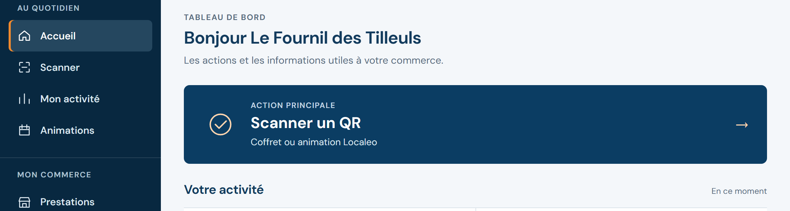
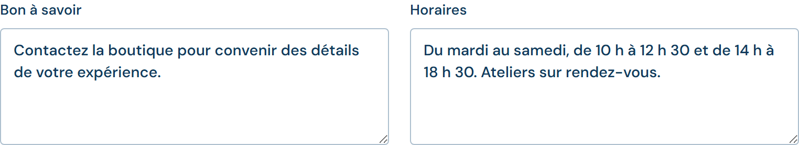
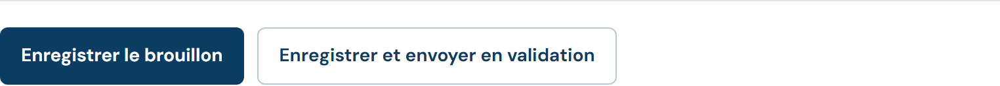
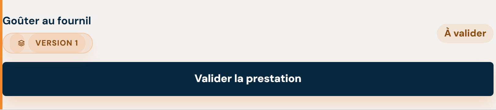
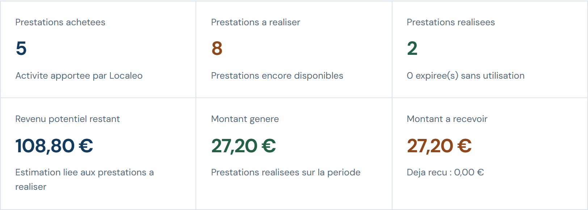
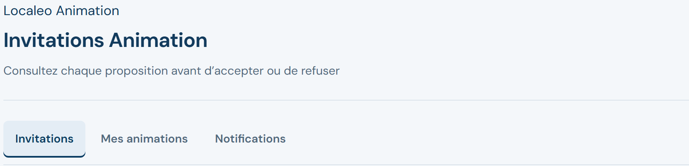
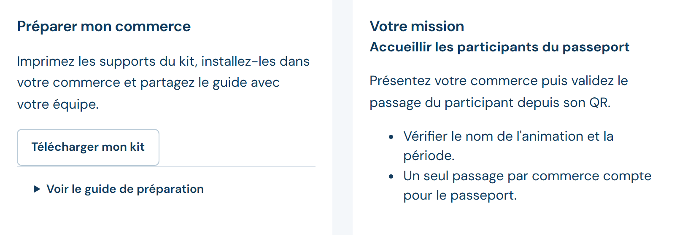
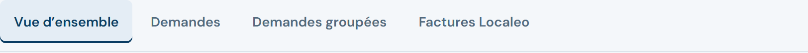
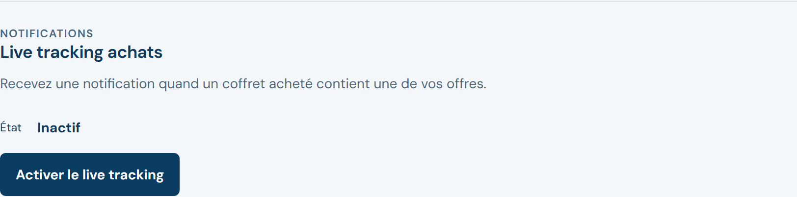

# Localeo Commerçant · Votre guide au quotidien

<!-- Source du guide remis à l’onboarding. Les huit sections de niveau 2 correspondent aux huit pages du PDF. Édition détaillée, septembre 2026. -->

## 1 · Se connecter et se repérer

Ce guide vous accompagne au comptoir et dans le suivi de votre commerce. Retrouvez chaque action à partir du nom de la rubrique affichée dans l’application.

### Ouvrir votre espace commerçant

1. Ouvrez le lien fourni par Localeo sur votre téléphone ou votre ordinateur.
2. Saisissez votre email dans **Login**, puis votre **Mot de passe**. Cliquez sur **Se connecter**.
3. Vérifiez le nom du commerce affiché en haut. Dans **Accueil**, consultez **À traiter**, si affiché, pour retrouver les demandes qui attendent votre réponse.

Si l’écran **Préparer mon compte commerçant** apparaît, complétez les informations demandées. Les fonctions de vente seront accessibles après activation par Localeo ; reconnectez-vous ensuite.

### Retrouver rapidement une fonction

- **Présenter mon commerce et mes offres :** Compte, Ma page publique et Prestations, page 2.
- **Accueillir un client avec un coffret :** Scanner, page 3.
- **Suivre mon activité et mes versements :** Mon activité et Reversements, page 4.
- **Participer à une animation :** Invitations, préparation et accueil des joueurs, pages 5 et 6.
- **Traiter les factures :** Facturation, page 7.
- **Recevoir les alertes et obtenir de l’aide :** Compte, Aide et contact, page 8.

Sur téléphone, la barre du bas propose **Accueil**, **Scanner**, **Activité** et **Plus**. Ouvrez **Plus** pour les autres rubriques. Sur ordinateur, utilisez le menu latéral.

### Garder l’application à portée de main

Choisissez **Installer** lorsque cette action est proposée. Sur iPhone, suivez l’aide affichée : **Partager**, **Sur l’écran d’accueil**, puis **Ajouter**.

**Mot de passe oublié ?** Depuis la connexion, choisissez **Mot de passe oublié**, renseignez votre email et cliquez sur **Demander le lien**. Ouvrez le lien reçu, saisissez et confirmez votre nouveau mot de passe, puis **Valider le mot de passe**.

> Captures de l’application de test, avec des données d’exemple. Certaines rubriques dépendent des services activés. Une connexion Internet reste nécessaire pour enregistrer vos actions.

## 2 · Présenter votre commerce

Des coordonnées à jour, des horaires fiables et des prestations claires aident les clients à préparer leur visite.

### Mettre à jour vos coordonnées

Dans **Compte**, corrigez vos prénom, nom ou téléphone, puis **Enregistrer**. Pour changer l’email, contactez Localeo. Dans **Adresse du commerce**, renseignez voie ou lieu-dit, code postal et localité, puis **Enregistrer l’adresse**. Après un doute d’enregistrement, choisissez **Recharger l’adresse enregistrée** et contrôlez le résultat.

### Soigner votre page publique

Dans **Ma page publique**, préparez les informations visibles par les visiteurs :

- **Accroche courte** et **Présentation longue** : ce que vous proposez et ce qui vous distingue.
- **Histoire du commerce**, **Mot du commerçant**, **Spécialités** et **Ambiance** : votre savoir-faire et votre accueil. Séparez spécialités et ambiances par des virgules.
- **Bon à savoir** et **Horaires** : conditions de visite, réservation, jours et heures d’ouverture.
- **Site web**, **Instagram** et **Lien de réservation** : les liens utiles aux clients.

Ajoutez une **Image principale**, un **Portrait** et jusqu’à trois photos d’**Ambiance**. Choisissez des images nettes, au format JPEG, PNG ou WebP, de 5 Mo maximum chacune. Attendez la fin du chargement.

Vérifiez l’aperçu. **Enregistrer le brouillon** conserve votre travail. **Enregistrer et envoyer en validation** transmet votre demande à Localeo : les changements ne sont pas immédiatement publics. Dans **Demandes**, consultez statut et commentaires ; corrigez si nécessaire, puis renvoyez la demande.

### Consulter ou modifier une prestation

Dans **Prestations**, recherchez par nom ou coffret, puis sélectionnez l’offre. Consultez description, statut et montant reversé. Si elle est **Modifiable**, corrigez son nom ou sa description et choisissez **Enregistrer les modifications** ; **Annuler** abandonne vos changements. En **Lecture seule**, contactez Localeo pour une correction. L’ajout d’une offre et les changements de montant passent également par Localeo.

## 3 · Accueillir un client avec un coffret

Le QR du client permet de retrouver ce qu’il peut recevoir dans votre commerce. Vérifiez la prestation avant de la remettre.

### Scanner, vérifier, puis valider

1. Ouvrez **Scanner**, autorisez l’accès à la caméra et placez le QR du client devant l’objectif.
2. Vérifiez le coffret, sa date d’expiration et la prestation à remettre. Seules vos prestations proposent **Valider la prestation**.
3. Cliquez une seule fois sur **Valider la prestation**. Attendez la confirmation de réussite avant de remettre la prestation.
4. Pour le client suivant, choisissez **Scanner un autre QR**. Pour une autre prestation du même coffret, scannez de nouveau son QR.

### Si la caméra ne fonctionne pas

Vérifiez que le navigateur est autorisé à utiliser la caméra. Essayez **Réinitialiser l’appareil photo**. Si vous disposez de la valeur du QR, collez-la dans **Identifiant du QR code**, puis **Analyser le QR**. Une capture floue peut empêcher la lecture : demandez au client d’agrandir le QR sur son téléphone.

### Si la connexion coupe pendant la validation

- **Aucune confirmation :** utilisez **Vérifier le résultat**, si proposé. L’action a pu être enregistrée malgré la coupure ; ne cliquez pas à répétition.
- **Validation confirmée, affichage ancien :** rescannez le coffret pour relire son état, sans valider à nouveau.
- **Résultat toujours incertain :** contactez Localeo avec la référence affichée et l’heure de l’action, depuis **Aide et contact**.

### Annuler une validation faite par erreur

Rescannez le coffret et ouvrez **Prestations déjà validées**. Si **Annuler la validation** est proposé, sélectionnez cette action, indiquez le **Motif d’annulation**, cochez la confirmation, puis **Confirmer l’annulation**. Attendez le résultat. Cette possibilité dépend notamment du délai autorisé ; sinon, contactez Localeo.

> Un refus, une erreur ou un résultat « à contrôler » ne confirme jamais une prestation. Seule la confirmation de réussite permet de considérer l’action comme effectuée.

## 4 · Suivre l’activité et les versements

**Mon activité** vous aide à comprendre l’utilisation des coffrets. **Reversements** permet de suivre les sommes dues et les versements effectués.

### Consulter la bonne période

Ouvrez **Mon activité** sur ordinateur ou **Activité** sur téléphone. Choisissez dates, regroupement **Jour**, **Semaine** ou **Mois**, et éventuellement une prestation. Cliquez sur **Appliquer**. Pour retrouver une vue complète, utilisez **Réinitialiser** ou élargissez les dates.

- **Prestations achetées :** vos offres présentes dans les coffrets achetés.
- **Prestations à réaliser :** celles qui restent disponibles pour une visite.
- **Prestations réalisées** et **Montant généré :** l’activité effectivement validée.
- **Revenu potentiel restant :** une estimation liée aux prestations encore à réaliser.
- **Montant à recevoir / Déjà reçu :** le suivi des sommes liées à cette activité.

Le graphique compare achats et prestations consommées. **Par prestation et version** permet de consulter le détail de chaque offre.

### Retrouver un reversement

Dans **Reversements**, consultez **Sommes en attente de versement**, puis **Versements des 12 derniers mois**. Retrouvez montant, prestation, validation et statut. Sur téléphone, ouvrez **Détails du mouvement** si nécessaire.

Le statut indique une attente de campagne, un blocage à régulariser, un versement en cours, effectué ou en échec. Le **Suivi du virement bancaire**, si disponible, précise l’arrivée estimée et la destination masquée. **Voir les tentatives précédentes** aide à comprendre un retard.

### Configurer la réception des versements

Dans **Compte > Stripe Connect**, choisissez **Configurer mon compte Stripe** ou **Reprendre la configuration**, si proposé. Complétez les informations directement chez Stripe. De retour dans Localeo, choisissez **Synchroniser mon compte** et vérifiez le statut ainsi que **Ventes** et **Reversements**. Si un blocage persiste, utilisez **Aide et contact**.

> Un achat n’est pas encore une prestation réalisée. Le revenu potentiel n’est pas une somme déjà versée. Les reversements suivent les campagnes Localeo : cette page ne déclenche pas de paiement.

## 5 · Répondre à une invitation

Une animation peut vous proposer d’accueillir des participants, de présenter votre commerce ou de faire réaliser une mission. Consultez votre rôle avant de vous engager.

### Examiner la proposition

1. Ouvrez **Animations > Invitations**, ou la demande signalée dans **À traiter** sur l’accueil.
2. Choisissez **Consulter la demande**. Vérifiez le nom de l’animation, la commune, l’organisateur, les dates et la date limite de réponse.
3. Lisez votre mission et les préparatifs. Ouvrez **Présentation et règlement**, ou **Consulter le règlement et les détails de l’animation**, pour les informations complémentaires.
4. Vérifiez que vous pourrez accueillir les participants sur la période prévue et que votre équipe dispose du matériel nécessaire.

### Accepter la participation

Pour une invitation classique, choisissez **Accepter la participation**.

Pour une chasse au trésor, choisissez votre mission si plusieurs sont proposées. Lisez les préparatifs, puis cochez **Je peux réaliser cette mission et tous les préparatifs ci-dessus.** Cliquez sur **Accepter cette mission**. Attendez la confirmation ; le kit devient alors accessible.

### Refuser ou signaler un empêchement

Si vous ne pouvez pas participer, choisissez le refus et confirmez votre décision. Pour une chasse, ouvrez **Autres choix**, puis **Refuser la participation** et **Confirmer**. Le motif est facultatif.

Après acceptation, consultez **Contact et suivi de ma participation**, si proposé. Pour une chasse, ouvrez **Autres choix > Retirer ma participation**, puis **Confirmer**. Avant publication, le retrait peut être direct ; après publication, il est traité par l’organisateur. Prévenez-le rapidement et vérifiez l’état affiché avant de considérer votre participation comme retirée.

### Retrouver votre décision

Les invitations conservent un historique. **Mes animations** donne accès aux animations acceptées, avec les périodes proposées à l’écran. Ouvrez **Voir le détail** pour retrouver la mission et préparer votre commerce.

> Après une coupure de connexion, choisissez **Vérifier ma décision** avant de recommencer. Si la date limite est dépassée, contactez l’organisateur : lui seul peut prolonger le délai.

## 6 · Préparer et accueillir les joueurs

Après acceptation, l’essentiel se trouve dans le détail de l’animation : votre mission, le kit et les consignes à partager avec l’équipe.

### Préparer votre commerce

1. Choisissez **Télécharger mon kit**. Ouvrez le fichier téléchargé et ses documents. **Voir le guide de préparation** permet aussi de retrouver les consignes dans l’application.
2. Imprimez et installez les supports destinés aux joueurs. Préparez les objets indiqués et expliquez la mission aux personnes qui accueilleront les participants.
3. Une fois les préparatifs terminés, choisissez **Je suis prêt**, si proposé. Attendez la confirmation : l’organisateur sera informé.

### Utiliser le bon support

- **QR de lieu**, pour une chasse : à installer à l’endroit prévu ; les joueurs le scannent dans Localeo Live pour ouvrir le défi.
- **Flyer joueurs :** présente l’accès public ou l’inscription à l’animation ; il ne remplace pas le QR de lieu.
- **Guide de l’équipe :** contient vos consignes privées. Gardez-le pour votre équipe, sans l’afficher aux participants.

### Accueillir et valider un passage

Relisez **Votre mission** avant le lancement. Si elle prévoit une validation par votre commerce, ouvrez **Scanner un QR**, lisez le QR personnel du participant, vérifiez l’animation et l’étape, puis choisissez **Valider cette étape**. Attendez la confirmation. Le scan du QR de lieu par le joueur ne remplace pas cette validation lorsqu’elle est demandée.

Consultez **Suivi chez votre commerce**, si affiché, pour voir les validations et la dernière activité.

### Suivre les messages de l’organisateur

Dans **Animations > Notifications**, ouvrez **Voir la demande** ou **Voir l’animation**. Utilisez les filtres proposés. Après lecture, choisissez **Marquer comme lue** ou **Tout marquer comme lu**. **Supprimer**, puis **Confirmer la suppression**, retire une notification de la liste.

> Après une coupure, utilisez **Vérifier mon kit** ou **Vérifier ma confirmation**, si proposé, avant de recommencer. Télécharger le kit ne signifie pas que votre commerce est prêt.

## 7 · Traiter vos factures

La rubrique **Facturation** apparaît lorsque ce service est activé. Elle distingue vos factures de prestation et les factures de commissions émises par Localeo.

### Fournir une facture demandée

1. Dans **Demandes** ou **Demandes groupées**, recherchez la référence ou filtrez par statut. Ouvrez la demande et vérifiez prestations, montant brut TTC, commission et net reversé.
2. Cliquez sur **Accuser réception**, puis **Démarrer le traitement**, lorsque proposé.
3. Préparez la facture dans votre outil habituel, en reprenant les informations de la demande. Vérifiez le montant brut TTC à facturer : il est distinct du net reversé après commission.
4. Dans **Déposer votre facture**, ajoutez un PDF de 10 Mo maximum, son numéro et sa date.
5. Choisissez **Fournir la facture**, attendez la confirmation, puis vérifiez le statut **Facture fournie**.

Les statuts **Demandée**, **Réception accusée** et **En traitement** indiquent ce qu’il reste à faire. Une demande groupée réunit plusieurs prestations : contrôlez toutes les lignes avant de fournir le document.

### Annuler ou corriger une demande

Avant fourniture, l’annulation est proposée lorsque l’action est possible. Vérifiez la référence, puis choisissez **Annuler la demande** et attendez la confirmation.

Pour une demande groupée déjà fournie, utilisez **Créer une correction distincte** : choisissez **Avoir** ou **Facture corrective**, renseignez le **Motif**, puis **Créer la demande de correction**. La correction est distincte de la facture d’origine.

### Télécharger les factures Localeo

Dans **Factures Localeo**, retrouvez commissions et avoirs, puis **Télécharger le PDF**. Conservez-les avec votre suivi comptable ; ils ne remplacent pas votre facture de prestation.

### Options disponibles selon votre compte

**Assistant d’émission facultatif :** si proposé sur une demande unitaire en traitement, choisissez **Créer ou reprendre un brouillon**. Vérifiez toutes les informations, enregistrez, confirmez leur exactitude puis **Émettre la facture**. Si le formulaire vous semble difficile, demandez l’aide de Localeo ou utilisez votre PDF habituel.

**Chorus Pro :** si l’onglet apparaît, vous pouvez autoriser Localeo à déposer vos factures publiques. Lisez le mandat, renseignez les références fournies par Localeo, cochez l’accord puis **Accepter le mandat**. Pour y mettre fin, indiquez le motif et choisissez **Révoquer le mandat** ; attendez la confirmation. Les preuves des dépôts antérieurs restent conservées.

> Une page qui ne charge pas ne signifie pas qu’aucune facture n’existe. Actualisez ou demandez de l’aide avant de créer un nouveau document.

## 8 · Gérer vos alertes et vos demandes

Gardez un accès à jour, recevez les informations utiles et retrouvez les réponses de Localeo dans votre espace.

### Recevoir les alertes d’achat

Dans **Compte > Live tracking achats**, choisissez **Activer le live tracking** et autorisez les notifications. Si la préférence est déjà active, choisissez **Abonner cet appareil**. Vérifiez la mention **Actif sur cet appareil**. Répétez l’abonnement sur chaque appareil où vous souhaitez recevoir les alertes.

Une alerte signifie qu’un coffret acheté contient une de vos offres ; elle ne remplace pas la validation lors de la visite. Si les notifications sont refusées, vérifiez les autorisations du navigateur. **Désactiver** permet d’arrêter les alertes du compte.

### Contacter Localeo et suivre une réponse

1. Ouvrez **Aide et contact**, puis sélectionnez le **Motif** le plus proche de votre besoin.
2. Dans **Message**, décrivez l’action souhaitée, le problème et son heure. Ajoutez **Référence coffret** ou **Référence prestation**, si disponible.
3. Choisissez **Envoyer** une seule fois et attendez la confirmation.
4. Dans **Mes demandes**, ouvrez le fil pour lire les réponses. Choisissez **Répondre** pour poursuivre l’échange au même endroit.

Si aucun motif n’est disponible ou si l’envoi est impossible, utilisez le contact Localeo remis lors de votre onboarding. Pour une question sur l’organisation d’une animation, contactez d’abord son organisateur.

### Retrouver votre contrat et sécuriser votre accès

Dans **Compte > Mon contrat**, choisissez **Télécharger le contrat**. S’il manque, utilisez **Actualiser le contrat** si proposé, puis contactez Localeo.

Le menu portant le nom de votre commerce permet de **Copier** votre identifiant pour le support, de **Modifier mon mot de passe** et de **Se déconnecter**. Pour changer le mot de passe, renseignez l’actuel, le nouveau et sa confirmation, puis **Mettre à jour**. Reconnectez-vous ensuite : les sessions ouvertes sont fermées.

> En fin d’utilisation sur un appareil partagé, déconnectez-vous. Ne transmettez jamais votre mot de passe, votre lien de réinitialisation ou le QR personnel d’un client dans une demande d’aide.
