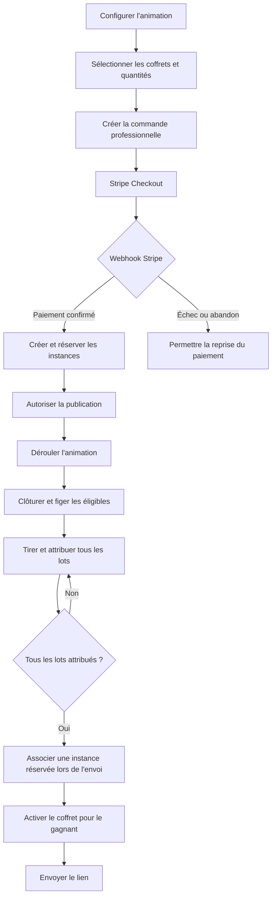
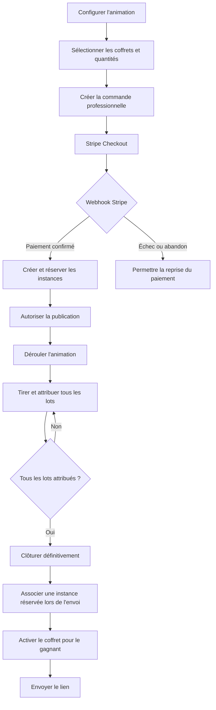

# EPIC 46 — Paiement professionnel et activation différée des lots d'une animation

> État produit commun : **Terminée**. Backlog consolidé le 18 septembre 2026 ; les contributions applicatives sont réunies dans ce fichier. Les anciens états de cadrage ou de stories restent historiques et ne rouvrent pas l’EPIC.

## Statut

- Priorité : Critique
- Statut : `Termine`
- Produit : Localeo Animation
- Dépendances : Epic 41 Animation locale, Gestion des achats, documents d'achat, Stripe Checkout, Stripe Connect et webhook Stripe
- Socle local analysé : commit `6455858`, version `1.0.0+6455858`
- Dossier de conception : [`docs/specifications/epic-46-paiement-lots-animation/`](../../specifications/epic-46-paiement-lots-animation/README.md)

## Objectif

Permettre à un gestionnaire d'animation de commander et payer via Stripe les coffrets sélectionnés comme lots, selon un parcours d'achat professionnel.

Les coffrets payés doivent être réservés à l'animation sans être activés. Chaque instance est activée uniquement lorsqu'un gain est attribué et envoyé à un gagnant.

## Diagnostic et challenge du besoin

Le besoin métier est cohérent, mais deux niveaux doivent être distingués :

1. **Invariants indispensables**, déjà retenus : aucun achat à zéro euro, confirmation exclusive par webhook Stripe, instances non activées avant le gain et publication interdite avant couverture financière complète.
2. **Expérience de paiement multi-lots validée** : un seul checkout regroupant plusieurs coffrets, un récapitulatif consolidé, une preuve de paiement unique et une reprise globale.

Le socle `6455858` implémente le premier niveau avec un achat professionnel et un checkout **par ligne de lot**. Il ne faut pas présenter ce socle comme une commande multi-lots unique : `AchatCoffret`, `Paiement`, les documents d'achat et la résolution de la `source_transaction` Stripe Connect sont actuellement structurés autour d'un seul coffret. Ce socle n'étant pas en production, il est remplacé directement sans maintien d'une compatibilité Animation par ligne.

La cible « un paiement unique pour tous les lots » nécessite donc un agrégat de commande multi-lignes explicite. Une simple création de plusieurs `AchatCoffret` partageant artificiellement la même transaction Stripe rendrait ambigus les remboursements, la facturation, l'idempotence et les reversements commerçants ; cette option est écartée.

### Socle déjà disponible

- rattachement d'un achat professionnel à `animation_id + animation_lot_ordre` ;
- initialisation Stripe idempotente par ligne de lot ;
- création d'instances `EN_ATTENTE_ACTIVATION` après confirmation du webhook ;
- contrôle de la couverture financière avant publication ;
- blocage de la modification ou suppression des lots après démarrage d'un paiement ;
- activation d'une instance prépayée lors de l'envoi d'un gain ;
- conservation de la transaction payée comme source des reversements Stripe Connect.

### Écarts restant à traiter pour atteindre la présente Epic

- commande et checkout uniques pour plusieurs lignes de coffrets ;
- snapshot consolidé des lignes, prix et identité de facturation ;
- paiement rattaché à la commande tout en restant résolvable depuis chaque achat enfant ;
- document de paiement consolidé et règles de facturation multi-coffrets ;
- états agrégés, reprise, expiration, annulation, remboursement et réconciliation ;
- projection du sous-workflow financier dans le workflow Animation ;
- retrait des endpoints et projections Animation par ligne du socle `6455858`.

## Valeur métier

- Garantir que tous les lots annoncés sont financés avant la publication.
- Centraliser la commande au nom du partenaire organisateur et rendre le reçu ainsi que le dossier de facturation accessibles depuis l'animation.
- Ne pas faire démarrer la période de validité d'un coffret avant son attribution.
- Assurer une traçabilité complète entre animation, paiement, achat, instance, gain et bénéficiaire.
- Éviter les doubles paiements et les doubles activations.

## Périmètre fonctionnel

### Inclus

- Sélection de plusieurs types de coffrets et de leurs quantités.
- Calcul et affichage d'un récapitulatif financier.
- Achat de type `PROFESSIONNEL` via Stripe Checkout.
- Paiement unique pour l'ensemble des lots d'une animation.
- Confirmation du paiement par webhook Stripe.
- Création et réservation des instances sans activation.
- Blocage de la publication tant que les lots ne sont pas intégralement payés et réservés.
- Association d'une instance réservée à chaque gain.
- Activation et envoi au gagnant lors de l'attribution.
- Reprise idempotente des opérations en erreur.
- Affichage du suivi financier et opérationnel dans le workflow.
- Consultation du reçu consolidé et du dossier de facturation depuis la fiche Animation.
- Attribution obligatoire de tous les lots achetés avant la clôture définitive.

### Hors périmètre initial

- Paiement fractionné ou échéancier.
- Achat de lots provenant de plusieurs communes.
- Remplacement automatique d'un modèle de coffret devenu indisponible.
- Remboursement automatique après activation d'un coffret.
- Modification libre des quantités après publication.

## Principes métier

1. Une animation appartient à une seule commune.
2. Un coffret doit être éligible dans la commune au moment de la commande.
3. La quantité payée doit couvrir la quantité configurée pour chaque type de coffret.
4. Un paiement confirmé crée ou rend disponibles des instances non activées.
5. Une instance réservée ne peut appartenir qu'à une animation et à un seul lot.
6. Une instance ne peut être associée qu'à un seul gain.
7. La durée de validité commence à l'activation, pas au paiement.
8. La redirection Stripe n'est jamais une preuve de paiement ; seul le webhook fait foi.
9. Le frontend ne manipule ni clé Stripe secrète ni token de gestion d'achat.
10. Toute commande, association et activation sensible est idempotente.
11. Le tirage crée un gain attribué pour chaque lot acheté ; aucun lot payé ne reste sans bénéficiaire au MVP.
12. L'instance réservée est associée lors de l'envoi irréversible du gain, après les éventuels remplacements de gagnant.
13. Une désactivation commerciale ultérieure d'un coffret ne remet pas en cause les instances payées ; seul un blocage légal, fraude ou sécurité déclenche une régularisation support.
14. Le MVP accepte uniquement `EUR`, au maximum 20 lignes et 100 instances par commande, avec un plafond monétaire configurable.

## Parcours cible



## Intégration au workflow Animation

Le paiement ne doit pas multiplier les statuts principaux de l'animation. Il est modélisé comme un sous-workflow financier de la phase `CONFIGURATION`.

### États financiers proposés

| État | Description | Effet sur le workflow |
|---|---|---|
| `A_CONFIGURER` | Aucun lot valide sélectionné | Configuration incomplète |
| `A_REGLER` | Lots configurés, commande non payée | Action suivante : payer les lots |
| `PAIEMENT_EN_COURS` | Checkout créé, confirmation attendue | Publication bloquée |
| `PAYE` | Paiement confirmé | Réservation des instances attendue |
| `INSTANCES_RESERVEES` | Toutes les instances sont disponibles | Passage à `PRETE_A_PUBLIER` autorisé |
| `ECHEC` | Paiement ou réservation en erreur | Action suivante : reprendre |
| `ANNULE` | Commande annulée | Publication bloquée |
| `REMBOURSE` | Achat remboursé | Publication bloquée ou animation à régulariser |
| `A_RECONCILIER` | Paiement confirmé mais état technique incomplet | Traitement automatique ou support requis |

### Conditions de passage à `PRETE_A_PUBLIER`

- Configuration métier complète.
- Aucun coffret frappé d'un blocage légal, fraude ou sécurité ; une simple désactivation commerciale postérieure au paiement n'est pas bloquante.
- Commande Stripe confirmée.
- Quantité payée supérieure ou égale à la quantité configurée pour chaque lot.
- Toutes les instances attendues réservées.
- Aucun incident financier bloquant.

### Détail affiché dans l'étape Configuration

```text
Lots configurés             ✓
Commande créée              ✓
Paiement Stripe             ✓ Payé le 21/08/2026
Instances réservées         ✓ 3 / 3
```

## APIs existantes à réutiliser

### Façade Animation par ligne à remplacer

```http
GET /protected/animation-locale/animations/{animation_id}/lots/financements
POST /protected/animation-locale/animations/{animation_id}/lots/{lot_ordre}/paiement/initialiser
```

Ce contrat constitue le socle technique actuel, mais n'est pas déployé en production. L'Epic 46 le retire de la façade et de l'OpenAPI Animation au profit de la commande consolidée ; aucun fallback de lecture ni période de dépréciation n'est requis.

### Initialisation unitaire Marketplace

```http
POST /public/gestion-achats/paiements/initialiser
```

Paramètres disponibles : `coffret_id`, `quantite`, `type_client`, `email_client`, `telephone_client`, `nom_entreprise`, `nom_contact` et `Idempotency-Key`.

Limite : cet endpoint ne prend en charge qu'un seul type de coffret par checkout.

### Consultation après Stripe

```http
GET /protected/gestion-achats/achats/depuis-session/{session_id}
GET /protected/gestion-achats/achats/{achat_id}
GET /protected/gestion-achats/achats/{achat_id}/coffrets-instances
```

### Activation d'une instance

```http
POST /protected/gestion-achats/achats/{achat_id}/coffrets-instances/{coffret_instance_id}/activer
```

Payload :

```json
{
  "email_beneficiaire": "gagnant@example.com"
}
```

Limite : depuis `6455858`, cette activation manuelle est volontairement refusée pour les achats `LOT_ANIMATION`. L'envoi du gain passe par le service Animation afin de garantir l'association au gagnant et d'empêcher le détournement d'une instance réservée.

### Confirmation Stripe

```http
POST /public/stripe/webhook
```

## Contrat backend cible validé

La recommandation produit est de conserver l'expérience demandée : **une commande et un checkout Stripe uniques par version de configuration**. La recommandation technique est de créer une vraie commande multi-lignes ; elle ne doit pas être simulée par plusieurs paiements ou par plusieurs objets `Paiement` portant le même identifiant Stripe.

### Créer une commande multi-lots

```http
POST /protected/animation-locale/animations/{animation_id}/commande-lots
Idempotency-Key: animation:{animation_id}:commande:{configuration_version}
```

```json
{
  "acheteur": {
    "nom_entreprise": "Commune de Latresne",
    "nom_contact": "Jean Dupont",
    "email": "gestionnaire@example.fr",
    "telephone": "+33600000000"
  }
}
```

Le backend charge les lots depuis la version courante de la configuration. Le navigateur ne renvoie ni lignes, ni prix, ni URLs de redirection faisant autorité.

Réponse proposée :

```json
{
  "commande_id": "uuid",
  "animation_id": "uuid",
  "checkout_url": "https://checkout.stripe.com/...",
  "statut": "PAIEMENT_EN_COURS",
  "montant_total_centimes": 19500,
  "devise": "EUR"
}
```

L'implémentation crée une commande multi-lignes dans `gestion_achats`, puis matérialise un `AchatCoffret` enfant par ligne après confirmation. Le paiement Stripe appartient à la commande. Chaque achat enfant conserve une relation explicite vers cette commande afin que documents, instances et reversements retrouvent sans ambiguïté la transaction source.

Les champs `success_url` et `cancel_url` ne sont pas acceptés depuis le payload du navigateur. Ils sont construits à partir de templates backend configurés et allowlistés afin d'éviter une redirection ouverte.

### Consulter la commande de l'animation

```http
GET /protected/animation-locale/animations/{animation_id}/commande-lots
```

### Reprendre un paiement

```http
POST /protected/animation-locale/animations/{animation_id}/commande-lots/reprendre
Idempotency-Key: animation:{animation_id}:commande:{commande_id}:reprise:{n}
```

### Annuler ou rembourser avant attribution

```http
POST /protected/animation-locale/animations/{animation_id}/commande-lots/annuler
```

Cette commande demande un remboursement total uniquement avant publication et si aucune instance n'est activée. Après publication ou première activation, elle renvoie `409` et impose un traitement support/finance. Aucun remboursement partiel n'est disponible au MVP.

### Consulter les documents depuis l'animation

```http
GET /protected/animation-locale/animations/{animation_id}/commande-lots/{commande_id}/documents
GET /protected/animation-locale/animations/{animation_id}/commande-lots/{commande_id}/documents/{document_id}/telecharger
```

La fiche Animation expose le reçu de paiement consolidé et le dossier de facturation détaillé. Le téléchargement est protégé par le tenant, audité et s'appuie sur les snapshots figés au paiement.

### Contrats d'erreur minimaux

| HTTP | Code métier | Cas |
|---|---|---|
| `409` | `COMMANDE_LOTS_DEJA_ACTIVE` | Une commande compatible est déjà en cours ou payée. |
| `409` | `CONFIGURATION_LOTS_FIGEE` | Les lots ont changé après création de la commande. |
| `409` | `PAIEMENT_LOTS_INCOMPLET` | Publication demandée sans couverture complète. |
| `409` | `COMMANDE_LOTS_A_RECONCILIER` | Paiement confirmé mais achats ou instances incomplets. |
| `422` | `COFFRET_LOT_NON_ELIGIBLE` | Coffret inactif, hors commune ou non vendable. |
| `409` | `COFFRET_LOT_BLOQUE` | Coffret payé frappé d'un blocage légal, fraude ou sécurité. |
| `422` | `QUANTITE_LOT_INVALIDE` | Quantité absente, nulle ou hors limite. |
| `422` | `LIMITE_COMMANDE_LOTS_DEPASSEE` | Limite de lignes, quantité totale ou plafond monétaire dépassé. |
| `503` | `STRIPE_TEMPORAIREMENT_INDISPONIBLE` | Initialisation ou lecture Stripe impossible. |

## Responsabilités Backend

### BE-01 — Modèle de données

Créer les agrégats ou tables permettant de relier :

```text
Animation
  → Commande de lots
    → Lignes de commande
      → Achat Marketplace
        → Instances réservées
          → Gain
```

Données minimales :

- `commande_id`, `animation_id`, `statut`, `montant_total_centimes`, `devise`.
- Snapshot de chaque lot : coffret, nom, prix unitaire, quantité, ordre.
- `achat_id`, `checkout_session_id`, `reference_transaction`.
- `coffret_instance_id`, statut de réservation, `gain_id`, `participant_id`.
- Dates de création, paiement, réservation, attribution et activation.

### BE-02 — Validation de la commande

- Vérifier les droits du gestionnaire sur l'animation et la commune.
- Vérifier que l'animation est encore configurable.
- Vérifier l'éligibilité et la disponibilité des coffrets.
- Recalculer les prix côté serveur.
- Refuser les quantités nulles ou négatives.
- Refuser plus de 20 lignes, plus de 100 instances, une devise autre que `EUR` ou un total supérieur au plafond configuré.
- Refuser une nouvelle commande incompatible avec une commande déjà payée.

### BE-03 — Orchestration Stripe

- Créer un checkout professionnel unique.
- Associer les métadonnées `animation_id` et `commande_id` à Stripe.
- Utiliser une clé d'idempotence stable.
- Ne jamais accepter le montant calculé par le frontend.
- Retourner uniquement l'URL de checkout et les références métier nécessaires.

### BE-04 — Webhook et confirmation

- Vérifier la signature Stripe.
- Traiter les événements de manière idempotente.
- Mettre à jour la commande après confirmation effective.
- Créer ou rattacher les instances non activées.
- Passer à `INSTANCES_RESERVEES` lorsque les quantités sont complètes.
- Passer à `A_RECONCILIER` si le paiement est confirmé mais les instances incomplètes.

### BE-05 — Workflow et validation de publication

- Exposer l'état financier dans `WorkflowAnimationPayload` ou un payload dédié.
- Ajouter les blocages de publication liés au paiement.
- Retourner une prochaine action contextualisée : payer, reprendre, attendre ou contacter le support.
- Interdire la publication si les quantités financées sont insuffisantes.

### BE-06 — Attribution transactionnelle

- Sélectionner une instance réservée du bon coffret.
- Verrouiller l'instance pendant l'association.
- Associer atomiquement instance, gain et participant.
- Garantir qu'une instance et un gain ne sont utilisés qu'une fois.
- Conserver l'instance réservée si l'activation échoue.
- Produire au tirage exactement un gain attribué par instance achetée.
- Bloquer la clôture définitive tant que tous les gains ne sont pas attribués.

### BE-07 — Activation et envoi

- Appeler le use case interne d'activation depuis Animation ; ne pas exposer le token de gestion et ne pas utiliser l'endpoint d'activation manuelle pour un lot réservé.
- Transmettre l'email du gagnant uniquement au moment de l'attribution.
- Enregistrer `date_activation`, `date_expiration` et `consultation_url`.
- Envoyer le lien au bénéficiaire.
- Rendre l'opération rejouable sans créer une seconde activation.

Clé proposée :

```text
animation:{animation_id}:gain:{gain_id}:activation
```

### BE-08 — Annulation, remboursement et réconciliation

- Autoriser uniquement le remboursement total avant publication et sans instance activée.
- Basculer vers un traitement support/finance après publication ou première activation.
- Empêcher un remboursement automatique d'une instance déjà activée.
- Libérer les réservations après remboursement valide.
- Fournir un job de réconciliation paiement/instances.
- Exposer le reçu consolidé et les documents de facturation depuis la commande de l'animation.
- Produire des alertes exploitables par le support.

### BE-09 — Sécurité et audit

- Garder les secrets Stripe et tokens Marketplace côté serveur.
- Ne pas exposer le `management_token` au navigateur.
- Journaliser commande, paiement, webhook, réservation, attribution et activation.
- Masquer les données sensibles dans les logs.
- Vérifier les droits tenant/commune sur chaque opération.

### BE-10 — Observabilité

Mesurer au minimum :

- Checkouts créés, abandonnés, payés et échoués.
- Délai entre paiement et réservation complète.
- Écarts entre quantités payées et instances disponibles.
- Activations réussies, échouées et rejouées.
- Commandes en état `A_RECONCILIER`.

## Responsabilités Frontend

### FE-01 — Configuration des lots

- Afficher les coffrets éligibles de la commune.
- Permettre de configurer une quantité par coffret, minimum 1.
- Afficher prix unitaire, sous-total et total.
- Signaler les coffrets devenus indisponibles.
- Conserver la configuration avant redirection Stripe.

### FE-02 — Récapitulatif de commande

- Présenter les lignes de commande et l'identité professionnelle de l'acheteur.
- Afficher les mentions indiquant que les coffrets seront activés lors de l'attribution.
- Demander une confirmation avant de démarrer le paiement.
- Désactiver le bouton pendant l'initialisation.

### FE-03 — Redirection Stripe

- Appeler uniquement l'endpoint d'orchestration Animation.
- Générer et envoyer `Idempotency-Key`.
- Rediriger vers `checkout_url`.
- Ne stocker aucun secret ou token de gestion Marketplace.

### FE-04 — Retour de paiement

- Gérer les retours succès, annulation et erreur.
- Afficher « Confirmation en cours » tant que le webhook n'est pas traité.
- Actualiser périodiquement l'état de la commande avec une durée maximale.
- Ne jamais afficher « Payé » sur la seule base des paramètres d'URL.

### FE-05 — Intégration au workflow

- Afficher les sous-étapes financières dans Configuration.
- Afficher les quantités configurées, payées et réservées.
- Présenter les blocages remontés par le backend.
- Proposer l'action adaptée : payer, reprendre ou consulter l'incident.
- Ne pas dupliquer les règles métier du backend.

### FE-06 — Publication

- Désactiver « Publier » tant que le backend ne retourne pas l'autorisation.
- Expliquer précisément le blocage.
- Rafraîchir la validation de publication après confirmation du paiement.

### FE-07 — Tirage et gains

- Afficher le nombre de lots achetés, attribués et envoyés.
- Exiger un gagnant pour chaque lot acheté avant de proposer la clôture ; l'envoi reste suivi séparément.
- Afficher l'instance réservée associée à chaque gain lorsque disponible.
- Conserver une confirmation avant « Envoyer le gain ».
- Afficher séparément attribution, activation et notification.
- Permettre la reprise d'une activation échouée sans générer un second gain.

### FE-08 — États d'erreur

Prévoir les écrans ou messages suivants :

- Checkout abandonné.
- Paiement refusé.
- Confirmation Stripe en attente.
- Paiement confirmé, instances en préparation.
- Quantités réservées incomplètes.
- Activation en échec.
- Commande à réconcilier.

### FE-09 — Accessibilité et responsive

- Parcours utilisable au clavier.
- États de chargement annoncés.
- Messages d'erreur associés aux actions.
- Tableau de commande lisible sur mobile.
- Aucun statut communiqué uniquement par la couleur.

### FE-10 — Documents de la commande

- Afficher `Consulter la facture des lots` sur la fiche Animation lorsque la commande est payée.
- Présenter séparément le reçu de paiement et le dossier de facturation lorsqu'il contient plusieurs documents.
- Utiliser exclusivement les liens de téléchargement protégés retournés par l'API.

### FE-11 — Télémétrie

Émettre des événements fonctionnels sans données bancaires :

- `animation_lots_checkout_started`
- `animation_lots_checkout_returned`
- `animation_lots_payment_confirmed`
- `animation_lots_payment_failed`
- `animation_gain_activation_started`
- `animation_gain_activation_completed`
- `animation_gain_activation_failed`

## User stories et critères d'acceptation

### US-01 — Commander les lots

En tant que gestionnaire, je veux payer tous les lots d'une animation en une seule fois afin de garantir leur disponibilité.

Critères :

- Étant donné plusieurs types de coffrets sélectionnés, lorsqu'une commande est créée, alors un seul checkout Stripe est présenté.
- Le total affiché correspond au total recalculé côté serveur.
- Un double clic ne crée pas deux commandes.
- Le paiement porte le type client `PROFESSIONNEL`.

### US-02 — Confirmer le paiement

En tant que gestionnaire, je veux connaître l'état réel du paiement après Stripe.

Critères :

- Le retour navigateur affiche un état d'attente tant que le webhook n'a pas confirmé le paiement.
- Un paiement confirmé affiche la référence et la date de paiement.
- Une actualisation de page conserve le même état.
- Un checkout abandonné peut être repris.

### US-03 — Bloquer la publication

En tant qu'organisateur, je ne dois pas publier une animation dont les lots ne sont pas financés.

Critères :

- `Publier` reste indisponible tant que toutes les instances ne sont pas réservées.
- Le blocage indique les quantités manquantes.
- L'autorisation est recalculée côté serveur.

### US-04 — Activer lors de l'attribution

En tant que gestionnaire, je veux activer le coffret uniquement lors de son envoi au gagnant.

Critères :

- Avant attribution, `date_activation` et `date_expiration` sont nulles.
- Une instance réservée est associée à un seul gain.
- L'activation renseigne le gagnant comme bénéficiaire.
- La durée de validité commence à la date d'activation.
- Rejouer l'action ne crée pas une seconde instance.

### US-05 — Traiter les incidents

En tant que support Localeo, je veux identifier et reprendre les paiements ou activations incomplets.

Critères :

- Une commande payée mais incomplète passe à `A_RECONCILIER`.
- Les événements Stripe et les actions de reprise sont audités.
- Une reprise ne provoque ni double débit ni double activation.

### US-06 — Consulter les documents d'achat

En tant que gestionnaire, je veux accéder aux documents d'achat depuis l'animation afin de retrouver immédiatement la preuve de paiement et les factures des lots.

Critères :

- Une commande payée expose un reçu consolidé.
- Le dossier de facturation distingue les documents par achat enfant, commerçant et Localeo.
- Le reçu n'est pas présenté comme une facture fiscale.
- La consultation et le téléchargement contrôlent le tenant et sont audités.

### US-07 — Attribuer tous les lots lors du tirage

En tant qu'organisateur, je veux que tous les lots achetés soient attribués afin qu'aucun coffret financé ne reste inutilisé au MVP.

Critères :

- Le tirage crée exactement un gain attribué par lot acheté.
- L'instance n'est associée et activée qu'au moment de l'envoi irréversible du gain.
- La clôture précède le tirage et fige atomiquement la population éligible.
- Le tirage attribue tous les gains ; l'envoi associe ensuite l'instance de manière idempotente.

## Stratégie de tests

### Backend

- Tests unitaires des transitions financières.
- Tests d'idempotence commande, webhook et activation.
- Tests transactionnels d'attribution concurrente.
- Tests d'écart entre quantités commandées, payées et réservées.
- Tests de signature et rejeu de webhook Stripe.
- Tests d'annulation et remboursement.

### Frontend

- Tests des calculs d'affichage et formats monétaires.
- Tests des états du bouton de paiement et de publication.
- Tests des retours Stripe succès, annulation et attente.
- Tests des blocages remontés par l'API.
- Tests de reprise d'une activation échouée.

### End-to-end Stripe Test

1. Créer une animation.
2. Sélectionner deux types de coffrets et plusieurs quantités.
3. Effectuer un paiement professionnel avec une carte Stripe de test.
4. Vérifier le webhook et les instances non activées.
5. Publier puis clôturer et vérifier que la population éligible est figée.
6. Lancer le tirage et vérifier que tous les lots sont attribués.
7. Envoyer tous les gains.
8. Vérifier l'activation unique, la date d'expiration, la notification et les documents accessibles depuis l'animation.

## Arbitrages et prérequis résiduels

Les 16 décisions du [registre des arbitrages](../../specifications/epic-46-paiement-lots-animation/registre-arbitrages.md) sont validées et intégrées. Aucun point fonctionnel ou technique du registre ne bloque le démarrage de l'implémentation.

Deux validations externes restent requises avant la mise en production, sans bloquer les premiers lots de développement :

1. faire valider par comptabilité/juridique la composition exacte du reçu consolidé et du dossier de facturation ;
2. fixer avec finance/risque la valeur du plafond monétaire configurable par commande.

## Découpage de livraison recommandé

### Lot 0 — Décisions et caractérisation du socle

- Consigner les 16 arbitrages validés dans les contrats, l'architecture et les tests.
- Caractériser achat professionnel, webhook, documents, remboursements et Stripe Connect.
- Figer le contrat OpenAPI multi-lots et le retrait du socle Animation par ligne.
- Critère de sortie : aucune ambiguïté sur la racine du paiement, la preuve documentaire et la transaction source des reversements.

### Lot 1 — Socle backend

- Modèle commande/lignes/réservations.
- Endpoint multi-lots.
- Intégration Stripe Test.
- Webhook et réconciliation.

### Lot 2 — Configuration frontend

- Récapitulatif financier.
- Paiement et retour Stripe.
- États de commande.

### Lot 3 — Workflow et publication

- Blocages backend.
- Sous-workflow financier frontend.
- Validation de publication.

### Lot 4 — Attribution différée

- Association transactionnelle d'une instance.
- Activation lors de l'envoi du gain.
- Reprise et audit.

### Lot 5 — Robustesse

- Annulation et remboursement.
- Réconciliation et alertes.
- Tests E2E et observabilité.

## Definition of Done

- Un gestionnaire paie en une fois plusieurs types de coffrets.
- Le paiement est confirmé exclusivement par webhook Stripe.
- Les instances payées sont réservées mais non activées.
- Une animation non financée ne peut pas être publiée.
- Chaque gain utilise exactement une instance réservée.
- L'activation démarre la validité et notifie le gagnant.
- Les opérations sensibles sont idempotentes et auditées.
- Les erreurs sont rejouables sans double débit ni double activation.
- Les tests backend, frontend et E2E Stripe Test passent.
- Le contrat OpenAPI et la documentation d'exploitation sont publiés.
- Chaque achat enfant permet de retrouver la commande, le paiement et la `source_transaction` Stripe sans heuristique.
- La fiche Animation donne accès au reçu consolidé et au dossier de facturation de la commande payée.
- La clôture définitive est impossible tant que tous les lots achetés ne sont pas attribués.
- Le socle Animation par ligne est retiré sans couche de compatibilité.
- Les décisions du registre sont reflétées dans le modèle, l'OpenAPI et les tests.


## Compléments Animation

Les passages communs sont intégrés au corps principal. Les précisions et jalons propres à cette interface sont conservés ci-dessous ; leurs anciens états de lots ne remplacent pas l’état produit commun. La séquence clôture/tirage ci-dessous est une variante historique divergente, conservée pour traçabilité ; voir le [registre PLOT-ARB-16](../../specifications/epic-46-paiement-lots-animation/registre-arbitrages.md). Cette fusion ne tranche pas cette divergence.

### Parcours cible



### Contrat backend cible validé / Contrats d'erreur minimaux

| HTTP | Code métier | Cas |
|---|---|---|
| `409` | `LOTS_ACHETES_NON_ATTRIBUES` | Clôture demandée alors que tous les lots achetés ne disposent pas d'un gain attribué. |

### User stories et critères d'acceptation / US-07 — Attribuer tous les lots avant clôture

- La clôture renvoie `LOTS_ACHETES_NON_ATTRIBUES` tant qu'un gain attribué manque.
- Après attribution de tous les gains, la clôture est autorisée ; l'envoi associe ensuite l'instance de manière idempotente.

### Stratégie de tests / End-to-end Stripe Test

5. Publier puis n'attribuer qu'une partie des lots et vérifier que la clôture est refusée.
6. Attribuer tous les lots puis clôturer.
