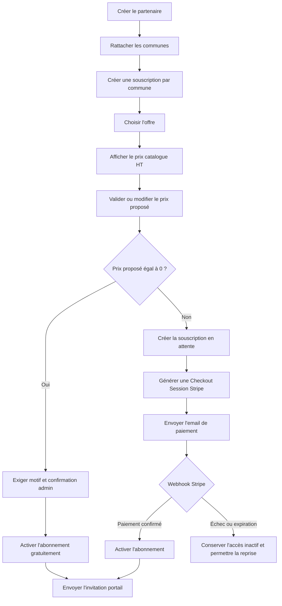

# EPIC 47 — Souscription et paiement de l'abonnement partenaire Animation

## Statut

- Priorité : Critique
- Statut : `Termine` - cloture produit confirmee par l'utilisateur le 15 septembre 2026.
- Le socle technique et les evolutions sont livres. L'ancienne mention de recette Stripe Test
  ne maintient plus cette epic ouverte ; la procedure reste une reference d'exploitation.
- Cette cloture ne constitue pas une nouvelle attestation de recette Stripe executee par l'assistant.
- Produit : Localeo Animation / Back-office Localeo
- Domaine propriétaire : `abonnements_plateforme`
- Dépendances : Epic 41 Animation locale, référencement partenaire, Stripe
  Checkout, webhook Stripe, outbox email, audit et gestion documentaire
- Dossier de conception :
  [`docs/specifications/epic-47-souscription-abonnement-partenaire-animation/`](../../specifications/epic-47-souscription-abonnement-partenaire-animation/README.md)

## Objectif

Compléter le référencement d'un partenaire Animation par une souscription
commerciale traçable et, lorsque le prix négocié est supérieur à zéro, par un
paiement Stripe.

Le partenaire, ses communes et son premier utilisateur peuvent être préparés
depuis le back-office, mais le droit d'utiliser Localeo Animation ne devient
actif qu'après confirmation du paiement par webhook Stripe. Une souscription
gratuite est activée explicitement par l'administrateur, sans créer de paiement
fictif.

## Offres initiales

Les montants ci-dessous sont des prix catalogue hors taxes, modifiables depuis
la gestion des offres sans modifier les souscriptions déjà créées.

| Code | Libellé | Prix catalogue HT | Droit principal |
|---|---|---:|---|
| `DECOUVERTE` | Offre Découverte | 390,00 € | Une animation clé en main, crédit valable douze mois |
| `ESSENTIELLE` | Offre Essentielle | 708,00 € | Accès à la plateforme pendant un an, sans limite du nombre d'animations |

Le prix catalogue s'applique à un couple **partenaire + commune**. Un partenaire
rattaché à plusieurs communes souscrit et paie donc une offre pour chacune
d'elles.

L'offre Découverte donne accès à un modèle d'animation clé en main administrable.
Son crédit est consommé lors de la première publication réussie et n'est pas
restitué automatiquement. Le financement des lots reste traité séparément par
l'Epic 46.

## Valeur métier

- Ne plus activer gratuitement et implicitement tous les nouveaux partenaires.
- Proposer un catalogue simple, compréhensible et administrable.
- Permettre une remise commerciale ou une gratuité sans altérer le prix
  catalogue de l'offre.
- Disposer d'une preuve entre l'offre proposée, le prix accepté, le paiement et
  les droits ouverts.
- Automatiser l'activation après paiement sans faire confiance à la page de
  retour Stripe.
- Conserver un parcours entièrement pilotable par l'administrateur Localeo.

## Diagnostic du socle existant

### Réutilisable

- domaine `abonnements_plateforme` avec `OffrePlateforme`,
  `AbonnementPlateforme`, droits, limites et événements Stripe idempotents ;
- rattachement d'un abonnement à un partenaire et une commune ;
- contrôle des droits Animation via le port `VerificationDroitPlateforme` ;
- écran **Animations locales > Référencer un partenaire** ;
- écrans SQLAdmin des offres et abonnements ;
- Stripe Checkout, validation de signature et endpoint
  `POST /public/stripe/webhook` ;
- outbox email, audit et corrélation des traitements.

### À faire évoluer

- `OffrePlateforme` ne porte actuellement aucun prix catalogue, devise, durée
  commerciale ni type de quota explicite ;
- `AbonnementPlateforme` ne distingue pas souscription, attente de paiement,
  prix négocié et droit actif ;
- le référencement active immédiatement un abonnement via
  `ActiverAbonnementAdministrativement` ;
- aucune Checkout Session d'abonnement n'est générée ;
- le webhook Stripe ne route pas encore les événements vers la projection
  d'abonnement ;
- le premier email ouvre immédiatement le portail et contient les accès ;
- la gratuité, les remises et leur justification ne sont pas modélisées ;
- le quota d'une animation de l'offre Découverte n'est pas consommé ni
  contrôlé.

## Principes de conception validés

1. Le prix catalogue appartient à l'offre ; il est versionné ou snapshoté et
   ne réécrit jamais une souscription existante.
2. Le prix réellement proposé appartient à la souscription et peut être
   inférieur, égal ou supérieur au catalogue.
3. Toute différence de prix exige un motif et l'identité de l'administrateur.
4. La gratuité est un prix négocié de `0`, validé explicitement et audité ; elle
   ne crée aucune session ni transaction Stripe.
5. Une souscription payante reste `EN_ATTENTE_PAIEMENT` jusqu'au webhook Stripe
   confirmé.
6. La redirection de succès Stripe n'est jamais une preuve de paiement.
7. Le lien envoyé par email est une Checkout Session Stripe créée par le
   backend ; le frontend ne fournit ni prix ni URL de retour faisant autorité.
8. L'abonnement actif constitue le droit d'accès. La souscription constitue le
   dossier commercial et financier.
9. L'invitation d'accès au portail est envoyée après activation, pas avant le
   paiement.
10. Les montants sont stockés en centimes avec une devise explicite et des
    snapshots HT, TVA et TTC.
11. Les webhooks et actions administratives sont idempotents et audités.
12. Une remise ou une gratuité ne modifie pas les droits fonctionnels de
    l'offre sélectionnée.
13. Une souscription porte exactement un partenaire et une commune ; son prix
    ne couvre aucune autre commune.
14. L'offre Essentielle est prépayée pour douze mois sans renouvellement
    automatique au MVP.
15. La date de fin est visible dans la section abonnement du portail Animation.
16. L'approche de l'expiration produit une alerte dans le back-office et dans
    Localeo Animation, ainsi qu'un email automatique a J-30, J-7 et a
    expiration au contact de facturation et aux gestionnaires actifs.

## Parcours cible

## Cycle de vie validé

### Souscription commerciale

| Statut | Signification | Accès Animation |
|---|---|---|
| `BROUILLON` | Offre et prix en préparation | Interdit |
| `EN_ATTENTE_PAIEMENT` | Souscription validée, aucun paiement confirmé | Interdit |
| `PAIEMENT_EN_COURS` | Checkout active et email envoyé | Interdit |
| `PAYEE` | Paiement confirmé, activation en cours | Interdit jusqu'à matérialisation |
| `ACTIVEE` | Abonnement et droits créés | Autorisé selon l'offre |
| `GRATUITE_ACTIVEE` | Gratuité validée et abonnement créé | Autorisé selon l'offre |
| `EXPIREE` | Checkout expirée sans paiement | Interdit |
| `ANNULEE` | Souscription abandonnée par l'administrateur | Interdit |
| `A_RECONCILIER` | Paiement confirmé mais activation locale incomplète | Interdit et support requis |

### Abonnement et droits

Les statuts existants `ACTIF`, `EN_GRACE`, `EXPIRE` et `SUSPENDU` sont
conservés. Aucun abonnement `ACTIF` n'est créé avant le paiement ou la
validation explicite d'une gratuité.

## Périmètre fonctionnel

### Inclus

- création et administration des deux offres initiales ;
- prix catalogue HT paramétrable ;
- snapshot du prix catalogue lors de la souscription ;
- saisie d'un prix négocié depuis le référencement partenaire ;
- motif obligatoire pour remise, majoration ou gratuité ;
- création d'un lien Stripe Checkout pour toute souscription payante ;
- email de demande de paiement avec offre, montants et lien ;
- preuve de paiement adressée au contact de facturation et dossier documentaire
  permettant la production d'une facture conforme ;
- activation exclusive par webhook Stripe ou validation gratuite auditée ;
- invitation du premier utilisateur après activation ;
- reprise d'une Checkout Session expirée ;
- consultation des souscriptions, paiements et abonnements dans le back-office ;
- intégration des abonnements encaissés au suivi du chiffre d'affaires dans le
  dashboard opérationnel et Localeo Control, avec une ventilation distincte
  des ventes de coffrets ;
- contrôle du quota de l'offre Découverte ;
- expiration annuelle de l'offre Essentielle ;
- affichage de la date de fin et alertes d'expiration dans le back-office et le
  portail Animation ;
- emails d'expiration a J-30, J-7 et a expiration, dedupliques et idempotents ;
- audit, idempotence, supervision et procédure d'exploitation.

### Hors périmètre initial validé

- souscription autonome depuis un site public ;
- prélèvement et renouvellement automatique ;
- paiement fractionné ;
- coupons Stripe comme source de vérité des remises ;
- remboursement automatisé depuis le parcours de référencement ;
- changement d'offre en cours de période ;
- prorata lors d'une extension de périmètre ;
- devis ou signature électronique avant paiement.

## User Stories

### `PRD-415` — Paramétrer les offres Animation

En tant qu'administrateur, je veux configurer le prix catalogue et les droits
des offres afin de faire évoluer la politique commerciale sans déploiement.

Critères d'acceptation :

- `DECOUVERTE` est initialisée à `39000` centimes HT ;
- `ESSENTIELLE` est initialisée à `70800` centimes HT ;
- la devise est `EUR` ;
- une modification ne change pas les souscriptions déjà snapshotées ;
- toute modification est auditée.

### `PRD-416` — Choisir l'offre pendant le référencement

En tant qu'administrateur, je veux sélectionner une offre active pendant la
création du partenaire afin de préparer son périmètre contractuel.

Critères d'acceptation :

- seules les offres actives sont proposées ;
- le prix catalogue HT et les droits sont visibles ;
- les communes, le contact de facturation et le premier utilisateur sont
  confirmés avant validation ;
- une souscription distincte est créée pour chaque commune, au prix propre à
  cette commune.

### `PRD-417` — Négocier le prix d'une souscription

En tant qu'administrateur, je veux remplacer le prix catalogue par un prix
spécifique afin d'accorder une promotion ou une condition commerciale.

Critères d'acceptation :

- le prix négocié est saisi en euros HT puis stocké en centimes ;
- il ne peut pas être négatif ;
- le catalogue et le prix négocié sont tous deux conservés ;
- un motif est obligatoire dès que les prix diffèrent ;
- une majoration est autorisée avec un avertissement explicite ;
- l'acteur et la date de décision sont audités ;
- toute modification après validation annule la souscription en préparation et
  en crée une nouvelle ; le snapshot précédent reste historisé.

### `PRD-418` — Accorder une gratuité

En tant qu'administrateur, je veux activer gratuitement une offre afin de gérer
un geste commercial, un pilote ou un partenariat particulier.

Critères d'acceptation :

- une confirmation explicite et un motif sont obligatoires ;
- aucune Checkout Session ni transaction à zéro euro n'est créée ;
- la source d'activation distingue la gratuité du paiement Stripe ;
- l'abonnement reprend exactement les droits de l'offre ;
- l'action est auditée.

### `PRD-419` — Générer le lien de paiement Stripe

En tant qu'administrateur, je veux générer un lien de paiement à partir de la
souscription afin que le partenaire règle le montant convenu.

Critères d'acceptation :

- le montant et la devise viennent exclusivement du snapshot backend ;
- la Checkout Session contient les identifiants de souscription et partenaire ;
- l'opération est idempotente ;
- le lien a une durée limitée ;
- un lien expiré peut être remplacé sans créer une seconde souscription.

### `PRD-420` — Envoyer la demande de paiement

En tant qu'administrateur, je veux envoyer le lien Stripe par email afin de
finaliser le référencement avec le partenaire.

Critères d'acceptation :

- le mail précise l'offre, le prix catalogue, le prix convenu, les montants HT,
  TVA et TTC, et la durée ou le quota ;
- le lien Stripe est le seul appel à l'action principal ;
- l'envoi passe par l'outbox et peut être relancé ;
- l'email ne contient ni mot de passe ni secret ;
- la source et l'identifiant de souscription sont conservés ;
- après paiement, une preuve de paiement est envoyée au contact de facturation
  et rattachée au dossier documentaire de la souscription.

### `PRD-421` — Activer après confirmation Stripe

En tant que système, je veux activer les droits seulement après un webhook de
paiement confirmé afin d'empêcher tout accès non payé.

Critères d'acceptation :

- la page de retour Stripe ne modifie aucun droit ;
- signature, montant, devise, statut et rattachement sont vérifiés ;
- le webhook est idempotent ;
- un abonnement actif est créé pour le périmètre validé ;
- un écart place la souscription en `A_RECONCILIER` sans ouvrir les droits.

### `PRD-422` — Inviter le premier utilisateur au bon moment

En tant qu'administrateur, je veux que l'utilisateur soit invité après
activation afin qu'il n'accède jamais à une plateforme non souscrite.

Critères d'acceptation :

- le gestionnaire préparé reste sans droit opérationnel avant activation ;
- l'invitation est créée une seule fois après paiement ou gratuité ;
- l'email contient le lien du portail et le parcours sécurisé d'initialisation
  d'accès ;
- un renvoi manuel est possible et audité.

### `PRD-423` — Appliquer les limites de l'offre

En tant que système, je veux contrôler le quota ou la durée de l'offre afin que
les droits ouverts correspondent à la souscription payée.

Critères d'acceptation :

- l'offre Découverte ne permet pas de consommer plus d'une animation ;
- son crédit expire douze mois après activation et est consommé lors de la
  première publication réussie ;
- l'offre Essentielle autorise un nombre illimité d'animations pendant un an ;
- le contrôle est réalisé côté backend avant l'action métier retenue pour la
  consommation du quota ;
- l'expiration retire le droit de créer ou publier sans supprimer l'historique.

### `PRD-424` — Piloter et reprendre les souscriptions

En tant qu'administrateur, je veux consulter et reprendre une souscription afin
de traiter les liens expirés, emails non reçus et activations incomplètes.

Critères d'acceptation :

- le back-office affiche partenaire, communes, offre, prix, statut, références
  Stripe et dates ;
- la date de fin est visible et les abonnements proches de leur expiration sont
  signalés ;
- les actions disponibles dépendent du statut ;
- régénérer ou renvoyer un lien ne modifie pas le prix snapshoté ;
- la réconciliation ne peut ni forcer un paiement ni contourner Stripe ;
- chaque action produit un audit corrélé.

### `PRD-425` — Recetter et exploiter le parcours

En tant qu'exploitant, je veux des contrôles et procédures afin de sécuriser la
mise en production du paiement d'abonnement.

Critères d'acceptation :

- tests unitaires, intégration SQL, webhook, API, admin et email ;
- recette Stripe Test des cas payé, refusé, expiré, rejoué et incohérent ;
- procédure de reprise et de réconciliation publiée dans le back-office ;
- procédure auditée de remboursement et de suspension des nouveaux droits ;
- format de preuve de paiement, TVA et exigences de facturation validés avec la
  comptabilité ou le conseil juridique avant production ;
- readiness des migrations et configurations ;
- métriques sur attente de paiement, conversion, expiration et erreurs ;
- recette des alertes d'expiration dans le back-office et Localeo Animation.

### `PRD-426` — Intégrer les abonnements encaissés au suivi du CA

En tant qu'administrateur, je veux visualiser le montant des abonnements
encaissés afin que le suivi du chiffre d'affaires Localeo couvre aussi les
revenus de la plateforme Animation.

Critères d'acceptation :

- seuls les paiements d'abonnement confirmés par webhook sont comptabilisés ;
- les gratuités sont comptées dans le volume des souscriptions mais pour un
  montant encaissé nul ;
- le montant est filtrable sur les mêmes périodes que le suivi commercial ;
- le dashboard opérationnel et Localeo Control affichent un indicateur
  **Abonnements encaissés** distinct du CA des coffrets ;
- une ventilation par offre et partenaire est consultable ;
- le prix étant porté par le couple partenaire + commune, le filtre communal
  rattache directement chaque encaissement à sa commune et le total global ne
  compte chaque paiement qu'une fois ;
- le suivi expose séparément les montants HT et TTC ;
- tout remboursement futur est déduit à sa date d'exécution, sans réécrire
  l'historique du paiement initial.

## Découpage proposé

| Lot | Contenu | Dépendances |
|---|---|---|
| 0 | Décisions `SUB-ARB-21`/`SUB-ARB-22`, modèle cible et contrats | Aucune |
| 1 | Catalogue tarifé, migration et initialisation des offres | Lot 0 |
| 2 | Agrégat de souscription, snapshots tarifaires et gratuité | Lot 1 |
| 3 | Stripe Checkout, webhook et activation idempotente | Lot 2 |
| 4 | Emails de paiement et d'invitation | Lots 2 et 3 |
| 5 | Parcours back-office de référencement et pilotage | Lots 1 à 4 |
| 6 | Quota Découverte, durée Essentielle et contrôle des droits | Lots 2 et 3 |
| 7 | Suivi du CA, reprise, audit et supervision | Lots 3 à 6 |
| 8 | Recette, procédures et documentation | Lots 1 à 7 |

## Indicateurs de succès

- 100 % des abonnements payants actifs rattachés à un paiement Stripe confirmé ;
- 0 activation déclenchée par la seule redirection navigateur ;
- 100 % des remises et gratuités justifiées et auditées ;
- 0 modification rétroactive d'un prix souscrit après évolution du catalogue ;
- 100 % des invitations portail envoyées après activation ;
- absence de double activation lors du rejeu d'un webhook ;
- 100 % des paiements d'abonnement confirmés présents une seule fois dans le
  suivi du CA ;
- distinction lisible entre CA coffrets et abonnements encaissés.

## Points d'arbitrage

Les décisions `SUB-ARB-01` à `SUB-ARB-22` sont validées et intégrées au présent
backlog. `SUB-ARB-21` retient un paiement Stripe consolidé avec une ligne par
souscription mono-commune. `SUB-ARB-22` retient les alertes back-office et
portail ainsi que les emails automatiques à J-30, J-7 et à expiration.

Le détail et les propositions sont centralisés dans le
[`registre des arbitrages`](../../specifications/epic-47-souscription-abonnement-partenaire-animation/registre-arbitrages.md).
