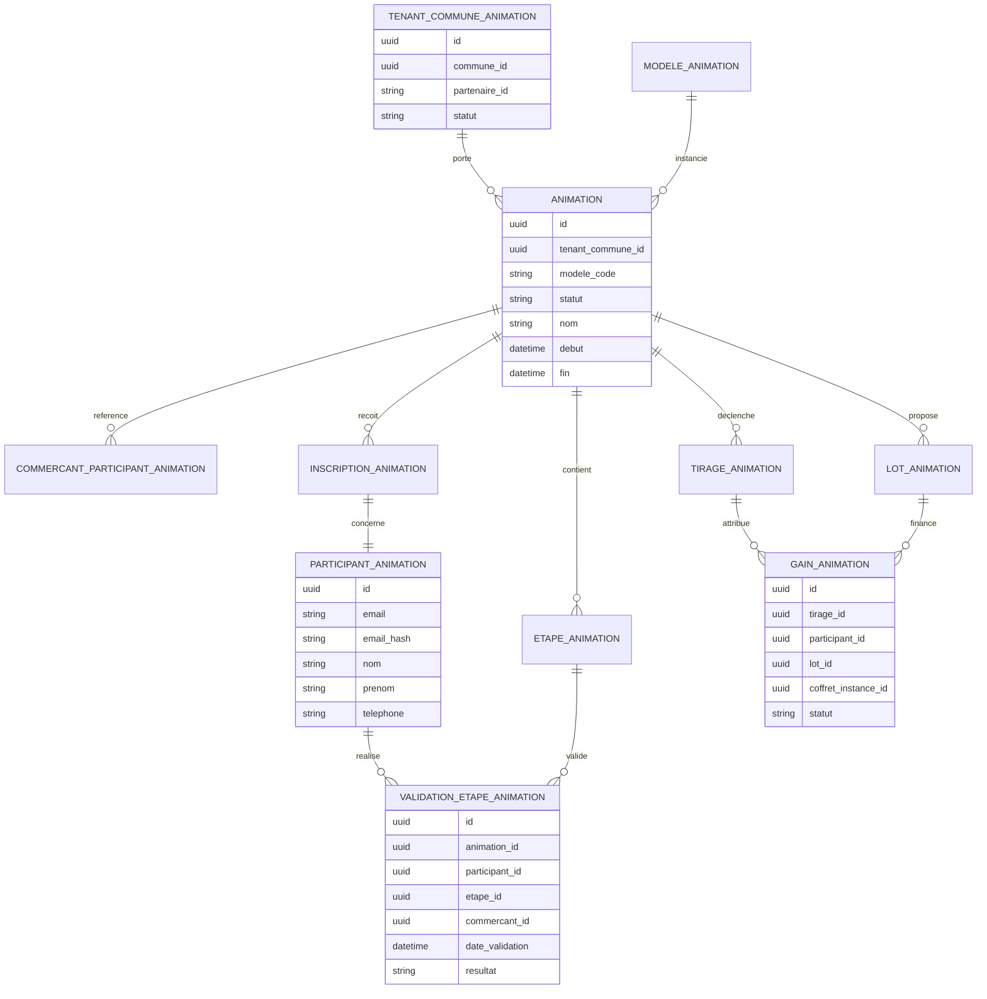
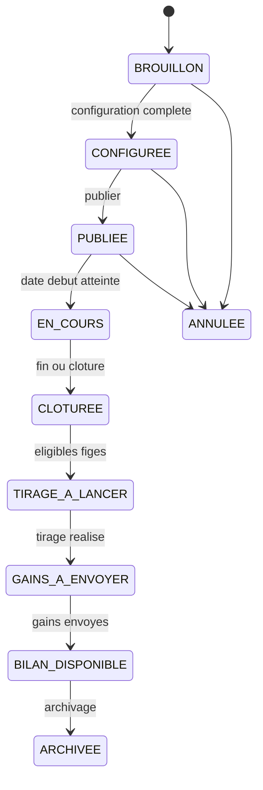
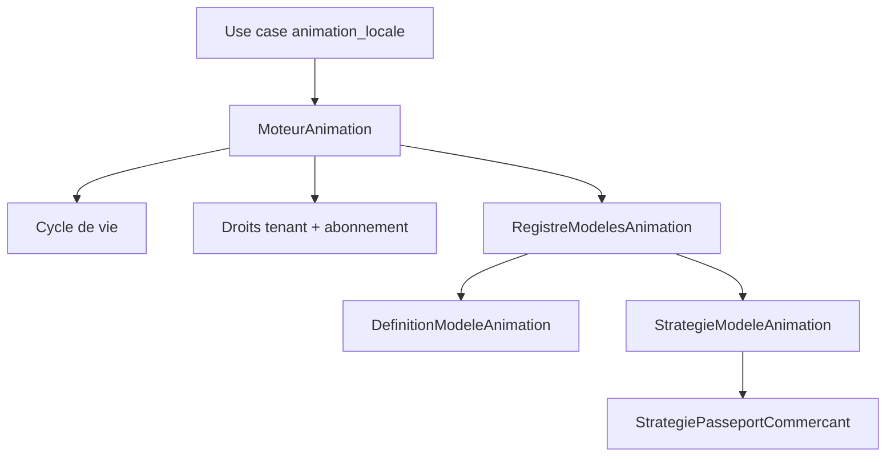
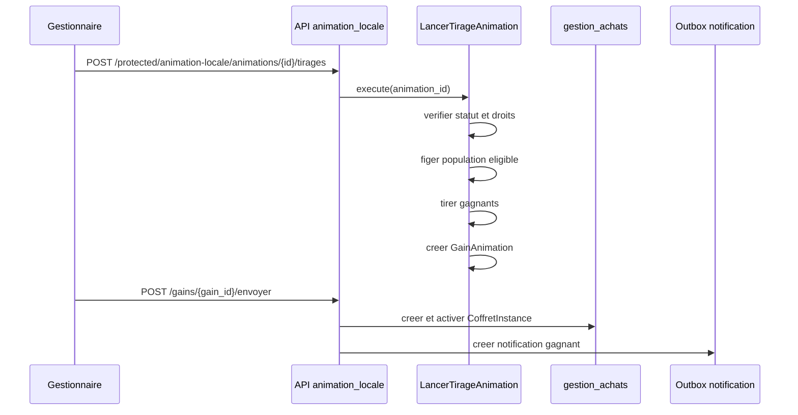

# DCT EPIC 41 - Animation locale

> Consolidation documentaire du 18 septembre 2026 : contributions Backend et Animation réunies. Le cadrage v0.2 et les étapes d’implémentation ci-dessous sont historiques ; la [roadmap](../../roadmap/terminees/epic-41-plateforme-animation-locale-mvp-backlog.md) conserve l’EPIC terminée. Le conflit des sources sur les flyers est signalé en section 18 et dans le registre commun.

## 1. Objet

Ce document initialise la conception technique detaillee de l'EPIC 41.

L'objectif est de definir le socle technique du domaine `animation_locale` pour livrer le MVP `Passeport commercant`, tout en conservant un moteur generique capable d'accueillir d'autres modeles d'animations locales.

Le document complete :

- le backlog produit [EPIC 41 - Plateforme d'animation locale MVP](../../roadmap/terminees/epic-41-plateforme-animation-locale-mvp-backlog.md) ;
- l'architecture applicative [EPIC 41 - Domaine animation locale](../../architecture/backend/epics/epic-41-animation-locale-architecture.md) ;
- l'expression de besoin UX [Plateforme partenaire Animation locale](../../produit/animation/epic-41-expression-besoin-plateforme-partenaire-figma.md) ;
- l'analyse API de la maquette [epic-41-animation-locale-analyse-api-maquette.md](analyse-api-maquette.md) ;
- les conventions transverses [API et OpenAPI](../../architecture/transverse/conventions-api-openapi.md).
- le dossier de [specifications techniques API EPIC 41](README.md).

## 2. Statut du document de cadrage

- Version : initialisation v0.2.
- Date : 2026-07-03.
- Statut : ecarts de la maquette partenaire V2 integres.
- Portee : backend `localeo-backend`, contrats API, domaine, application, persistance logique, integrations et traitements asynchrones.
- Hors portee : maquettes UI detaillees, implementation frontend, choix fin de design SQL, implementation concrete des classes.

## 3. Objectifs techniques

Le backend doit permettre :

- la creation et la gestion self-service d'animations par un partenaire ou organisateur habilite ;
- le rattachement strict d'une animation a un tenant commune ;
- la verification d'un droit d'acces plateforme derive d'un abonnement Stripe Billing actif ;
- l'inscription participant sans compte ;
- la generation d'un QR d'inscription et d'un QR participant ;
- la validation terrain par scan du QR participant depuis l'application commercant ;
- le calcul de progression et de qualification ;
- la cloture, le tirage au sort, l'envoi des gains et l'activation automatique des coffrets gagnes ;
- le suivi live, le workflow global, le dashboard de performance et le bilan ;
- les vues globales du portail partenaire : participants, validations, tirages, flyers, bilans et coffrets gagnes ;
- les projections d'eligibilite commercants et coffrets pendant la creation ;
- l'abonnement detaille, les notifications portail et le contexte utilisateur/tenant ;
- les exports CSV traces et purges automatiquement ;
- l'audit partenaire limite aux evenements publiables ;
- le raccordement au support partenaire ;
- la supervision Localeo sans faire de Localeo le createur nominal des animations ;
- la conservation, purge et anonymisation des donnees d'animation.

## 4. Principes de conception

- `animation_locale` est un domaine fonctionnel dedie.
- Les packages `app/domaine/animation_locale` et `app/application/animation_locale` portent la logique metier et applicative.
- La couche `app/infrastructure` reste transverse.
- Le moteur d'animation separe le socle generique des strategies propres a chaque modele.
- `PASSEPORT_COMMERCANT` est la premiere strategie activee au MVP.
- Le tenant MVP est la commune.
- Les communes, commercants, coffrets, achats, documents, notifications et acces ne sont pas dupliques.
- Les API suivent la convention `/{exposition}/animation-locale/...`.
- Les operations OpenAPI portent les tags `Animation locale` et le tag d'exposition `public`, `protected` ou `internal`.
- Les actions sensibles sont auditees et idempotentes quand elles peuvent etre rejouees.

## 5. Etat technique de depart

L'EPIC 40 a prepare l'enveloppe technique :

```text
app/domaine/animation_locale/
  entities/
  exceptions/
  repositories/

app/application/animation_locale/
  services/
  use_cases/
```

Le tag OpenAPI `Animation locale` est deja reserve dans `app/main.py`.

L'EPIC 41 doit maintenant remplir cette enveloppe avec les objets, ports, use cases, schemas API, modeles ORM, tests et traitements necessaires.

## 6. Decoupage cible

### 6.1 Domaine

```text
app/domaine/animation_locale/
  entities/
    animation.py
    modele_animation.py
    tenant_commune_animation.py
    participant_animation.py
    inscription_animation.py
    etape_animation.py
    validation_etape_animation.py
    lot_animation.py
    tirage_animation.py
    gain_animation.py
    politique_conservation_animation.py
  value_objects/
    periode_animation.py
    configuration_animation.py
    progression_animation.py
    qr_animation.py
    token_participant_animation.py
  repositories/
    animation_repository.py
    modele_animation_repository.py
    participant_animation_repository.py
    tirage_animation_repository.py
  exceptions/
    animation_exceptions.py
```

Les entites domaine portent les invariants metier :

- transition de statut ;
- rattachement tenant commune ;
- eligibilite a la publication ;
- unicite de validation ;
- qualification ;
- population eligible au tirage ;
- attribution d'un gain ;
- regles de conservation.

### 6.2 Application

```text
app/application/animation_locale/
  use_cases/
    consulter_contexte_portail_animation.py
    consulter_abonnement_animation.py
    lister_modeles_animation.py
    lister_commercants_eligibles_animation.py
    lister_coffrets_eligibles_animation.py
    creer_animation.py
    configurer_animation.py
    consulter_configuration_animation.py
    verifier_publication_animation.py
    publier_animation.py
    inscrire_participant.py
    lister_participants_animation.py
    lister_validations_animation.py
    valider_etape_animation.py
    cloturer_animation.py
    lister_tirages_animation.py
    lancer_tirage_animation.py
    lister_gains_animation.py
    envoyer_gain_animation.py
    consulter_workflow_animation.py
    consulter_live_animation.py
    consulter_dashboard_performance.py
    lister_vues_globales_portail.py
    generer_flyer_animation.py
    telecharger_flyer_animation.py
    exporter_bilan_animation.py
    exporter_validations_animation.py
    exporter_bilans_animation.py
    consulter_audit_animation.py
  services/
    moteur_animation.py
    registre_modeles_animation.py
    strategie_passeport_commercant.py
    service_eligibilite_animation.py
    projection_contexte_portail_animation.py
    projection_workflow_animation.py
    projection_live_animation.py
    projection_dashboard_animation.py
    projection_vues_globales_animation.py
    projection_audit_animation.py
    projection_abonnement_animation.py
    service_qr_animation.py
    service_export_animation.py
    service_conservation_animation.py
  ports/
    referencement_port.py
    commercialisation_port.py
    gestion_achats_port.py
    identite_acces_port.py
    abonnement_plateforme_port.py
    documentaire_port.py
    notification_port.py
    audit_port.py
    support_port.py
```

Les use cases transactionnels doivent respecter la regle Unit of Work du backend :

- ouverture via `uow_factory` ;
- modifications metier, audit et outbox dans la meme transaction ;
- effets externes executes via outbox ou orchestrations idempotentes.

Regles de decoupage :

- les commandes modifient l'etat metier et produisent audit/outbox dans la meme transaction ;
- les projections lisent des vues consolidees et appliquent les filtres tenant commune avant toute pagination ;
- les projections d'eligibilite masquent la logique inter-domaines et retournent une raison de non-eligibilite quand utile ;
- les exports reutilisent les memes filtres que les listes affichables, produisent une trace d'export et deleguent le stockage du fichier au domaine `documentaire` ou au service documentaire retenu ;
- le support partenaire est declenche depuis le portail mais reste porte par le domaine `support`.

### 6.3 API

```text
app/api/animation_locale_api.py
app/api/schemas_animation_locale.py
```

Le router peut etre separe en trois routers internes si le fichier devient trop volumineux :

```text
animation_locale_public_api.py
animation_locale_protected_api.py
animation_locale_internal_api.py
```

## 7. Modele logique



Les champs exacts, types SQL et index seront precises dans la phase de design SQL.

## 8. Objets metier a creer

| Objet | Role technique |
| --- | --- |
| `ModeleAnimation` | Catalogue des modeles disponibles. |
| `DefinitionModeleAnimation` | Capacites et contraintes configurables d'un modele. |
| `StrategieModeleAnimation` | Contrat d'execution des regles variables par modele. |
| `RegistreModelesAnimation` | Resolution d'une definition et d'une strategie par code modele. |
| `TenantCommuneAnimation` | Perimetre commune, partenaire et habilitations. |
| `DroitAccesPlateformeAnimation` | Droit consomme par le portail, derive d'un abonnement actif. |
| `ContextePortailAnimation` | Projection de demarrage du portail : tenant actif, habilitations, abonnement, notifications. |
| `AbonnementAnimation` | Projection UX de l'abonnement : formule, statut, dates, droits inclus et limitations. |
| `NotificationPortailAnimation` | Notification ou alerte visible par le gestionnaire dans le portail. |
| `Animation` | Agregat principal : statut, configuration, dates, workflow. |
| `GestionnaireAnimation` | Projection d'habilitation d'un utilisateur sur un tenant commune. |
| `ParticipantAnimation` | Personne inscrite, sans compte MVP. |
| `InscriptionAnimation` | Inscription d'un participant a une animation. |
| `QrInscriptionAnimation` | QR public menant vers la page contextualisee. |
| `QrParticipantAnimation` | QR personnel scanne par le commercant. |
| `EtapeAnimation` | Etape validable dans l'animation. |
| `ValidationEtapeAnimation` | Validation terrain d'une etape. |
| `LotAnimation` | Lot configure, obligatoirement coffret actif de la commune au MVP. |
| `TirageAnimation` | Tirage sur population eligible figee. |
| `GainAnimation` | Gain attribue et suivi jusqu'a envoi. |
| `FlyerCommunicationAnimation` | Metadonnees du flyer PDF stocke via documentaire. |
| `CommercantEligibleAnimation` | Projection d'un commercant selectionnable ou non pour une animation. |
| `CoffretEligibleAnimation` | Projection d'un coffret selectionnable ou non comme lot. |
| `ValidationPublicationAnimation` | Resultat de verification avant publication, avec blocages actionnables. |
| `VueWorkflowAnimation` | Projection de statut, blocages et prochaine action. |
| `VueLiveAnimation` | Projection live d'inscriptions, validations, alertes. |
| `DashboardPerformanceAnimation` | Projection agregee multi-animations. |
| `ListeParticipantsAnimation` | Vue globale ou par animation, masquee et paginee. |
| `ListeValidationsAnimation` | Vue globale ou par animation des validations et anomalies. |
| `ListeTiragesAnimation` | Vue globale des tirages, eligibles, gagnants et actions. |
| `ListeGainsAnimation` | Vue des gains et de leur etat d'envoi. |
| `ListeFlyersAnimation` | Vue globale des flyers et de leur statut. |
| `ListeBilansAnimation` | Vue globale de comparaison des bilans. |
| `AuditAnimation` | Projection des evenements publiables pour le partenaire. |
| `ExportAnimation` | Trace d'un export CSV, fichier rattache, filtres, expiration. |
| `BilanAnimation` | Synthese exportable de fin d'animation. |

## 9. Cycle de vie



Regles :

- `VueWorkflowAnimation` est une projection, pas un etat concurrent.
- Le statut persiste reste `CLOTUREE` pendant les phases post-cloture. La projection retourne `TIRAGE_A_LANCER` tant qu'aucun tirage n'est realise, `GAINS_A_ENVOYER` lorsqu'au moins un gain effectif reste a envoyer, puis `BILAN_DISPONIBLE` lorsque tous les gains effectifs sont `ENVOYE`.
- Les gains de suppleants encore en reserve et les gains `REMPLACE` sont exclus du controle de fin d'envoi ; le gain de remplacement devenu effectif doit, lui, etre `ENVOYE`.
- Toute transition sensible est auditee.
- Les transitions doivent verifier droits, tenant commune, abonnement et invariants metier.
- L'abonnement expire ne stoppe pas une animation publiee ou en cours ; il bloque les nouvelles actions payantes hors finalisation autorisee.

## 10. Moteur generique

Le moteur fournit les invariants communs :

- creation depuis un modele ;
- verification de configuration ;
- publication ;
- inscription ;
- validation d'etape ;
- calcul de progression ;
- qualification ;
- cloture ;
- tirage ;
- attribution et envoi de gains ;
- projections workflow/live/dashboard ;
- audit ;
- conservation.

Les points de variation sont delegues a `StrategieModeleAnimation` :

- validation de configuration ;
- construction des etapes ;
- controle d'une validation terrain ;
- calcul de progression ;
- qualification ;
- indicateurs specifiques.



## 11. Strategie MVP `PASSEPORT_COMMERCANT`

Regles specifiques :

- une etape correspond a une visite ou validation chez un commercant participant ;
- les commercants participants doivent appartenir a la commune de l'animation ;
- une validation est refusee hors periode ;
- une validation est refusee si le commercant n'est pas eligible ;
- une validation est refusee si l'etape a deja ete validee par le participant ;
- la suppression manuelle d'un participant exige `animation:supprimer_participant` et le tenant commune actif ;
- la suppression efface aussi les tokens et validations du participant, mais jamais une preuve de tirage ou un gain ;
- un participant appartenant a une population eligible figee ou reference par un gain ne peut plus etre supprime ;
- une validation peut etre refusee si elle est trop rapprochee d'une validation precedente ;
- la progression est calculee a partir du nombre de validations distinctes ;
- la qualification depend d'un seuil configure ;
- les lots sont uniquement des coffrets actifs de la commune.

## 12. API cible

### 12.1 Routes publiques

Routes sans compte participant, protegees par tokens, signatures ou controles anti-abus selon les cas :

- `GET /public/animation-locale/modeles`
- `GET /public/animation-locale/communes/{commune_id}/animations`
- `GET /public/animation-locale/animations/{animation_id}`
- `GET /public/animation-locale/animations/{animation_id}/inscription`
- `POST /public/animation-locale/animations/{animation_id}/inscriptions`
- `GET /public/animation-locale/participants/{participant_token}/animations`
- `GET /public/animation-locale/participants/{participant_token}/historique`
- `GET /public/animation-locale/participants/{participant_token}/animations/{animation_id}`
- `GET /public/animation-locale/participants/{participant_token}/animations/{animation_id}/qr`
- `GET /public/animation-locale/participants/{participant_token}/progression`

### 12.2 Routes protegees partenaire et commercant

Routes avec authentification applicative :

Contexte portail et droits :

- `GET /protected/animation-locale/contexte-portail`
- `GET /protected/animation-locale/tenant-communes`
- `GET /protected/animation-locale/droit-acces`
- `GET /protected/animation-locale/abonnement`
- `GET /protected/animation-locale/notifications`

Modeles et eligibilite de configuration :

- `GET /protected/animation-locale/modeles`
- `GET /protected/animation-locale/communes/{commune_id}/commercants-eligibles`
- `GET /protected/animation-locale/communes/{commune_id}/coffrets-eligibles`

Creation et cycle de vie :

- `GET /protected/animation-locale/communes/{commune_id}/animations`
- `POST /protected/animation-locale/animations`
- `GET /protected/animation-locale/animations/{animation_id}`
- `PATCH /protected/animation-locale/animations/{animation_id}`
- `GET /protected/animation-locale/animations/{animation_id}/configuration`
- `GET /protected/animation-locale/animations/{animation_id}/validation-publication`
- `POST /protected/animation-locale/animations/{animation_id}/publier`
- `POST /protected/animation-locale/animations/{animation_id}/cloturer`

Fiche animation et projections :

- `GET /protected/animation-locale/animations/{animation_id}/workflow`
- `GET /protected/animation-locale/animations/{animation_id}/live`
- `GET /protected/animation-locale/animations/{animation_id}/live/evenements`
- `GET /protected/animation-locale/animations/{animation_id}/actualites`
- `POST /protected/animation-locale/animations/{animation_id}/actualites`
- `GET /protected/animation-locale/animations/{animation_id}/actualites/{actualite_id}`
- `PATCH /protected/animation-locale/animations/{animation_id}/actualites/{actualite_id}`
- `POST /protected/animation-locale/animations/{animation_id}/actualites/{actualite_id}/publier`
- `POST /protected/animation-locale/animations/{animation_id}/actualites/{actualite_id}/masquer`
- `DELETE /protected/animation-locale/animations/{animation_id}/actualites/{actualite_id}` pour un brouillon uniquement
- `GET /protected/animation-locale/animations/{animation_id}/participants`
- `DELETE /protected/animation-locale/animations/{animation_id}/participants/{participant_id}`
- `GET /protected/animation-locale/animations/{animation_id}/participants/export.csv`
- `GET /protected/animation-locale/animations/{animation_id}/validations`
- `POST /protected/animation-locale/animations/{animation_id}/validations`
- `GET /protected/animation-locale/animations/{animation_id}/tirages`
- `POST /protected/animation-locale/animations/{animation_id}/tirages`
- `GET /protected/animation-locale/animations/{animation_id}/gains`
- `POST /protected/animation-locale/animations/{animation_id}/gains/{gain_id}/envoyer`
- `POST /protected/animation-locale/animations/{animation_id}/gains/{gain_id}/remplacer`
- `POST /protected/animation-locale/animations/{animation_id}/gains/{gain_id}/relancer`
- `GET /protected/animation-locale/animations/{animation_id}/gains/coffrets/consommation`
- `GET /protected/animation-locale/animations/{animation_id}/gains/{gain_id}/coffret-consommation`
- `GET /protected/animation-locale/animations/{animation_id}/flyer`
- `GET /protected/animation-locale/animations/{animation_id}/flyer/preview`
- `GET /protected/animation-locale/animations/{animation_id}/flyer/download`
- `POST /protected/animation-locale/animations/{animation_id}/flyer/regenerer`
- `GET /protected/animation-locale/animations/{animation_id}/bilan`
- `GET /protected/animation-locale/animations/{animation_id}/bilan/export.csv`
- `GET /protected/animation-locale/animations/{animation_id}/bilan/export.pdf` en P2
- `GET /protected/animation-locale/animations/{animation_id}/audit`

Vues globales du portail partenaire :

- `GET /protected/animation-locale/dashboard-performance`
- `GET /protected/animation-locale/participants`
- `GET /protected/animation-locale/validations`
- `GET /protected/animation-locale/validations/export.csv`
- `GET /protected/animation-locale/tirages`
- `GET /protected/animation-locale/gains/coffrets/consommation`
- `GET /protected/animation-locale/flyers`
- `GET /protected/animation-locale/bilans`
- `GET /protected/animation-locale/bilans/export.csv`
- `POST /protected/animation-locale/notifications/lire-tout` en P2
- `POST /protected/animation-locale/animations/archiver-lot` en P2

Routes support adjacentes, portees par le domaine `support` mais appelees depuis le portail partenaire :

- `GET /protected/support/animation-locale/ressources`
- `POST /protected/support/animation-locale/messages`

### 12.3 Routes internes Localeo

Routes reservees a l'exploitation et a la supervision :

- `GET /internal/animation-locale/live`
- `GET /internal/animation-locale/communes/{commune_id}/live`
- `GET /internal/animation-locale/dashboard-performance`
- `GET /internal/animation-locale/animations/{animation_id}/workflow`
- `GET /internal/animation-locale/communes/{commune_id}/droit-acces`
- `GET /internal/animation-locale/live/evenements`
- `GET /internal/animation-locale/live/alertes`
- `GET /internal/animation-locale/animations`
- `POST /internal/animation-locale/animations/{animation_id}/cloturer`
- `POST /internal/animation-locale/animations/{animation_id}/tirages`
- `GET /internal/animation-locale/animations/{animation_id}/gains`
- `GET /internal/animation-locale/animations/{animation_id}/gains/coffrets/consommation`

### 12.3.1 Indicateurs economiques et d'usage des gains

Le dashboard de performance, le bilan d'une animation et la Vision 360 exposent le meme objet `consommation_financiere`. Il contient le montant deja reinjecte, le potentiel restant, les coffrets entierement non consommes proches expiration, le delai de premiere consommation, les commercants participants effectifs sans validation et la repartition du montant reinjecte par commercant.

Les montants sont des entiers en centimes avec une devise explicite. Le parametre `horizon_expiration_jours`, borne de 1 a 365 et valant 30 par defaut, est retourne avec le compteur. Les definitions fonctionnelles, exclusions et regles de compatibilite sont centralisees dans [Indicateurs economiques et d'usage des gains](indicateurs-economiques.md).

### 12.4 Routes admin API

- `GET /admin/api/animation-locale/animations`
- `GET /admin/api/animation-locale/animations/{animation_id}`
- `POST /admin/api/animation-locale/animations/{animation_id}/correction`

Les routes admin API sont a limiter aux besoins reels du back-office SQLAdmin.

## 13. Schemas API principaux

Schemas d'entree :

- `CreerAnimationRequest`
- `ConfigurerAnimationRequest`
- `PublierAnimationRequest`
- `InscrireParticipantRequest`
- `ValiderEtapeAnimationRequest`
- `CloturerAnimationRequest`
- `LancerTirageAnimationRequest`
- `EnvoyerGainAnimationRequest`
- `RegenererFlyerAnimationRequest`
- `CreerMessageSupportAnimationRequest`
- `CreerActualiteAnimationRequest`
- `ModifierActualiteAnimationRequest`
- `ExporterAnimationQuery`

Schemas de sortie :

- `ContextePortailAnimationResponse`
- `NotificationPortailAnimationResponse`
- `ModeleAnimationResponse`
- `ModeleAnimationContextualiseResponse`
- `CommercantEligibleAnimationResponse`
- `CoffretEligibleAnimationResponse`
- `AbonnementAnimationResponse`
- `AnimationResponse`
- `AnimationListItemResponse`
- `ConfigurationAnimationResponse`
- `ValidationPublicationAnimationResponse`
- `VueWorkflowAnimationResponse`
- `VueLiveAnimationResponse`
- `ActualiteAnimationResponse`
- `ActualiteAnimationListResponse`
- `DashboardPerformanceAnimationResponse`
- `ParticipantAnimationResponse`
- `ParticipantAnimationListResponse`
- `ValidationAnimationResponse`
- `ValidationAnimationListResponse`
- `ProgressionAnimationResponse`
- `QrParticipantResponse`
- `TirageAnimationResponse`
- `TirageAnimationListResponse`
- `GainAnimationResponse`
- `GainAnimationListResponse`
- `ConsommationCoffretGainResponse`
- `BilanAnimationResponse`
- `BilanAnimationListResponse`
- `FlyerAnimationResponse`
- `FlyerAnimationListResponse`
- `AuditAnimationResponse`
- `ExportAnimationResponse`
- `RessourceSupportAnimationResponse`

Regles :

- les vues agregees ne retournent pas de donnees personnelles participant ;
- `ParticipantAnimationResponse` expose une `reference` pseudonymisee stable dans l'animation, par exemple `PART-0247`, utilisee comme identifiant d'affichage des tableaux ;
- les donnees nominatives sont masquees par defaut ;
- les endpoints publics tokenises retournent uniquement le perimetre du token ;
- les schemas exposent les raisons de blocage actionnables quand une action est impossible ;
- les listes globales du portail partenaire exposent uniquement les donnees du tenant commune actif ou des tenants explicitement habilites ;
- les exports CSV reprennent les filtres appliques a l'ecran, creent une trace d'export et respectent la politique de suppression des exports.

Parametres transverses a standardiser :

- `commune_id` : filtre tenant commune, obligatoire pour une vue mono-tenant quand aucun tenant actif n'est implicite ;
- `animation_id` : identifiant d'animation ;
- `periode_debut`, `periode_fin` : fenetre temporelle inclusive selon le fuseau applicatif ;
- `modele_code` : code de modele, par exemple `PASSEPORT_COMMERCANT` ;
- `statut` : statut d'animation ou statut de ressource selon la route ;
- `alerte` : code d'alerte operationnelle ;
- `resultat` : resultat de validation ou de traitement ;
- `commercant_id` : filtre commercant ;
- `qualifie`, `termine` : filtres booleens participant ;
- `q` : recherche texte limitee aux champs non sensibles ou references masquees ;
- `periode=7j|30j|12m` : raccourci de plage pour le dashboard, les dates explicites restant prioritaires ;
- `page`, `page_size` : pagination bornee ;
- `sort` : tri explicite parmi une liste blanche.

## 14. Persistance logique

Tables candidates :

- `animation_tenant_communes`
- `animation_modeles`
- `animation_definitions_modeles`
- `animations`
- `animation_commercants_participants`
- `animation_participants`
- `animation_inscriptions`
- `animation_etapes`
- `animation_validations_etapes`
- `animation_lots`
- `animation_tirages`
- `animation_gains`
- `animation_notifications`
- `animation_flyers`
- `animation_evenements`
- `animation_exports`
- `animation_export_fichiers` si le suivi de fichier n'est pas porte directement par `documentaire`
- aucune table `animation_actualites` : les publications reutilisent `activites_locales` avec un `animation_id` relationnel

Index a prevoir :

- `animations(tenant_commune_id, statut, date_debut, date_fin)` ;
- `animations(tenant_commune_id, modele_code, statut)` pour les listes et dashboards ;
- `animation_inscriptions(animation_id, participant_id)` avec unicite ;
- `animation_inscriptions(animation_id, date_inscription)` pour les listes participants ;
- `animation_participants(email_hash)` ;
- `animation_validations_etapes(animation_id, participant_id, etape_id)` avec unicite anti-doublon ;
- `animation_validations_etapes(animation_id, commercant_id, date_validation)` pour les vues live ;
- `animation_validations_etapes(animation_id, resultat, date_validation)` pour les filtres d'anomalies ;
- `animation_gains(animation_id, participant_id, lot_id)` ;
- `animation_gains(animation_id, statut)` pour les vues tirages et gains ;
- `animation_evenements(animation_id, created_at)` ;
- `animation_evenements(animation_id, visibilite, created_at)` pour l'audit partenaire ;
- `animation_exports(expires_at)` ;
- `activites_locales(animation_id, niveau_visibilite, date_publication)` pour la fiche Animation et le feed public.

Au MVP, les champs PII participant ne sont pas chiffres au niveau applicatif. Ils sont proteges par les controles d'acces, le masquage des projections, l'audit, la securite de l'infrastructure et les politiques de conservation. Une empreinte non reversible de l'email normalise peut etre conservee pour l'unicite et la recherche exacte, sans remplacer la donnee fonctionnelle. Cette exception doit etre reevaluee avant production.

Regles de persistance des projections :

- les vues workflow, live, dashboard et vues globales sont calculees a partir des tables metier et de projections de lecture ; elles ne doivent pas creer un second etat metier concurrent ;
- les compteurs couteux peuvent etre materialises uniquement si le besoin de performance est demontre ;
- les exports sont persistants comme traces fonctionnelles, mais le fichier exporte est stocke hors table metier via `documentaire` ou le stockage documentaire retenu ;
- l'abonnement detaille est une projection d'un domaine ou service `abonnements_plateforme`; `animation_locale` ne stocke pas les donnees Stripe Billing comme source de verite.

## 15. Integrations inter-domaines

| Domaine consomme | Usage | Regle |
| --- | --- | --- |
| `referencement` | Communes et commercants participants. | Reference par identifiant, pas de duplication. |
| `commercialisation` | Coffrets disponibles comme lots. | Filtrer les coffrets actifs de la commune et exposer les raisons de non-eligibilite. |
| `gestion_achats` | Creation et activation des `CoffretInstance` gagnees, suivi consommation. | `animation_locale` ne porte pas la consommation. |
| `identite_acces` | Authentification, roles, tokens, habilitations, push participant. | Pas de logique d'auth dans `animation_locale`. |
| `documentaire` | Stockage du flyer PDF, exports CSV et metadonnees. | Pas de binaire PDF ou CSV stocke directement dans `animation_locale`. |
| `exploitation` | Audit operationnel, activite live, application commercant et publications `ACTUALITE_ANIMATION`. | `animation_locale` delegue l'edition a un port ; `activites_locales` reste la source de verite editoriale avec un rattachement relationnel a l'animation. |
| `support` | Ressources support et messages partenaire/participant. | Reference vers animation, participant ou gain si necessaire ; les messages restent proprietes du support. |
| `abonnements_plateforme` | Droit d'acces et abonnement detaille derive de Stripe Billing. | Domaine transverse dedie, consomme via port applicatif ; aucune source de verite Stripe dans `animation_locale`. |

## 16. QR, tokens et securite

QR d'inscription :

- public ;
- rattache a une animation publiee ou en cours ;
- contient une URL d'inscription contextualisee ;
- ne contient pas de donnees personnelles ;
- peut etre regenere via le flyer.

QR participant :

- personnel ;
- signe et non devinable ;
- rattache a une inscription ;
- scanne par l'application commercant ;
- revocable ;
- expire au plus tard fin d'animation + 3 mois.

Controles :

- signature HMAC ou token aleatoire stocke hash en base ;
- limitation de debit sur inscription et consultation tokenisee ;
- refus si animation hors periode, annulee ou archivee ;
- audit des validations et scans invalides significatifs.

## 17. Notifications

Notifications MVP :

- email d'inscription avec informations animation et QR participant ;
- email gagnant ;
- push gagnant via application participant ;
- eventuels emails d'erreur ou reprise operationnelle a cadrer ;
- inbox et WebPush Localeo Live d'une actualite d'animation lorsque la preference `ANIMATION` est activee.

### Actualites d'animation

- le type de feed canonique est `ACTUALITE_ANIMATION` ;
- la ville et le deep link sont derives de l'animation, jamais fournis comme source de verite par le client ;
- une publication effective exige une animation `PUBLIEE`, `EN_COURS` ou `CLOTUREE`, non archivee ;
- la cle fonctionnelle de notification est `ACTUALITE_ANIMATION:{actualite_id}` ;
- les installations sont eligibles lorsqu'elles suivent la ville ou une participation a l'animation et que la categorie `ANIMATION` est activee ;
- seuls les brouillons peuvent etre supprimes physiquement ; une publication est masquee ;
- la gestion exige `animation:gerer_actualites`, le tenant de l'animation et un audit de chaque transition.

Regles techniques :

- creation d'une outbox dans la transaction metier ;
- envoi asynchrone par batch ou worker existant ;
- idempotence par cle fonctionnelle ;
- trace de statut provider ;
- reprise possible en cas d'echec temporaire.

## 18. Flyer PDF

Les règles de cycle de vie ci-dessous proviennent de la source Backend. La variante DCT Animation indiquait une génération dès la création ou la configuration, mais limitait l’aperçu à une projection HTML/JSON ou une URL de preview non durable. Son registre ARB-22/28/48 interdisait pourtant tout aperçu avant publication. Ces formulations distinctes sont conservées ici et dans le [registre consolidé](registre-arbitrages.md#divergence-documentaire-sur-les-flyers), en lien avec ANI-PART-ARB-11 ; aucun choix produit nouveau n’est déduit de cette fusion.

Un apercu prive peut etre genere des l'etat `BROUILLON` ou `CONFIGUREE`, depuis la configuration courante.
Le flyer final est genere pendant ou apres la publication, depuis la configuration publiee et la liste
figee des commercants participants. La publication promeut et remplace l'eventuel apercu provisoire.

La direction artistique validee, les formats, les regles de composition et les criteres de recette sont
decrits dans [Epic 41 - Direction artistique des flyers Animation](flyer-direction-artistique.md).

Contenu minimal :

- logo officiel Localeo Animation ;
- nom et description de l'animation ;
- commune ;
- dates ;
- organisateur ;
- accroche personnalisee ;
- QR d'inscription ;
- URL publique d'inscription ;
- mentions utiles.

Regles :

- le gabarit suit la charte `LOCALEO_ANIMATION_MARKETPLACE_V4` décrite dans la spécification artistique ;
  elle remplace explicitement la charte V3 issue des emails, en conservant une zone sociale sûre `4:5` ;
- le moteur embarque le logo horizontal et la photographie editoriale de repli issus de la direction
  artistique validee ; un visuel principal valide de l'animation reste prioritaire ;
- le coffret reste présenté comme un avantage digital avec un libellé explicite, sans colis ou boîte
  physique ; la composition V4 remplace l’ancienne illustration de carte-cadeau dans un smartphone ;
- le parcours Passeport indique que l'inscription s'effectue depuis le QR public du flyer, puis que le
  participant doit faire scanner son QR personnel chez les commercants participants pour valider ses passages ;
- le PDF A4 et son apercu PNG sont obligatoires ; les declinaisons `1080 x 1350`, `1080 x 1920` et presse
  monochrome sont produites par le meme moteur sans dupliquer la source de verite ;
- le QR mesure au moins 35 mm sur A4, conserve sa zone de silence et est accompagne d'une URL de secours ;
- le PDF et ses metadonnees sont stockes via `documentaire` ou le service documentaire retenu ;
- `animation_locale` conserve seulement la reference documentaire ;
- avant publication, l'apercu est un document `BROUILLON`, limite au scope `PORTAIL_ANIMATION` et inaccessible
  au catalogue public comme a l'application commercant ;
- a la publication, PDF et PNG passent au statut `PUBLIE` et gagnent le scope `APPLICATION_COMMERCANT` ;
- le telechargement du PDF passe par le backend afin d'appliquer droits, audit et rattachement tenant ; il peut repondre par streaming ou par redirection `302` vers une URL signee temporaire ;
- les URL du PDF et du PNG portent la version documentaire et leurs reponses utilisent `Cache-Control: private, no-store` afin qu'une regeneration ne reutilise jamais un ancien rendu ;
- la regeneration remplace le support courant sans exposer de notion de version au gestionnaire ;
- chaque generation ou regeneration est auditee.

## 19. Tirage et gains

Flux :



Regles :

- le tirage est possible uniquement apres fin ou cloture ;
- la population eligible est figee avant tirage ;
- un tirage rejoue avec la meme cle d'idempotence ne cree pas de doublon ;
- l'envoi du gain cree et active automatiquement la `CoffretInstance` ;
- les lots sont obligatoirement des coffrets actifs de la commune ;
- le suivi de consommation lit les donnees `gestion_achats`.

## 20. Projections

### 20.1 `VueWorkflowAnimation`

Doit retourner :

- statut courant ;
- etapes terminees ;
- etapes restantes ;
- action suivante recommandee ;
- actions disponibles ;
- blocages ;
- droits de l'utilisateur courant ;
- etat d'abonnement utile.

### 20.2 `VueLiveAnimation`

Doit retourner :

- inscrits total ;
- participants ayant termine ;
- validations recentes ;
- participants qualifies ;
- alertes ;
- incidents ;
- action possible.

### 20.3 `DashboardPerformanceAnimation`

Doit retourner :

- animations publiees, en cours, terminees ;
- inscrits ;
- participants ayant termine ;
- taux de completion ;
- qualifies ;
- coffrets envoyes ;
- taux de consommation ;
- comparaison des animations ;
- top commercants par validations ;
- alertes de sous-performance.

Les donnees personnelles sont exclues de cette projection.

### 20.4 Vues globales portail

Les vues globales reprennent les memes objets que la fiche animation, mais sur un perimetre multi-animations limite aux tenants habilites.

`ListeParticipantsAnimation` doit retourner :

- reference participant masquee ;
- animation ;
- date d'inscription ;
- nombre de validations ;
- statut termine ;
- statut qualifie ;
- indicateur de coffret gagne si applicable.

`ListeValidationsAnimation` doit retourner :

- date ;
- animation ;
- commercant ;
- reference participant masquee ;
- resultat ;
- anomalie ou motif de refus si publiable.

`ListeTiragesAnimation` doit retourner :

- animation ;
- statut ;
- population eligible ;
- nombre de lots ;
- tirage realise ou non ;
- nombre de gagnants ;
- action disponible.

`ListeFlyersAnimation` doit retourner :

- animation ;
- commune ;
- date de generation ;
- statut `A_JOUR` ou `A_REGENERER` ;
- URL publique d'inscription ;
- action de telechargement ou regeneration.

`ListeBilansAnimation` doit retourner :

- animation ;
- periode ;
- statut ;
- inscrits ;
- participants termines ;
- taux de completion ;
- qualifies ;
- validations ;
- coffrets envoyes.

`ConsommationCoffretGain` global doit retourner :

- reference coffret gagne ;
- reference gagnant masquee ;
- animation ;
- statut de consommation ;
- date d'activation ;
- date d'expiration ;
- prestations consommees et restantes ;
- alerte de sous-consommation si applicable.

### 20.5 Eligibilite creation

Les endpoints d'eligibilite protegent le frontend de la logique inter-domaines.

`CommercantEligibleAnimation` doit retourner :

- `commercant_id` ;
- nom public ;
- adresse courte ;
- statut ;
- indicateur `eligible` ;
- `non_eligibility_reason` si non eligible.

`CoffretEligibleAnimation` doit retourner :

- `coffret_id` ;
- nom ;
- commune ;
- statut ;
- date d'expiration ou duree utile ;
- indicateur `eligible` ;
- `non_eligibility_reason` si non eligible.

Regles MVP :

- un commercant eligible appartient a la commune de l'animation et est actif ;
- un coffret eligible est actif, vendable ou utilisable comme lot, et appartient a la commune de l'animation ;
- une raison de non-eligibilite doit etre fonctionnelle et actionnable.

### 20.6 Contexte, abonnement et notifications portail

`ContextePortailAnimation` doit retourner :

- utilisateur courant ;
- partenaire courant ;
- tenant commune actif ;
- liste des tenants habilites ;
- abonnement synthetique ;
- droits effectifs ;
- notifications et alertes prioritaires.

`AbonnementAnimation` doit retourner :

- formule ;
- statut ;
- partenaire ;
- commune couverte ;
- date de debut ;
- date de renouvellement ou fin ;
- mode de facturation ;
- droits inclus ;
- limitations ;
- actions bloquees et motifs.

`NotificationPortailAnimation` doit rester une notification de pilotage, distincte de l'outbox d'envoi email/push. Elle peut etre derivee d'alertes d'animation, d'abonnement ou d'actions en attente.

### 20.7 Audit partenaire

`AuditAnimation` expose uniquement les evenements publiables au gestionnaire :

- creation ;
- configuration completee ;
- publication ;
- flyer genere ou regenere ;
- cloture ;
- tirage lance ;
- gain attribue ;
- gain envoye ;
- bilan exporte.

Ne doivent pas etre exposes dans l'audit partenaire :

- details de securite ;
- corrections internes non publiables ;
- donnees nominatives participant ;
- erreurs techniques fournisseur ;
- secrets, tokens ou payloads bruts.

### 20.8 Exports CSV

Les exports CSV sont des ressources techniques tracees.

Chaque export doit porter :

- type d'export ;
- tenant commune ;
- animation si applicable ;
- utilisateur demandeur ;
- filtres appliques ;
- date de generation ;
- date d'expiration ;
- statut ;
- reference documentaire ou stockage.

Les exports MVP attendus :

- validations ;
- bilan d'une animation ;
- bilans globaux.

## 21. Audit et evenements

Evenements a produire :

- `ANIMATION_CREEE`
- `ANIMATION_CONFIGUREE`
- `ANIMATION_PUBLIEE`
- `ANIMATION_CLOTUREE`
- `PARTICIPANT_INSCRIT`
- `QR_PARTICIPANT_GENERE`
- `VALIDATION_ETAPE_ACCEPTEE`
- `VALIDATION_ETAPE_REFUSEE`
- `PARTICIPANT_QUALIFIE`
- `TIRAGE_LANCE`
- `GAIN_ATTRIBUE`
- `GAIN_ENVOYE`
- `COFFRET_GAIN_ACTIVE`
- `NOTIFICATION_GAIN_ENVOYEE`
- `FLYER_GENERE`
- `FLYER_REGENERE`
- `BILAN_EXPORTE`
- `VALIDATIONS_EXPORTEES`
- `BILANS_GLOBAUX_EXPORTES`
- `EXPORT_CSV_SUPPRIME`
- `MESSAGE_SUPPORT_ANIMATION_CREE`
- `ABONNEMENT_ANIMATION_CONSULTE`
- `CORRECTION_EXCEPTIONNELLE_LOCALEO`

Chaque evenement sensible doit porter :

- acteur ;
- source ;
- animation ;
- tenant commune ;
- correlation id ;
- ancienne valeur et nouvelle valeur quand applicable ;
- motif si obligatoire ;
- date.

## 22. Conservation et anonymisation

Regles cible :

- donnees nominatives participant : fin d'animation + 12 mois, puis anonymisation ;
- QR et tokens participant : fin d'animation + 3 mois maximum ;
- validations detaillees : 24 mois, puis anonymisation des references nominatives ;
- tirages et gains : 5 ans avec participant pseudonymise si l'identite nominative n'est plus necessaire ;
- exports CSV : suppression automatique apres 90 jours maximum ;
- traces email/push : 12 mois, puis purge ou anonymisation ;
- audit securite : 24 mois.

Traitements a prevoir :

- batch de purge des tokens expires ;
- batch d'anonymisation participant ;
- batch de suppression des exports ;
- controle d'idempotence des batchs.

## 23. Tests attendus

Tests domaine :

- transitions de statut ;
- configuration invalide ;
- publication impossible ;
- validation hors periode ;
- validation doublon ;
- qualification ;
- tirage sur population figee ;
- attribution de gain.

Tests application :

- creation animation ;
- inscription participant ;
- generation QR ;
- validation commercant ;
- cloture ;
- lancement tirage ;
- envoi gain et activation coffret ;
- projections workflow/live/dashboard ;
- projections globales portail ;
- eligibilite commercants et coffrets ;
- abonnement detaille et contexte portail ;
- audit partenaire ;
- exports CSV et suppression d'exports expires.

Tests API :

- tags OpenAPI ;
- prefixes `/public`, `/protected`, `/internal` ;
- controles d'acces ;
- masquage des donnees personnelles ;
- pagination, filtres et tris des listes portail ;
- vues globales portail : participants, validations, tirages, flyers, bilans, coffrets gagnes ;
- exports CSV et traces d'export ;
- erreurs fonctionnelles explicites.

Tests integration :

- port `referencement` ;
- port `commercialisation` ;
- port `gestion_achats` ;
- port `documentaire` ;
- outbox notification ;
- audit.

## 24. Sequence d'implementation recommandee

1. Finaliser les objets domaine et value objects.
2. Ajouter les repositories et modeles ORM.
3. Implementer le registre de modeles et la strategie `PASSEPORT_COMMERCANT`.
4. Implementer creation, configuration et publication.
5. Implementer inscription, QR et email.
6. Implementer validation terrain depuis application commercant.
7. Implementer workflow, live et dashboard.
8. Implementer les vues globales du portail partenaire : participants, validations, tirages, flyers, bilans et coffrets gagnes.
9. Implementer lots, tirage, gains et activation coffret.
10. Implementer flyer PDF via documentaire.
11. Implementer exports CSV, traces d'export et suppression des exports expires.
12. Implementer conservation, purge et anonymisation.
13. Ajouter routes API, schemas OpenAPI et tests.
14. Ajouter vues back-office ou endpoints de supervision Localeo.

## 25. Decisions techniques validees

- Session Animation serveur distincte, token opaque et expiration absolue de 8 heures, sans renouvellement silencieux au MVP.
- Routes de connexion, validation et deconnexion portees par `identite_acces`.
- Tables dediees aux partenaires, gestionnaires et habilitations par commune ; controle des droits depuis la source persistante.
- Persistance relationnelle des invariants Animation ; JSON reserve aux parametres variables, snapshots et audits.
- Verrouillage en ecriture de l'animation avant cloture et snapshot eligible dans la meme transaction.
- Domaine `abonnements_plateforme` minimal : Offre, Abonnement, DroitAccesPlateforme et evenements Stripe idempotents.
- Tokens QR aleatoires CSPRNG de 256 bits minimum, Base64URL, hashes en base, revocables et sans PII.
- Aucun chiffrement applicatif des PII participant au MVP, conformement a l'amendement valide de `ARB-46`. Maintenir controle d'acces, masquage, audit, secrets d'infrastructure et conservation ; reevaluation securite/RGPD obligatoire avant production.
- Routage QR par chemins distincts ; identite commercant issue exclusivement de la session.
- Flyer genere par ReportLab, gabarit/polices versionnes, PDF et apercu PNG asynchrones stockes dans `documentaire`.
- Table `animation_operations`, execution par BatchRunner/outbox, cinq tentatives maximum avec backoff exponentiel et conservation 30 jours.
- Notifications derivees d'evenements metier par `exploitation`, avec statut et relance propres a chaque canal.
- Upload DAM protege : PNG, JPEG, WebP, 5 Mo maximum, validation MIME/contenu et quotas partenaire.
- Support partenaire textuel rattache facultativement a une animation ; pieces jointes hors MVP.
- Activation administrative auditee des abonnements disponible avant Stripe ; cles et secret de webhook requis uniquement pour le raccordement Stripe test.
- Gabarits email Animation versionnes, avec expediteur, adresse de reponse et mentions configurables ; validation editoriale avant recette metier.
- Historique graphique : la source Backend décrivait la charte V3 validée le 28 août 2026, avec logo officiel,
  palette des emails, composition éditoriale, A4 et zone sociale sûre. La variante Animation autorisait des
  assets ReportLab temporaires et une charte partenaire configurable avant recette. La spécification
  artistique les remplace explicitement par Marketplace V4 ; la charte versionnée et le rendu de référence
  restent des critères de non-régression visuelle.
- URLs publiques completes fournies par `LOCALEO_ANIMATION_PUBLIC_URL_TEMPLATE` et `LOCALEO_ANIMATION_PARTICIPANT_URL_TEMPLATE` ; HTTPS definitif obligatoire avant recette de bout en bout.
- Integration QR de l'application commercant livree comme lot coordonne dans sa premiere version, avec chemins distincts et erreurs explicites, sans retrocompatibilite.
- Le parcours, les écrans, contrats, règles de sécurité, lots et critères de recette de ce lot sont détaillés dans [la spécification application commerçant](application-commercant.md).
- Durees RGPD configurables et tests automatises de purge ; validation juridique tracee obligatoire avant production.
- Abstraction `documentaire` avec stockage local en developpement et stockage objet prive en environnement heberge ; acces par route protegee ou URL signee courte.
- Actualites Animation portees par `activites_locales.animation_id`, sans second moteur editorial ; type `ACTUALITE_ANIMATION`, filtre Live `ANIMATION` et diffusion idempotente selon la preference du meme nom.

## 26. Ecarts maquette traites

| Ecart issu de l'analyse | Traitement dans ce DCT |
| --- | --- |
| Vues globales partenaire non couvertes. | Routes globales, projections `Liste*`, tests API et sequence d'implementation. |
| Lectures participants, validations, tirages et gains manquantes. | Routes de lecture par animation et schemas `*ListResponse`. |
| Eligibilite commercants et coffrets non explicite. | Endpoints `commercants-eligibles`, `coffrets-eligibles` et service `service_eligibilite_animation`. |
| Abonnement plus riche que `droit-acces`. | Route `abonnement`, projection `AbonnementAnimation` et port `abonnement_plateforme_port`. |
| Exports CSV absents. | Routes d'export, schema `ExportAnimationResponse`, table `animation_exports`, traces et purge. |
| Audit visible partenaire absent. | Route `audit`, projection `AuditAnimation`, visibilite d'evenements et exclusions de donnees sensibles. |
| Support partenaire non raccorde. | Routes `protected/support/animation-locale/*` et port `support_port`, en gardant la propriete au domaine `support`. |
| Contexte portail absent. | Route `contexte-portail` et projection `ContextePortailAnimation`. |
| Notifications portail absentes. | Route `notifications` et projection `NotificationPortailAnimation`. |
| Actualites d'animation absentes. | Onglet et CRUD protege par animation, rattachement `activites_locales.animation_id`, projection Live `ACTUALITE_ANIMATION` et notification de categorie `ANIMATION`. |
| Liens directs depuis alertes, notifications et workflow. | Ajout de `animation_id`, `action_cible` et `onglet_cible` aux projections concernees, sans persister un etat de navigation frontend. |
| Cloture interactive et irreversible. | Commande atomique : transition d'etat, fermeture des inscriptions/validations et gel de la population eligible ; reponse avec nouvel etat et prochaine action. |
| Confirmation de publication et diffusion du QR. | Reponse de publication enrichie et suivi du traitement de generation/diffusion via outbox, avec succes partiel explicite si asynchrone. |
| Retours d'action explicites. | Les commandes de flyer, export et gain retournent identifiant de ressource, statut de traitement et erreur metier exploitable par le portail. |
