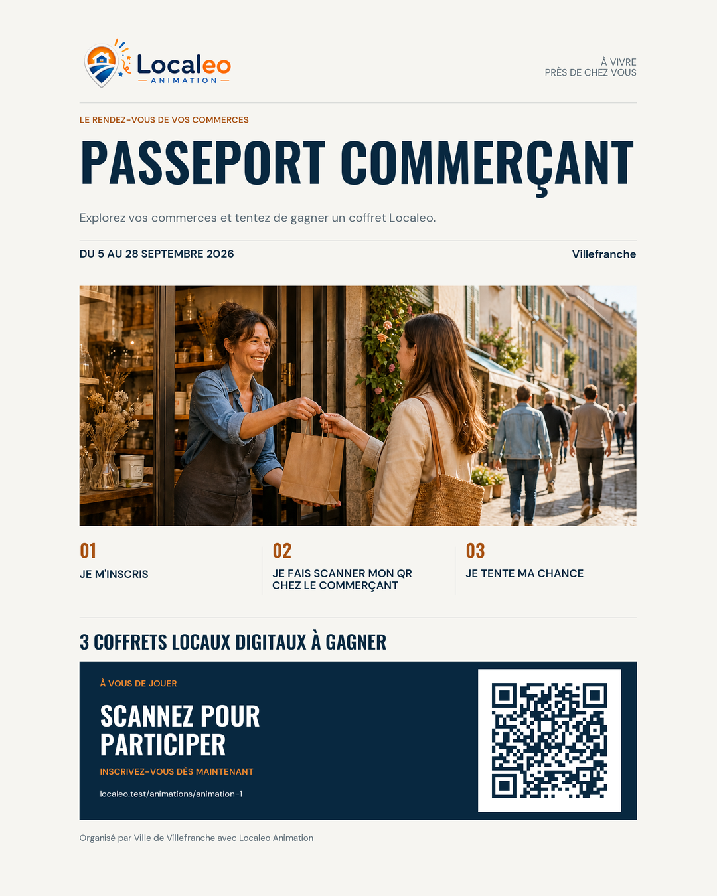

# Epic 41 - Direction artistique des flyers Animation

## Statut

La refonte demandee rapproche les flyers de l'identite editoriale de la Marketplace. Elle porte la charte
`LOCALEO_ANIMATION_MARKETPLACE_V4` et remplace la composition `LOCALEO_ANIMATION_EDITORIAL_V3`.

Le generateur reconstruit chaque bloc avec les donnees de l'animation, le logo officiel, les polices
embarquees dans le moteur et un QR code reellement scannable. Cette charte constitue la reference des
prochaines generations de flyers.

L'[ancienne reference V3](assets/flyer-direction-artistique-validee.png), validee le 28 aout 2026,
est conservee comme historique. Ses vagues, ombres, formes arrondies et illustrations decoratives ne
constituent plus la cible du rendu. L'exemple V4 utilise une URL fictive de recette.

La mecanique reste inchangee : le libelle intermediaire historique `Je visite` est remplace dans le rendu
fonctionnel par `Je fais scanner mon QR chez les commercants participants`, afin d'expliquer l'action qui
valide effectivement un passage.

## Objectif marketing

Le flyer doit donner envie de participer avant de chercher a expliquer l'ensemble du reglement. Il valorise
la vie locale, la relation entre habitants et commercants ainsi que le benefice concret de l'animation. Sa
lecture doit rester immediate en vitrine, sur un fil social ou dans une publication locale.

La hierarchie de lecture du generateur est la suivante :

1. identification de Localeo Animation ;
2. promesse et nom de l'animation ;
3. dates et commune ;
4. ambiance locale et humaine ;
5. mecanique de participation en trois etapes maximum, incluant explicitement le scan du QR personnel chez le commercant ;
6. mise en avant des gains ;
7. appel a l'action et QR d'inscription ;
8. organisateur et mentions utiles.

## Cycle de vie

Cette section porte la formulation Backend autorisant l’aperçu privé. Les anciennes formulations Animation d’ARB-22, ARB-28 et ARB-48 l’interdisaient avant publication ; leur [divergence est conservée dans le registre commun](registre-arbitrages.md#divergence-documentaire-sur-les-flyers), avec le lien vers ANI-PART-ARB-11. Le remplacement graphique de V3 par V4 décrit ici ne constitue pas un nouvel arbitrage sur ce cycle de vie.

Le gestionnaire peut generer et telecharger un apercu des l'etat `BROUILLON` ou `CONFIGUREE`. Cet apercu
reste prive dans Localeo Animation : il est stocke avec le statut documentaire `BROUILLON` et le seul scope
`PORTAIL_ANIMATION`. Il n'est accessible ni au catalogue public ni a l'application commercant.

La publication regenere le flyer a partir de la configuration et de la liste figees, puis promeut le PDF et
le PNG au statut `PUBLIE` avec le scope `APPLICATION_COMMERCANT`. Le flyer publie reste la version finale de
reference ; une regeneration ulterieure remplace son contenu de maniere versionnee.

## Identite visuelle

Le flyer reprend la sobriete editoriale de la Marketplace tout en conservant le logo officiel Localeo
Animation :

| Role | Couleur |
| --- | --- |
| Papier et fond de page | `#F6F5F1` |
| Encre, titres et bloc d'inscription | `#082840` |
| Orange d'accent et d'appel a l'action | `#F28A2E` |
| Orange de texte sur fond clair | `#A85213` |
| Texte secondaire | `#586873` |
| Filets de separation | `#D7D9D8` |
| Blanc | `#FFFFFF` |

Regles graphiques :

- utiliser le logo officiel complet `Localeo Animation`, sans le redessiner, le deformer ou le recolorer ;
- utiliser Oswald pour les titres et DM Sans pour le texte courant, avec les fichiers de polices embarques
  dans le moteur pour obtenir un rendu reproductible ; le PDF demeure raster a 200 dpi ;
- employer des titres hierarchises, des respirations genereuses et des separateurs fins ;
- donner une place dominante a une photographie rectangulaire, sans masque en vague ni decor superpose ;
- conserver des marges imprimables autour des contenus, de la photographie et du bloc d'inscription ;
- supprimer les vagues, ombres portees, illustrations decoratives et effets de volume ;
- reserver l'orange aux accents, aux numeros des etapes et a l'appel a l'action ;
- conserver une comprehension correcte en niveaux de gris ;
- eviter l'empilement de cartes generiques, les textes decoratifs et la surcharge d'informations.

## Composition du format maitre

Le format maitre est un A4 portrait avec des marges imprimables. Les informations indispensables restent
dans une zone sure : logo, nom de l'animation, dates, commune, promesse et QR. L'apercu social `4:5` conserve
l'integralite de la composition ; un changement de ratio ne doit couper aucun contenu essentiel.

La composition comprend :

- un en-tete sobre avec le logo Localeo Animation ;
- un titre evenementiel dominant en Oswald et une accroche courte en DM Sans ;
- une ligne de dates et de commune nettement hierarchisee, separee par des filets fins ;
- une photographie principale rectangulaire montrant une situation locale, humaine et authentique ;
- un parcours de participation limite a trois etapes courtes lorsque le modele le permet ; pour le
  `PASSEPORT_COMMERCANT`, les libelles de reference sont `Je m'inscris`, `Je fais scanner mon QR chez les
  commercants participants` et `Je tente ma chance` ;
- une mise en avant typographique des lots en bleu encre ;
- un bloc final contraste, en encre sur le fond papier, comprenant le QR sur blanc, la consigne
  `Scannez pour participer` et l'URL de secours ;
- un pied de page indiquant l'organisateur et les mentions obligatoires.

Le visuel principal provient en priorite de l'asset principal valide de l'animation. A defaut, le moteur
utilise la photographie editoriale Localeo de commerces de proximite deja validee et embarquee. L'absence
de photo fournie ne supprime donc pas le visuel principal. Le logo horizontal officiel est conserve sans
modification. Le generateur ne doit jamais utiliser une image non autorisee, un logo tiers implicite ou une
photographie generative non validee en production.

## Contenus dynamiques

Le gabarit injecte au minimum :

- logo Localeo Animation ;
- nom et accroche de l'animation ;
- commune, dates et organisateur ;
- etapes publiques synthetisees du modele d'animation ;
- libelle court des gains ;
- visuel principal ou photographie de repli validee ;
- QR et URL publique d'inscription ;
- mentions utiles et reglementaires.

Le renderer consomme les libelles prepares par le domaine : il conserve les dates de la periode en heure
de Paris, le nombre de lots et la distinction singulier/pluriel des coffrets locaux digitaux. Une quantite
non encore renseignee utilise le libelle generique prevu pour l'apercu. La date de fin technique exclusive
ne doit pas ajouter un jour a la periode publique.

Les textes longs sont bornes par le gabarit. Un depassement ne reduit jamais une information essentielle
sous le seuil de lisibilite : le moteur adapte la composition ou retourne une erreur de validation
actionnable. Le QR et l'URL de secours doivent rester utilisables, y compris avec un titre, une commune ou
un nom d'organisateur longs.

Le moteur ne tronque jamais un contenu avec des points de suspension. Un champ impossible a composer
lisiblement produit une erreur dediee `ContenuFlyerNonAffichable`, traduite par le service en erreur de
configuration HTTP 422, avec le champ a corriger. Les erreurs techniques de fontes ou d'images ne sont
pas masquees par ce traitement. Les espaces typographiques sont normalises lors de la composition.

## Formats produits

Le PDF et son apercu partagent les memes donnees et la meme version de charte :

| Usage | Format cible | Regle |
| --- | --- | --- |
| Impression et journal local | PDF A4 portrait, 210 x 297 mm | Rendu final a 200 dpi, raster 1654 x 2339 pixels, poids cible inferieur a 500 000 octets, marges imprimables |
| Apercu du flyer et diffusion Facebook/Instagram | PNG 1080 x 1350, ratio 4:5 | Integralite du A4 centree, sans perte des informations essentielles, poids cible inferieur a 1 000 000 octets |
| Story Facebook et Instagram | PNG 1080 x 1920, ratio 9:16 | Recomposition verticale avec QR et appel a l'action dans la partie basse |
| Presse monochrome | PDF ou PNG A4/A5 | Contraste controle et comprehension sans dependance a la couleur |

Le PDF A4 et son apercu PNG 4:5 restent P0. Les exports story, les compositions sociales dediees et les
exports presse monochromes constituent des declinaisons ulterieures ; ils ne doivent pas introduire une
seconde source de verite. Un fond perdu de 3 mm, si un imprimeur le requiert, releve d'un export adapte et
ne remplace pas les marges du PDF courant.

Les limites de performance restent applicables : une generation simultanee au maximum par worker,
fermeture des images intermediaires, repli lorsque la source depasse 12 Mio ou 24 megapixels. Les seuils de
poids sont verifies sur le flyer de reference ; la taille et la duree reelles dependent aussi du visuel.

## Regles du QR et de l'appel a l'action

- le QR imprime sur le flyer encode exclusivement l'URL publique contextualisee de l'animation et sert a
  l'inscription ;
- apres inscription, le participant obtient son QR personnel, qu'il presente chez un commercant participant ;
- le commercant scanne ce QR personnel depuis son application pour valider le passage et faire progresser
  le participant vers le tirage ;
- le texte du flyer distingue sans ambiguite le QR public d'inscription du QR personnel scanne en commerce ;
- le QR public du flyer ne contient aucune donnee personnelle ni token participant ;
- sa taille imprimee est d'au moins 35 mm sur le format A4 ;
- une zone de silence blanche conforme est preservee autour du code ;
- le contraste est verifie automatiquement ;
- l'URL complete, hors protocole, est affichee en solution de secours ; chemin, parametres et fragment
  sont conserves, avec retour a la ligne si necessaire ;
- un test de lecture sur telephone fait partie de la recette de chaque gabarit.

## Versionnement et regeneration

La charte `LOCALEO_ANIMATION_MARKETPLACE_V4` porte un identifiant distinct de la version fonctionnelle de
l'animation et de la version documentaire du PDF/PNG. Les documents generes doivent rester rattachables
a la configuration, a la charte, aux assets et a l'URL d'inscription qui ont servi a leur production.

La publication genere le flyer final depuis la configuration publiee et la population participante figee.
Une modification autorisee affectant une information visible, un asset, l'URL ou le QR declenche une
regeneration auditee et idempotente de toutes les declinaisons actives.

Le changement de renderer ne modifie pas les flyers deja stockes. Ils conservent leur ancien rendu
jusqu'a une regeneration explicite, qui remplace le PDF et le PNG et incremente leur version documentaire.
La regeneration existante est autorisee pour les animations `BROUILLON`, `CONFIGUREE`, `PUBLIEE` et
`EN_COURS`. Une animation `CLOTUREE` ou `ARCHIVEE` conserve son document de reference ; la refonte ne
contourne pas cette regle de cycle de vie.

Les URL binaires portent la version documentaire et les reponses conservent les directives
`Cache-Control: private, no-store, no-cache, must-revalidate`, `Pragma: no-cache` et `Expires: 0`. Les
interfaces existantes de telechargement et d'impression peuvent consommer les nouveaux documents sans
changement de contrat API.

## Criteres d'acceptation

- le rendu respecte la charte V4, sa palette, ses polices et sa hierarchie editoriale ;
- la photo est rectangulaire et dominante ; les filets fins et les marges remplacent les vagues, ombres
  et illustrations decoratives de la V3 ;
- le logo officiel est net, non deforme et suffisamment visible ;
- le nom, les dates, la commune et l'appel a l'action sont lisibles a distance sur A4 ;
- l'apercu 4:5 conserve toutes les informations essentielles ;
- le QR du PDF imprime est lisible par au moins deux lecteurs mobiles ;
- le parcours explique explicitement que le participant doit faire scanner son QR personnel chez les
  commercants participants pour valider ses passages et tenter sa chance ;
- les accents francais, retours a la ligne et titres longs sont rendus correctement ;
- le document reste comprehensible en niveaux de gris ;
- aucun visuel ou logo non autorise n'est incorpore ;
- les lots sont presentes comme des avantages digitaux, jamais comme une boite ou un colis physique, et
  le libelle precise `coffret local digital` ou son pluriel ; aucune illustration decorative n'est requise ;
- PDF et PNG sont produits de facon idempotente et rattaches a la meme version de flyer ;
- leurs URL sont invalidees par la version documentaire et les reponses binaires interdisent le cache navigateur ;
- le PDF reste un A4 a 200 dpi et le PNG mesure 1080 x 1350 pixels ; les poids de reference restent sous
  500 000 octets et 1 000 000 octets respectivement ;
- les controles visuels de non-regression couvrent au minimum un titre court, un titre long, une commune
  et un organisateur longs, un lot unique, plusieurs lots, un libelle generique de lots, une animation avec
  visuel et une animation utilisant le visuel de repli ;
- les scopes prives des apercus, leur promotion a la publication et l'acces commercant aux seuls flyers
  publies sont preserves ;
- apres regeneration d'un flyer existant, le telechargement livre la nouvelle version sans reutiliser
  l'ancien PDF ou PNG mis en cache.

## Verification locale

Les tests du renderer couvrent les formats, les budgets de poids, les textes longs sans perte de contenu,
les variantes de lots, les visuels personnalises et les replis. Les tests de service verifient la traduction
des erreurs de contenu sans masquer une panne technique. Les controles API conservent le contrat de cache.

Le decodage du QR depuis le PNG final et le PDF rasterise a 200 dpi utilise les outils QA facultatifs
`zxing-cpp` et `pypdfium2`, sans dependance de production supplementaire. Ces cas sont explicitement
ignores si les outils ne sont pas installes ; il faut les activer pour la recette de la charte. La lecture
automatique ne remplace pas le controle sur telephone d'une impression physique.

Les fichiers et licences des polices sont decrits dans
[`assets/fonts/README.md`](../../../../localeo-backend/app/infrastructure/animation_locale/assets/fonts/README.md).

Recette du 14 septembre 2026 : 44 tests reussis sur le renderer, le domaine, le service et les controles
API, avec decodage actif des QR des deux livrables. Les deux PDF finaux (nom court et textes longs) ont
ete rasterises et relus visuellement. Le flyer de reference pese 367 981 octets en PDF et 809 372 octets
en PNG ; la variante longue pese 418 601 et 842 279 octets respectivement.

Deux tests OpenAPI restent en echec sur la route de resolution des participants
`POST /protected/animation-locale/commercants/me/participants/resoudre`, sans modele de reponse declare.
Cette definition et les tests sont identiques a `HEAD` et n'ont pas ete modifies par la refonte. Ces
echecs preexistants sont distincts des controles du flyer, qui reussissent tous. Aucune impression
physique ni lecture sur telephone n'a ete realisee pendant cette recette locale.
