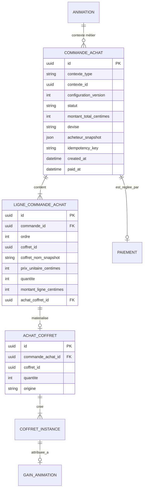

# Architecture et modèle de données

> Consolidation documentaire du 18 septembre 2026 : versions Backend et Animation réunies. Le diagnostic financier détaillé dans le backend est conservé ; aucune différence métier concurrente dans ce document.

## Répartition des responsabilités

| Domaine | Responsabilité |
|---|---|
| `animation_locale` | Tenant, configuration des lots, validation de publication, tirage, gain et orchestration de la façade. |
| `gestion_achats` | Commande multi-lignes, calcul serveur, paiement, achats enfants, instances et documents d'achat. |
| `commercialisation` | Coffrets, prix catalogue, prestations et vendabilité. |
| `gestion_reversement` | Mouvements et transferts commerçants à partir du paiement source. |
| `infrastructure.paiement` | Création/récupération Stripe Checkout, validation des webhooks et remboursements autorisés. |
| `exploitation` | Audit, outbox email, alertes et réconciliation. |

## Modèle logique recommandé



## Entités

### `CommandeAchat`

Racine transactionnelle de la commande multi-lignes.

Champs minimaux :

- `id` ;
- `contexte_type = ANIMATION_LOTS` et `contexte_id = animation_id` ;
- `configuration_version` ;
- `statut` ;
- `montant_total_centimes`, `devise` ;
- snapshot de l'acheteur professionnel ;
- `idempotency_key`, références checkout et dates ;
- version optimiste ou mécanisme de verrouillage.

Invariants :

- au moins une ligne ;
- une seule devise, `EUR` au MVP ;
- au maximum 20 lignes et 100 instances par commande ;
- total inférieur ou égal au plafond monétaire configuré ;
- somme des lignes égale au total ;
- une seule commande active par animation et version de configuration ;
- aucune ligne modifiable après création du checkout ;
- passage à `PAYEE` uniquement depuis un webhook vérifié.

### `LigneCommandeAchat`

Snapshot immuable d'une ligne de lot : ordre, coffret, nom, prix unitaire, quantité et sous-total. L'ordre reste l'identité fonctionnelle du lot, y compris lorsque plusieurs lignes utilisent le même coffret.

Après confirmation, la ligne référence exactement un `AchatCoffret` enfant. L'achat enfant conserve `origine=LOT_ANIMATION`, `animation_id` et `animation_lot_ordre` pour l'audit et la résolution métier, sans constituer une seconde racine de paiement.

### `Paiement`

Deux conceptions restent possibles : généraliser `Paiement` à une source de paiement typée, ou ajouter une relation commande dédiée. La décision doit respecter ces invariants :

- une transaction Stripe n'est persistée qu'une fois ;
- le paiement de commande est retrouvable depuis tous les achats enfants ;
- le webhook ne dépend pas d'un `achat_id` artificiel ;
- les parcours mono-coffret existants restent compatibles.

La conception détaillée recommandée est une relation additive `commande_achat_id` nullable sur `Paiement`, avec contrainte « exactement une racine parmi `achat_id` et `commande_achat_id` ». `achat_id` devient nullable après migration contrôlée. Les repositories exposent `obtenir_par_commande` et `obtenir_source_par_achat`.

## États de commande

```text
A_CONFIGURER
  -> A_REGLER
  -> PAIEMENT_EN_COURS
  -> PAYEE
  -> MATERIALISATION_EN_COURS
  -> INSTANCES_RESERVEES

PAIEMENT_EN_COURS -> ECHEC | EXPIREE
PAYEE/MATERIALISATION_EN_COURS -> A_RECONCILIER
INSTANCES_RESERVEES -> REMBOURSEMENT_EN_COURS -> REMBOURSEE
```

`PAYEE` est un état financier. `INSTANCES_RESERVEES` est un état opérationnel. Leur séparation permet de détecter un webhook confirmé dont la matérialisation locale a échoué.

## Contraintes SQL recommandées

- unicité partielle d'une commande active par `contexte_type + contexte_id` ;
- unicité `commande_id + ordre` ;
- unicité de `achat_coffret_id` sur les lignes matérialisées ;
- unicité de `transaction_id` et `stripe_checkout_session_id` ;
- check des montants et quantités strictement positifs ;
- FK des achats enfants vers la commande avec suppression restreinte ;
- FK de `GainAnimation.coffret_instance_id` unique lorsqu'elle est renseignée.

## Blocage d'un coffret après paiement

La vendabilité commerciale et l'interdiction d'usage sont deux notions distinctes. Une instance déjà réservée reste utilisable si le coffret sort simplement du catalogue. Un indicateur explicite `blocage_usage` avec les motifs `LEGAL`, `FRAUDE` ou `SECURITE` bloque en revanche publication, attribution et activation, place l'animation en régularisation support et conserve la preuve financière. Le backend ne déduit jamais ce blocage d'un simple statut commercial inactif.

Le diagnostic de publication conserve la couverture financiere calculee meme si un controle de coffret echoue ensuite. `COFFRET_LOT_BLOQUE` ne produit pas a lui seul `PAIEMENT_LOTS_INCOMPLET` ; les actions de paiement ne sont exposees que sur la base du diagnostic financier.

## Bascule depuis le socle par ligne

Le socle par ligne n'étant pas déployé en production, la commande consolidée devient l'unique source de vérité du financement des lots Animation. La bascule :

1. supprime l'initialisation Stripe par ligne de la façade Animation ;
2. remplace la projection de couverture par ligne par celle de la commande ;
3. n'ajoute aucun fallback de lecture vers les anciens financements ;
4. fournit une procédure de nettoyage des seules données de développement concernées.

Les invariants et contraintes de commande suffisent ainsi à empêcher les doubles financements, sans branche conditionnelle de compatibilité.

## Attribution et clôture

- Le tirage doit produire exactement autant de gains attribués que d'instances achetées pour l'animation.
- Chaque gain référence le lot et le participant retenu dès le tirage ; l'instance réservée reste libre de toute association définitive à ce stade afin de permettre le remplacement contrôlé d'un gagnant.
- L'instance est sélectionnée et associée au gain dans la transaction d'envoi irréversible, puis activée.
- La clôture définitive exige `gains_attribues = instances_achetees` ; sinon elle renvoie un conflit métier détaillant les quantités manquantes. L'envoi et l'activation restent suivis séparément après attribution.
- Aucun lot payé n'est libéré vers un stock professionnel, remboursé ou réaffecté automatiquement au MVP.
