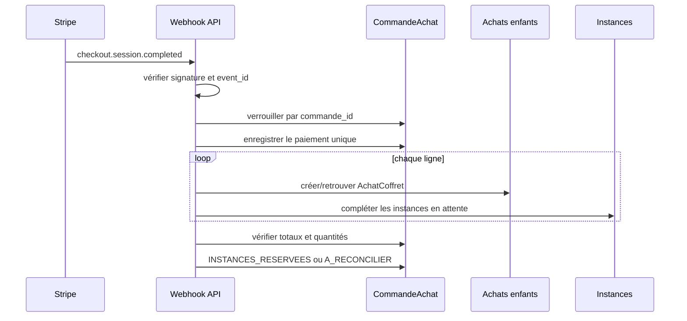

# Flux Stripe, concurrence et réconciliation

> Consolidation documentaire du 18 septembre 2026 : les précisions d’exploitation du backend sont conservées. Les différences de métadonnées Stripe et d’états d’entrée du job sont documentées comme écarts de contrat à vérifier.

## Initialisation

1. Verrouiller l'animation ou la commande active.
2. Vérifier tenant, permission, statut configurable et abonnement.
3. Lire la configuration courante et vérifier chaque coffret.
4. Calculer les prix depuis le catalogue et créer les snapshots.
5. Persister la commande en `A_REGLER` avec la clé d'idempotence.
6. Créer une session Stripe avec plusieurs `line_items`. Les deux sources citent `commande_id` et `contexte_type` ; le backend ajoute `transfer_group`, tandis que le portail Animation cite `contexte_id`. Le jeu exact de métadonnées reste une divergence de contrat à vérifier, sans retirer l’une des informations par simple fusion.
7. Persister la référence de session et passer en `PAIEMENT_EN_COURS`.
8. Retourner l'URL Stripe.

Une nouvelle tentative avec la même clé et le même snapshot retourne la même commande. Une même clé avec un payload effectif différent renvoie `409`.

## Confirmation webhook

Le traitement est idempotent à trois niveaux :

- événement Stripe (`event_id`) ;
- transaction/session (`transaction_id`, `checkout_session_id`) ;
- matérialisation de ligne (`commande_id + ordre`).

Une erreur de matérialisation ne doit pas annuler la preuve du paiement reçu. L'état passe à `A_RECONCILIER`, puis un job complète les achats et instances manquants sans nouvel appel financier.

## Résolution Stripe Connect

Lorsqu'une prestation d'une instance gagnée génère un reversement :

1. retrouver l'`AchatCoffret` de l'instance ;
2. retrouver sa `CommandeAchat` ;
3. retrouver le paiement unique de la commande ;
4. obtenir `stripe_charge_id` ;
5. créer le Transfer avec cette `source_transaction` et une clé d'idempotence propre au mouvement.

Le `transfer_group` des commandes Animation est `commande_achat:{commande_id}`. Le resolver général conserve le format `achat:{achat_id}` pour les achats Marketplace mono-coffret, mais aucun fallback vers un ancien financement Animation par ligne n'est ajouté.

## Réservation et attribution concurrentes

La couverture financière seule ne suffit pas à empêcher deux gains concurrents de sélectionner la même instance. L'association doit utiliser l'un des mécanismes suivants :

- `SELECT ... FOR UPDATE SKIP LOCKED` sur les instances disponibles ; ou
- mise à jour conditionnelle atomique avec contrainte unique sur `gain.coffret_instance_id`.

La transaction associe l'instance au gain avant activation. En cas d'échec avant commit, l'instance reste disponible. En cas d'échec d'email après commit, l'instance reste active et seule l'outbox est relancée.

## Expiration et reprise

- `checkout.session.expired` fait passer la tentative en `EXPIREE` si aucun paiement n'est confirmé.
- Une reprise crée une nouvelle session sur la commande immuable.
- Une session ancienne confirmée tardivement est acceptée seulement si aucun autre paiement de la commande n'est confirmé.
- Deux confirmations financières différentes placent la commande en incident critique ; aucune instance supplémentaire n'est créée automatiquement.

## Job de réconciliation

Entrée décrite par le backend : commande ou lot de commandes en `PAYEE` ou `A_RECONCILIER`. La source Animation ajoute `MATERIALISATION_EN_COURS` ; l’admission de cet état reste à vérifier avant d’en faire une consigne d’exécution.

Le job est exposé par `POST /internal/animation-locale/commandes-lots/reconcilier`, réservé à la session d'administration, avec une limite de 1 à 500 commandes par exécution.

Le back-office expose également l'action ciblée **Réconcilier la
matérialisation** dans **Gestion achats > Commandes de lots Animation**. Elle
traite uniquement les commandes sélectionnées et journalise le déclenchement
sous `animation_lots.reconciliation.admin_triggered`.

Contrôles attendus avant l'exécution du job :

- paiement et charge Stripe présents ;
- somme Stripe égale au total snapshoté ;
- un achat enfant par ligne ;
- nombre d'instances par achat égal à la quantité ;
- aucune instance utilisée par deux gains ;
- nombre de gains attribués cohérent avec les instances achetées lorsque la clôture est demandée.

Le backend vérifie la preuve Stripe mémorisée localement avant la relance :
paiement `paid`, Checkout Session concordante, montant, devise et statut. La
relecture du Dashboard Stripe reste réalisée par l'opérateur ; le traitement ne
relit pas Stripe en temps réel.
Le job ne crée jamais de session, PaymentIntent, remboursement ou Transfer. Il
répare uniquement les projections locales autorisées et produit une alerte si une action financière ou humaine est nécessaire. Il ne doit donc pas être
utilisé pour un écart de montant, une double confirmation ou un incident de
remboursement.

La procédure d'exploitation complète est décrite dans
[`Réconciliation des commandes de lots Animation`](../../exploitation/exploitation/reconcilier-commande-lots-animation.md).

## Audit et métriques

Événements minimaux :

- `animation_lots.order.created` ;
- `animation_lots.checkout.created` ;
- `animation_lots.payment.confirmed` ;
- `animation_lots.line.materialized` ;
- `animation_lots.instances.reserved` ;
- `animation_lots.reconciliation.required|succeeded|failed` ;
- `animation_lots.instance.assigned` ;
- `animation_lots.instance.activated` ;
- `animation_lots.documents.viewed|downloaded` ;
- `animation_lots.closure.blocked_unassigned` ;
- `animation_lots.refund.requested|confirmed|failed`.

Les logs excluent email complet, téléphone, adresse, URL Stripe, tokens et payload webhook complet. Les métriques portent compteurs, durées et montants agrégés sans PII.
