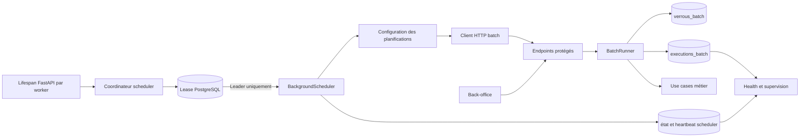

# Epic 48 — Conception technique APScheduler

> Suivi produit au 18 septembre 2026 : **Terminée** — [backlog de référence](../../roadmap/terminees/epic-48-apscheduler-ordonnancement-batchs-backlog.md). Les bilans techniques datés ci-dessous conservent leur portée historique.

## Objet

Cette spécification décrit l'intégration d'APScheduler comme ordonnanceur des
batchs Localeo. Elle complète, sans le remplacer, le socle de l'Epic 23.

- [Backlog Epic 48](../../roadmap/terminees/epic-48-apscheduler-ordonnancement-batchs-backlog.md)
- [Registre des arbitrages](registre-arbitrages.md)
- [Référence opérationnelle actuelle des batchs](../../exploitation/technique/reference-batchs.md)

## État de l'existant

Le backend possède déjà :

- un catalogue `BATCH_DEFINITIONS` ;
- un `BatchRunner` commun pour l'historisation et le verrouillage ;
- les tables `executions_batch` et `verrous_batch` ;
- des endpoints protégés par le scope `internal:batch` ;
- des lancements manuels depuis le back-office ;
- un inventaire, un historique et un health opérationnel.

Le code de déclenchement reste cependant distribué entre les routes API et les
actions d'administration. Les fréquences sont des libellés destinés à
l'affichage et non des triggers exécutables.

## Décisions techniques validées

La cible validée utilise APScheduler `>=3.11.3,<4.0`, version stable compatible
avec Python 3.14 au moment du cadrage. La branche 4 reste une préversion et
n'entre pas dans le MVP. Les planifications utilisent le job store mémoire et
sont reconstruites à chaque démarrage.

La décision d'hébergement est actée : APScheduler fonctionne dans le service
FastAPI actuellement déployé sur Render. L'intégration utilise
`BackgroundScheduler`, démarré et arrêté par le lifespan. Un lease PostgreSQL
garantit qu'un seul processus web pilote les jobs, y compris pendant un
redéploiement avec recouvrement d'instances.

Les fréquences sont configurables par variables d'environnement. À chaque
échéance, le scheduler appelle l'endpoint HTTP protégé déclaré dans le registre
avec une clé API portant le scope `internal:batch`. Il n'invoque pas directement
les use cases.

Références éditeur :

- [APScheduler sur PyPI](https://pypi.org/project/APScheduler/) ;
- [Guide APScheduler 3.x](https://apscheduler.readthedocs.io/en/3.x/userguide.html) ;
- [Cycle de déploiement Render](https://render.com/docs/deploys) ;
- [Limites des services Render gratuits](https://render.com/docs/free).

## Architecture cible



### Responsabilités

| Composant | Responsabilité |
|---|---|
| Registre des batchs | Décrire identité, endpoint, configuration, paramètres et politiques |
| APScheduler | Calculer les échéances et appeler le client HTTP |
| Client HTTP | Authentifier l'appel, propager la corrélation et contrôler la réponse |
| Endpoint protégé | Valider les paramètres et appeler le runner canonique |
| `BatchRunner` | Verrouiller, tracer, corréler et normaliser le résultat |
| Use case métier | Réaliser le traitement sans dépendre d'APScheduler |
| Projection scheduler | Exposer heartbeat, version et prochaines échéances |

## Intégration au cycle de vie FastAPI

### Démarrage

Chaque processus Uvicorn démarre un coordinateur léger dans le lifespan :

1. il charge et valide la configuration ;
2. si le scheduler est désactivé, il ne démarre aucune boucle ;
3. sinon, il tente atomiquement d'acquérir le lease `localeo.scheduler.main` ;
4. le détenteur construit `BackgroundScheduler`, enregistre les jobs et
   renouvelle le lease avec son heartbeat ;
5. les autres coordinateurs restent en veille et retentent périodiquement ;
6. si le leader perd le lease, il arrête immédiatement son scheduler ;
7. à l'arrêt du lifespan, le processus ferme les exécuteurs et libère son lease
   s'il en est toujours propriétaire.

Le coordinateur doit rester non bloquant pour la boucle `asyncio` de FastAPI.
Les accès SQL de lease et le client HTTP synchrone s'exécutent hors de la
boucle événementielle.

### Interdictions

- aucun scheduler démarré hors du composant lifespan dédié ;
- aucun job enregistré avant l'acquisition du lease ;
- aucun appel direct du scheduler vers les use cases métier ;
- aucun import d'APScheduler dans les routes ou les use cases métier ;
- aucune URL complète ni méthode HTTP provenant de la base ou d'une saisie
  administrateur ;
- aucun secret dans le job store, les paramètres ou les traces.

## Registre exécutable

`BatchDefinition` évolue vers une définition structurée, par exemple :

| Attribut | Rôle |
|---|---|
| `code` | Identifiant stable du batch et du job |
| `http_method` | `POST` pour les batchs actuels |
| `endpoint` | Chemin relatif protégé et fixé dans le code |
| `schedule_env_key` | Variable d'environnement surchargeant la fréquence |
| `strategie` | Automatique, reprise ou manuel |
| `default_cron` | Expression cron utilisée sans surcharge |
| `effective_cron` | Expression validée issue de l'environnement ou du défaut |
| `timezone` | `UTC` par défaut |
| `default_params` | Paramètres validés et non sensibles |
| `enabled` | Éligibilité à l'enregistrement automatique |
| `coalesce` | Fusion des échéances manquées |
| `misfire_grace_time_seconds` | Tolérance d'un lancement tardif |
| `max_instances` | `1` au MVP |
| `timeout_seconds` | Seuil opérationnel existant |
| `max_delay_minutes` | Seuil du health existant |
| `startup_catchup` | Autorise une reprise unique au démarrage |

Les libellés d'affichage et la fréquence lisible sont dérivés de la
configuration effective. Les expressions invalides empêchent le coordinateur
de se déclarer sain et sont exposées sans révéler de secret.

## Client HTTP batch

Le client expose conceptuellement :

```text
execute_http(batch_code, correlation_id) -> BatchHttpResult
```

Il applique dans cet ordre :

1. résolution de la méthode, du chemin relatif, des paramètres et du timeout
   depuis la définition connue ;
2. construction de l'URL depuis `LOCALEO_SCHEDULER_API_BASE_URL` ;
3. ajout de `X-API-KEY`, du correlation ID et d'un `User-Agent` technique ;
4. appel HTTP avec timeouts de connexion et de lecture bornés ;
5. contrôle du statut `2xx` et du corps JSON attendu ;
6. journalisation assainie du résultat ou de l'échec.

L'API authentifie la clé, valide les paramètres, appelle `BatchRunner`, puis le
use case métier. L'acteur d'audit est dérivé de l'identité de la clé API et non
d'un header librement fourni. L'appel peut utiliser une URL loopback ou l'URL
Render, mais la valeur est toujours fournie explicitement par configuration.

L'API key brute n'apparaît jamais dans les paramètres APScheduler, la base, les
logs ou les réponses. Une réponse HTTP non `2xx` est un échec d'ordonnancement,
même si elle contient un corps JSON exploitable.

## Persistance validée

### Job store validé

Au MVP, les jobs sont recréés avec le job store mémoire. Les fréquences
effectives proviennent de la configuration d'environnement validée. Les
tables métier existantes restent la preuve des exécutions. Ce choix évite :

- la sérialisation persistante de callables ;
- la création automatique d'une table hors migrations SQL versionnées ;
- une seconde source de configuration ;
- le partage non supporté d'un job store APScheduler 3.x entre schedulers.

La reprise après indisponibilité s'appuie sur l'historique Localeo et une
politique explicite `startup_catchup`, et non sur le rejeu de toutes les
échéances perdues.

### Lease et projection de supervision

Deux tables sont retenues :

#### `leases_ordonnanceur_batch`

- `lease_name`, clé primaire valant `localeo.scheduler.main` ;
- `owner_id`, identité unique du processus leader ;
- `statut` : `ACQUIS`, `LIBERATION_EN_COURS`, `ERREUR` ;
- `version_application` ;
- `acquired_at` ;
- `heartbeat_at` ;
- `expires_at` ;
- `configuration_hash` ;
- `erreur_type` et `erreur_message` assainis.

#### `planifications_batch`

- `schedule_id`, clé primaire distincte du code batch pour supporter plusieurs
  planifications d'un même traitement ;
- `batch_code` ;
- `scheduler_id` ;
- `active` ;
- `cron_expression`, `http_method`, `endpoint`, `parametres` et
  `trigger_snapshot` ;
- `timezone` ;
- `next_run_at` ;
- `last_synced_at` ;
- `configuration_hash`.

Ces tables sont gérées par la migration SQL séquentielle `v174`. Le lease est acquis ou renouvelé par une
écriture conditionnelle atomique utilisant l'heure de la base. Les tables ne
sont ni un job store ni une source de callables.

## Concurrence et idempotence

Trois niveaux se complètent :

1. un lease PostgreSQL n'autorise qu'un leader parmi les processus FastAPI ;
2. `max_instances=1` dans APScheduler pour un même job ;
3. verrou SQL `verrous_batch` partagé avec les lancements API et back-office.

Le lease doit expirer automatiquement si le leader disparaît. Un worker en
veille prend alors le relais. Lors d'une partition réseau, le leader qui ne
peut plus renouveler son lease arrête ses jobs ; si une course subsiste, les
verrous batch protègent les effets métier.

Un job ignoré pour concurrence n'est pas un succès métier. L'événement est
journalisé avec son `batch_code`, l'identité scheduler et le correlation ID,
puis visible dans la supervision.

## Retards, misfires et reprise

Politique validée :

| Famille | Coalescence | Reprise après indisponibilité |
|---|---|---|
| Outbox fréquente | Oui | Reprendre au prochain tick, sans rejouer chaque minute |
| Synchronisation provider | Oui | Une exécution au prochain tick |
| Expiration et relances quotidiennes | Oui | Une reprise unique au démarrage si le retard dépasse la fréquence |
| Purges | Oui | Pas de reprise automatique agressive ; prochaine échéance ou action manuelle |
| Rattrapage financier | Oui | Reprise unique bornée et idempotente selon la fenêtre configurée |

APScheduler ne remplace pas les règles de retry métier des outbox. Un échec est
historisé ; le prochain tick reprend seulement les éléments encore éligibles.

## Observabilité et health

Le leader journalise au minimum :

- `scheduler.started`, `scheduler.heartbeat`, `scheduler.stopping` ;
- `scheduler.job.submitted`, `scheduler.job.executed` et
  `scheduler.job.failed` ;
- identité scheduler, `batch_code`, prochaine échéance, correlation ID,
  durée et résultat synthétique.

Le health existant est enrichi avec :

- présence d'un scheduler actif lorsque l'ordonnancement est activé ;
- âge du dernier heartbeat ;
- cohérence entre jobs attendus et planifications projetées ;
- prochaine exécution calculée ;
- jobs absents, désactivés ou en retard.

## Configuration validée

| Clé | Défaut cible | Usage |
|---|---|---|
| `LOCALEO_SCHEDULER_ENABLED` | `false` | Activation explicite du processus |
| `LOCALEO_SCHEDULER_TIMEZONE` | `UTC` | Fuseau commun des triggers |
| `LOCALEO_SCHEDULER_ID` | identité de l'instance | Identité visible dans les traces |
| `LOCALEO_SCHEDULER_MAX_WORKERS` | `4` | Taille bornée du pool d'exécution |
| `LOCALEO_SCHEDULER_HEARTBEAT_SECONDS` | `30` | Fréquence de présence |
| `LOCALEO_SCHEDULER_STALE_AFTER_SECONDS` | `120` | Seuil health sans heartbeat |
| `LOCALEO_SCHEDULER_LEASE_SECONDS` | `90` | Durée du mandat du leader |
| `LOCALEO_SCHEDULER_LEADER_POLL_SECONDS` | `15` | Tentative de reprise par un worker en veille |
| `LOCALEO_SCHEDULER_STARTUP_CATCHUP_ENABLED` | `true` | Reprise unique des jobs éligibles |
| `LOCALEO_SCHEDULER_STARTUP_DELAY_SECONDS` | `15` | Délai avant le premier appel HTTP après le démarrage FastAPI |
| `LOCALEO_SCHEDULER_API_BASE_URL` | obligatoire si activé | URL absolue du backend appelée par le scheduler |
| `LOCALEO_INTERNAL_BATCH_API_KEY` | obligatoire si activé | Clé API brute avec scope `internal:batch` |
| `LOCALEO_SCHEDULER_HTTP_CONNECT_TIMEOUT_SECONDS` | `10` | Timeout de connexion HTTP |

Chaque fréquence suit la convention :

```text
LOCALEO_SCHEDULER_CRON_<BATCH_CODE_NORMALISE>
```

Le code est converti en majuscules et les caractères `.` ou `-` sont remplacés
par `_`. Exemples :

| Batch | Clé de fréquence | Défaut initial |
|---|---|---|
| `emails.envoyer` | `LOCALEO_SCHEDULER_CRON_EMAILS_ENVOYER` | `*/2 * * * *` |
| `emails.synchroniser_statuts` | `LOCALEO_SCHEDULER_CRON_EMAILS_SYNCHRONISER_STATUTS` | `*/30 * * * *` |
| `sms.envoyer` | `LOCALEO_SCHEDULER_CRON_SMS_ENVOYER` | `*/2 * * * *` |
| `coffrets.expiration` | `LOCALEO_SCHEDULER_CRON_COFFRETS_EXPIRATION` | `10 0 * * *` |
| `coffrets.relance_expiration` | `LOCALEO_SCHEDULER_CRON_COFFRETS_RELANCE_EXPIRATION` | `30 7 * * *` |

Toutes les clés des planifications automatiques sont générées depuis leur
`schedule_id` et publiées dans la référence de configuration. Cette distinction
produit les suffixes `_14J` et `_90J` pour les deux reprises Stripe. Une valeur
absente utilise le défaut ; une valeur vide ou invalide est une erreur de
configuration et ne désactive pas silencieusement le job. La pause par job
reste hors MVP conformément à `APS-ARB-10`.

## Déploiement dans le service FastAPI Render

Le scheduler utilise le service web existant et sa commande Uvicorn actuelle.
La configuration doit garantir au moins une instance toujours active. Un
service Render gratuit qui s'endort après une période sans trafic ne peut pas
garantir l'exécution des batchs ; la production doit donc utiliser une instance
sans mise en veille.

Le lease rend l'intégration compatible avec plusieurs workers Uvicorn, un
scaling horizontal et le recouvrement temporaire entre ancienne et nouvelle
version pendant un déploiement.

La bascule suit quatre phases :

1. déployer FastAPI avec `LOCALEO_SCHEDULER_ENABLED=false` ;
2. vérifier schéma, registre, expressions cron, URL HTTP, clé API, acquisition
   simulée du lease et accès providers ;
3. arrêter les déclencheurs externes des batchs migrés puis activer le scheduler
   dans le service web ;
4. contrôler heartbeat, prochaines échéances, exécutions et absence de doublon.

Le rollback désactive APScheduler avant de réactiver l'ancien ordonnanceur. Les
deux sources automatiques ne doivent jamais rester actives simultanément.

## Stratégie de tests

- contrat du registre : identifiants uniques, crons valides, méthodes et
  endpoints autorisés ;
- client HTTP : URL, méthode, query/body, clé masquée, correlation ID, timeout,
  réponse `2xx`, erreur `4xx/5xx` et JSON invalide ;
- enregistrement : idempotence et remplacement d'une définition ;
- concurrence : `max_instances` et verrou SQL ;
- horloge contrôlée : cron, interval, fuseau et changement de jour ;
- misfire : coalescence et reprise unique ;
- cycle de vie : démarrage, signal d'arrêt et erreur fatale ;
- élection : acquisition atomique, renouvellement, perte du lease, veille et
  reprise par un autre worker ;
- supervision : heartbeat frais, périmé, job manquant et version ;
- intégration : appel HTTP réel d'un batch inoffensif avec authentification,
  verrou et historique ;
- déploiement : démarrage désactivé, puis activation contrôlée.

## Migration et compatibilité

- aucune table métier de l'Epic 23 n'est supprimée ;
- les endpoints et lancements manuels restent compatibles ;
- les nouveaux champs d'inventaire sont ajoutés sans retirer les champs
  existants ;
- les migrations de projection précèdent l'activation du worker ;
- APScheduler est désactivé par défaut jusqu'à la fin de la recette de bascule ;
- le déploiement de la migration du lease précède l'activation dans FastAPI.

## Implémentation livrée

- dépendance `APScheduler>=3.11.3,<4.0` ;
- catalogue `BATCH_SCHEDULE_DEFINITIONS` de 17 planifications pour 16 batchs ;
- coordinateur leader/standby dans le lifespan FastAPI ;
- acquisition et renouvellement atomiques du lease avec l'heure PostgreSQL ;
- job store mémoire, `coalesce=true`, `max_instances=1` et misfires bornés ;
- appels HTTP internes authentifiés et corrélés ;
- audit `api-key:<id>` dans `executions_batch` ;
- projection des crons et prochaines échéances dans `planifications_batch` ;
- health critique en cas de leader absent/périmé ou de planification critique
  absente ;
- affichage du scheduler et des planifications dans **Batchs exploitation** ;
- migration `sql/v174_epic48_apscheduler_ordonnancement.sql` et contrôle de
  readiness associé.

[Retour à l’index des spécifications](../INDEX.md)
