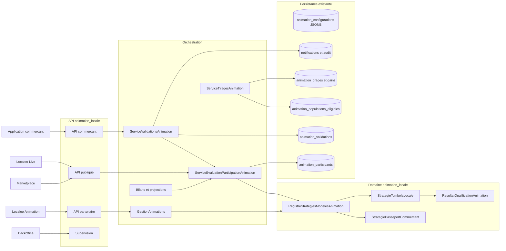

# Conception technique - Epic 53 Tombola locale des commercants

## 1. Etat et objectif

- Date de conception : `2026-08-29`.
- Etat de conception historique au 29 aout 2026 : conception finalisee, implementation a realiser.
- Domaine proprietaire : `animation_locale`.
- Modele ajoute : `TOMBOLA_LOCALE`.
- Socle reutilise : Epics 41, 42, 46, 47, 48, 49 et 56.
- Source fonctionnelle : [cadrage Epic 53](README.md).
- Decisions : [registre des arbitrages](registre-arbitrages.md).

L'etat produit courant est suivi dans le [backlog commun](../../roadmap/terminees/epic-53-tombola-locale-backlog.md).
Les ecarts d'existant et les sequences d'implementation de ce document
conservent le contexte de conception. La fusion du volet frontend ne constitue
pas une nouvelle preuve d'implementation ou de recette.

La Tombola est un deuxieme modele du moteur Animation. Elle ne constitue ni un
nouveau domaine ni un second workflow. Une inscription et au moins une
validation d'achat effective donnent une chance unique au tirage final.

La conception poursuit deux objectifs :

1. livrer la Tombola avec le moins de nouvelles structures possible ;
2. rendre le moteur reellement extensible sans disperser des conditions sur
   `modele_code` dans les services applicatifs.

## 2. Analyse de l'existant

Le socle couvre deja l'essentiel du besoin :

| Existant | Couverture Epic 53 |
| --- | --- |
| `Animation` et `ConfigurationAnimation` versionnee JSONB | Cycle de vie et attributs variables du modele |
| `ModeleAnimation` et `CatalogueModelesAnimation` | Metadonnees, regles, mission et reglement par defaut |
| Demandes de participation Epic 56 | Acceptation et population effective des commercants |
| Inscription, participant et QR | Identification du participant sans nouveau compte |
| `ValidationAnimation` | Confirmation terrain par le commercant |
| Index effectif `(participant_id, etape_id)` | Une validation effective par participant et par commercant |
| Annulation de validation | Recalcul de l'eligibilite avant cloture |
| Population eligible versionnee | Gel auditable a la cloture |
| Tirage, suppleants, gains et lots | Attribution finale sans nouveau moteur |
| Notifications Localeo Live | Publication, cloture et resultat |
| Catalogue public Epic 49 | Decouverte Marketplace et Localeo Live |
| Bilans, exports, Vision 360 et audit | Pilotage et supervision |

Les ecarts a traiter sont les suivants :

- le registre de `GestionAnimations` ne contient que `PASSEPORT_COMMERCANT` ;
- la strategie existante valide surtout la configuration et ne porte pas la
  qualification d'un participant ;
- les calculs de progression et d'eligibilite sont dupliques dans les
  validations, le pilotage, les bilans, la Vision 360 et plusieurs routes API ;
- `nombre_validations_requises` est aujourd'hui calcule a partir du nombre de
  commercants, ce qui serait incorrect pour la Tombola ;
- la reponse de scan ne dit pas explicitement si la chance vient d'etre acquise ;
- aucune notification Localeo Live n'existe pour la premiere qualification.

## 3. Decisions techniques structurantes

1. `TOMBOLA_LOCALE` est ajoute au catalogue persistant decrit en section 7,
   sans creer un second moteur d'animation.
2. Les comportements variables sont portes par une strategie de domaine, pas
   par des `if modele_code` repartis dans l'application.
3. Une evaluation de qualification canonique remplace tous les calculs locaux
   de progression.
4. Pour la Tombola, une validation `VALIDEE` suffit ; `ANOMALIE` et `ANNULEE`
   ne qualifient jamais.
5. L'etape de validation reste l'identifiant deterministe du couple animation
   et commercant. L'index existant garantit une validation effective maximum
   par participant et par commercant.
6. Les validations chez d'autres commercants sont conservees pour les
   statistiques mais n'ajoutent aucune chance.
7. L'eligibilite courante est derivee avant cloture. La population versionnee
   devient la preuve immuable apres cloture.
8. La premiere transition vers `ELIGIBLE` produit une notification idempotente.
9. La configuration JSONB versionnee reste la source de verite des attributs du
   modele. Aucune denormalisation n'est necessaire au MVP.
10. Les APIs existantes sont enrichies de maniere additive ; aucune route
    historique n'est supprimee.
11. Les anciennes animations Passeport ne font l'objet d'aucune migration de
    donnees.

L'hypothese initiale d'un catalogue sans nouvelle table de modeles a ete
remplacee par le referentiel `animation_modeles_catalogue`. Ce choix est
documente dans la section 7, l'avancement du backlog commun et la
[migration v187](../../../../localeo-backend/sql/v187_epic53_catalogue_modeles_animation.sql).

## 4. Vue cible



## 5. Configuration du modele

### 5.1 Entree normalisee

```json
{
  "modele_code": "TOMBOLA_LOCALE",
  "nom": "La Tombola des commercants",
  "description": "Effectuez un achat chez un commercant participant.",
  "date_debut": "2026-10-01T08:00:00Z",
  "date_fin": "2026-10-31T22:59:59Z",
  "commercant_ids": ["uuid"],
  "commercant_participant_ids": [],
  "lots": [
    {"coffret_id": "uuid", "quantite": 1, "ordre": 1}
  ],
  "regles": {
    "inscription_requise": true,
    "condition_qualification": "ACHAT_CONFIRME",
    "nombre_validations_requises": 1,
    "nombre_chances_par_participant": 1,
    "validation_unique_par_commercant": true,
    "montant_minimum_centimes": null,
    "conditions_participation": "Effectuer un achat sans montant minimum chez un commercant participant."
  },
  "mission_commercant": {
    "titre": "Valider un achat pour la tombola",
    "description": "Scanner le QR du participant apres son achat pour lui attribuer sa chance au tirage.",
    "consignes": [
      "Aucun montant minimum n'est exige.",
      "Ne valider qu'un achat realise pendant la periode de la tombola.",
      "Aucun ticket ni montant ne doit etre saisi dans Localeo."
    ]
  }
}
```

Les champs serveur de l'Epic 56 restent applicables :

- `regles_sources` ;
- `date_limite_reponse_commercants` ;
- `commercant_participant_ids` au moment de la publication ;
- `participation_migree` ;
- assets et visuel principal.

### 5.2 Regles de validation

La strategie `TOMBOLA_LOCALE` applique les controles communs du Passeport sur
le nom, les dates, les commercants, les lots, la mission et les assets, puis
impose :

- `nombre_validations_requises = 1` ;
- `nombre_chances_par_participant = 1` ;
- `condition_qualification = ACHAT_CONFIRME` ;
- absence de montant minimum ;
- une commune unique, deja garantie par le tenant de l'animation ;
- au moins un commercant accepte et un lot finance avant publication.

Une tentative de surcharge d'une constante du MVP retourne
`422 REGLE_TOMBOLA_NON_MODIFIABLE` avec la liste des champs concernes.

### 5.3 Reglement

Le catalogue fournit un reglement Tombola distinct, versionne, couvrant au
minimum : inscription, achat sans minimum, validation par le commercant,
chance unique, periode, tirage, gains, fraude, donnees personnelles et
modification ou annulation.

Le contenu suit la mecanique existante du Passeport. Sa validation juridique
effective reste un prerequis de premiere publication en production.

## 6. Modele de domaine

### 6.1 Strategie de modele

Introduire un contrat de domaine, par exemple :

```python
class StrategieModeleAnimation(Protocol):
    code: str

    def normaliser_configuration(self, configuration: dict) -> dict: ...
    def regles_effectives(self, configuration: dict) -> dict: ...
    def evaluer_qualification(
        self,
        validations: tuple[ValidationAnimation, ...],
        commercant_ids: tuple[UUID, ...],
    ) -> ResultatQualificationAnimation: ...
```

Le registre `RegistreStrategiesModelesAnimation` refuse les codes inconnus et
garantit une strategie unique par code. Il est utilise par la gestion de
configuration et par toutes les projections de participation.

`CatalogueModelesAnimation` conserve la presentation des modeles. Il delegue
les regles et invariants a la strategie de domaine au lieu de les recalculer.

### 6.2 Resultat de qualification

Creer un value object immuable :

```python
@dataclass(frozen=True)
class ResultatQualificationAnimation:
    validations_effectives: int
    validations_requises: int
    progression: float
    est_eligible: bool
    nombre_chances: int
    premiere_validation_at: datetime | None
```

Invariants :

- nombres positifs ou nuls ;
- `progression` comprise entre `0` et `100` ;
- aucune chance lorsque `est_eligible` est faux ;
- une chance maximum pour `TOMBOLA_LOCALE` ;
- `premiere_validation_at` provient uniquement d'une validation effective.

### 6.3 Strategie Tombola

```text
validations_effectives = validations VALIDEE,
                         appartenant a l'animation,
                         realisees par un commercant participant,
                         distinctes par commercant

est_eligible = validations_effectives >= 1
progression = 100 si eligible, sinon 0
nombre_chances = 1 si eligible, sinon 0
```

Les validations `ANOMALIE` restent visibles pour la supervision mais sont
exclues. Une validation annulee n'est plus effective. Une nouvelle validation
chez le meme commercant est alors autorisee par l'index partiel existant.

### 6.4 Evolution du participant

Avant tirage :

```text
INSCRIT -- premiere validation effective --> ELIGIBLE
ELIGIBLE -- annulation de la derniere validation --> INSCRIT
```

`EN_COURS` n'est pas utilise par la Tombola, puisqu'il n'existe aucun seuil
intermediaire. `GAGNANT` reste gere par le tirage. Une correction nominale de
validation est interdite apres cloture ; la population gelee fait foi.

La transition est portee par une methode du domaine Participant ou par une
politique de qualification, jamais par une affectation de statut dans l'API.

## 7. Persistance et migration

Le catalogue des modeles est porte par la table dediee
`animation_modeles_catalogue`. Les attributs communs (`code`, `nom`,
`description`, strategie, activation, ordre et version) sont
normalises. Une colonne `specificites JSONB` contient les prerequis, parametres,
regles par defaut et reglement propres au modele.

Le Backoffice permet d'administrer ce referentiel avec les garde-fous suivants :

- aucune suppression physique ;
- code et strategie immuables apres creation ;
- strategie obligatoirement connue du registre backend ;
- structure JSON minimale controlee ;
- avertissement de risque affiche par SQLAdmin sur les champs sensibles, sans
  persistance dans le modele ;
- desactivation privilegiee pour retirer un modele des nouvelles creations ;
- increment de version a chaque modification.

Une modification reste a risque eleve : elle peut affecter les formulaires, la
publication et les regles effectives. Les invariants metier restent donc imposes
par les strategies backend et ne peuvent pas etre contournes par le JSONB.

### 7.1 Aucune nouvelle table transactionnelle

En dehors du referentiel `animation_modeles_catalogue`, le MVP reutilise :

- `animation_animations.modele_code` ;
- `animation_configurations.parametres` JSONB ;
- `animation_validations` ;
- `animation_participants.statut` ;
- populations, tirages et gains existants.

L'index partiel `uq_animation_validation_effective` sur
`(participant_id, etape_id) WHERE statut = 'VALIDEE'` realise deja
`TOM-ARB-11`.

### 7.2 Migration de donnees

Aucune reprise d'animation n'est necessaire : aucune Tombola n'existe avant le
deploiement. La migration initialise le catalogue avec le Passeport et la
Tombola, sans modifier le code modele ni la configuration des Passeports
existants. Les eventuelles contraintes transactionnelles supplementaires restent
limitees a celles identifiees pendant l'implementation.

Le catalogue et le registre doivent etre deployes atomiquement : le modele ne
doit jamais etre expose par `GET /modeles` sans strategie disponible.

## 8. Cas d'usage backend

### 8.1 Configurer et publier

`GestionAnimations.creer` et `modifier` resolvent la strategie via le registre.
Les invitations, acceptations, lots et controles de publication restent ceux de
l'Epic 56.

La publication fige :

- la version de configuration ;
- les commercants ayant accepte ;
- les regles effectives Tombola ;
- la version du reglement presentee.

### 8.2 Valider un achat

Sequence transactionnelle :

1. resoudre le QR et le participant ;
2. verifier animation, periode, commercant accepte et etape deterministe ;
3. charger le participant avec verrou d'ecriture ;
4. traiter l'idempotence de la commande ;
5. retourner la validation effective existante si le couple
   participant/commercant est deja valide ;
6. creer `VALIDEE` ou `ANOMALIE` selon l'anti-fraude existant ;
7. evaluer la qualification par la strategie du modele ;
8. appliquer la transition de statut du participant ;
9. si la transition est nouvelle, creer la notification de qualification ;
10. auditer et committer atomiquement.

Deux scans concurrents avec des cles differentes ne doivent jamais produire une
erreur technique : le conflit de l'index effectif est traduit en relecture de la
validation existante et en succes idempotent.

### 8.3 Annuler une validation

L'annulation reste autorisee uniquement avant cloture et avec motif. Dans la
meme transaction :

- la validation passe a `ANNULEE` ;
- la qualification est recalculee sur les validations restantes ;
- le participant redevient `INSCRIT` uniquement s'il n'en reste aucune ;
- l'audit enregistre l'ancien et le nouveau resultat de qualification.

Aucune notification de perte d'eligibilite n'est envoyee au MVP. Le nouvel etat
est visible immediatement dans Localeo Live et Localeo Animation. Cette absence
evite un message potentiellement anxiogene lors d'une correction suivie d'un
nouveau scan ; elle pourra etre revue apres retour d'usage.

### 8.4 Cloturer et tirer

Juste avant le gel, `ServiceTiragesAnimation.cloturer` reevalue les participants
par lot avec la strategie canonique afin de ne pas dependre d'un statut persiste
devenu stale. Il synchronise leur statut puis cree la population versionnee dans
la meme transaction verrouillee.

Apres cloture :

- les validations et annulations nominales sont interdites ;
- la population gelee, et non le statut courant, est la source du tirage ;
- chaque participant apparait une fois et possede donc une seule chance ;
- tirage, suppleants, gains et envoi des coffrets sont reutilises sans variante.

## 9. Contrats API

Les contrats restent additifs et utilisent les conventions Epic 41.

### 9.1 Localeo Animation

Routes reutilisees :

- `GET /protected/animation-locale/modeles` ;
- `GET /protected/animation-locale/modeles/TOMBOLA_LOCALE` ;
- CRUD et publication des animations ;
- demandes de participation des commercants ;
- listes participants, validations, tirages, gains, bilan et exports.

Le modele catalogue expose les regles non modifiables afin que le frontend
n'affiche pas un controle trompeur.

Les projections participant et bilan ajoutent :

```json
{
  "qualification": {
    "est_eligible": true,
    "validations_effectives": 2,
    "validations_requises": 1,
    "nombre_chances": 1,
    "premiere_validation_at": "2026-10-04T10:30:00Z"
  }
}
```

#### Contrat du catalogue consomme

L'etat frontend charge le catalogue par l'API et alimente le catalogue visuel,
l'assistant de configuration et le pilotage. Il ne connait ni le schema SQL
ni la structure brute du JSONB. Les champs exposes constituent son contrat :

```json
{
  "code": "TOMBOLA_LOCALE",
  "nom": "Tombola locale",
  "description": "Un achat valide donne une chance au tirage final.",
  "disponible": true,
  "raison_indisponibilite": null,
  "prerequis": ["Au moins un commercant accepte", "Au moins un coffret finance et reserve"],
  "parametres": {"strategie": "TOMBOLA_LOCALE", "champs": ["dates", "commercants", "lots", "regles"]},
  "regles_par_defaut": {},
  "reglement": {}
}
```

- `code` est l'identifiant technique stable, jamais le libelle ;
- `disponible=false` interdit la creation et affiche sa raison ;
- un modele absent de la liste active n'est plus proposable ;
- une animation existante conserve son `modele_code` et reste consultable ;
- les objets inconnus sont ignores sans faire echouer toute la page.

Les libelles sont resolus depuis le catalogue plutot que par des branches
limitees a `PASSEPORT_COMMERCANT`. Le code brut sert uniquement de repli
historique. Le portail consomme `nom`, `description`, `prerequis`, `parametres`,
`regles_par_defaut` et `reglement` sans reconstruire de valeurs locales.

#### Formulaire et parcours partenaire

Le formulaire charge le catalogue avant le choix, conserve la definition
selectionnee, affiche `parametres.champs`, initialise les regles depuis
`regles_par_defaut` et revalide la disponibilite avant creation. Les constantes
Tombola sont visibles mais non editables :

| Constante | Valeur du MVP |
| --- | --- |
| `condition_qualification` | `ACHAT_CONFIRME` |
| `nombre_validations_requises` | `1` |
| `nombre_chances_par_participant` | `1` |
| `validation_unique_par_commercant` | `true` |
| `montant_minimum_centimes` | `null` |

Le portail ne surcharge jamais ces valeurs ; le backend reste responsable du
refus `422 REGLE_TOMBOLA_NON_MODIFIABLE` si un client presente un contrat
obsolete.

La configuration couvre nom, description, dates, commune, commercants, mission
et date limite de reponse. Elle reutilise les invitations et acceptations de
l'Epic 56, puis la selection et le financement des coffrets de l'Epic 46,
avant les visuels, le contenu public, le reglement et le recapitulatif.

La readiness backend pilote la publication : aucune demande en attente, au
moins un commercant accepte, un lot finance et reserve, reglement et dates
valides. La validation juridique reste une exigence organisationnelle avant
la premiere publication en production.

Inscriptions, validations, eligibles, activite par commercant, population
gelee, tirage, suppleants, gains et bilan proviennent du backend. Le portail
affiche et exporte ces projections sans calculer l'eligibilite. Une modification
Backoffice des libelles, prerequis, missions, regles ou reglements demande une
recette integree ; la saisie d'une nouvelle definition ne remplace pas le
deploiement d'une strategie backend.

#### Gestion des erreurs dans l'interface

| Code ou situation | Comportement UI |
| --- | --- |
| `REGLE_TOMBOLA_NON_MODIFIABLE` | Restaurer les constantes et expliquer qu'elles sont imposees. |
| `CONFIGURATION_ANIMATION_INCOMPLETE` | Afficher les erreurs par section du formulaire. |
| `TRANSITION_ANIMATION_INTERDITE` | Rafraichir l'animation et sa readiness. |
| Modele absent ou desactive | Bloquer une creation, conserver les lectures historiques. |

Toutes les erreurs conservent le `correlationId` pour le support sans exposer
le JSONB de stockage.

### 9.2 Application commercant

La route de scan existante est conservee :

```http
POST /protected/animation-locale/validations
```

Sa reponse devient explicitement exploitable :

```json
{
  "id": "uuid",
  "statut": "VALIDEE",
  "modele_code": "TOMBOLA_LOCALE",
  "idempotent_replay": false,
  "qualification": {
    "est_eligible": true,
    "nouvellement_eligible": true,
    "nombre_chances": 1
  }
}
```

L'application affiche : achat confirme, chance acquise, ou participation deja
validee chez ce commercant. Elle ne demande ni montant ni photo de ticket.

### 9.3 Marketplace

Les routes publiques de l'Epic 49 exposent sans nouvelle route :

- `modele_code = TOMBOLA_LOCALE` ;
- principe de participation ;
- commercants acceptes ;
- lots ;
- dates, regles et reglement ;
- lien d'inscription.

La Marketplace ne calcule jamais l'eligibilite et ne valide aucun achat.

### 9.4 Localeo Live

`GET /public/animation-locale/participants/{token}` conserve `participant`,
`qr_url` et `etapes`, puis ajoute `qualification`.

Pour la Tombola :

- progression `0` ou `100` ;
- chance `0` ou `1` ;
- historique des commerces valides ;
- aucun detail concernant les autres participants ;
- resultat final et gain via les mecanismes existants.

### 9.5 Backoffice

La Vision 360 et la supervision ajoutent le filtre `TOMBOLA_LOCALE` et affichent
regles effectives, validations, eligibilite, population gelee, tirage, gains et
chronologie d'audit. Aucune commande de correction propre a la Tombola n'est
ajoutee au MVP.

## 10. Notifications

### 10.1 Qualification

Lors de la premiere transition vers `ELIGIBLE` :

- creer une notification inbox Localeo Live ;
- emettre une WebPush uniquement si l'installation est associee, active et a
  conserve la categorie `ANIMATION` ;
- ne pas envoyer d'email supplementaire au MVP ;
- utiliser la source idempotente
  `ANIMATION_QUALIFICATION:{animation_id}:{participant_id}`.

Contenu propose :

```text
Titre : Votre chance est validee
Corps : Votre achat chez {commercant} vous permet de participer au tirage de {animation}.
```

Les validations suivantes ne recreent pas cette notification. En cas
d'annulation puis de nouvelle qualification, la source existante empeche un
second message.

### 10.2 Autres evenements

Publication, cloture, resultat, gain, invitations et notifications commercants
reutilisent strictement les traitements existants.

## 11. Indicateurs et bilan

Les indicateurs sont calcules a la lecture au MVP :

| Indicateur | Definition |
| --- | --- |
| Inscrits | Participants non anonymises de l'animation |
| Qualifies courants | Participants ayant au moins une validation effective avant cloture |
| Eligibles figes | Membres de la population versionnee apres cloture |
| Taux de qualification | Qualifies / inscrits |
| Validations effectives | Couples participant/commercant en statut `VALIDEE` |
| Validations supplementaires | Validations effectives moins participants qualifies |
| Commercants sans validation | Participants commercants acceptes avec zero validation effective |
| Repartition par commercant | Nombre de participants uniques valides par commercant |
| Delai de qualification | Premiere validation effective moins date d'inscription |

Les bilans, exports, dashboard, pilotage et Vision 360 consomment le meme service
d'evaluation. Aucun de ces consommateurs ne recalcule directement un seuil avec
`nombre_validations_requises`.

## 12. Idempotence et concurrence

- `Idempotency-Key` reste obligatoire pour le scan ;
- unicite `(commercant_id, idempotency_key)` pour la commande ;
- unicite effective `(participant_id, etape_id)` pour la regle metier ;
- verrou du participant pendant evaluation et transition ;
- source unique de notification par animation et participant ;
- verrou de l'animation pendant la cloture ;
- tirage existant rejouable sans second tirage realise.

Les replays retournent `200` ou `201` selon la convention existante, avec
`idempotent_replay=true`, mais jamais un nouveau droit au tirage.

## 13. Erreurs metier

| Code | HTTP | Situation |
| --- | --- | --- |
| `MODELE_ANIMATION_INCONNU` | 422 | Code absent du registre |
| `REGLE_TOMBOLA_NON_MODIFIABLE` | 422 | Surcharge d'une constante du MVP |
| `COMMERCANT_NON_PARTICIPANT` | 409 | Scan par un commercant non accepte |
| `VALIDATION_HORS_PERIODE` | 409 | Scan avant le debut ou apres la fin |
| `PARTICIPATION_DEJA_VALIDEE_CHEZ_COMMERCANT` | 200 | Replay fonctionnel du couple participant/commercant |
| `ANIMATION_N_ACCEPTE_PLUS_VALIDATIONS` | 409 | Animation cloturee ou autre statut interdit |
| `VALIDATION_ANOMALIE_ANTI_FRAUDE` | 202 | Scan conserve pour supervision, sans qualification |
| `VALIDATION_NON_ANNULABLE` | 409 | Annulation interdite ou deja realisee |

Toutes les erreurs utilisent l'enveloppe standard et propagent le
`correlationId`.

## 14. Securite, confidentialite et droit

- l'identite du commercant provient exclusivement de sa session ;
- le client ne fournit jamais `commercant_id`, `animation_id`, statut ou nombre
  de chances ;
- le QR reste opaque et limite aux contrats existants ;
- aucun montant, ticket, photo ou donnee de paiement n'est collecte ;
- les listes nominatives restent protegees par les permissions Animation ;
- Marketplace n'expose que les donnees publiques ;
- les exports et audits conservent les regles de retention Epic 41 ;
- la version du reglement acceptee par le participant reste tracable ;
- une validation juridique du reglement Tombola est requise avant la premiere
  publication de production.

## 15. Audit et observabilite

Evenements minimum :

- `animation_locale.tombola_configuree` ;
- `animation_locale.validation_achat` avec resultat `VALIDEE`, `ANOMALIE` ou
  `REPLAY`, sans PII ni montant ;
- `animation_locale.participant_qualifie` une seule fois ;
- `animation_locale.validation_achat_annulee` avec motif et changement
  d'eligibilite ;
- `animation_locale.population_tombola_figee` ;
- tirage et gain existants enrichis de `modele_code`.

Metriques techniques : volume de scans, taux de replay, conflits d'unicite
rattrapes, anomalies anti-fraude, duree d'evaluation, notifications creees ou
ignorees et duree de cloture.

Les logs propagent `correlation_id`, `animation_id`, `participant_id` technique
et `modele_code`, sans email, telephone, nom ni contenu du QR.

## 16. Impacts de code attendus

### Nouveaux composants

- `app/domaine/animation_locale/services/strategie_modele_animation.py` :
  contrat commun des strategies ;
- `app/domaine/animation_locale/services/strategie_tombola_locale.py` :
  invariants de configuration et qualification Tombola ;
- `app/domaine/animation_locale/services/registre_strategies_modeles_animation.py` :
  resolution exhaustive des modeles ;
- `app/domaine/animation_locale/value_objects/resultat_qualification_animation.py` :
  resultat canonique immuable ;
- `app/application/animation_locale/services/evaluation_participation_animation.py` :
  chargement des validations et orchestration de la strategie.

### Composants a faire evoluer

- `strategie_passeport_commercant.py` pour implementer le contrat commun sans
  modifier ses regles ;
- `catalogue_modeles.py` pour ajouter les metadonnees Tombola et deleguer les
  regles effectives ;
- `gestion_animations.py` pour utiliser le registre ;
- `validations_animation.py` pour verrouiller le participant, evaluer la
  qualification et produire le resultat de scan ;
- `tirages_animation.py` pour reevaluer avant le gel ;
- `notifications_localeo_live.py` pour la qualification idempotente ;
- `pilotage_animation.py`, `bilans_exports_animation.py`,
  `vision_360_animation.py`, `supervision_animation.py` et les projections API
  pour supprimer les calculs locaux ;
- `participant_animation_repository.py` et son adaptateur SQLAlchemy pour la
  lecture avec verrou ;
- `animation_locale_api.py` et `contracts.py` pour les champs additifs ;
- catalogue public, flyer et contenus par defaut pour presenter la Tombola.

### Composants explicitement inchanges

- tables de validations, populations, tirages et gains ;
- algorithme de tirage et gestion des suppleants ;
- commande et reservation des coffrets lots ;
- authentification partenaire, commercant et participant ;
- processus d'acceptation des commercants Epic 56.

## 17. Strategie de tests

### Domaine

- configuration Tombola normalisee ;
- constantes du MVP non surchargeables ;
- zero validation : non eligible et zero chance ;
- une validation effective : eligible et une chance ;
- plusieurs commercants : toujours une chance ;
- validation annulee ou anomalie exclue ;
- non-regression de la progression Passeport.

### Application

- premier scan, replay technique et replay fonctionnel ;
- deux scans concurrents chez le meme commercant ;
- scans simultanes chez deux commercants ;
- notification uniquement a la premiere qualification ;
- annulation de la seule validation puis d'une validation parmi plusieurs ;
- refus avant/apres periode et apres cloture ;
- recalcul canonique et gel atomique a la cloture ;
- tirage unique avec participants uniques.

### API et OpenAPI

- modele visible dans le catalogue ;
- creation, modification et publication ;
- contrats additifs `qualification` et `modele_code` ;
- permissions partenaire et commercant ;
- projection publique sans donnee sensible ;
- erreurs metier et `correlationId` modeles.

### Localeo Animation

- catalogue avec et sans Tombola ;
- libelles resolus depuis le catalogue ;
- constantes Tombola non editables ;
- traitement de `REGLE_TOMBOLA_NON_MODIFIABLE` ;
- reprise d'un brouillon dont le modele est desactive ;
- readiness et pilotage sans recalcul local ;
- non-regression du Passeport et recette integree avec les autres surfaces.

### Infrastructure

- index effectif et idempotence PostgreSQL ;
- persistance de la configuration JSONB ;
- notification inbox et WebPush idempotentes ;
- aucune migration des Passeports existants.

## 18. Deploiement et compatibilite

Ordre recommande :

1. introduire les abstractions de domaine et migrer le Passeport dessus ;
2. centraliser tous les calculs de qualification existants ;
3. ajouter et tester `TOMBOLA_LOCALE` dans le registre et le catalogue ;
4. enrichir contrats et projections backend ;
5. livrer Localeo Animation et l'application commercant ;
6. livrer Marketplace et Localeo Live ;
7. activer le modele apres recette et validation du reglement.

Pour le portail partenaire, l'ordre d'integration recommande est : client et
store de catalogue generiques, resolution des libelles depuis le catalogue,
carte et detail Tombola, assistant de configuration, readiness et pilotage
jusqu'aux gains, puis recette integree avec les autres surfaces. Cet ordre
de conception ne remplace pas l'etat produit courant du backlog commun.

Un feature flag serveur `LOCALEO_ANIMATION_TOMBOLA_ENABLED`, desactive par
defaut sur les environnements de production jusqu'a la recette, controle
l'exposition du modele dans le catalogue et la creation de nouvelles Tombolas.
Les lectures d'une Tombola existante ne doivent jamais dependre du flag.

Le rollback masque la creation du modele mais conserve les donnees et les
lectures. Il ne supprime aucune animation deja creee.

## 19. Definition de termine technique

- la Tombola est configurable et publiable depuis le catalogue ;
- le domaine determine seul qualification, progression et nombre de chances ;
- tous les consommateurs utilisent l'evaluation canonique ;
- une validation effective qualifie, sans montant ni justificatif ;
- un participant ne possede jamais plus d'une validation effective par
  commercant ni plus d'une chance ;
- annulation et cloture respectent les invariants retenus ;
- la notification de qualification est unique ;
- population, tirage, gains et audits sont rejouables et tracables ;
- les Passeports existants conservent exactement leur comportement ;
- les cinq surfaces disposent de contrats documentes et testes ;
- le reglement est valide avant activation en production.
