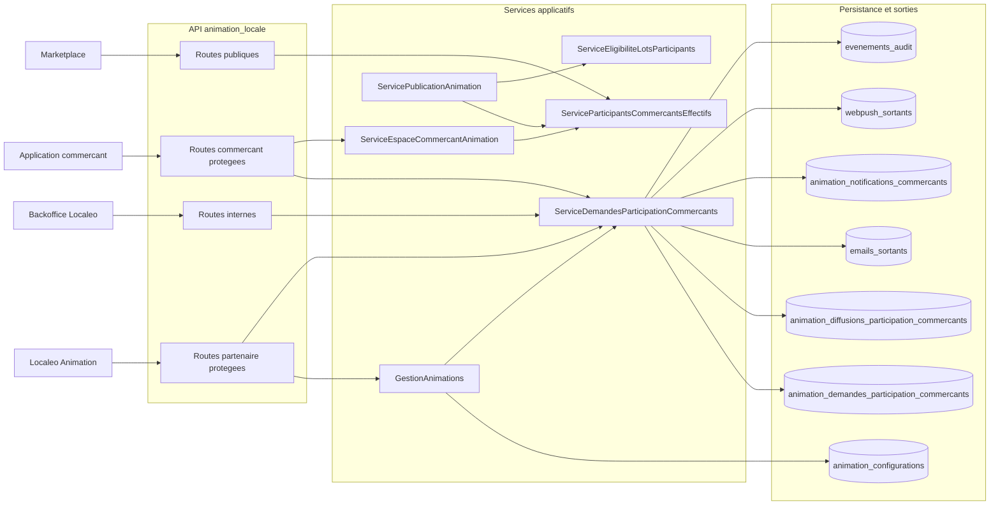
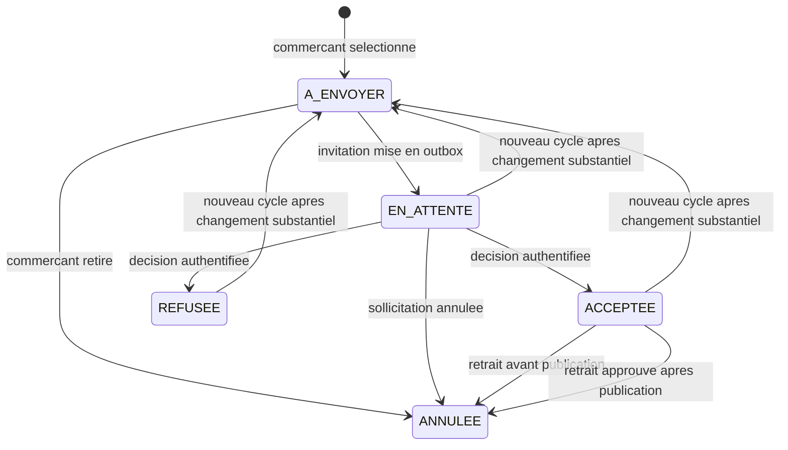

# Conception technique - Epic 56 Validation de la participation des commercants

> Consolidation documentaire du 18 septembre 2026 : versions Backend, Animation et Commerçant réunies. Le complément du 13 septembre sur les lots est intégré comme une évolution explicitement annoncée par sa source. Les différences sur l’aperçu privé du flyer restent signalées, sans arbitrage supplémentaire.

## 1. Etat et objectif

- Date de finalisation : `2026-08-28`.
- Statut : scope backend implemente le `2026-08-28`, interfaces clientes a realiser.
- Domaine proprietaire : `animation_locale`.
- Surfaces : backend/backoffice Localeo, Localeo Animation, application commercant et projection Marketplace.
- Source fonctionnelle : [backlog Epic 56](../../roadmap/terminees/epic-56-validation-participation-commercants-animation-backlog.md).
- Decisions : [registre des arbitrages](registre-arbitrages.md).

La cible remplace l'inclusion implicite d'un commercant par une demande de participation explicite. Le backend doit pouvoir prouver quelle version de l'animation a ete presentee, recueillir une decision authentifiee, stabiliser les participants avant publication et reutiliser cette population dans tous les controles existants.

## 2. Analyse de l'existant

L'Epic s'insere dans le socle Animation existant sans creer un nouveau domaine :

- `AnimationOrm` et `ConfigurationAnimationOrm` portent deja une animation et ses configurations JSONB versionnees ;
- `GestionAnimations` normalise actuellement `commercant_ids` et calcule les `regles` effectives ;
- `ServiceEspaceCommercantAnimation._participe` assimile directement la presence dans `commercant_ids` a une participation ;
- `ServiceEspaceCommercantAnimation.notifier_inclusions_dans_uow` cree une notification applicative et une WebPush seulement lors de la publication, sans email ni decision ;
- `ServiceValidationsAnimation`, `CatalogueAnimationsPubliques`, les bilans, le pilotage et la Vision 360 utilisent directement `commercant_ids` ;
- La copie backend indique que `ServiceFlyerAnimation` genere un apercu prive en brouillon puis promeut le PDF et le PNG pendant la publication. Les copies frontend decrivent une generation seulement lors de la publication ; la difference doit etre rapprochee de la disponibilite effective de l’aperçu partenaire ;
- `ServiceCommandeLotsAnimation` verifie l'activite et la commune du coffret, mais pas le lien entre ses prestations et les commercants ayant accepte ;
- les outbox `emails_sortants` et `webpush_sortants`, l'inbox `animation_notifications_commercants`, l'idempotence Animation et le journal d'audit sont reutilisables.

La conception doit donc retirer la responsabilite de consentement a `commercant_ids` tout en conservant ce champ comme liste de selection du brouillon et pour la compatibilite des configurations historiques.

## 3. Decisions techniques structurantes

1. La demande de participation est un nouvel agregat du domaine `animation_locale`.
2. `configuration.parametres.mission_commercant` est la source de verite de la mission, au meme niveau que `regles`.
3. `commercant_ids` reste la liste des commercants selectionnes ; il ne constitue plus une preuve de participation.
4. Une demande conserve un snapshot canonique de la version de l'animation presentee, mais aucune mission autonome editable.
5. Les participants acceptes sont figes dans `commercant_participant_ids` lors de la publication.
6. Avant publication, la population effective est derivee des demandes courantes `ACCEPTEE`. Apres publication, les parcours publics et terrain utilisent le snapshot de publication.
7. Email, notification applicative et WebPush eventuelle sont crees dans la meme transaction que le passage de la demande a `EN_ATTENTE`.
8. Le lien email ou WebPush ne porte aucun jeton de decision. Il ouvre une route de l'application commercant, puis l'API exige la session existante `commercant:animation`.
9. Aucun flyer ni aperçu n’est exposé au commerçant avant publication. Le backend documente un aperçu privé pour le partenaire en brouillon ; les anciennes conceptions frontend interdisent toute génération avant publication. Cette divergence de portée reste à vérifier, sans modifier la protection de l’accès commerçant.
10. Les indicateurs sont des projections synchrones ; aucune table d'agregats statistiques n'est creee au MVP.
11. Les controles de publication, de lot et de validation s'appuient sur un service unique de resolution des participants effectifs.
12. Le workflow actuel d'inclusion apres publication est decommissionne pour les nouvelles animations.
13. La validation d'une animation est decoupee en trois niveaux : brouillon, envoi des invitations et publication. Les lots deviennent obligatoires seulement pour leur achat et la publication.

## 4. Vue applicative cible



## 5. Metadonnees de configuration

### 5.1 Contrat cible

La configuration versionnee ajoute deux champs saisissables et un champ serveur :

```json
{
  "mission_commercant": {
    "titre": "Valider le passage des participants",
    "description": "Accueillir le participant et scanner son QR depuis l'application commercant.",
    "consignes": [
      "Verifier qu'un achat a ete effectue, sans minimum d'achat.",
      "Ne valider qu'un passage conforme au reglement."
    ]
  },
  "date_limite_reponse_commercants": "2026-10-15T21:59:59Z",
  "regles_sources": {
    "nombre_validations_requises": "AUTO"
  },
  "commercant_participant_ids": []
}
```

Regles de validation :

- `mission_commercant.titre` : obligatoire avant envoi, de `1` a `160` caracteres ;
- `mission_commercant.description` : obligatoire avant envoi, de `1` a `4 000` caracteres ;
- `mission_commercant.consignes` : `0` a `20` valeurs, chacune limitee a `500` caracteres ;
- les balises HTML sont refusees ; les valeurs sont normalisees et restituees en texte ;
- `date_limite_reponse_commercants` : obligatoire avant envoi, strictement future et au plus tard egale a `date_debut` ;
- apres un premier envoi, la date limite peut uniquement etre prolongee ;
- `regles_sources.nombre_validations_requises` est renseigne par le serveur avec `AUTO` lorsque la valeur depend du nombre de participants et `MANUEL` lorsqu'elle a ete imposee par le partenaire ;
- `commercant_participant_ids` est en lecture seule dans les APIs et n'est renseigne par le backend qu'a la publication.

Le nom technique `mission_commercant` est retenu. Le reglement reste fourni par `CatalogueModelesAnimation.reglement` et n'est pas duplique dans cette metadonnee.

### 5.2 Separation des modeles API

Le modele Pydantic unique actuel doit etre separe :

- `ConfigurationAnimationInput` pour la creation, sans `commercant_participant_ids` ;
- `ModifierAnimationRequest` pour les changements partiels ;
- `ConfigurationAnimationPayload` pour la lecture, incluant la mission et le snapshot serveur.

`StrategiePasseportCommercant.valider` normalise `mission_commercant` mais autorise son absence dans un brouillon. La checklist d'envoi, et non la creation du brouillon, rend cette metadonnee obligatoire.

### 5.3 Niveaux de validation

La validation monolithique actuelle de `StrategiePasseportCommercant` doit etre separee :

| Niveau | Exigences principales |
| --- | --- |
| `valider_brouillon` | nom, modele et dates coherentes ; `commercant_ids` et `lots` peuvent encore etre incomplets |
| `valider_envoi_invitations` | au moins un commercant selectionne, mission complete, reglement disponible, date limite valide et email pour chaque demande ciblee |
| `valider_publication` | demandes resolues, minimum d'acceptations, lots presents, finances completes et tous les autres prerequis existants |

Cette separation permet le parcours obligatoire : selectionner et inviter les commercants, recueillir leurs accords, puis choisir et acheter les lots ; le lien entre leurs prestations et les commerçants acceptés est désormais un diagnostic non bloquant. `GestionAnimations.creer` et `modifier` utilisent la validation brouillon ; les services d'envoi et de publication appellent leur niveau respectif.

### 5.4 Empreinte du contenu presente

Le snapshot de consentement contient uniquement :

- `animation_id`, `nom`, `description`, `modele_code` ;
- `date_debut`, `date_fin` ;
- `regles` effectives ;
- `reglement.version`, `reglement.titre`, `reglement.format` et `reglement.contenu` ;
- `mission_commercant` ;
- identite publique de l'organisateur.

Le détail API expose ce snapshot sous `contenu` et sa version sous `version_presentee`.
Le champ `contact`, séparé du contenu figé, contient le nom et l'email actuels du
gestionnaire auteur de l'invitation initiale (`INVITATION`, relance 0). Il est résolu
dans l'historique des diffusions, y compris pour les anciennes demandes, et limité
au partenaire de l'animation. Une relance ne change pas cet interlocuteur. En
l'absence d'expéditeur identifiable, le contact reste non renseigné. Les réponses
d'acceptation, de refus et de retrait restituent aussi le contenu et le contact.


Il exclut les lots, assets, donnees techniques et coordonnees des autres commercants. Sa representation JSON canonique utilise des cles triees, UTF-8 et des separateurs stables. Son SHA-256 est stocke dans `contenu_sha256`.

Avant publication, les champs substantiels sont `nom`, `description`, `date_debut`, `date_fin`, `regles`, `reglement` et `mission_commercant`. Leur modification apres envoi cree un nouveau cycle de demandes. Les assets, lots et la prolongation de la date limite ne changent pas l'empreinte de consentement.

Apres publication, les changements substantiels restent interdits par le cycle de vie existant. L'unique exception conservee est la prolongation de `date_fin` d'une animation `EN_COURS` : elle copie `commercant_participant_ids` dans la nouvelle configuration, ne revoque pas les accords deja acquis, regenere le flyer et notifie les commercants participants. Cette precision preserve l'evolution deja implementee sans autoriser une nouvelle mission ou de nouvelles regles en cours d'animation.

## 6. Modele de domaine et persistance

### 6.1 Agregat principal

Creer :

- `app/domaine/animation_locale/entities/demande_participation_commercant.py` ;
- `app/domaine/animation_locale/repositories/demande_participation_commercant_repository.py` ;
- `app/infrastructure/persistence/repositories/animation_locale_repositories.py` pour l'adaptateur SQLAlchemy ;
- l'accesseur `uow.demandes_participation_commercants` dans `SqlAlchemyUnitOfWork`.

L'entite `DemandeParticipationCommercantAnimation` expose les transitions, sans manipulation directe du statut depuis l'API.

### 6.2 Table `animation_demandes_participation_commercants`

| Colonne | Type | Nullabilite | Regle |
| --- | --- | --- | --- |
| `id` | UUID | non nulle | cle primaire |
| `animation_id` | UUID | non nulle | FK `animation_animations`, cascade a la suppression du brouillon |
| `commercant_id` | UUID | non nulle | FK `commercants`, suppression restreinte |
| `cycle` | INTEGER | non nulle | commence a `1`, incremente apres invalidation substantielle |
| `est_courante` | BOOLEAN | non nulle | une seule ligne courante par animation et commercant |
| `statut` | TEXT | non nulle | `A_ENVOYER`, `EN_ATTENTE`, `ACCEPTEE`, `REFUSEE`, `ANNULEE` |
| `origine` | TEXT | non nulle | `STANDARD` ou `REPRISE_EXISTANT` |
| `configuration_id_presentee` | UUID | nullable | FK vers `animation_configurations`, renseignee au premier envoi |
| `configuration_version_presentee` | INTEGER | nullable | facilite la lecture et le diagnostic |
| `contenu_snapshot` | JSONB | nullable | obligatoire a partir de `EN_ATTENTE` |
| `contenu_sha256` | TEXT | nullable | 64 caracteres hexadecimaux, obligatoire a partir de l'envoi |
| `date_limite_reponse` | TIMESTAMP | non nulle | date UTC figee ou prolongee explicitement |
| `nb_relances` | INTEGER | non nulle | `0..3` |
| `premier_envoi_at` | TIMESTAMP | nullable | renseigne au premier envoi |
| `dernier_envoi_at` | TIMESTAMP | nullable | premier envoi ou derniere relance |
| `decision_at` | TIMESTAMP | nullable | obligatoire pour `ACCEPTEE` et `REFUSEE` |
| `decision_session_id` | UUID | nullable | session commercant ayant porte la decision |
| `motif_refus` | TEXT | nullable | facultatif, `1 000` caracteres maximum |
| `annulation_at` | TIMESTAMP | nullable | retrait, suppression de selection ou invalidation |
| `annulation_motif` | TEXT | nullable | code metier stable |
| `retrait_demande_at` | TIMESTAMP | nullable | demande de retrait apres publication |
| `retrait_motif` | TEXT | nullable | facultatif, `1 000` caracteres maximum |
| `retrait_decision` | TEXT | nullable | `ACCEPTEE` ou `REFUSEE` par le partenaire |
| `retrait_decision_at` | TIMESTAMP | nullable | date de traitement partenaire |
| `retrait_decision_by` | UUID | nullable | gestionnaire ayant traite le retrait |
| `version` | INTEGER | non nulle | verrou optimiste, commence a `1` |
| `created_by` | UUID | nullable | gestionnaire ou `NULL` pour migration |
| `created_at` / `updated_at` | TIMESTAMP | non nulles | UTC |

Contraintes et index :

```sql
CHECK (statut IN ('A_ENVOYER','EN_ATTENTE','ACCEPTEE','REFUSEE','ANNULEE'))
CHECK (origine IN ('STANDARD','REPRISE_EXISTANT'))
CHECK (cycle >= 1)
CHECK (nb_relances BETWEEN 0 AND 3)
CHECK (version >= 1)
UNIQUE (animation_id, commercant_id, cycle)
CREATE UNIQUE INDEX uq_animation_demande_participation_courante
  ON animation_demandes_participation_commercants(animation_id, commercant_id)
  WHERE est_courante
INDEX (animation_id, est_courante, statut)
INDEX (commercant_id, est_courante, statut, updated_at DESC)
INDEX (statut, date_limite_reponse) WHERE est_courante AND statut = 'EN_ATTENTE'
```

Les invariants conditionnels entre statut, snapshot et dates sont controles dans l'entite et doubles par des `CHECK` SQL lorsque leur expression reste lisible.

### 6.3 Historique des diffusions

La table `animation_diffusions_participation_commercants` trace chaque tentative fonctionnelle d'envoi :

| Colonne | Type | Regle |
| --- | --- | --- |
| `id` | UUID | cle primaire |
| `demande_id` | UUID | FK demande, cascade |
| `type_diffusion` | TEXT | `INVITATION` ou `RELANCE` |
| `numero_relance` | INTEGER | `0` pour invitation, `1..3` pour relance |
| `email_sortant_id` | UUID | FK `emails_sortants`, non nulle |
| `notification_commercant_id` | UUID | FK inbox commercant, non nulle |
| `webpush_sortant_id` | UUID | FK WebPush, nullable |
| `created_by` | UUID | gestionnaire demandeur |
| `correlation_id` | TEXT | correlation propagable |
| `created_at` | TIMESTAMP | UTC |

La contrainte `UNIQUE(demande_id, numero_relance)` empeche un double envoi fonctionnel. Les statuts de distribution restent portes par les outbox existantes ; cette table conserve uniquement leurs references.

### 6.4 Representation de la reprise historique

`ACCEPTEE_REPRISE_EXISTANT` reste un libelle fonctionnel. Techniquement, la ligne utilise :

```text
statut = ACCEPTEE
origine = REPRISE_EXISTANT
```

Cette decomposition evite d'ajouter un statut possedant les memes transitions qu'une acceptation normale.

## 7. Machine d'etats



Les fleches vers `A_ENVOYER` apres changement substantiel representent deux lignes : l'ancienne est passee a `ANNULEE` et `est_courante=false`, puis une nouvelle demande de cycle suivant est creee.

Regles de concurrence :

- acceptation, refus, annulation, relance et retrait chargent la demande `FOR UPDATE` ;
- rejouer la meme decision retourne la projection courante avec `idempotent_replay=true` ;
- tenter la decision opposee retourne `409 DECISION_PARTICIPATION_DEJA_ENREGISTREE` ;
- une reponse recue strictement apres `date_limite_reponse` retourne `409 DATE_LIMITE_REPONSE_DEPASSEE` ;
- le statut reste `EN_ATTENTE` apres echeance afin que le partenaire doive prolonger, relancer ou annuler ; la projection expose `echeance_depassee=true`.

## 8. Services applicatifs

### 8.1 `ServiceDemandesParticipationCommercantsAnimation`

Nouveau fichier cible :

`app/application/animation_locale/services/demandes_participation_commercants.py`

Responsabilites :

- synchroniser les demandes courantes avec `commercant_ids` lors de la creation ou modification du brouillon ;
- verifier la checklist et envoyer une ou plusieurs invitations ;
- relancer dans les limites retenues ;
- annuler une sollicitation ;
- recueillir acceptation, refus et retrait ;
- traiter un retrait apres publication ;
- produire liste, detail, synthese et etats de diffusion ;
- enregistrer audit et notifications partenaire.

### 8.2 Synchronisation avec la configuration

Dans la transaction de `GestionAnimations.creer` ou `modifier` :

1. comparer l'ancienne et la nouvelle liste `commercant_ids` ;
2. creer une demande `A_ENVOYER` pour chaque ajout ;
3. annuler la demande courante pour chaque retrait ;
4. recalculer l'empreinte des champs substantiels ;
5. avant publication, si elle change, annuler les demandes envoyees ou decidees encore courantes et creer le cycle suivant `A_ENVOYER` pour les commercants toujours selectionnes ;
6. si seule la date limite est prolongee, mettre a jour les demandes courantes sans changer de cycle ;
7. auditer les identifiants et transitions, sans snapshot complet dans les logs.

La synchronisation est atomique avec la nouvelle version de configuration. Un echec ne laisse jamais une configuration et des demandes desynchronisees.

### 8.3 Participants effectifs

`ServiceParticipantsCommercantsEffectifs` fournit une seule methode de resolution :

```text
BROUILLON ou CONFIGUREE -> demandes courantes ACCEPTEE
PUBLIEE et statuts suivants -> configuration.commercant_participant_ids
reprise legacy temporaire -> configuration.commercant_ids
```

Le fallback legacy n'est actif que pendant le deploiement et uniquement si la configuration a ete marquee `participation_migree=false`. Il est supprime apres verification de la migration.

Les consommateurs a migrer sont au minimum :

- `ServiceEspaceCommercantAnimation` ;
- `ServiceValidationsAnimation` et le calcul de progression ;
- `CatalogueAnimationsPubliques` ;
- `CatalogueModelesAnimation.regles_effectives` ;
- `ServicePilotageAnimation`, bilans, exports et Vision 360 Animation ;
- generation du flyer et controle des lots.

## 9. Contrats API

Toutes les dates sont retournees en ISO 8601 UTC. Les routes de commande exigent `Idempotency-Key` et propagent `X-Correlation-Id`.

### 9.1 Localeo Animation

Permission ajoutee :

```text
animation:gerer_participations_commercants
```

Elle est attribuee aux gestionnaires Animation provisionnes et reste distincte de `animation:lire`.

| Methode et route | Usage |
| --- | --- |
| `GET /protected/animation-locale/animations/{id}/demandes-participation` | liste paginee, filtres statut, commercant et echeance |
| `GET /protected/animation-locale/animations/{id}/demandes-participation/synthese` | compteurs, taux, diffusions en erreur |
| `POST /protected/animation-locale/animations/{id}/demandes-participation/envoyer` | envoi groupe des demandes `A_ENVOYER` selectionnees |
| `POST /protected/animation-locale/animations/{id}/demandes-participation/{demande_id}/relancer` | relance d'une demande `EN_ATTENTE` |
| `POST /protected/animation-locale/animations/{id}/demandes-participation/{demande_id}/annuler` | annulation avant publication |
| `POST /protected/animation-locale/animations/{id}/demandes-participation/{demande_id}/retrait/accepter` | traitement positif d'un retrait apres publication |
| `POST /protected/animation-locale/animations/{id}/demandes-participation/{demande_id}/retrait/refuser` | refus motive du retrait apres publication |

L'endpoint d'envoi accepte :

```json
{
  "demande_ids": ["uuid"],
  "confirmer_version_configuration": 4
}
```

La version obligatoire evite d'envoyer un contenu que le partenaire n'a pas relu. Une divergence retourne `409 CONFIGURATION_ANIMATION_MODIFIEE`.

La projection d'une demande contient : identifiants, commerce, statut, origine, cycle, version presentee, date limite, echeance depassee, dates d'envoi et de decision, motif de refus, nombre de relances, prochaine relance autorisee, retrait et etat de chaque canal. Elle ne retourne le snapshot complet que dans le detail autorise.

### 9.2 Application commercant

Toutes les routes reutilisent `require_commercant_session_scope("commercant:animation")` et ignorent tout `commercant_id` fourni par le client.

| Methode et route | Usage |
| --- | --- |
| `GET /protected/animation-locale/commercants/me/demandes-participation` | demandes en attente et historique du commercant |
| `GET /protected/animation-locale/commercants/me/demandes-participation/{id}` | contenu snapshot presente et actions autorisees |
| `POST /protected/animation-locale/commercants/me/demandes-participation/{id}/accepter` | acceptation authentifiee |
| `POST /protected/animation-locale/commercants/me/demandes-participation/{id}/refuser` | refus avec motif facultatif |
| `POST /protected/animation-locale/commercants/me/demandes-participation/{id}/retirer` | retrait direct avant publication ou demande de retrait apres publication |
| `POST /protected/animation-locale/commercants/me/notifications/{id}/non-lire` | remettre une notification de participation en non lue |
| `DELETE /protected/animation-locale/commercants/me/notifications/{id}` | masquer durablement une notification par suppression logique |
| `GET /protected/animation-locale/commercants/me/animations/{id}/flyer` | metadonnees du flyer apres publication |
| `GET /protected/animation-locale/commercants/me/animations/{id}/flyer/download` | PDF apres publication et acceptation |

Le detail de demande expose `animation`, `regles`, `reglement`, `mission_commercant`, `date_limite_reponse`, `decision` et `actions`. Il ne depend pas de la configuration courante : il restitue le snapshot presente. Le retour en non lu remet `lue_at` a `null`. La suppression renseigne `supprimee_at` et preserve la ligne referencee par l'historique de diffusion ; les notifications supprimees sont exclues de l'inbox et du badge.

Le deep link cible est construit avec une nouvelle variable :

```text
LOCALEO_FRONT_COMMERCANT_ANIMATION_INVITATION_URL_TEMPLATE
```

La valeur doit contenir `{demande_id}`. Exemple :

```text
https://localeo.app/commercants/animations/invitations/{demande_id}
```

### 9.3 Marketplace

Aucune route de commande n'est ajoutee. `AnimationPubliquePayload.commercants` est alimente uniquement par `commercant_participant_ids`. Les demandes, refus, relances, motifs et missions internes ne sont jamais exposes publiquement.

### 9.4 Backoffice interne

| Methode et route | Usage |
| --- | --- |
| `GET /internal/animation-locale/demandes-participation` | recherche transverse par animation, commune, partenaire, commercant, statut ou erreur de canal |
| `GET /internal/animation-locale/demandes-participation/{id}` | chronologie, snapshot, diffusions et audit associe |

Le MVP interne est en lecture seule. Les corrections restent realisees par les use cases metier du partenaire ou du commercant, afin d'eviter une mutation SQLAdmin contournant les invariants.

## 10. Envoi, notification et relance

### 10.1 Premier envoi

Dans une seule unite de travail :

1. verrouiller l'animation, sa configuration et les demandes ciblees ;
2. verifier statut de preparation, tenant, commercant actif, email de contact, mission, reglement, dates et date limite ;
3. produire snapshot et empreinte ;
4. preparer un email `INVITATION_PARTICIPATION_COMMERCANT_ANIMATION` avec `source_type=DEMANDE_PARTICIPATION_COMMERCANT_ANIMATION` et `source_id=demande.id` ;
5. creer une notification `ANIMATION_PARTICIPATION_DEMANDEE` avec `inclusion_key=diffusion:{diffusion_id}` ;
6. creer une WebPush si un abonnement commercant actif existe, avec `resource_type=DIFFUSION_PARTICIPATION_ANIMATION` et `resource_id=diffusion.id` ;
7. enregistrer la diffusion ;
8. passer la demande a `EN_ATTENTE` ;
9. journaliser puis commit.

L'email et la notification applicative sont obligatoires. Si `contact_email` est absent ou invalide, aucun canal n'est cree et la demande reste `A_ENVOYER` avec l'erreur `EMAIL_COMMERCANT_ABSENT` ou `EMAIL_COMMERCANT_INVALIDE`.

La WebPush est facultative. Son absence n'est ni une erreur ni un blocage.

### 10.2 Relance

Une relance est autorisee si :

- la demande est `EN_ATTENTE` ;
- la date limite n'est pas depassee ;
- `nb_relances < 3` ;
- `dernier_envoi_at <= now - 24 heures`.

Elle cree un nouvel email dont `email_initial_id` reference le premier email, une nouvelle notification applicative et une WebPush eventuelle. Les erreurs contractuelles sont :

- `RELANCE_PARTICIPATION_TROP_PRECOCE` avec `prochaine_relance_at` ;
- `NOMBRE_MAX_RELANCES_ATTEINT` ;
- `DATE_LIMITE_REPONSE_DEPASSEE` ;
- `DEMANDE_PARTICIPATION_NON_RELANCABLE`.

Un echec ulterieur du fournisseur email ou WebPush ne remet pas la demande en `A_ENVOYER`. L'etat du canal est visible dans Localeo Animation et le backoffice.

### 10.3 Decommissionnement de l'inclusion actuelle

`ServiceEspaceCommercantAnimation.notifier_inclusions_dans_uow` n'est plus appele pour annoncer une inclusion automatique. A la publication, une notification `ANIMATION_PUBLIEE_FLYER_DISPONIBLE` peut etre creee pour chaque commercant accepte, sans nouvel email obligatoire. Elle pointe vers l'animation publiee et son flyer.

## 11. Publication et snapshot des participants

`ServicePublicationAnimation.valider` ajoute les codes bloquants :

- `MISSION_COMMERCANT_INCOMPLETE` ;
- `DATE_LIMITE_REPONSE_COMMERCANTS_INVALIDE` ;
- `DEMANDES_PARTICIPATION_A_ENVOYER` ;
- `DEMANDES_PARTICIPATION_EN_ATTENTE` ;
- `AUCUN_COMMERCANT_PARTICIPANT` ;
- `MINIMUM_COMMERCANTS_PARTICIPANTS_NON_ATTEINT`.

`COFFRET_LOT_SANS_PRESTATION_PARTICIPANT` est renvoyé dans `avertissements`, jamais dans `erreurs`, et ne rend pas `valide` faux, conformément au complément du 13 septembre.

Les demandes `REFUSEE` et `ANNULEE` sont resolues et ne bloquent pas. Une demande `A_ENVOYER` bloque egalement la publication : le partenaire doit l'envoyer ou retirer le commercant de sa selection, afin qu'aucune candidature ne soit ignoree silencieusement.

Dans `publier`, apres verrouillage et nouvelle validation dans la transaction :

1. resoudre les demandes courantes `ACCEPTEE` ;
2. creer une nouvelle version de configuration contenant `commercant_participant_ids` tries et uniques ;
3. recalculer les regles dependantes du nombre de participants lorsque `regles_sources` vaut `AUTO`, notamment `nombre_validations_requises` ;
4. incrementer `animation.version` ;
5. generer le flyer a partir de cette version figee ;
6. publier l'animation ;
7. emettre audit, activite et notifications dans la meme unite de travail.

La génération du flyer final publié utilise la population figée. Cette contrainte ne tranche pas la divergence documentaire sur un éventuel aperçu privé du partenaire en brouillon.

## 12. Eligibilite des lots

La [mise à jour du 13 septembre 2026](avertissement-lots-sans-participant.md) distingue les conditions d’éligibilité du diagnostic de présence de prestations de participants. `ServiceEligibiliteLotsParticipantsAnimation` calcule notamment ce diagnostic :

```sql
EXISTS (
  SELECT 1
  FROM prestations_coffret p
  JOIN commercants c ON c.id = p.commercant_id
  WHERE p.coffret_id = :coffret_id
    AND p.statut = 'ACTIVE'
    AND c.statut = 'ACTIF'
    AND p.commercant_id = ANY(:participants_acceptes)
)
```

Le service retourne les `commercant_ids_couvrants`. Si la requête ne trouve pas de prestation participante, le coffret reste dans le catalogue `eligible=true` lorsque ses autres conditions sont remplies ; le diagnostic est exposé dans `metadata.avertissements`. Le paiement et la publication n’imposent plus ce lien.

Le diagnostic est recalculé aux étapes concernées sans faire du lien aux participants une condition bloquante :

1. lors de la projection des coffrets eligibles ;
2. avant la creation d'une commande de lots dans `_construire_lignes` ;
3. lors de la reconciliation/reservation si la commande n'est pas encore payee ;
4. dans la validation de publication ;
5. une derniere fois sous verrou dans la transaction de publication.

Les lots ne sont pas exiges lors de la creation du brouillon ni pour envoyer les invitations. Ils deviennent obligatoires avant la creation de leur commande et pour la publication.

Si un lot perd uniquement le lien avec les prestations d’un participant, un avertissement est affiché et la publication reste possible. Une perte des autres conditions d’éligibilité — catalogue, commune, statut ou financement — conserve son caractère bloquant avec une action requise. Le remplacement reutilise les controles financiers de `ServiceFinancementLotsAnimation`; si le remplacement n'est plus possible automatiquement, l'action devient `CONTACTER_SUPPORT` et aucun nouveau paiement implicite n'est cree.

Le message du portail est : « Un ou plusieurs coffrets ne contiennent aucune prestation active d’un commerçant participant. Vous pouvez néanmoins payer les lots et publier l’animation. » Le serveur et l’interface doivent être livrés pour obtenir le comportement complet. La recette doit couvrir sélection, paiement et publication malgré cet avertissement, tout en maintenant le blocage des coffrets indisponibles.

## 13. Application commercant et flyer

La liste existante `/commercants/me/animations` ne contient que les animations acceptees et publiees ou ayant depasse ce stade. Les demandes en attente sont exposees exclusivement par les nouvelles routes de demandes.

`ServiceEspaceCommercantAnimation._participe` est remplace par le service de participants effectifs. Le detail d'une animation acceptee ajoute `mission_commercant`, `regles` et `reglement`.

L'acces au flyer verifie simultanement :

- session commercant valide ;
- demande acceptee ou presence dans le snapshot historique migre ;
- animation dans `PUBLIEE`, `EN_COURS`, `CLOTUREE` ou `ARCHIVEE` ;
- document courant `PUBLIE` rattache a l'animation.

Un brouillon ou une animation seulement configuree retourne `404 FLYER_ANIMATION_INTROUVABLE`, afin de ne pas reveler l'existence d'un document inaccessible. Les documents generes portent les scopes `PORTAIL_ANIMATION` et `APPLICATION_COMMERCANT`.

## 14. Retrait apres publication

Avant publication, l'action commerçant passe directement la demande acceptee a `ANNULEE`.

Apres publication :

1. l'action commercant renseigne `retrait_demande_at` et notifie le partenaire ;
2. le commercant reste participant tant que le retrait n'est pas approuve ;
3. le partenaire consulte les impacts calcules : minimum de participants, progression, lots et flyer ;
4. un refus motive conserve la participation et renseigne `retrait_decision=REFUSEE` ;
5. une acceptation n'est possible que si les invariants restent satisfaits ; elle annule la demande, cree une nouvelle version de configuration et retire le commercant de `commercant_participant_ids` ;
6. les caches Marketplace sont invalides et le flyer est regenere ;
7. si les invariants ne peuvent pas etre maintenus, l'API retourne `409 RETRAIT_PARTICIPANT_IMPOSSIBLE` avec les actions requises.

La perte du seul lien entre un lot et un commerçant participant ne bloque pas ce retrait ; les autres invariants ci-dessus restent exigés.

Cette action exceptionnelle est integralement auditee. Elle ne reecrit jamais une configuration historique.

## 15. Metriques et projection Localeo Animation

La synthese est calculee sur les demandes courantes `origine=STANDARD` de l'animation :

| Champ | Calcul |
| --- | --- |
| `sollicites` | demandes ayant connu au moins une diffusion |
| `a_envoyer` | statut `A_ENVOYER` |
| `en_attente` | statut `EN_ATTENTE` |
| `en_attente_echues` | `EN_ATTENTE` et date limite depassee |
| `acceptes` | statut `ACCEPTEE` |
| `refuses` | statut `REFUSEE` |
| `annules` | statut `ANNULEE` |
| `taux_reponse` | `(acceptes + refuses) / sollicites` |
| `taux_acceptation` | `acceptes / (acceptes + refuses)` |
| `relances` | somme de `nb_relances` |
| `diffusions_email_en_erreur` | emails references dont le statut est en echec |
| `diffusions_webpush_en_erreur` | WebPush references dont le statut est en echec |

Les taux sont des nombres decimaux de `0` a `100`, arrondis a deux decimales. Un denominateur nul produit `0.0`. Les volumes bruts sont toujours retournes avec les taux.

Pour la reprise historique, les demandes `origine=REPRISE_EXISTANT` sont affichees dans les volumes de participants mais exclues des taux de reponse et d'acceptation, puisqu'aucune sollicitation reelle n'a eu lieu.

## 16. Securite, audit et idempotence

### 16.1 Autorisations

- un gestionnaire doit appartenir au partenaire, a la commune active et posseder `animation:gerer_participations_commercants` ;
- un commercant ne peut lire ou modifier que les demandes dont `commercant_id` est celui de sa session ;
- l'envoi initial et la publication exigent un droit plateforme Animation actif ; une demande deja envoyee reste consultable et decidable par le commercant si l'abonnement du partenaire expire entre-temps ;
- dans ce cas, le contexte commercant expose `animation:repondre_invitation`, tandis que `animation:lire` et `animation:valider` restent soumis aux droits applicables aux animations publiees ;
- une ressource hors tenant ou appartenant a un autre commercant retourne `404` ;
- le snapshot n'est jamais expose a la Marketplace ;
- les motifs de refus et retrait sont reserves au partenaire concerne et au backoffice autorise.

### 16.2 Audit

Actions minimales :

- `animation_locale.demande_participation.creation` ;
- `animation_locale.demande_participation.envoi` ;
- `animation_locale.demande_participation.relance` ;
- `animation_locale.demande_participation.acceptation` ;
- `animation_locale.demande_participation.refus` ;
- `animation_locale.demande_participation.annulation` ;
- `animation_locale.demande_participation.retrait_demande` ;
- `animation_locale.demande_participation.retrait_decision` ;
- `animation_locale.flyer.consultation_commercant` ;
- `animation_locale.participants_snapshot.publication`.

Les metadonnees contiennent identifiants, ancien/nouveau statut, configuration version, empreinte, canal et correlation. Elles excluent corps email, reglement complet, mission complete, email, motif libre et secrets WebPush.

### 16.3 Idempotence

Les routes de commande reutilisent `animation_idempotence` avec l'acteur authentifie, la route, la cle et l'empreinte du payload. Les contraintes SQL de cycle et diffusion protegent egalement contre deux requetes concurrentes.

Une meme cle avec un payload different retourne `409 IDEMPOTENCY_KEY_REUSED_WITH_DIFFERENT_PAYLOAD`.

## 17. Observabilite et erreurs

Tous les nouveaux use cases utilisent l'instrumentation existante et propagent `correlation_id`. Les logs structures ajoutent uniquement :

- `animation_id`, `demande_id`, `commercant_id` ;
- operation et transition ;
- resultat, duree et code d'erreur ;
- nombre de canaux crees ;
- configuration version et empreinte tronquee si necessaire.

Metriques techniques recommandees :

- compteur d'envois et relances par canal/resultat ;
- compteur de decisions par type ;
- histogramme du delai de reponse ;
- jauge de demandes echues en attente ;
- compteur des blocages de publication par code ;
- compteur des lots devenus ineligibles.

Les erreurs API utilisent le format transverse avec detail et `correlationId` lorsque disponible.

## 18. Migration et compatibilite

### 18.1 Migration SQL

La prochaine migration cible est :

`sql/v182_epic56_participation_commercants_animation.sql`

Elle doit :

1. creer les deux tables et leurs contraintes ;
2. ajouter les modeles ORM et index ;
3. ajouter `animation:gerer_participations_commercants` aux habilitations Animation actives qui possedent deja `animation:modifier`, sans dupliquer la valeur JSONB ;
4. creer des demandes historiques pour les commercants des configurations courantes ;
5. ne jamais modifier un fichier de migration deja applique ;
6. rester idempotente selon les conventions du projet.

### 18.2 Backfill

- `PUBLIEE`, `EN_COURS`, `CLOTUREE`, `ARCHIVEE` : creer une demande courante `ACCEPTEE`, `origine=REPRISE_EXISTANT`, puis une nouvelle version de configuration contenant `commercant_participant_ids=commercant_ids` ;
- `BROUILLON`, `CONFIGUREE` : creer une demande `A_ENVOYER` par commercant selectionne ; la mission doit etre completee avant envoi ;
- `ANNULEE` : ne creer aucune demande courante ;
- si la date limite n'existe pas dans un brouillon, reprendre `date_debut` sans envoyer automatiquement ; si elle est deja passee, Localeo Animation exige une prolongation ;
- ne creer aucun email, notification ou WebPush pendant la migration.

La migration insere une nouvelle configuration plutot que de modifier une ligne versionnee existante, puis aligne `AnimationOrm.version`.

### 18.3 Deploiement coordonne

1. deployer migration, ORM, backfill et lecture compatible ;
2. deployer les APIs et l'application commercant ;
3. deployer Localeo Animation ;
4. activer `LOCALEO_ANIMATION_MERCHANT_CONSENT_ENFORCED=true` ;
5. verifier l'absence de configuration publiee non migree ;
6. retirer le fallback legacy dans une release ulterieure.

Avant activation, les nouvelles routes fonctionnent mais les controles bloquants restent en mode avertissement pour eviter de rendre le portail inutilisable pendant le deploiement multi-applications.

## 19. Strategie de tests

### 19.1 Domaine

- toutes les transitions autorisees et interdites ;
- limite de trois relances et delai de 24 heures ;
- decision apres echeance ;
- idempotence de meme decision et conflit de decision opposee ;
- invalidation lors d'une modification substantielle ;
- retrait avant et apres publication.

### 19.2 Application

- synchronisation ajout/retrait des commercants avec la configuration ;
- creation atomique demande, diffusion et outbox ;
- absence d'email : aucun envoi partiel ;
- WebPush absente : envoi email et inbox reussi ;
- calcul des metriques, y compris zero et reprise historique ;
- selection des participants effectifs avant et apres publication ;
- controle du lot avec zero, une ou plusieurs prestations participantes ;
- publication concurrente avec une decision ou une relance.

### 19.3 API et securite

- isolation partenaire/commune et isolation commercant ;
- scope commerçant obligatoire ;
- permission partenaire obligatoire ;
- snapshot inaccessible publiquement ;
- lien profond sans pouvoir de decision ;
- flyer inaccessible avant publication ou pour un commercant non accepte ;
- idempotence et erreurs `409` documentees.

### 19.4 Migration

- test statique de `v182` ;
- execution deux fois sur une base vide ;
- reprise des quatre statuts ayant ete publies ;
- creation `A_ENVOYER` pour brouillon/configuree ;
- aucune diffusion pendant le backfill ;
- unicite de la demande courante et alignement des versions.

### 19.5 Non-regression

- publication, flyer, inscription, scan, progression et tirage Passeport ;
- catalogue Marketplace et filtres de statut ;
- espace commercant et notifications existantes ;
- commande, paiement et reservation des lots ;
- Vision 360 Animation, bilans et exports.

## 20. Decoupage d'implementation

### Lot A0 - Persistance et domaine

- migration `v182`, ORM, entites, enums, repositories et UOW ;
- tests de migration et transitions.

### Lot A1 - Metadonnees et synchronisation

- `mission_commercant`, date limite et separation input/output ;
- synchronisation des demandes avec les configurations ;
- invalidation par empreinte.

### Lot A2 - Diffusion et pilotage Localeo Animation

- envoi, relance, annulation, outbox et audit ;
- routes partenaire, liste, detail et synthese ;
- permission dediee.

### Lot A3 - Decision application commercant

- routes liste/detail/acceptation/refus/retrait ;
- deep links, notification et securite session ;
- adaptation de l'espace commercant.

### Lot A4 - Participants effectifs, publication et lots

- service de resolution central ;
- snapshot de publication ;
- migration des consommateurs `commercant_ids` ;
- eligibilite des lots et readiness.

### Lot A5 - Flyer, Marketplace et supervision

- acces flyer commercant apres publication ;
- projection publique acceptee ;
- supervision interne et retrait post-publication.

### Lot A6 - Recette coordonnee

- reprise historique ;
- tests bout en bout sur les quatre applications ;
- activation du feature flag et suppression de l'ancien envoi d'inclusion.

## 21. Definition technique de termine

- les schemas et migrations sont deployables sans modifier une migration appliquee ;
- aucune surface ne deduit une participation publique de la seule presence dans `commercant_ids` ;
- la mission est lue depuis `configuration.parametres.mission_commercant` ;
- chaque decision est authentifiee, idempotente, versionnee et auditee ;
- la publication fige les participants et refuse toute demande non resolue ;
- le diagnostic des lots contre les prestations actives des participants acceptés produit un avertissement non bloquant ; les autres conditions de validité du lot restent contrôlées ;
- le flyer n'est accessible au commercant qu'apres publication ;
- email, notification et WebPush eventuelle sont tracables jusqu'a la demande ;
- les taux sont calcules selon les arbitrages valides ;
- les tests de concurrence, securite, migration et non-regression sont verts ;
- les documentations OpenAPI, exploitation et recette sont mises a jour.

## 22. Points ouverts

Aucun arbitrage fonctionnel bloquant ne subsiste. Les seuls ajustements restants relevent de l'implementation : wording final des emails, composition visuelle des ecrans et instrumentation metrique disponible dans l'environnement d'exploitation.
