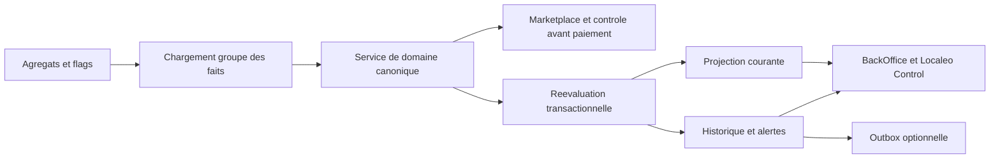

# Conception technique - Epic 60 Vision 360 Commercialisation

> Historique de conception. Etat realise et decisions deleguees : [rapport V1](rapport-developpement-v1.md), [specification detaillee](specifications-fonctionnelles.md), [contrats implementes](contrats-api.md).

> Apres fusion des Epics 60 et 61, ce document couvre le volet diagnostic.
> Les ateliers ERP sont decrits dans l'[analyse des parcours](analyse-parcours-erp.md)
> et leur conception reste a completer selon le [plan unifie](plan-livraison-unifie.md).

> Statut : conception du MVP, implementation a realiser.
> Reference de code examinee : `9607d3a`, le 2026-09-05.
> Les decisions produit sont celles du [registre](registre-arbitrages.md).

## 1. Perimetre et points de depart

Cette conception couvre PRD-561 a PRD-570 : diagnostic, projection, file de
traitement, detail, historique, alertes, couverture territoriale et Localeo
Control. Elle ne modifie ni les donnees de commercialisation depuis la vue,
ni la rentabilite de l'Epic 28. La reevaluation ecrit uniquement les donnees
de pilotage, l'audit et les demandes de notification.

| Existant verifie | Evolution necessaire |
| --- | --- |
| `app/application/referencement/services/gouvernance_catalogue.py` : diagnostic partage par liste, detail et paiement | Conserver une facade, deplacer les decisions dans un service de domaine pur ; retourner tous les controles |
| `ServiceConformiteBum._blocages_charges` et `motif_ineligibilite_stripe_connect` s'arretent au premier echec | Accumuler les echecs independants ; rendre explicites les controles impossibles |
| Le diagnostic parcourt toutes les prestations, y compris inactives, puis charge chaque commercant | Conserver ce perimetre en C0 ; lectures groupees ; toute restriction aux seules prestations actives exige une decision produit |
| Les gardes BUM et Stripe dependent de deux feature flags | Injecter leur valeur dans les faits du diagnostic et sa version de regles |
| `filtre_coffrets_bum.py` traduit certaines gardes en SQL avant pagination | Maintenir une traduction technique testee contre le domaine, sans en faire une seconde autorite metier |
| `Ville.publiee_marketplace` existe ; le diagnostic actuel ne la controle pas | Integrer le controle territorial au diagnostic et aux consommateurs publics ensemble |
| La liste publique appelle le diagnostic par coffret | Ajouter un chargement groupe des faits ; aucune lecture distante Stripe pendant le diagnostic |
| Sessions internes : `admin_authenticated`, `admin_role`, `admin_commune_ids` | Autorisation explicite sur toutes les nouvelles routes et leurs requetes SQL |
| Localeo Control est servi par `app/api/pwa_exploitation_api.py` | Ajouter resume et alertes depuis les memes use cases internes |
| `BatchRunner`, executions et verrous de batch existent | Ajouter des definitions de batch et une file durable specifique ; pas de nouveau scheduler |

Le README est la cible fonctionnelle, pas une description exhaustive du runtime
actuel. Aucun schema SQL, endpoint ou composant ci-dessous n'est deja livre par
ce document. Les contrats sont dans [contrats-api.md](contrats-api.md) et les
preuves attendues dans [plan-tests-et-livraison.md](plan-tests-et-livraison.md).

## 2. Domaine et invariants

### 2.1 Objets

Les agregats sources restent `Coffret`, `PrestationCoffret`, `Commercant`,
`Ville`, politique et qualification BUM. Aucun nouvel agregat ne les recopie.

Ajouter dans `app/domaine/commercialisation/` :

- `value_objects/faits_vendabilite.py` : faits immuables, listes de prestations
  et commercants, donnees BUM et indicateurs de disponibilite des sources ;
- `value_objects/controle_vendabilite.py` : code, famille, statut, severite,
  ressource, caractere obligatoire, dependances et motif de non-applicabilite ;
- `value_objects/diagnostic_vendabilite.py` : verdict, controles, version,
  empreinte canonique et contexte territorial ;
- `services/evaluer_vendabilite.py` : evaluation pure, sans ORM, configuration
  globale, horloge implicite ni appel reseau ;
- `entities/suivi_vendabilite.py` : transition entre deux diagnostics, episodes
  de blocage, premiere detection des causes et regles d'alerte ;
- ports de lecture des faits et de persistance du suivi dans `repositories/`.

Le domaine recoit l'instant d'evaluation. Les libelles traduits et les liens
HTTP sont resolus par un catalogue de presentation applicatif ; le domaine
emet une cle de traitement, jamais une URL dependante de SQLAdmin.

### 2.2 Calcul du verdict

Ordre imperatif, independant de l'ordre d'execution des controles :

1. Au moins un controle obligatoire `UNKNOWN` : `INDETERMINE`, meme avec
   d'autres echecs certains. Ces echecs restent visibles.
2. Sinon, au moins un controle bloquant `FAILED` : `NON_VENDABLE`.
3. Sinon : `VENDABLE`.

Une source lue avec succes et une ressource absente produisent un echec metier
connu. Une source illisible produit `UNKNOWN`. Une politique absente est un
echec certain ; les controles qui exigent cette politique ne sont pas marques
reussis. Ils portent `applicable=false`, `dependsOn` et une explication, et
ne contribuent pas une seconde fois au verdict. Les controles independants
(promesse, statut du coffret, Stripe, etc.) continuent.

Les trois statuts du README sont conserves : un controle non applicable a
`status=UNKNOWN`, `applicable=false`, `required=false`. Une desactivation par
feature flag est ainsi visible sans apparaitre comme un controle reussi.
Une exception inconnue interdit toujours un verdict vendable.

### 2.3 Referentiel de controles

Toutes les causes actives possedent code stable, famille, severite, libelle,
ressource et traitement. Ordre d'affichage : `CRITICAL`, `HIGH`, `MEDIUM`,
`LOW`, puis date de premiere detection decroissante, code et UUID.

| Code | Condition d'echec | Famille / severite | Traitement |
| --- | --- | --- | --- |
| `COFFRET_NOT_ACTIVE` | Statut different de `ACTIVE` | CATALOGUE / HIGH | Fiche coffret, statut |
| `NO_ACTIVE_PRESTATION` | Aucune prestation `ACTIVE` | CATALOGUE / HIGH | Composition du coffret |
| `INVALID_PRICE` | Prix absent ou non strictement positif en centimes | CATALOGUE / CRITICAL | Fiche coffret, prix |
| `GUARANTEED_PROMISE_MISSING` | Promesse vide hors garde BUM | CONTRAT / HIGH | Fiche coffret, promesse |
| `INDICATIVE_CONTENT_MISSING` | Contenu indicatif vide | CONTRAT / MEDIUM | Fiche coffret, contenu ; avertissement MVP |
| `BUM_POLICY_MISSING` | Aucune politique active | BUM / CRITICAL | Localeo Onboard, politique |
| `BUM_ACQUISITION_WORDING_NOT_APPROVED` | Wording acquisition non conforme | BUM / CRITICAL | Localeo Onboard, wording |
| `BUM_MARKETPLACE_WORDING_NOT_APPROVED` | Wording avant achat non conforme | BUM / CRITICAL | Localeo Onboard, wording |
| `BUM_GUARANTEED_PROMISE_MISSING` | Promesse vide avec garde BUM active | BUM / CRITICAL | Fiche coffret, promesse |
| `BUM_QUALIFICATION_MISSING` | Aucune qualification courante | BUM / CRITICAL | Localeo Onboard, qualification |
| `BUM_REQUALIFICATION_REQUIRED` | Qualification liee a une autre politique | BUM / CRITICAL | Localeo Onboard, requalification |
| `BUM_NOT_VALIDATED_MULTI_PURPOSE` | Qualification autre que MULTI_PURPOSE / VALIDATED | BUM / CRITICAL | Localeo Onboard, qualification |
| `MERCHANT_MISSING` | Commercant reference absent | COMMERCANT / HIGH | Prestation puis procedure de referencement |
| `MERCHANT_NOT_ACTIVE` | Commercant different de `ACTIF` | COMMERCANT / HIGH | Vision 360 commercant |
| `STRIPE_ACCOUNT_MISSING` | Identifiant de compte absent | STRIPE / CRITICAL | Onboarding Stripe commercant |
| `STRIPE_CHARGES_DISABLED` | Charges desactivees | STRIPE / CRITICAL | Onboarding Stripe commercant |
| `STRIPE_PAYOUTS_DISABLED` | Payouts desactives | STRIPE / CRITICAL | Onboarding Stripe commercant |
| `STRIPE_REQUIREMENTS_DUE` | Exigences dues non vides | STRIPE / CRITICAL | Onboarding Stripe commercant |
| `STRIPE_ACCOUNT_DISABLED` | Motif de desactivation present | STRIPE / CRITICAL | Onboarding Stripe commercant |
| `CITY_NOT_PUBLISHED` | Commune du coffret non publiee | TERRITOIRE / HIGH | Fiche commune |
| `CITY_MISMATCH` | Commune demandee differente de celle du coffret | TERRITOIRE / HIGH | Revenir au contexte de la commune du coffret |
| `CITY_MISSING` | Commune reference absente | TERRITOIRE / HIGH | Fiche coffret puis procedure referentiel |
| `DIAGNOSTIC_FAILED` | Faits obligatoires impossibles a charger/evaluer | TECHNIQUE / CRITICAL | Reevaluation puis exploitation |
| `STALE_PROJECTION` | Projection absente, invalidee ou trop ancienne | TECHNIQUE / CRITICAL | Reevaluation puis sante des batchs |

`GUARANTEED_PROMISE_MISSING` est un avertissement hors garde BUM au MVP pour
ne pas activer implicitement une garde desactivee. Avec BUM actif, seul le
code historique `BUM_GUARANTEED_PROMISE_MISSING` est emis pour cette cause.
Le contenu indicatif reste un avertissement tant qu'aucune regle produit
explicite n'en impose le caractere bloquant. Ces precisions figurent au registre.

Les controles Stripe sont conditionnes par le flag existant. En absence de
compte, ses capacites sont non applicables ; avec un compte, tous les echecs
independants remontent, meme si le commercant est inactif. Les exigences Stripe
brutes ne sont jamais recopiees dans la reponse : seul un indicateur et le code.

Les nouvelles gardes `NO_ACTIVE_PRESTATION`, `INVALID_PRICE` et territoriales
sont des evolutions de comportement a livrer simultanement sur les trois
parcours, apres recette des exclusions additionnelles. La dependance Epic 50
ne signifie pas que son deploiement est termine : verifier ses flags et donnees.

### 2.4 Identite, contexte et empreinte

Une projection correspond au coffret dans sa commune proprietaire uniquement.
`CITY_MISMATCH` est un resultat contextuel de consultation ; il ne modifie ni
la projection ni les alertes du coffret. Aucun produit cartesien coffret/commune.

Identite d'une cause : `(code, resourceType, resourceId)`. Un probleme Stripe
partage par trois prestations du meme commercant est une cause avec trois
references de prestations associees, pas trois alertes. Le compteur de causes
porte sur ces identites distinctes.

`diagnostic_hash` = SHA-256 d'une serialisation canonique de la version de
regles, des flags pertinents, du verdict et des identites/statuts des causes
bloquantes ou obligatoires inconnues, triees. Exclure horodatages, libelles,
ordre SQL, liens et donnees personnelles. Les avertissements ont une empreinte
separee pour historiser leurs changements sans ouvrir d'alerte critique.

Une meme cause garde son `detectedAt` tant qu'elle persiste. Apres disparition
puis reapparition, une nouvelle occurrence recoit un nouvel instant. Ces dates
designent une detection, pas une date metier reconstruite ou devinee.

## 3. Application et integration canonique

Ajouter des use cases dedies dans `app/application/commercialisation/use_cases/` :
`ConsulterSyntheseVendabilite`, `RechercherCoffretsVendabilite`,
`ConsulterDetailVendabilite`, `ReevaluerVendabiliteCoffret`,
`ListerChronologieVendabilite`, `ListerAlertesVendabilite`,
`ConsulterCouvertureCommercialisation` et `ReconcilierVendabilite`.

Le chargement groupe lit coffrets, prestations, commercants, communes,
politique et qualifications en un nombre borne de requetes par lot. Le
service applicatif assemble les faits et appelle le domaine. La migration
des regles BUM de l'application vers le domaine preserve les fonctions pures
de wording deja presentes dans `app/domaine/conformite_fiscale_bum/entities.py`.

Migrer tous les consommateurs de `diagnostiquer_blocages_vendabilite_coffret`
au contrat structure dans la meme livraison C0. Supprimer l'usage de la
veracite d'une liste comme verdict ; appeler explicitement `est_vendable`.
Le formateur de messages ne doit pas republier les causes internes aux clients.

Les routes publiques et la creation d'une nouvelle intention Checkout
evaluent les faits courants, jamais une projection reputee vendable. Le detail
interne presente le dernier diagnostic persiste et sa fraicheur ; le POST
de reevaluation fournit un diagnostic courant et persiste coherent.

Conserver les contrats publics existants : coffret exclu de la liste, detail
indisponible avec 404, achat refuse avec l'erreur metier publique generique.
Un incident technique empêche l'achat et produit une erreur generique 503,
sans envoyer d'appel Stripe. Si la lecture des faits de toute une liste echoue,
retourner 503, pas une fausse liste vide. Une projection interne perimee ne
prouve pas que la route publique est elle-meme indisponible.

Le diagnostic concerne l'eligibilite catalogue ; il ne promet ni une quantite
disponible, ni un succes Stripe, ni l'eligibilite d'un credit B2B. Les autres
regles d'achat restent appliquees. La reprise d'un Checkout deja engage garde
le contrat durable et idempotent livre par le correctif d'audit ; elle ne doit
ni recreer une intention ni changer son prix a partir de la nouvelle projection.

Revoir aussi recherche multi-scope, coffrets du moment et selections paginees
eligibles. Si un predicat SQL equivalent est conserve pour paginer efficacement,
sa parite est testee sur les memes faits. Interdit : paginer des candidats puis
filtrer la seule page. Une optimisation SQL ne peut exclure une offre que le
domaine accepte, ni accepter une offre qu'il refuse.

## 4. Persistance et concurrence

Nouvelle migration additive `sql/vNNN_epic60_vendabilite.sql`, numero attribue
au moment de l'implementation apres le dernier numero present. Ne pas modifier
v217 ni une migration appliquee. UTC pour toutes les dates ; conversion ISO 8601
explicite avec `Z` a la frontiere HTTP.

| Table cible | Donnees et contraintes |
| --- | --- |
| `projection_vendabilite_coffret` | PK/FK `coffret_id`, verdict enum controle, `blocking_codes`, `warning_codes`, hash, version de diagnostic, revision des sources, `evaluated_at`, `changed_at`, `invalidated_at`, `expires_at`, `source_event`, severite maximale, debut d'episode ; controles JSONB minimises sans copie des agregats |
| `evenement_vendabilite_coffret` | UUID, coffret, ancien/nouveau verdict et hashes, delta des causes codes/ressources, declencheur, date, revision, acteur verifie et correlation ; unique `(coffret_id, revision)` pour un changement |
| `alerte_vendabilite_coffret` | UUID d'episode/occurrence, coffret, nature METIER ou TECHNIQUE, hash, severite, ouverture, derniere observation, fermeture, motif de fermeture ; unique partiel `(coffret_id, nature)` pour une alerte ouverte |
| `demande_reevaluation_vendabilite` | PK coffret, generation demandee/traitee, disponibilite, tentative, expiration de lease, jeton de claim, dernier evenement ; coalescence des demandes sans perte de generation |
| `idempotence_reevaluation_vendabilite` | Acteur, hash de cle, methode/ressource, hash de requete, statut et resultat minimal, expiration ; unicite acteur/cle sur ce endpoint |

Les controles persistants sont necessaires pour afficher la premiere detection
et les succes sans tout recalculer a chaque GET. Ce sont des resultats de
diagnostic minimises, pas une copie des contrats, noms ou donnees Stripe.
Les libelles et noms sont resolus a la lecture ; les diagnostics volumineux du
detail sont pages selon le contrat API.

Index cibles : projection `(verdict, severite_max, debut_episode DESC, coffret_id)`,
`expires_at`, GIN des codes si le plan de requete le justifie ; historique
`(coffret_id, date DESC, id DESC)` ; alertes ouvertes par severite/date ; file
`(disponible_at, lease_expires_at)`. Verifier les index des jointures
coffret/ville/type et prestation/coffret/commercant, sans les dupliquer.

Les facettes territoriales et les noms se lisent dans les tables sources. Toute
suppression definitive d'un coffret doit etre coordonnee avec la retention de
son historique ; privilegier le statut ARCHIVE existant. Pas de cascade effacant
silencieusement des alertes ouvertes.

### 4.1 Traitement d'une reevaluation

1. Toute mutation concernee incremente la generation demandee et marque la
   projection invalide dans la transaction des donnees sources. Un rollback
   annule aussi la demande. Couvrir explicitement les sauvegardes SQLAdmin.
2. Le worker reserve un lot par `FOR UPDATE SKIP LOCKED`, avec un jeton de
   claim et une lease ; il ne detient pas une transaction durant un appel reseau.
3. Lire les faits dans un snapshot transactionnel coherent et memoriser la
   generation. Calculer le diagnostic en memoire.
4. Verrouiller le suivi du coffret et comparer generation et jeton avant
   publication. Si une mutation a eu lieu, rejeter le resultat ancien et
   laisser une demande en attente. Le verrou coordonne aussi l'action manuelle.
5. Ecrire projection, changement, alertes et intentions de notification dans
   la meme transaction. Un calcul identique actualise `evaluated_at` mais ne
   cree ni changement ni notification. Accuser seulement la generation traitee.
6. En echec, rollback puis enregistrer l'incident si la base est accessible,
   replanifier avec backoff borne et conserver la derniere evaluation reussie
   pour comparaison. Un claim expire peut etre repris ; son ancien proprietaire
   n'a plus le droit de publier.

L'insertion initiale de suivi est protegee par unicite et reprise sur conflit.
Verrouiller les coffrets par UUID croissant lors des fan-out. Pour une mutation
globale de politique BUM, utiliser une revision globale incluse dans la
fraicheur de toutes les projections et un curseur durable de fan-out : aucune
fenetre ou les anciens verdicts restent affiches comme frais.

### 4.2 Couverture des declencheurs

| Mutation | Coffrets a invalider |
| --- | --- |
| Coffret : prix, statut, commune, contrat, type | Coffret modifie ; anciennes et nouvelles communes affectees pour les KPI |
| Prestation : ajout, retrait, statut, version, commercant, rattachement | Ancien et nouveau coffret |
| Commercant : statut ou synchronisation Connect | Tous les coffrets de ses prestations, pas uniquement les actifs |
| Qualification ou diagnostic fiscal influencant la qualification | Coffret lie |
| Politique BUM, wording ou revision des flags de publication | Tous les coffrets par lots reprenables |
| Publication de commune | Tous les coffrets de cette commune |
| Deploiement d'une nouvelle version de regles | Invalidation globale et reconstitution |

Une ecriture SQL hors application ne produit pas automatiquement ces demandes.
Le batch complet constitue le filet de rattrapage ; documenter cette limite
et exiger une reconciliation apres toute operation de maintenance catalogue.

## 5. Fraicheur, historique et alertes

Valeurs d'exploitation initiales proposees : consommation de la file chaque
minute, reconciliation complete toutes les 15 minutes par lots de 100,
expiration a 20 minutes depuis la derniere evaluation reussie. Le volume reel
et la duree de tour complet doivent valider ces valeurs avant activation.

La fraicheur depend aussi des invalidations et de la version de regles : une
projection recente mais invalidee est deja obsolete. La lecture calcule alors
`verdict=INDETERMINE`, `lastKnownVerdict` et le controle `STALE_PROJECTION`.
L'expiration ne rafraichit jamais artificiellement `evaluated_at`. Les KPI
appliquent cette meme regle au meme instant `asOf`, y compris aux coffrets sans
projection, par jointure gauche depuis tous les coffrets.

Un passage naturel du temps ne cree pas d'ecriture sur GET. Le batch detecte
les expirations pour historiser et alerter ; en cas d'arret du scheduler,
la supervision des batchs reste le signal de secours. L'objectif « aucun
coffret ne disparait silencieusement » est borne par ce delai de detection,
pas une promesse de temps reel absolu.

| Avant / apres | Historique et alertes |
| --- | --- |
| Aucun diagnostic -> VENDABLE | Initialisation, aucune alerte |
| Aucun diagnostic -> NON_VENDABLE | Etat initial visible dans la file, sans inventer une perte de vente ni notification de transition |
| Tout etat -> INDETERMINE, y compris initial | Ouvrir/actualiser l'alerte TECHNIQUE ; conserver une eventuelle alerte METIER |
| VENDABLE -> NON_VENDABLE | Ouvrir un episode METIER critique |
| INDETERMINE -> NON_VENDABLE | Fermer l'alerte TECHNIQUE avec motif DIAGNOSTIC_RETABLI ; ouvrir/maintenir l'episode METIER si le dernier verdict fiable etait VENDABLE ou si un episode existe deja |
| NON_VENDABLE -> NON_VENDABLE, meme hash | Aucun nouveau changement de causes ni alerte |
| Causes changees dans un episode METIER | Fermer l'occurrence precedente avec CAUSES_MODIFIEES et en ouvrir une nouvelle ; conserver l'instant de debut de l'episode |
| Tout etat -> VENDABLE | Resoudre les alertes ouvertes, conserver historique et duree d'episode |
| VENDABLE -> NON_VENDABLE apres resolution | Nouvel episode, meme si le hash a deja existe |

La cle du README `coffret_id + verdict + diagnostic_hash` deduplique une
occurrence ouverte. Elle n'est pas une contrainte unique sur tout l'historique,
sinon une rechute identique ne pourrait plus alerter. La mise a jour des
severites/libelles seuls ne declenche pas de notification de rechute.

Les notifications optionnelles utilisent les outbox existantes, une cle
`alerte_id + canal + destinataire` et des tentatives bornees. Aucun envoi dans
la transaction. Les payloads externes contiennent uniquement une invitation
a consulter Localeo Control, sans motif fiscal, nom ou donnees Stripe.
Le worker recontrole habilitation, preferences et etat ouvert avant envoi.

## 6. BackOffice, securite et exploitation

Ajouter une vue SQLAdmin dediee et des templates locaux, en limitant les ajouts
au fichier `admin.py` a l'enregistrement et aux points d'integration. Navigation
cible : `/admin/vision-360-commercialisation` et detail associe. Liens d'entree
depuis dashboard, coffret et Vision 360 commercant. Localeo Control presente
le nombre de pertes nouvelles et les cinq alertes critiques autorisees.

La file s'ouvre sur NON_VENDABLE ; un onglet INDETERMINE et son compteur restent
visibles. Filtres dans l'URL, retour depuis le detail conservant filtres et page,
changement de filtre ramenant a la page 1. Tableau : coffret, commune, type,
verdict, premiere cause, nombre total, depuis, derniere evaluation, Traiter.
Tri par severite decroissante puis debut d'episode decroissant (les plus recents
d'abord), avec option les plus anciens d'abord. Ce choix resout l'ambiguite
entre « anciennete » et « les plus recents » dans le backlog.

Le detail commence par verdict et fraicheur, puis toutes les causes avec
traitement ; succes replies, avertissements distingues, BUM presente comme
un statut source. Chronologie paginee. Etats explicites : chargement, vide,
erreur avec correlation, reevaluation en cours, diagnostic obsolete, refus
d'acces. Libelles et icones accompagnent la couleur ; navigation clavier et
annonce accessible du resultat de reevaluation.

Les liens de traitement sont construits cote serveur a partir d'une liste
fermee de destinations. Les exemples d'URL du README sont illustratifs :
utiliser les identites SQLAdmin reelles (`coffret-orm`, `commercant-orm`,
`ville-orm`) et la generation de routes, sans inventer d'ancre absente.
Si une section profonde n'existe pas, ouvrir la fiche avec une consigne.
Localeo Onboard peut etre ouvert a sa racine `/internal/onboard` avec une
consigne lorsque le contexte profond n'est pas supporte. Un lien ne confere
aucun droit supplementaire ; verifier aussi les droits de l'ecran cible.

Sur chaque endpoint : session interne verifiee, role present dans
`ADMIN|EXPLOITATION`, aucun fallback ADMIN si le role manque. ADMIN a acces
global ; EXPLOITATION est limite a la liste explicite de communes, vide =
aucun acces. Perimetre invalide = rejet. Filtrage avant agregation, pagination,
historique et choix des alertes ; detail hors perimetre = 404.

Reevaluation POST protegee contre CSRF (jeton lie a la session et verification
d'origine), cle d'idempotence bornee, limitation par acteur ; pas de mutation
par GET. Audit par identite de session, jamais `X-Actor-ID`. Journaliser
consultation detaillee et reevaluation avec ressource, resultat et correlation,
sans nom, email, contenu contractuel ni compte Stripe. Reponses `no-store`,
aucun cache offline de ces donnees dans le service worker. Echappement des
textes dans les templates ; aucune insertion HTML des motifs sources.

Les batchs conservent leur mecanisme machine scope existant ; leurs identites
ne donnent pas acces implicitement aux pages humaines. Aucun nouveau compte
ou systeme d'authentification n'est necessaire.

Metriques : duree/echecs diagnostic, profondeur/age de file, rejets de generation,
projections obsoletes, dernier tour complet, transitions par famille, temps de
retablissement. Pas de label UUID a haute cardinalite. Afficher la derniere
execution et les echecs via les surfaces de supervision existantes.

Retention proposee a valider en exploitation : idempotence 24 h, historique et
alertes fermees 12 mois, aucune purge d'alerte ouverte. La retention de l'audit
general reste gouvernee par sa politique existante. La purge sera paginee et
mesuree, sans donnees personnelles dans les nouveaux diagnostics.

## 7. Limites et decisions restant explicites

- L'approbation de la conception ne vaut pas validation fiscale d'une politique.
- La « reference coffret » du backlog n'a pas de champ distinct dans l'entite
  examinee : proposer UUID comme reference MVP, sans ajouter de sequence metier.
- La lecture seule et les alertes sont retenues comme hypotheses conformes au
  backlog ; leur statut de validation reste celui du registre utilisateur.
- Retention, volumes, seuils et semantique des gardes nouvelles sont des choix
  proposes ici, a confirmer avant leur activation en production.
- Les parties BackOffice et Control existent dans ce depot ; les adaptations
  de tout client externe utilisant un ancien diagnostic exigent l'inventaire
  des consommateurs avant suppression d'un contrat.
